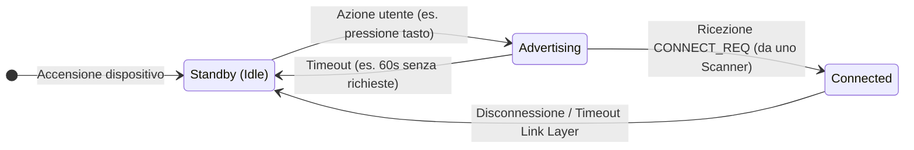

# BLE

Il Bluetooth SIG ha introdotto il Bluetooth Low Energy con la versione 4.0 delle specifiche Bluetooth Core. Il Bluetooth Low Energy (BLE) è stato progettato per fornire una connettività wireless a basso consumo energetico per dispositivi che richiedono una lunga durata della batteria, come sensori, dispositivi indossabili e dispositivi IoT. BLE consente ai dispositivi di comunicare tra loro utilizzando meno energia rispetto al Bluetooth classico, rendendolo ideale per applicazioni che richiedono una connessione continua o frequente.

La specifica Bluetooth copre sia il Bluetooth classico (il noto standard wireless che è ormai diffuso in molti dispositivi di consumo da diversi anni) sia il Bluetooth Low Energy (il nuovo standard wireless altamente ottimizzato introdotto nella versione 4.0). Questi due standard di comunicazione wireless non sono direttamente compatibili e i dispositivi Bluetooth qualificati su qualsiasi versione di specifica precedente alla 4.0 non possono comunicare in alcun modo con un dispositivo BLE. Il protocollo on-air, i livelli di protocollo superiori e le applicazioni sono diversi e incompatibili tra le due tecnologie.

La specifica Bluetooth (versione 4.0 e successive) definisce due tecnologie wireless:

- BR/EDR (Bluetooth classico): Lo standard wireless che si è evoluto con la specifica Bluetooth a partire dalla versione 1.0.
- BLE (Bluetooth Low Energy): Lo standard wireless a basso consumo introdotto con la versione 4.0 della specifica.

E questi sono i due tipi di dispositivi che possono essere utilizzati con queste configurazioni:

- Dispositivo monomodale (BLE, Bluetooth Smart): Un dispositivo che implementa BLE, in grado di comunicare con dispositivi monomodali e bimodali, ma non con dispositivi che supportano solo BR/EDR.
- Dispositivo bimodale (BR/EDR/LE, Bluetooth Smart Ready): Un dispositivo che implementa sia BR/EDR che BLE, in grado di comunicare con qualsiasi dispositivo Bluetooth

i tre elementi costitutivi principali di ogni dispositivo Bluetooth:

1. Applicazione: L'applicazione utente che si interfaccia con lo stack di protocolli Bluetooth per coprire un particolare caso d'uso.
2. Host: I livelli superiori dello stack di protocolli Bluetooth.
3. Controller: I livelli inferiori dello stack di protocolli Bluetooth, inclusa la radio.

Inoltre, la specifica fornisce un protocollo di comunicazione standard tra l'host e il controller, l'Host Controller Interface (HCI), per consentire l'interoperabilità tra host e controller prodotti da aziende diverse.
Questi livelli possono essere implementati in un singolo circuito integrato (IC) o chip, oppure possono essere suddivisi in diversi IC collegati tramite un livello di comunicazione (UART, USB, SPI o altro).
Queste sono le tre configurazioni più comuni presenti nei prodotti attualmente disponibili in commercio:

1. SoC (system on chip) Un singolo IC esegue l'applicazione, l'host e il controller.
2. Doppio circuito integrato su HCI Un circuito integrato esegue l'applicazione e l'host e comunica tramite HCI con un secondo circuito integrato che gestisce il controller. Il vantaggio di questo approccio è che, poiché l'HCI è definito dalle specifiche Bluetooth, qualsiasi host può essere combinato con qualsiasi controller, indipendentemente dal produttore.
3. Doppio circuito integrato con dispositivo di connettività Un circuito integrato esegue l'applicazione e comunica tramite un protocollo proprietario con un secondo circuito integrato che gestisce sia l'host che il controller. Poiché le specifiche non includono tale protocollo, l'applicazione deve essere adattata al protocollo specifico del fornitore scelto.

## Limiti di BLE

- **Data Throughput** La velocità di modulazione della radio Bluetooth Low Energy è impostata dalle specifiche a 1 Mbps costante. Questo stabilisce il limite superiore teorico per la velocità di trasmissione che BLE può fornire, ma in termini reali, questo limite viene in genere abbassato in modo significativo da una varietà di fattori, inclusi ma non limitati al traffico bidirezionale, sovraccarico del protocollo, limitazioni della CPU e della radio e restrizioni software artificiali

- **Range** il Bluetooth Low Energy si concentra sulle comunicazioni a corto raggio.
  La potenza di trasmissione (tipicamente misurata in dBm) è solitamente configurabile su un certo intervallo (solitamente tra -30 e 0 dBm), ma maggiore è la potenza di trasmissione (migliore portata), maggiore è il carico sulla batteria, riducendone la durata utile.
  È possibile creare e configurare un dispositivo BLE in grado di trasmettere dati in modo affidabile a 30 metri o più di distanza in linea d'aria, ma una portata operativa tipica è probabilmente più vicina ai 2-5 metri, con uno sforzo consapevole per ridurre la portata e risparmiare la durata della batteria senza che la distanza di trasmissione diventi un fastidio per l'utente finale.

## Topologia di rete

Un dispositivo Bluetooth Low Energy può comunicare con il mondo esterno in due modi: broadcasting o connessioni. Ogni meccanismo presenta vantaggi e limitazioni, ed entrambi sono soggetti alle linee guida stabilite dal Generic Access Profile (GAP)

### Broadcasting e osservazione

Utilizzando il broadcasting senza connessione, è possibile inviare dati a qualsiasi dispositivo di scansione o ricevitore nel raggio di ascolto inviariando dati in un'unica direzione a chiunque o qualsiasi cosa sia in grado di captare i dati trasmessi.

Il broadcasting definisce due ruoli distinti:

1. Broadcaster Invia periodicamente nonconnectable advertising package a chiunque sia disposto a riceverli.
2. Osservatore Esegue ripetutamente la scansione delle frequenze preimpostate per ricevere eventuali nonconnectable advertising package attualmente trasmessi.

L'advertising standar package contiene un payload di 31 byte utilizzato per includere dati che descrivono il broadcaster e le sue capacità, ma può anche includere qualsiasi informazione personalizzata che si desidera trasmettere ad altri dispositivi. Se questo payload standard di 31 byte non è sufficientemente grande da contenere tutti i dati richiesti, BLE supporta anche un payload pubblicitario secondario opzionale (chiamato Scan Response), che consente ai dispositivi che rilevano un dispositivo broadcaster di richiedere un secondo frame pubblicitario con un altro payload di 31 byte, per un massimo di 62 byte totali.

Una delle principali limitazioni del broadcasting, rispetto a una connessione tradizionale, è l'assenza di misure di sicurezza o privacy (qualsiasi dispositivo osservatore è in grado di ricevere i dati trasmessi), quindi potrebbe non essere adatto per i dati sensibili.

### Connessioni

Se è necessario trasmettere dati in entrambe le direzioni, o se si dispone di più dati di quanti i due advertising package possano gestire, è necessario utilizzare una connessione.
Una **connessione** è uno scambio di dati permanente e periodico di pacchetti tra due dispositivi. È quindi intrinsecamente privata (i dati vengono inviati e ricevuti solo dai due peer coinvolti nella connessione e da nessun altro dispositivo, a meno che non stia effettuando uno sniffing indiscriminato).

Le connessioni implicano due ruoli distinti:

1. Centrale (master) Esegue ripetutamente la scansione delle frequenze preimpostate alla ricerca di pacchetti pubblicitari collegabili e, se necessario, avvia una connessione. Una volta stabilita la connessione, la centrale gestisce la temporizzazione e avvia gli scambi di dati periodici.
2. Periferica (slave) Un dispositivo che invia periodicamente pacchetti pubblicitari collegabili e accetta connessioni in entrata. Una volta stabilita una connessione attiva, la periferica segue i tempi della centrale e scambia dati regolarmente con essa.

Per avviare una connessione, un dispositivo centrale preleva i pacchetti di advertising collegabili da una periferica e invia quindi una richiesta alla periferica per stabilire una connessione esclusiva tra i due dispositivi. Una volta stabilita la connessione, la periferica interrompe l'advertising e i due dispositivi possono iniziare a scambiare dati in entrambe le direzioni. La connessione rimane attiva finché uno dei due dispositivi non decide di disconnettersi, a quel punto la periferica riprende l'advertising e la centrale torna alla scansione alla ricerca di altri dispositivi a cui connettersi.

A partire dalla versione 4.1 della specifica, tutte le restrizioni sulle combinazioni di ruoli sono state rimosse e sono possibili le seguenti funzioni:

- Un dispositivo può fungere contemporaneamente da centrale e periferica.
- Una centrale può essere collegata a più periferiche.
- Una periferica può essere collegata a più centrali.

organizzare i dati con un controllo molto più dettagliato su ciascun campo o proprietà attraverso l'uso di livelli di protocollo aggiuntivi e, più specificamente, del Generic Attribute Profile (GATT). I dati sono organizzati in unità chiamate servizi e caratteristiche.
I servizi possono contenere più caratteristiche, ciascuna con i propri diritti di accesso e metadati descrittivi. Ulteriori vantaggi includono una maggiore produttività, la possibilità di stabilire un collegamento crittografato sicuro e la negoziazione dei parametri di connessione per adattarli al modello di dati.

Le connessioni consentono un modello di dati molto più ricco e stratificato. Hanno anche il potenziale di consumare molta meno energia rispetto alla modalità broadcast perché possono estendere ulteriormente il ritardo tra gli eventi di connessione o inviare grandi quantità di dati solo quando sono disponibili nuovi valori, anziché dover annunciare continuamente l'intero payload a una velocità specifica senza sapere chi sta ascoltando o con quale frequenza. Non solo, ma il fatto che entrambi i peer sappiano quando si verificheranno gli eventi di connessione in futuro consente di spegnere la radio più a lungo, risparmiando potenzialmente la batteria rispetto alla trasmissione.
Infine, queste topologie possono essere combinate liberamente in una rete BLE più ampia. Un dispositivo compatibile con BR/EDR/LE può collegare connessioni BLE e BR/EDR, e il numero di combinazioni e partecipanti sulla rete è limitato solo dalle limitazioni delle radio e degli stack di protocollo di ciascun dispositivo che vi partecipa.

### Protocolli e profili

Il Bluetooth Low Energy è progettato per essere un protocollo di comunicazione wireless generico, ma le specifiche Bluetooth forniscono anche una serie di profili e protocolli standardizzati che definiscono casi d'uso specifici e modelli di dati per applicazioni comuni. Questi profili e protocolli standardizzati consentono l'interoperabilità tra dispositivi di diversi produttori e semplificano lo sviluppo di applicazioni Bluetooth Low Energy.

**Protocolli** Elementi costitutivi utilizzati da tutti i dispositivi conformi alle specifiche Bluetooth, i protocolli sono i livelli che implementano i diversi formati di pacchetto, routing, multiplexing, codifica e decodifica che consentono l'invio efficace dei dati tra peer.
**Profili**
funzionalità che coprono sia le modalità operative di base richieste da tutti i dispositivi (Profilo di accesso generico, Profilo di attributi generico) sia casi d'uso specifici (Profilo di prossimità, Profilo del glucosio), i profili definiscono essenzialmente come i protocolli dovrebbero essere utilizzati per raggiungere un obiettivo particolare, generico o specifico.

## Protocollo Base

Single mode BLE: Controller, host e applicazione.

1. Applicazione
   L'applicazione, come in tutti gli altri tipi di sistemi, è il livello più elevato ed è responsabile della logica, dell'interfaccia utente e della gestione dei dati di tutto ciò che riguarda il caso d'uso effettivo implementato dall'applicazione. L'architettura di un'applicazione dipende fortemente da ogni specifica implementazione.
2. Host
   Include i seguenti livelli:
   • Generic Access Profile (GAP) • Generic Attribute Profile (GATT) • Logical Link Control and Adaptation Protocol (L2CAP) • Attribute Protocol (ATT)
   • Security Manager (SM) • Host Controller Interface (HCI), lato host
3. Controller
   Include i seguenti livelli
   Interfaccia Host Controller (HCI), lato controller • Livello di collegamento (LL)
   • Livello fisico (PHY)

### Physical Layer (PHY)

Lo strato fisico (PHY) è la parte che contiene i circuiti di comunicazione analogici, in grado di modulare e demodulare i segnali analogici e trasformarli in simboli digitali.
La radio utilizza la banda ISM (Industrial, Scientific and Medical) a 2,4 GHz per comunicare e la divide in 40 canali da 2,4000 GHz a 2,4835 GHz. 37 di questi canali sono utilizzati per i dati di connessione e gli ultimi tre canali (37, 38 e 39) sono utilizzati come canali advertising per stabilire connessioni e inviare dati di trasmissione.

Lo standard utilizza una tecnica chiamata **frequency hopping spread spectrum**, in cui la radio salta tra i canali a ogni evento di connessione utilizzando la seguente formula:

_canale = (canale_corrente + salto) mod 37_

Il valore del salto viene comunicato al momento dello stabilimento della connessione ed è quindi diverso per ogni nuova connessione stabilita. Questa tecnica riduce al minimo l'effetto di qualsiasi interferenza radio potenzialmente presente nella banda dei 2,4 GHz su qualsiasi singolo canale, soprattutto perché il WiFi e il Bluetooth classico sono prevalenti in questa banda e i dispositivi potrebbero subire forti interferenze in prossimità di dispositivi con un'elevata potenza di trasmissione.
La modulazione scelta per codificare il flusso di bit via etere è la **Gaussian Frequency Shift Keying (GFSK)**, la stessa modulazione utilizzata dal Bluetooth classico e da molti altri protocolli wireless proprietari a basso consumo. La velocità di modulazione per Bluetooth Low Energy è fissata a 1 Mbit/s, che rappresenta quindi il limite fisico massimo di throughput per la tecnologia.

Nota: A partire dalle specifiche del Bluetooth 5.0, il Physical Layer è stato espanso introducendo il LE 2M PHY (che raddoppia la velocità di modulazione a 2 Mbit/s per un throughput maggiore) e il LE Coded PHY (che riduce la velocità a 500 o 125 kbps inserendo codici di correzione d'errore per aumentare drasticamente il range di trasmissione senza aumentare la potenza radio).

### Link Layer (LL)

Il Link Layer è la parte che si interfaccia direttamente con il PHY e solitamente è implementato come una combinazione di hardware e software personalizzati. È anche l'unico livello con vincoli rigidi in tempo reale dell'intero stack protocollare, poiché è responsabile del rispetto di tutti i requisiti di temporizzazione definiti dalle specifiche. è solitamente mantenuto isolato dai livelli superiori dello stack protocollare tramite un'interfaccia standard che nasconde la complessità del Link Layer e consente a qualsiasi implementazione di essere utilizzata con qualsiasi host, a condizione che entrambi supportino l'interfaccia standard (HCI).

Implementate nell'hardware dai fornitori di silicio per evitare di sovraccaricare l'unità di elaborazione centrale che gestisce tutti i livelli software dello stack. Questa funzionalità solitamente include:
• Framing di preambolo, indirizzo di accesso e protocollo aereo • Generazione e verifica CRC
• Whitening dei dati • Generazione di numeri casuali • Crittografia AES

La metà software del Link Layer gestisce lo stato del collegamento radio, ovvero il modo in cui il dispositivo si connette ad altri dispositivi. Un dispositivo BLE può essere master, slave o entrambi, a seconda del caso d'uso e dei requisiti.

Un master può connettersi a più slave e uno slave può essere connesso a più master.

Il Bluetooth Low Energy presenta un'asimmetria intrinseca nei suoi livelli inferiori tra dispositivi master e slave, poiché richiede più risorse per fungere da master.

Il Link Layer definisce i seguenti ruoli:

1. Advertiser Un dispositivo che invia gli advertising package per stabilire connessioni o inviare dati di trasmissione.
2. Scanner Un dispositivo che esegue la scansione degli advertising package.

3. Master Un dispositivo che avvia una connessione e la gestisce in seguito.
4. Slave Un dispositivo che accetta una richiesta di connessione e segue le tempistiche del master.

#### Fase di Discovery

BLE ha un solo formato di pacchetto e due tipi di pacchetti (pacchetti pubblicitari e pacchetti dati), il che semplifica l'implementazione dello stack di protocollo. Gli advertising package servono a due scopi:

1. trasmettere dati per applicazioni che non necessitano del sovraccarico di una connessione completa
2. Individuare gli slave e connettersi a essi

Ogni pacchetto pubblicitario può trasportare fino a 31 byte di payload di dati pubblicitari, insieme alle informazioni di base dell'intestazione (incluso l'indirizzo del dispositivo Bluetooth).
Tali pacchetti vengono semplicemente trasmessi in modalità cieca dall'advertiser, senza la previa conoscenza della presenza di alcun dispositivo di scansione. Vengono inviati a una velocità fissa definita dall'intervallo pubblicitario, che varia da 20 ms a 10,24 s.
Più breve è l'intervallo, maggiore è la frequenza di trasmissione dei pacchetti pubblicitari, con conseguente maggiore probabilità che tali pacchetti vengano ricevuti da uno scanner, ma maggiori quantità di pacchetti trasmessi si traducono anche in un maggiore consumo energetico.

Poiché l'advertising utilizza un massimo di tre canali di frequenza e l'advertiser e lo scanner non sono sincronizzati in alcun modo, un pacchetto pubblicitario verrà ricevuto correttamente dallo scanner solo quando si sovrappongono casualmente.

I parametri intervallo di scansione e finestra di scansione definiscono la frequenza e la durata di ascolto di un dispositivo scanner per potenziali advertising pakage.

Come per l'intervallo di pubblicità, questi valori hanno un impatto significativo sul consumo energetico, poiché sono direttamente correlati al tempo di accensione della radio.
La specifica definisce due tipi fondamentali di procedure di scansione:

1. Scansione passiva Lo scanner si limita ad ascoltare i pacchetti pubblicitari e l'advertiser non si accorge mai che uno o più pacchetti sono stati effettivamente ricevuti da uno scanner.
2. Scansione attiva Lo scanner emette un pacchetto di richiesta di scansione dopo aver ricevuto un advertising package. L'advertiser lo riceve e risponde con un pacchetto di risposta alla scansione. Questo pacchetto aggiuntivo raddoppia il carico utile effettivo che l'advertiser è in grado di inviare allo scanner, ma è importante notare che ciò non fornisce allo scanner alcun mezzo per inviare dati utente all'advertiser.

Modificando questi tre parametri (Advertising Interval, Scan Interval e Scan Window), puoi decidere se vuoi che il tuo dispositivo consumi pochissima batteria (intervalli lunghi, finestre corte) al costo di metterci molto tempo a farsi trovare, oppure se vuoi che si colleghi istantaneamente (intervalli brevissimi, finestre lunghe) sacrificando però la batteria.

I tipi di pacchetti pubblicitari possono essere classificati in base a tre diverse proprietà. La prima è la connettibilità:
Connettibile
Uno scanner può avviare una connessione alla ricezione di tale pacchetto pubblicitario.
Non connettibile
Uno scanner non può avviare una connessione (questo pacchetto è destinato esclusivamente alla trasmissione).
La ​​seconda proprietà è la scansionabilità: Scansionabile
Uno scanner può emettere una richiesta di scansione alla ricezione di tale pacchetto pubblicitario.
Non scansionabile
Uno scanner non può emettere una richiesta di scansione alla ricezione di tale pacchetto pubblicitario.
La terza è la direzionalità: Diretto
Un pacchetto di questo tipo contiene solo gli indirizzi Bluetooth dell'inserzionista e dello scanner di destinazione nel suo payload. Non sono ammessi dati utente. Tutti i pacchetti pubblicitari diretti sono quindi connettibili.
Non diretto
Un pacchetto di questo tipo non è destinato a nessuno scanner in particolare e può contenere dati utente nel suo payload.

#### Fase di connessione

Una volta che lo Scanner (il dispositivo Centrale) ha "visto" l'Advertiser (la Periferica) durante la fase di Discovery e decide che vuole stabilire una comunicazione bidirezionale e privata, la procedura passa dal Broadcasting alla vera e propria Connessione.

Subito dopo aver ricevuto un pacchetto di advertising sul canale 37, 38 o 39, lo Scanner non aspetta il ciclo successivo, ma risponde immediatamente (entro pochi microsecondi) con un pacchetto speciale chiamato Connection Request (o CONNECT_IND) che contiene:

- Intervallo di connessione Tempo tra l'inizio di due eventi di connessione consecutivi. Questo valore varia da 7,5 ms (throughput elevato) a 4 s (throughput minimo possibile ma anche minimo consumo energetico).
- Latenza slave Numero di eventi di connessione che uno slave può scegliere di saltare senza rischiare una disconnessione.
- Timeout di supervisione della connessione Tempo massimo tra due pacchetti di dati validi ricevuti prima che una connessione venga considerata persa.

Il pacchetto di richiesta di connessione include l'incremento di frequenza del salto, che determina la sequenza di salto che sia il master che lo slave seguiranno durante la durata della connessione. ntrambi i dispositivi smettono immediatamente di usare i 3 canali di advertising. Si spostano sui restanti 37 canali dati della banda a 2.4 GHz.
Per evitare interferenze con il Wi-Fi e altri dispositivi Bluetooth, usano una tecnica chiamata Adaptive Frequency Hopping (AFH): ad ogni Connection Interval, i due dispositivi saltano insieme in modo sincronizzato su un canale diverso, seguendo un algoritmo pseudocasuale.

Ora i dispositivi sono connessi a livello radio (Link Layer). Non tengono però la radio sempre accesa. Si danno semplicemente "appuntamento" ad ogni Connection Interval. Durante questo brevissimo istante (chiamato Connection Event), il Centrale invia un pacchetto, la Periferica risponde, ed entrambi spengono immediatamente le radio fino all'appuntamento successivo. Questo è il vero segreto del "Low Energy" del BLE.

Liste bianche
Una funzionalità importante disponibile nei controller BLE, le liste bianche consentono agli host di filtrare i dispositivi durante l'annuncio, la scansione e la creazione di connessioni su entrambi i lati. Le liste bianche sono semplicemente array di indirizzi di dispositivi Bluetooth che vengono compilati dall'host e memorizzati e utilizzati nel controller.
Un dispositivo che esegue la scansione o avvia una connessione può utilizzare una lista bianca per limitare il numero di dispositivi che verranno rilevati o con cui può connettersi, e il dispositivo che annuncia può utilizzare una lista bianca per specificare da quali peer accetterà una connessione in ingresso. L'impostazione che definisce se utilizzare o meno una lista bianca è chiamata politica di filtro. Questa funge essenzialmente da interruttore per attivare e disattivare il filtro della lista bianca.

I pacchetti di dati hanno un payload di dati utilizzabile di 27 byte, ma protocolli aggiuntivi più in alto nello stack in genere limitano la quantità effettiva di dati utente a 20 byte per pacchetto, sebbene ciò dipenda logicamente dal protocollo utilizzato.
È importante notare che il livello di collegamento funge da portatore di dati affidabile. Tutti i pacchetti ricevuti vengono controllati con un CRC a 24 bit e vengono richieste ritrasmissioni quando il controllo degli errori rileva un errore di trasmissione. Non esiste un limite massimo per le ritrasmissioni; il livello di collegamento reinvierà il pacchetto finché non verrà finalmente riconosciuto dal ricevitore.

Il Link Layer è anche responsabile di diverse procedure di controllo, inclusi questi due processi critici:

- Modifica dei parametri di connessione
  Ogni connessione viene stabilita con un set di parametri di connessione impostato dal master, ma condizioni e requisiti potrebbero cambiare durante il ciclo di vita della connessione. Uno slave potrebbe improvvisamente richiedere un throughput maggiore per un breve burst di dati o, al contrario, potrebbe rilevare che nel prossimo futuro un intervallo di connessione più lungo sarà sufficiente a mantenere attiva la connessione. Il Link Layer consente al master e allo slave di richiedere nuovi parametri di connessione e, nel caso del master, di impostarli unilateralmente in qualsiasi momento. In questo modo, ogni connessione può essere ottimizzata per fornire il miglior equilibrio tra throughput e consumo energetico.
- Crittografia
  La sicurezza è fondamentale in BLE e il Link Layer fornisce i mezzi per scambiare dati in modo sicuro su un collegamento crittografato. Le chiavi vengono generate e gestite dall'host, ma il Link Layer esegue la crittografia e la decrittografia dei dati in modo trasparente per i livelli superiori.

### Host Controller Interface (HCI)

L'Host Controller Interface (HCI) è il livello di demarcazione cruciale all'interno dello stack Bluetooth. Poiché le specifiche consentono diverse configurazioni hardware, l'HCI funge da protocollo di comunicazione standard che permette l'interoperabilità tra un Host (i livelli superiori dello stack e l'applicazione) e un Controller (i livelli inferiori, come Link Layer e PHY) prodotti anche da aziende diverse (ad esempio, uno stack Host di Microsoft o Apple che comunica con un chip radio Controller di Broadcom o Qualcomm).

Esempi tipici di questa configurazione (definita a "doppio circuito integrato") includono la maggior parte degli smartphone, tablet e personal computer. In questi dispositivi la divisione dei compiti è netta:

- Host e Applicazione: Vengono eseguiti dal processore principale (CPU) del dispositivo, dove c'è abbondanza di memoria e potenza di calcolo.

- Controller: Si trova in un chip hardware dedicato e separato (il modulo radio Bluetooth).

Per far dialogare queste due entità, la specifica Bluetooth definisce l'HCI attraverso tre elementi fondamentali:

- Comandi ed Eventi: Un set standardizzato di istruzioni. L'Host invia Comandi al Controller (es. "Inizia la scansione", "Connettiti a questo MAC address"), e il Controller risponde con Eventi verso l'Host (es. "Scansione terminata", "Dispositivo connesso", "Connessione persa").

- Pacchetti Dati: Un formato rigoroso per incapsulare i dati utente (payload) da trasmettere o appena ricevuti via etere. L'HCI include anche un insieme di regole per il controllo di flusso, evitando che l'Host invii dati più velocemente di quanto il Controller (che ha buffer più piccoli) possa trasmetterli.

- Trasporti (Transports): La specifica definisce diversi livelli di trasporto fisico che veicolano e potenziano il protocollo HCI a livello hardware. I trasporti più comuni utilizzati per collegare fisicamente la CPU al chip radio sono interfacce seriali standard come UART, USB, SPI o SDIO.

### Logical Link Control and Adaptation Protocol (L2CAP)

Il protocollo L2CAP (Logical Link Control and Adaptation Protocol), fornisce due funzionalità principali.

Funge da **multiplexer di protocollo** che riceve più protocolli dai livelli superiori, assegnando a ciascun pacchetto un Channel Identifier (CID), un numero identificativo del canale, li incapsula nel formato standard del pacchetto BLE e li incanala nell'unica connessione HCI verso il controller. Sul percorso di ricezione, riceve pacchetti HCI dal controller, estrae il CID e li inoltra al protocollo appropriato nei livelli superiori dell'host.

In BLE, L2CAP utilizza principalmente canali fissi predefiniti:

- CID 0x0004: Canale riservato all'Attribute Protocol (ATT), ovvero lo scambio dei dati utente.
- CID 0x0005: Canale di segnalazione L2CAP (per gestire i parametri di connessione).
- CID 0x0006: Canale riservato al Security Manager Protocol (SMP), per la crittografia e il pairing.

Oltre a ciò, e a partire dalla versione 4.1 della specifica, L2CAP può creare canali personalizzati orientati alla connessione (LE Data Channels). Questi utilizzano un sistema "a crediti": il ricevitore comunica al trasmettitore quanti pacchetti è in grado di immagazzinare nel suo buffer. Il trasmettitore invia dati solo se possiede "crediti" sufficienti, evitando così di sovraccaricare la memoria di dispositivi con risorse molto limitate, perdendo pacchetti.

Esegue anche la **frammentazione** e la **ricombinazione**, un processo mediante il quale preleva pacchetti di grandi dimensioni dai livelli superiori e li suddivide in blocchi che rientrano nella dimensione massima del payload di 27 byte, o fino a 251 byte con le estensioni più recenti, dei pacchetti BLE sul lato trasmissione.

L2CAP si occupa di prendere i grossi blocchi di dati provenienti dai livelli superiori, "tagliarli" in frammenti più piccoli compatibili con la massima unità di trasmissione (MTU) del controller radio, e aggiungere un'intestazione (header) per indicarne la lunghezza e il canale. Sul dispositivo ricevente, L2CAP esegue l'operazione inversa, riassemblando i frammenti nell'esatto ordine prima di consegnarli al livello superiore.

L'intestazione del pacchetto L2CAP occupa quattro byte, il che significa che la lunghezza effettiva del payload utente è 27 - 4 = 23 byte (dove 27 byte è la dimensione del payload del LL, o 251 byte con le estensioni più recenti).

L2CAP garantisce un instradamento affidabile dei dati, ma sui canali fissi predefiniti (come l'ATT) non fornisce alcun meccanismo intrinseco di controllo del flusso o ritrasmissione in caso di errore (questi compiti sono demandati al Link Layer sottostante o al protocollo di livello superiore). Al contrario, per i canali personalizzati (LE Data Channels), il controllo di flusso è attivamente gestito tramite il sopracitato sistema a crediti

### Attribute Protocol (ATT)

L'Attribute Protocol (ATT) è il protocollo di livello superiore che definisce il modo in cui i dati vengono rappresentati, archiviati e scambiati all'interno di un dispositivo BLE. Viaggia sul canale L2CAP dedicato fisso (CID 0x0004) ed è la base su cui si costruisce l'intera applicazione utente.

L'ATT si basa su una rigorosa architettura Client/Server, che è indipendente dai ruoli GAP (Centrale e Periferica).

- ATT Server: È il dispositivo che possiede e memorizza fisicamente i dati (gli "attributi"). Accetta le richieste dal Client. (Esempio: un sensore di temperatura).
- ATT Client: È il dispositivo che desidera accedere ai dati. Invia richieste al Server per leggere, scrivere o essere avvisato dei cambiamenti. (Esempio: lo smartphone che legge la temperatura).

Il protocollo è rigoroso in termini di sequenziamento: se una richiesta è ancora in sospeso (non è stata ancora ricevuta alcuna risposta), non è possibile inviare ulteriori richieste finché la risposta non viene ricevuta ed elaborata. Questo vale in entrambe le direzioni in modo indipendente nel caso in cui due peer agiscano sia come client che come server.

Ogni server contiene dati organizzati sotto forma di **attributi**, composto da quattro elementi:

1. Attribute Handle (Gestore): È l'indirizzo a 16 bit dell'attributo (es. 0x001A). Funge da indice nel database. Il Client usa questo numero per dire al Server: "Voglio leggere il dato all'indirizzo 0x001A".
2. Attribute Type (UUID): È un identificatore univoco universale (UUID) che spiega al Client cosa rappresenta quel dato. Il Bluetooth SIG definisce UUID standard a 16 bit per i dati comuni (es. 0x2A37 significa sempre "Heart Rate Measurement"), ma gli sviluppatori possono creare UUID personalizzati a 128 bit per i propri dati proprietari.
3. Attribute Value (Valore): È il payload effettivo, ovvero il dato vero e proprio. Può essere un singolo numero a 8 bit, una stringa di caratteri o un array di byte (fino a 512 byte massimi in base alla frammentazione).
4. Attribute Permissions (Permessi): Definiscono chi può fare cosa con questo attributo. I permessi non possono essere letti dal Client, ma sono applicati dal Server. Stabiliscono se un attributo è di sola lettura, di lettura/scrittura, e se richiede una connessione crittografata (tramite il livello SMP) per essere accessibile.

Quando un client desidera leggere o scrivere valori di attributo da o verso un server, invia una richiesta di lettura o scrittura al server con l'handle. Il server risponderà con il valore dell'attributo o una conferma. Nel caso di un'operazione di lettura, spetta al client analizzare il valore e comprendere il tipo di dati in base all'UUID dell'attributo. D'altra parte, durante un'operazione di scrittura, ci si aspetta che il client fornisca dati coerenti con il tipo di attributo e il server è libero di rifiutare l'operazione in caso contrario.

#### Operazioni ATT

L'Attribute Protocol definisce anche i metodi (o comandi) con cui il Client e il Server interagiscono tra loro per manipolare questi attributi. Le operazioni principali sono:

- Read Request / Response: Il Client chiede di leggere il Valore di un attributo tramite il suo Handle. Il Server risponde con il dato.
- Write Request / Response: Il Client invia un dato al Server per scriverlo in un attributo specifico e attende una conferma (Response) dell'avvenuta scrittura.
- Write Command: Come la Write Request, ma il Client non attende alcuna conferma dal Server (utile per inviare flussi di dati molto veloci).
- Notification (Notifica): Inviata dal Server al Client in modo asincrono quando un dato cambia (es. il battito cardiaco aumenta). Non richiede conferma da parte del Client. È il metodo più utilizzato in BLE per risparmiare energia.
- Indication (Indicazione): Simile alla Notifica, ma il Server richiede che il Client risponda con una conferma di ricezione (più affidabile, ma più lenta).

### Security Manager Protocol (SMP)

Il Security Manager Protocol (SMP) è il livello dello stack Bluetooth Low Energy responsabile della sicurezza della connessione. Definisce i metodi e i protocolli necessari per accoppiare due dispositivi in modo sicuro, autenticarsi reciprocamente, crittografare il collegamento radio e scambiarsi le chiavi di sicurezza. L'SMP viaggia sul canale dedicato L2CAP (CID 0x0006).

Il Security Manager definisce due ruoli:

1. Initiator Corrisponde sempre al Link Layer master e quindi alla centrale GAP.
2. Responder Corrisponde sempre allo Link Layer slave e quindi alla periferica GAP.

Sebbene spetti sempre all'iniziatore attivare l'inizio di una procedura, il risponditore può richiedere in modo asincrono l'avvio di una qualsiasi delle procedure sicurezza. Non vi è alcuna garanzia per il risponditore che l'iniziatore ascolterà effettivamente la richiesta, fungendo più da suggerimento che da vera e propria richiesta vincolante. Questa richiesta di sicurezza può logicamente essere emessa solo dallo slave o dalla periferica della connessione.

Accoppiamento
Procedura mediante la quale viene generata una chiave di crittografia di sicurezza comune temporanea per poter passare a una connessione sicura e crittografata. Questa chiave temporanea non viene memorizzata e pertanto non è riutilizzabile nelle connessioni successive.
Bonding
Sequenza di accoppiamento seguita dalla generazione e dallo scambio di chiavi di sicurezza permanenti, destinate a essere memorizzate nella memoria non volatile e quindi a creare un collegamento permanente tra due dispositivi, che consentirà loro di impostare rapidamente una connessione sicura nelle connessioni successive senza dover eseguire nuovamente una procedura di collegamento.
Ripristino della crittografia
Al termine di una procedura di collegamento, le chiavi potrebbero essere state memorizzate su entrambi i lati della connessione. Se le chiavi di crittografia sono state memorizzate, questa procedura definisce come utilizzare tali chiavi nelle connessioni successive per ristabilire una connessione sicura e crittografata senza dover ripetere la procedura di accoppiamento (o collegamento).

#### Le fasi del Pairing

Il processo di sicurezza in BLE si divide tipicamente in tre fasi sequenziali:

Fase 1: Negoziazione delle funzionalità (Feature Exchange)
I due dispositivi si scambiano informazioni sulle proprie capacità di input/output (I/O capabilities). Ad esempio, un dispositivo dichiara se possiede un display (per mostrare un PIN), una tastiera (per inserirlo) o solo un pulsante "Sì/No". Questa negoziazione determina quale metodo di accoppiamento verrà utilizzato nella Fase 2.

Fase 2: Generazione della chiave (Key Generation)
In base alle capacità di I/O negoziate, i dispositivi utilizzano uno dei seguenti metodi per autenticarsi e generare la chiave di crittografia (Short Term Key in BLE Legacy, o Long Term Key in LE Secure Connections):

- Just Works: Usato quando i dispositivi non hanno display o tastiere (es. auricolari wireless). La connessione viene crittografata, ma non offre protezione contro gli attacchi Man-In-The-Middle (MITM).

- Passkey Entry: Un dispositivo mostra un PIN a 6 cifre sul display e l'utente lo digita sulla tastierina dell'altro dispositivo. Offre protezione MITM.

- Numeric Comparison: Introdotto con LE Secure Connections (BLE 4.2+), entrambi i dispositivi mostrano un codice a 6 cifre. L'utente deve solo confermare (tramite un pulsante "Sì") che i due codici corrispondono. Offre altissima sicurezza e protezione MITM.

- Out of Band (OOB): Le chiavi di sicurezza vengono scambiate utilizzando una tecnologia wireless completamente diversa, come l'NFC (Near Field Communication). È estremamente sicuro.

Fase 3: Distribuzione delle chiavi (Key Distribution)
Una volta che il canale è crittografato, i dispositivi possono scambiarsi chiavi aggiuntive per funzionalità specifiche. Le più importanti sono:

- Informazioni di crittografia (chiave a lungo termine o LTK) e identificazione master (EDIV, Rand)
  Si tratta di una chiave di crittografia a 128 bit condivisa da entrambe le parti (LTK) insieme a due valori (EDIV, Rand) che fungono da identificativo, poiché un dispositivo può essere associato a più peer.

- Identity Resolving Key (IRK): Fondamentale per la privacy. Consente a un dispositivo di cambiare continuamente il proprio indirizzo MAC pubblico (MAC Randomization) per non essere tracciato da scanner malevoli, permettendo però al dispositivo "bondato" (che possiede la IRK) di riconoscerlo ugualmente.

- Connection Signature Resolving Key (CSRK): Permette di firmare i dati e verificarne l'autenticità senza dover necessariamente crittografare l'intera connessione (utile per risparmiare energia in scenari specifici).

Ognuna di queste chiavi o set di chiavi è asimmetrica e unidirezionale: può essere utilizzata solo nella stessa configurazione di ruolo in cui è stata originariamente generata. Se i dispositivi desiderano scambiare i ruoli del Link Layer (master e slave) nelle connessioni successive, ciascuna parte deve distribuire il proprio set di chiavi per ciascun tipo di chiave. I dispositivi negoziano il numero di chiavi distribuite in ciascuna direzione, che può variare da zero a tutti e tre i tipi di chiave in ciascuna direzione, per un totale di sei chiavi distribuite tra i peer (tre dallo slave al master e tre dal master allo slave).

L'SM specifica i seguenti tre tipi di meccanismi di sicurezza che possono essere utilizzati per applicare vari livelli di sicurezza durante una connessione o durante la procedura pubblicitaria.

Crittografia
Questo meccanismo consiste nella crittografia completa di tutti i pacchetti trasmessi su una connessione stabilita.
Privacy
La funzione di privacy consente a un inserzionista di nascondere il proprio indirizzo Bluetooth pubblico utilizzando indirizzi temporanei, generati casualmente, che possono essere riconosciuti da uno scanner associato al dispositivo pubblicitario.
Firma
Con questo meccanismo, un dispositivo può inviare un pacchetto non crittografato su una connessione stabilita, firmato digitalmente (ovvero, la cui origine può essere verificata)

## Profili

I profili definiscono come i protocolli sottostanti debbano essere utilizzati per garantire l'interoperabilità tra dispositivi sviluppati da fornitori diversi. Nello stack Bluetooth Low Energy, due profili generici sono obbligatori e fondamentali per qualsiasi applicazione:

- Generic Access Profile (GAP): È il livello di controllo più elevato del BLE. Gestisce la topologia della rete, definendo i ruoli dei dispositivi (Broadcaster/Observer, Central/Peripheral) e le procedure per la scoperta (discovery), l'advertising, l'instaurazione delle connessioni e la gestione della sicurezza.

- Generic Attribute Profile (GATT): È il livello dei dati più elevato del BLE. Basato sul protocollo ATT, stabilisce un modello gerarchico per formattare e scambiare i dati tra dispositivi connessi, definendo le regole standard per rilevare, leggere, scrivere e notificare le informazioni utente.

### Generic Access Profile (GAP)

Il Generic Access Profile (GAP) è il framework fondamentale che garantisce l'interoperabilità tra i dispositivi BLE. Definisce le regole universali con cui i dispositivi si scoprono a vicenda, trasmettono dati in broadcast e stabiliscono connessioni sicure. Poiché gestisce queste operazioni di base, il GAP rappresenta quasi sempre il punto di ingresso principale (API) per gli sviluppatori di applicazioni.

Il GAP governa le interazioni definendo due concetti chiave: i Ruoli e le Modalità.

#### Ruoli

Un dispositivo può operare in uno o più ruoli contemporaneamente. I ruoli definiscono il comportamento di base del dispositivo e, solitamente, sono strettamente legati al suo scopo hardware (e quindi raramente cambiano).

- Broadcaster: Trasmette pacchetti pubblicitari (advertising) ma non accetta connessioni.
- Observer: Ascolta i pacchetti pubblicitari (scanning) ma non avvia connessioni.
- Peripheral (Periferica): Trasmette pacchetti pubblicitari e accetta connessioni in ingresso. Una volta connesso, assume il ruolo di Slave nel Link Layer.
- Central (Centrale): Ascolta i pacchetti pubblicitari e avvia connessioni verso le periferiche. Una volta connesso, assume il ruolo di Master nel Link Layer.

#### Modalità

A differenza dei ruoli, che sono spesso statici, le modalità sono stati temporanei.
Un dispositivo entra in una specifica modalità solo per un certo periodo di tempo, al fine di permettere a un altro dispositivo di interagire con esso. Il cambio di modalità avviene frequentemente e può essere attivato automaticamente dal sistema o da un'azione dell'utente (es. la pressione di un tasto per avviare il pairing).

Le modalità più comuni nel GAP sono:

- **Discoverable Mode** (Modalità Scopribile): Il dispositivo trasmette advertising package, permettendo ad altri dispositivi di scoprirlo durante la scansione.
- **Connectable Mode** (Modalità Connettibile): Il dispositivo accetta richieste di connessione in ingresso da altri dispositivi.
- **Bondable Mode** (Modalità Associabile): Il dispositivo consente il pairing e il bonding con altri dispositivi, memorizzando le chiavi di sicurezza per connessioni future.

### Generic Attribute Profile (GATT)

Il Generic Attribute Profile (GATT) stabilisce in dettaglio come scambiare i dati utente su una connessione BLE. Utilizza l'Attribute Protocol (ATT) come protocollo di trasporto sottostante, organizzando i dati grezzi (gli attributi) in una struttura gerarchica ben precisa.

Il GATT entra in gioco esclusivamente dopo che è stata stabilita una connessione (quando il dispositivo è nello stato Connected del GAP).

GATT fornisce inoltre il quadro di riferimento per tutti i profili basati su GATT, che coprono casi d'uso precisi e garantiscono l'interoperabilità tra dispositivi di diversi fornitori. Tutti i profili BLE standard sono quindi basati su GATT e devono essere conformi ad esso per funzionare correttamente.

Il GATT definisce due ruoli per l'interazione dei dati, che sono completamente indipendenti dai ruoli GAP (Centrale/Periferica):

- GATT Server: È il dispositivo che possiede il "database" dei dati e accetta le richieste. Esempio: Un sensore di temperatura (Periferica GAP) che memorizza il valore misurato. Riceve richieste da un client e invia risposte. Invia anche aggiornamenti avviati dal server quando configurato per farlo, ed è il ruolo responsabile dell'archiviazione e della messa a disposizione dei dati utente al client, organizzati in attributi. Ogni dispositivo BLE venduto deve includere almeno un server GATT di base in grado di rispondere alle richieste del client, anche solo per restituire una risposta di errore.
- GATT Client: È il dispositivo che invia richieste al Server per leggere, scrivere o essere notificato sui dati. Esempio: Uno smartphone (Centrale GAP) che legge il valore dal sensore. Il client GATT non sa nulla in anticipo sugli attributi del server, quindi deve prima informarsi sulla presenza e la natura di tali attributi eseguendo la scoperta del servizio (Service Discovery) prima di poter interagire con i dati.

Il GATT organizza i dati come una matrioska, strutturandoli in tre livelli principali: Profili, Servizi e Caratteristiche.

1. Profile (Profilo): Non esiste fisicamente sul dispositivo, ma è un documento concettuale (una specifica) definito dal Bluetooth SIG o dallo sviluppatore. Un Profilo è una raccolta di Servizi predefiniti che descrivono un caso d'uso specifico. Esempio: Il "Heart Rate Profile" stabilisce che il dispositivo deve obbligatoriamente contenere il Servizio Heart Rate e il Servizio Device Information.
2. Service (Servizio): È un raggruppamento logico di dati correlati tra loro per compiere una specifica funzione. Ogni servizio è identificato in modo univoco da un UUID (Universally Unique Identifier).
   - UUID a 16-bit: Riservati ai servizi standard definiti dal Bluetooth SIG (es. 0x180D per l'Heart Rate Service).
   - UUID a 128-bit: Utilizzati per servizi proprietari/personalizzati creati dallo sviluppatore (es. 12345678-1234-5678-1234-56789abcdef0).

   Servizio Primario (Primary Service): Rappresenta la funzionalità principale del dispositivo (es. il servizio Heart Rate in un cardiofrequenzimetro). Può essere scoperto direttamente dal Client.

   Servizio Secondario (Secondary Service): Contiene funzionalità ausiliarie e ha senso solo se referenziato (incluso) da un altro servizio primario. Non può essere scoperto direttamente dal Client per scopi principali.

3. Characteristic (Caratteristica): È il contenitore effettivo del dato utente e il concetto più importante del GATT. Un Servizio può contenere una o più Caratteristiche. Ogni Caratteristica è composta a sua volta da tre elementi:
   - Declaration (Dichiarazione): I metadati. Definisce le proprietà della caratteristica (sola lettura, scrittura, notifica), il suo UUID e il suo indirizzo (Handle).
   - Value (Valore): Il dato vero e proprio (es. il numero 60 che rappresenta i battiti al minuto, o una stringa di testo).
   - Descriptor (Descrittore - opzionale): Fornisce informazioni aggiuntive sulla caratteristica. Il più importante è il CCCD (Client Characteristic Configuration Descriptor), che agisce come un interruttore: il Client deve scriverci dentro un "1" per abilitare la ricezione delle Notifiche da parte del Server.

Tramite l'architettura Client/Server, il GATT espone i metodi dell'ATT per interagire con le Caratteristiche. Le operazioni fondamentali che un programmatore utilizzerà sono:

- Read: Il Client chiede di leggere il Valore di una Caratteristica.
- Write: Il Client invia un dato per sovrascrivere il Valore di una Caratteristica.
  - Write (Request): Il Client invia un dato e attende un pacchetto di conferma (ACK) dal Server. È un'operazione affidabile ma più lenta.
  - Write Without Response (Command): Il Client "spara" il dato al Server senza attendere conferme (Fire-and-forget). È meno affidabile, ma indispensabile per trasmettere flussi continui e veloci di dati (es. streaming audio compresso o aggiornamenti firmware OTA).

- Notify (Notifica): Il Server invia automaticamente il Valore al Client non appena questo cambia. È il meccanismo più efficiente e usato in BLE perché evita al Client di dover richiedere continuamente il dato (polling), risparmiando moltissima batteria.
- Indicate (Indicazione): Come la notifica, ma richiede una conferma di ricezione (ACK) da parte del Client.

#### MTU Exchange e Throughput

L'ATT MTU definisce la dimensione massima (in byte) di un pacchetto Attribute Protocol che può essere scambiato tra un Client e un Server GATT. Secondo le specifiche Bluetooth, ogni connessione BLE si avvia sempre con un MTU predefinito di 23 byte, per garantire l'assoluta retrocompatibilità con i primissimi dispositivi BLE 4.0.

Tuttavia, ogni operazione GATT (come inviare una Write o ricevere una Notify) richiede obbligatoriamente un'intestazione (header) ATT di 3 byte:

- 1 byte per l'Opcode (il tipo di operazione).
- 2 byte per l'Attribute Handle (l'indirizzo del dato).

Sottraendo questi 3 byte di overhead ai 23 byte di MTU, otteniamo esattamente 20 byte di payload utile. Se un'applicazione tenta di inviare una stringa di 25 byte senza aver prima negoziato l'MTU, i 5 byte in eccesso verranno inesorabilmente troncati.

Per superare questo limite, il GATT Client può avviare la procedura di MTU Exchange. Questa operazione può essere eseguita una sola volta per connessione e funziona secondo la rigorosa "regola del minimo":

1. Il Client invia un pacchetto Exchange MTU Request al Server, dichiarando la dimensione massima del proprio buffer di ricezione (ad esempio, 512 byte).
2. Il Server risponde con un pacchetto Exchange MTU Response, dichiarando a sua volta la propria capacità massima (ad esempio, 256 byte).
3. L'MTU effettivo per l'intera durata della connessione sarà impostato sul valore minimo tra i due dichiarati (in questo esempio, 256 byte).

Con un MTU negoziato a 256 byte, il payload utente per singolo pacchetto sale a 253 byte (256 - 3). Il limite massimo teorico consentito dalle specifiche per l'MTU è di 512 byte (509 byte di payload utile).

È fondamentale non confondere l'MTU (che è una restrizione logica a livello Host/L2CAP) con le dimensioni del pacchetto radio a livello Link Layer (Controller).

Se negozi un MTU di 512 byte su un vecchio hardware BLE 4.0 (che a livello radio supporta solo pacchetti da 27 byte), il livello L2CAP sarà costretto a compiere una massiccia frammentazione, spezzettando il tuo grosso pacchetto GATT in decine di minuscoli pacchetti Link Layer per trasmetterli via etere.
Per ottenere un reale aumento del throughput, un MTU elevato deve essere accompagnato dalla Data Length Extension (DLE), una funzionalità introdotta con il BLE 4.2 che espande il payload fisico del Link Layer da 27 fino a 251 byte. Quando DLE e un grande MTU lavorano in sinergia, il dispositivo può trasmettere enormi quantità di dati con un overhead minimo, aprendo la strada ad applicazioni come l'aggiornamento firmware over-the-air (OTA) o lo streaming di audio compresso.
