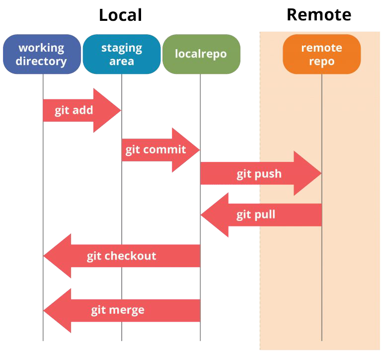
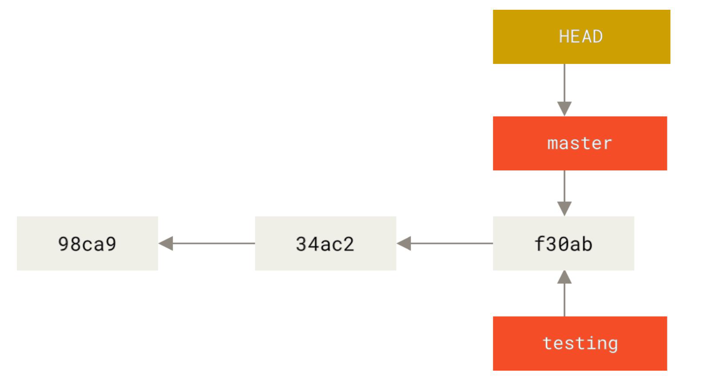

# Git

Parent: [[Versioning_MOC]]


Git è un software per il controllo di versione distribuito utilizzabile da interfaccia a riga dicomando, creato da Linus Torvalds nel 2005, basata su versioning di tipo DAG.



## Workflow

Per poter modificare il codice presente in un **repository remoto**, è necessario seguire alcuni passaggi fondamentali. Il primo passo consiste nel **clonare** il repository remoto sulla propria macchina locale. Questo permette di ottenere una copia del codice sorgente nella propria **working directory**, ovvero la cartella locale dove si lavorerà sulle modifiche. Una volta effettuatele modifiche ai file, questi devono essere aggiunti alla **staging area**, uno spazio temporaneo che raccoglie i file modificati prima di essere confermati. Questo passaggio avviene tramite il comando git add, che può essere utilizzato per aggiungere singoli file o tutti i file modificati. Dopo aver preparato i file nella staging area, è necessario creare un **commit**, che rappresenta un'istantanea delle modifiche apportate. Il commit viene effettuato con un messaggio descrittivo che spiega le modifiche effettuate. Tuttavia, il commit rimane ancora nella repository locale e non è stato inviato al repository remoto. Per rendere effettive le modifiche nel repository remoto, è necessario eseguire un **push**, che aggiorna il branch su cui si sta lavorando con i commit effettuati localmente. Nel caso in cui altri sviluppatori abbiano modificato il codice nelrepository remoto, è importante aggiornare la propria copia locale prima di procedere con nuove modifiche. Questo si fa con un pull, che permette di scaricare e integrare le modifiche più recenti. Infine, quando si lavora su più branch, è possibile passare da un branch all'altro e unire le modifiche tramite le operazioni di **checkout** e **merge**. Il merge permette di combinare le modifiche provenienti da diversi branch in un unico flusso di sviluppo.

| **COSA GESTIRE**                                                                                                                         | **COSA ESCLUDERE**                                                                                                                                                                                                                                                                                                                                                                                                      |
| ---------------------------------------------------------------------------------------------------------------------------------------- | ----------------------------------------------------------------------------------------------------------------------------------------------------------------------------------------------------------------------------------------------------------------------------------------------------------------------------------------------------------------------------------------------------------------------- |
| **Source Code** <br>**Configuration Files** <br>**Build & Deployment Scripts** <br>**Dependencies** (Librerie esterne e package manager) | **File temporanei o generati** <br>**File di log** (.log, .tmp) <br>**File compilati** (.class, .exe, dist/, node_modules/) <br>**File di cache** (`__pycache__`, .cache) <br>**File di configurazione specifici per l'utente** <br>**Impostazioni locali di IDE/editor** (.vscode/, .idea/, .DS_Store) <br>**File personali** (a meno che non siano critici per il deployment) <br>**Credenziali e segreti hardcoded** |

### File .gitignore

Il **file .gitignore** viene utilizzato per escludere specifici file e directory dal versionamento in Git. Questo è utile per evitare di includere file temporanei, di log, compilati, di configurazione locale o di cache.

Creare un file .gitignore nella root del repository.

Aggiungere le regole per escludere i file non necessari.

## Branching e Merge



In Git, ogni **branch** è come un **segnalibro** che punta a un certo punto della storia del progetto, cioè a un **commit** identificato da un
identificativo **hash SHA-1** di 40 caratteri.

Il **puntatore HEAD** non è un branch vero e proprio, ma serve a Git per capire **dove ti trovi attualmente**. Quando sei su un branch, HEAD punta a quel branch. Se fai un commit, il branch si sposta in avanti, e HEAD si sposta con lui. Se fai checkout di un altro branch, HEAD si sposta su quel branch.

**1.Clonare il repository remoto**

- Comando: git clone <URL-del-repository>
- Scarica una copia completa del repository sulla propria macchina (codice + cronologia).
- Crea una working directory locale dove poter lavorare.

**2.Modificare i file nella working directory**

- Apporta le modifiche desiderate ai file del progetto.
- Queste modifiche sono non tracciate finché non vengono aggiunte esplicitamente a Git.

**3.Aggiungere i file modificati alla staging area**

- Comando: git add <file> oppure git add . (per tutti i file modificati)
- La staging area è una zona intermedia prima del commit.
- Permette di selezionare quali modifiche includere nel prossimo commit.

**4.Creare un commit**

- Comando: git commit -m "Messaggio descrittivo"
- Crea un’istantanea delle modifiche nella repository locale.
- Il messaggio dovrebbe spiegare chiaramente cosa è stato modificato.

**5.Inviare le modifiche al repository remoto (push)**

- Comando: git push origin <nome-branch>
- Condivide i commit fatti localmente con il repository remoto.
- Rende visibili le modifiche agli altri collaboratori.

**6.Aggiornare la propria copia locale (pull)**

- Comando: git pull origin <nome-branch>
- Scarica e integra le modifiche più recenti dal repository remoto.
- Aiuta a lavorare su una base aggiornata ed evitare conflitti.

**7.Gestire i branch (opzionale, ma comune)**

- Cambiare branch: git checkout <nome-branch>
- Creare un nuovo branch: git checkout -b <nuovo-branch>
- Unire branch: git merge <branch-da-unire>
- Utile per organizzare il lavoro, ad esempio separando sviluppo, test e produzione.

## Conflitti e Integrazione

Nelle dinamiche di team, non si modifica direttamente il `main`. Si crea un branch separato, si fanno i commit e si apre una **Pull Request**. Questo permette la code review, l'esecuzione di test automatizzati (CI/CD) e, se tutto è corretto, l'approvazione del maintainer per il merge finale.

### Risoluzione dei Conflitti

Si verificano quando ci sono modifiche concorrenti incompatibili (es. stessa riga modificata diversamente in due branch). Git interrompe il merge e segnala il conflitto nei file:

```plaintext
<<<<<<< HEAD
Ciao, questo è un messaggio modificato da Main.

=======

Ciao, questo è un messaggio modificato dal nuovo branch.
> > > > > > > nuovo-branch
```

- <<<<<<< HEAD → indica la versione attuale nel branch main
- ======= → separa le due versioni
- \>>>>>>> nuovo-branch → indica la versione del branch che stai cercando di unire

L'utente deve rimuovere i marcatori (<<<, ===, >>>), mantenere la versione corretta (o un mix delle due) e fare un nuovo commit per risolvere il conflitto.

### Comprendere lo Stato: git status e git log

- git log: Mostra la cronologia dei commit con relativi hash SHA-1 (40 caratteri). L'HEAD indica dove ci si trova attualmente.

- git status: Divide i file in tre categorie:
  - Changes to be committed: In staging, pronti per il commit.
  - Changes not staged: Modificati ma non aggiunti alla staging area.
  - Untracked files: Nuovi file sconosciuti a Git.

### Strategie di Integrazione: Merge vs Rebase

Un **merge fast-forward** accade quando il branch di destinazione non ha commit propri e può semplicemente avanzare per includere i commit del branch da unire. In pratica, Git può spostare il puntatore del branch di destinazione avanti nel tempo, senza creare un commit di merge separato.

Un "fast-forward" avviene quando:

1. Il branch di destinazione è direttamente alla base del branch che stai cercando di unire
2. Non ci sono divergenze tra i due branch (cioè, il branch di destinazione non ha modifiche che non siano già nel branch di origine)

Un **merge non fast-forward** avviene quando i due branch hanno cambiamenti divergenti e Git non può semplicemente "spostare" il puntatore del branch di destinazione avanti. In questo caso, Git crea un **commit di merge** che unisce i cambiamenti dei due branch.

Un **merge non fast-forward** accade quando:

- Hai dei commit sia sul branch di origine che su quello di destinazione
- Git non può semplicemente spostare il puntatore del branch di destinazione per includere i commit del branch di origine, perché entrambi i branch hanno fatto modifiche in parallelo

Un **rebase** è un'alternativa al merge che riscrive la cronologia dei commit. Con il rebase, si sposta un intero set di commit (un branch) sopra un altro commit, come se i tuoi cambiamenti fossero stati fatti a partire da una base più recente.

Immagina che tu abbia il branch main e il branch feature:

1. main ha un commit A
2. feature ha i commit B e C

```plaintext
  A---B---C (feature)
     /
D---E---F---G (main)
```

Se fai un merge di feature su main, avrai qualcosa di simile:

```plaintext
    A---B---C
     /         \
D---E---F---G---M (main)
```

Un **rebase** cambia la cronologia in modo che i commit di feature vengano riposizionati sopra main. Il risultato sarà:

```plaintext
D---E---F---G (main)
             \
              A'---B'---C' (feature)
```

Per effettuare il rebase, è necessario avere tutti i commit che si vogliono portare nel rebase nel tuo branch master.

## Annullare Modifiche e Stashing

Oltre al workflow standard, è fondamentale saper gestire gli errori e manipolare l'area di lavoro in sicurezza. Git offre diversi comandi per annullare modifiche, sia a livello di commit che di file, e per gestire situazioni in cui si devono mettere da parte modifiche non ancora pronte per il commit.

### Reset vs Revert

- git reset: Arretra il puntatore HEAD a un commit precedente, "cancellando" la storia recente. Si usa solo per commit locali non condivisi.
  - --soft: Mantiene le modifiche nella staging area.
  - --mixed (default): Mantiene le modifiche nella working directory, rimuovendole dalla staging.
  - --hard: Distrugge definitivamente le modifiche. Ripristina il file system esattamente al commit indicato.
- git revert: Crea un nuovo commit che applica le modifiche inverse di un commit precedente. È l'unico modo sicuro per annullare modifiche già condivise sul repository remoto, in quanto non altera la storia pregressa.

### Lo Stash (git stash)

Permette di salvare temporaneamente le modifiche non committate "mettendole in pausa" in un'area separata (lo stash). È utile quando si deve cambiare branch urgentemente per risolvere un bug, ma non si vuole fare un commit incompleto.

- Salvare: git stash
- Recuperare: git stash pop (applica le modifiche salvate e le rimuove dallo stash).

### Cherry-Picking (git cherry-pick `hash`)

Permette di applicare le modifiche introdotte da un singolo commit specifico appartenente a un altro branch, inserendolo nel branch corrente. Molto usato per applicare hotfix urgenti estratti da branch di sviluppo generici. Git prende il commit scelto, calcola la differenza rispetto al suo genitore (il patch), e applica quella differenza al tuo branch corrente. Poi crea un nuovo commit, con un nuovo hash.
Stesso contenuto, identità diversa. Come clonare un gatto ma con un nuovo nome e microchip.

Questo significa che:

- la cronologia rimane lineare nel tuo branch,
- non porti dentro tutti i commit intermedi di un branch,
- puoi estrarre solo ciò che serve (tipico per hotfix).

```plaintext
main:    A---B---C
feature:      \---D---E
```

Il commit E contiene un bugfix urgente.
Da main fai `git cherry-pick E`

Risultato:

```plaintext
main: A---B---C---E'
feature:      \---D---E
```

`E'` è una copia logica di `E`, con hash diverso.

Se il codice è cambiato troppo, Git non riesce ad applicare il patch automaticamente e ti chiede di risolvere i conflitti.
Dopo averli sistemati:

```bash
git add .
git cherry-pick --continue
```

Oppure annulli tutto:

```bash
git cherry-pick --abort
```

#### Cherry-pick multiplo

Puoi applicare più commit:

```bash
git cherry-pick A B C
```

Oppure un range:

```bash
git cherry-pick A^..C
```

Git li applica in ordine.

-x aggiunge nel messaggio del commit la provenienza del commit originale.
Utile per tracciare da dove viene il fix.

--no-commit applica le modifiche senza creare subito il commit.
Perfetto se vuoi combinarle con altro.

## Best Practices: Conventional Commits

Per mantenere una cronologia pulita e leggibile, in ambito professionale si adottano i **Conventional Commits**. Si tratta di una convenzione leggera basata sull'uso di prefissi esplicativi:

- feat: (Nuova funzionalità per l'utente)
- fix: (Correzione di un bug)
- docs: (Modifiche alla sola documentazione)
- style: (Formattazione, assenza di punti e virgole; nessuna modifica al codice produttivo)
- refactor: (Ristrutturazione del codice senza alterarne il comportamento esterno)
- test: (Aggiunta o correzione di test)
- chore: (Aggiornamenti a script di build, configurazioni, aggiornamenti librerie)

Esempio: feat: aggiunta autenticazione tramite OAuth2

## Comandi (CLI)

| Comando                  | Categoria    | Descrizione                                                                                        |
| ------------------------ | ------------ | -------------------------------------------------------------------------------------------------- |
| `git init`               | Setup        | Inizializza un nuovo repository locale nella cartella corrente.                                    |
| `git clone url`          | Setup        | Scarica in locale un intero repository remoto.                                                     |
| `git add file`           | Modifiche    | Sposta file (o . per tutti i file) dalla working directory alla staging area.                      |
| `git commit -m "msg"`    | Modifiche    | Consente di salvare lo snapshot attuale in un nuovo commit locale.                                 |
| `git status`             | Ispezione    | Mostra lo stato dei file (non tracciati, modificati, in staging).                                  |
| `git log --oneline`      | Ispezione    | Stampa la cronologia dei commit in formato compatto.                                               |
| `git diff`               | Ispezione    | Mostra le differenze tra la working directory e l'ultimo commit.                                   |
| `git branch nome`        | Branching    | Crea un nuovo branch a partire dallo stato attuale.                                                |
| `git checkout branch`    | Branching    | Sposta l'HEAD e la working directory su un branch esistente (oggi sostituito anche da git switch). |
| `git checkout -b nome`   | Branching    | Crea un nuovo branch e ci si sposta immediatamente.                                                |
| `git merge branch`       | Branching    | Fonde i commit del branch indicato all'interno del branch in cui ci si trova.                      |
| `git push origin branch` | Remoto       | Invia i nuovi commit locali al server remoto.                                                      |
| `git pull origin branch` | Remoto       | Scarica nuovi commit dal remoto e li fonde (merge) col branch attuale.                             |
| `git fetch`              | Remoto       | Aggiorna le informazioni sui branch remoti in locale, senza fonderle.                              |
| `git stash`              | Utility      | Accantona le modifiche attuali non ancora committate.                                              |
| `git stash pop`          | Utility      | Ripristina nella working directory le ultime modifiche accantonate.                                |
| `git revert hash`        | Annullamento | Annulla in modo sicuro l'effetto di un commit passato, creando un nuovo commit di compensazione.   |
| `git reset --hard HEAD`  | Annullamento | Distruttivo. Elimina le modifiche non committate per tornare allo stato dell'ultimo commit locale. |
