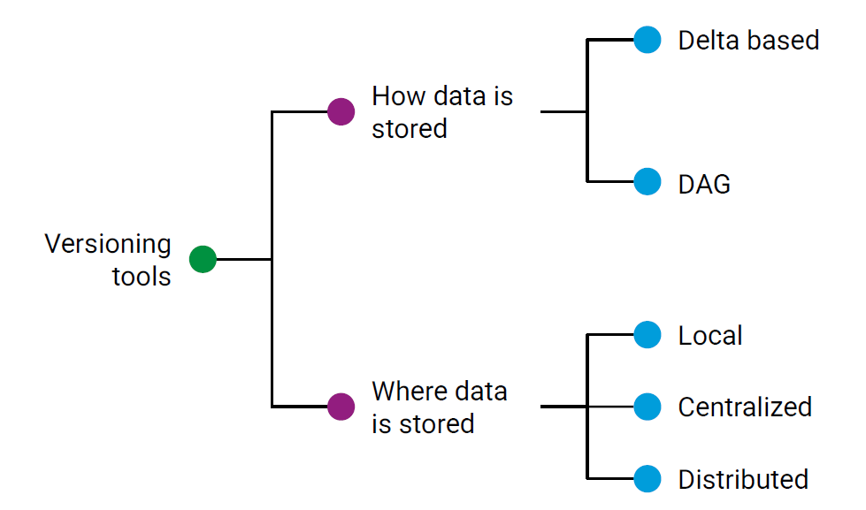
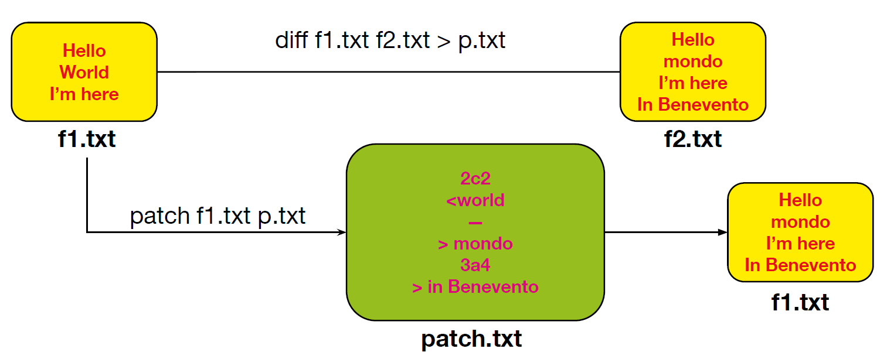
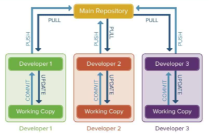
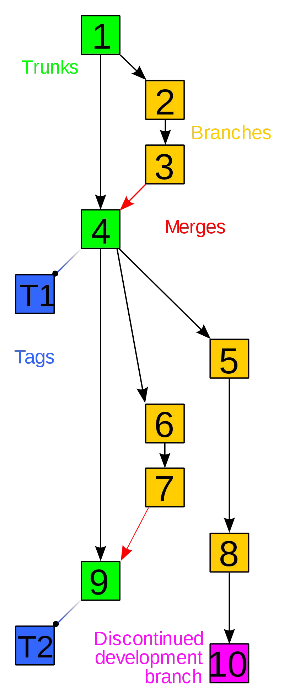

# SOFTWARE VERSIONING

Parent: [[Versioning_MOC]]

## Software configuration management

Le SCM sono un insieme di discipline che servono per gestire le evoluzione del software definendo degli standard da seguire per creare codice di qualità nei tempi previsti e con il budget disponibile. Quello che si cerca di evitare sono le **aziende di livello 1** cioè quelle aziende composte da poche persone e dove c'è una sola persone che prende le decisioni.

### Struttura del sistema software

Identifica in modo univoco i singoli componenti e li rende accessibili in una qualche forma.

- individuare gli item da tenere sotto controllo nell'SCM
- creare degli schemi, documentazioni che descrivono la gerarchia e che può essere modificata man mano che il codice viene modificato
- stabilire le configurazioni basedline cioè una versione formale e stabile di un prodotto software, che viene utilizzata come punto di riferimento per monitorare e gestire i cambiamenti futuri.

### Controllo dei cambiamenti di configurazione

Implica il controllo del rilascio e delle modifiche ai prodotti software durante tutto il ciclo di vita del software. Definiamo i processi di cambiamento:

- cambio che vengono chiesti dall'utente
- valutazione dei cambiamenti sulla base degli obiettivi del progetto
- discussione dei cambiamenti. Se viene accettato vengono implementate altrimenti no.
- stabilire una policy del controllo di cambiamenti per motivi di promotion cioè notificare chi è interessato dei cambiamenti fatti e di realise per una nuova versione del prodotto

### Contabilità dello stato della configurazione

Implica la registrazione e la segnalazione del processo di modifica. L'obiettivo della contabilità dello stato è mantenere "un record continuo dello stato e della storia di tutti gli elementi definiti come base (baselined) e delle modifiche proposte a essi.

### Auditing della configurazione

Verifica che il prodotto software sia costruito secondo i requisiti, gli standard o l'accordo contrattuale

## Software Versioning

E' responsabile della gestione del cambio del codice sorgente assegnando un **identificativo di revisione** e un **nome** alla modifica che viene associata anche al timestamp e all'autore che ha svolto la modifica



### Delta Base

Il delta-based è una tecnica di controllo della configurazione del software che si concentra sulla registrazione delle modifiche rispetto a uno stato precedente, piuttosto che conservare copie complete di ogni versione del software. Questa tecnica si basa su un approccio a snapshot, in cui viene creato uno stato iniziale del software, e poi, quando si verificano modifiche, vengono salvate solo le differenze (i delta) tra la versione corrente e quella precedente.


Utilizzando diff f1.txt f2.txt >p.txt viene creato un **file di patch** che contiene solo le differenze frai due documenti. Questo file ha una struttura simili:

```textplain
2c2 -->la riga 2 del primo file è stata cambiata con la riga 2 del secondo file <world -->per indicare cosa si è tolto

mondo -->per indicare cosa si è aggiunto 3a4 -->la riga 3 nel primo file è stata aggiunta dopo la riga 3 del primo file in Benevento
```

Con patch f1.txt p.txt applichiamo effettivamente le modifiche e solo quelle contenute nel file di patch

### Structure

Più sviluppatori possono lavorare insieme allo stesso progetto software in modo **indipendentemente**, sul proprio computer, in momenti diversi o da luoghi diversi condividendo il codice in un **repository centrale** che rappresenta la **versione ufficiale e condivisa** del progetto. Ogni sviluppatore può **contribuire con il proprio lavoro**, ma anche **ricevere gli aggiornamenti degli altri**.



Ogni sviluppatore ha una **copia locale del progetto**, dove può lavorare liberamente. Man mano che apporta modifiche, può **salvarle localmente**, tenendo traccia delle versioni, senza interferire subito con il lavoro degli altri.

Quando lo sviluppatore si sente pronto a condividere ciò che ha fatto, può **inviare le modifiche al repository centrale**.
A sua volta, può anche **recuperare** le novità introdotte dagli altri membri del team, per assicurarsi che tutto il lavoro sia aggiornato e coerente.

## Terminologia

**Repository**: Nei sistemi di controllo versione, un repository è una struttura dati che memorizza i metadati di un insieme di file o di una struttura di directory. I metadati di un repository includono un record storico delle modifiche nel repository, un insieme di oggetti di commit e un insieme di riferimenti agli oggetti di commit, chiamati heads.

**Branch**: Un insieme di file sotto controllo versione può essere "ramificato" o "forkato" in un determinato momento. Da quel momento in poi, due copie di quei file possono evolversi in modo indipendente, a velocità o in modi differenti.

**Trunk**: La linea unica di sviluppo che non è una ramificazione (nota anche come Baseline, Mainline o Master).

**Commit** (sostantivo): Un insieme di modifiche raggruppate insieme (chiamato changeset),insieme a informazioni meta (come le informazioni sull'autore, un messaggio di commit che descrive la modifica) riguardo alle modifiche. Un commit descrive le differenze esatte tra due versioni successive. Viene trattato come un'unità atomica.



**Commit** (verbo): Scrivere o unire le modifiche apportate alla copia di lavoro nel repository.

**Commit message**: Una breve nota che registra una descrizione dell'effetto o dello scopo della modifica.

**Head**: Si riferisce al commit più recente, sia nel trunk che in una branch.

**Tag**: Un tag o etichetta si riferisce a uno snapshot importante nel tempo, denominato con un nome amichevole o un numero di revisione.

**Cloning**: Creare un repository che contenga le revisioni da un altro repository.

**Checkout**: Creare una copia locale di lavoro dal repository. Un utente può specificare un are visione specifica o ottenere l'ultima versione.

**Pull, push**: Copiare le revisioni da un repository a un altro. Pulling si riferisce al recupero delle modifiche da un repository remoto e alla loro fusione nel tuo repository locale. Questo aggiorna il tuo repository locale con le modifiche più recenti dal remoto. Pushing implica l'invio delle modifiche che hai effettuato nel tuo repository locale a un repository remoto. Questo aggiorna il repository remoto con le tue modifiche locali.

**Merge**: È il processo di combinazione delle modifiche provenienti da rami diversi in un unico ramo. Permette di integrare le modifiche fatte in rami separati in un ramo comune, risolvendo eventuali conflitti che potrebbero sorgere durante il processo.

**Conflict**: Un conflitto si verifica quando parti diverse fanno modifiche allo stesso documento e il sistema non è in grado di riconciliare le modifiche. Un utente deve risolvere il conflitto combinando le modifiche o selezionando una modifica.

**Blame**: Una ricerca per identificare l'autore e la revisione che ha modificato per ultima una particolare riga.

### Semantica

Un numero di versione normale assume la forma **X.Y.Z**, dove **X**, **Y** e **Z** sono interi non negativi.

- **X** è la versione principale (major),
- **Y** è la versione secondaria (minor),
- **Z** è la versione di correzione (patch). Ogni elemento deve aumentare numericamente. Ad esempio: 1.9.0 -> 1.10.0 -> 1.11.0.

Una volta che un pacchetto versione è stato rilasciato, il contenuto di quella versione **NON DEVE** essere modificato. Ogni modifica **DEVE** essere rilasciata come una nuova versione. La versione principale zero (0.y.z) è per lo sviluppo iniziale. Qualsiasi cosa può cambiare in qualsiasi momento, infatti è usato per indicare un codice instabile e insicuro. Dalla versione 1.0.0 si definisce l'API pubblica. Il modo in cui il numero di versione viene incrementato dopo questo rilascio dipende dall'API pubblica e da come essa cambia.

- **Versione di correzione (Patch version) Z (x.y.Z | x > 0)**: deve essere incrementata se vengono introdotte solo correzioni di bug compatibilicon la versione precedente. Una correzione di bug è definita come un cambiamento interno cherisolve un comportamento errato.
- **Versione secondaria (Minor version) Y (x.Y.z | x > 0)**: deve essere incrementata se viene introdotta una nuova funzionalità compatibilecon la versione precedente nell'API pubblica. Può includere modifiche di livello patch. Laversione di correzione **DEVE** essere azzerata a 0 quando la versione secondaria vieneincrementata.
- **Versione principale (Major version) X (X.y.z | X > 0)**: essere incrementata se vengono introdotte modifiche incompatibili con laversione precedente nell'API pubblica. Può includere anche modifiche di versione secondaria edi correzione. Le versioni di correzione e secondarie **DEVE** essere azzerate a 0 quando laversione principale viene incrementata.

### Pull/Merge Request

Chiunque voglia modificare il codice non lo modifica direttamente nel branch principale (main/master), ma crea un branch separato in cui effettua le modifiche. Queste modifiche non diventano effettive immediatamente, perché è necessario effettuare una commit.

Tuttavia, la commit da sola non è sufficiente: per proporre le modifiche, bisogna creare una pull request (o merge request), alla quale devono essere allegati tutti i test effettuati per verificare la correttezza del codice.

Se le modifiche vengono accettate dal maintainer, allora è possibile effettuare il merge nel branch principale (main/master), ma solo dopo che il software versioning ha verificato che non ci siano conflitti con la versione esistente.

I conflitti nel version control si verificano quando due o più sviluppatori modificano la stessa parte di un file in branch diversi e il sistema non è in grado di decidere automaticamente quale versione mantenere.

I conflitti avvengono quando si hanno modifiche concorrenti sulla stessa riga di un file tra due commit diversi; eliminazione di un file in un branch mentre viene modificato in un altro; modifiche incompatibili tra due versioni dello stesso file.

### Costi

**Tempo e sforzo**: Nel caso più semplice, gli sviluppatori potrebbero conservare manualmente più copie delle diverse versioni del codice, etichettandole di conseguenza.

**Apprendimento e manutenzione**: Il team deve imparare i concetti alla base del version control e seguire le migliori pratiche per ottenere benefici concreti.

### Benefici

**Possibilità di annullare le modifiche**: Il version control semplifica l'annullamento delle modifiche, permettendo agli sviluppatori di sperimentare senza il timore di compromettere il codice esistente.

**Semplificazione dello sviluppo**: Grazie a funzionalità come **branching, merging e labeling**,è più facile gestire lo sviluppo in diverse fasi: sviluppo, test, staging, produzione,deployment, ecc.

**Gestione dei branch**: Tipicamente, il branch principale (**main/master**) contiene il codiceconsolidato, mentre gli altri branch contengono nuove funzionalità in fase di sviluppo.

**Migliora la collaborazione e la comunicazione**: Il version control permette di individuareconflitti tra le modifiche (modifiche incompatibili sulle stesse righe di codice), riducendo lanecessità di coordinazione tra gli sviluppatori.

**Mitigazione dei danni**: Monitorare la cronologia del codice aiuta a comprendere cosa èstato fatto, da quanto tempo esiste un bug e come risolverlo. È inoltre possibile installaree testare versioni precedenti del software.

**Semplifica il debugging**: Applicando un test case a più versioni del codice, si puòidentificare rapidamente quale modifica ha introdotto un bug.
