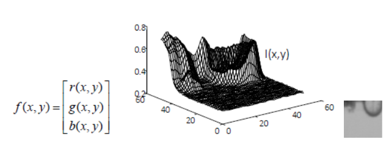
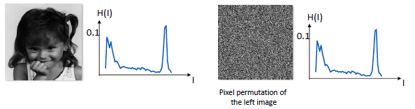
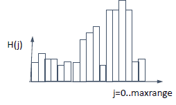
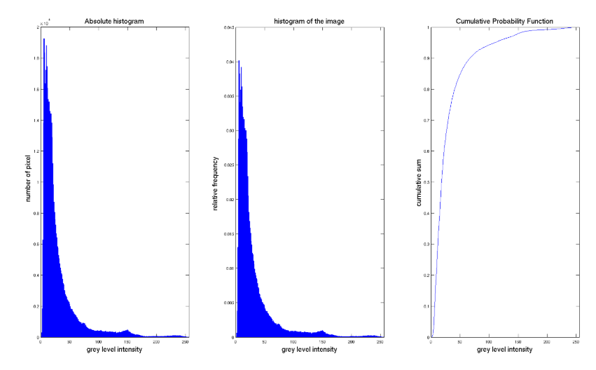

# Image

Parent: [[0-Computer_Vision_MOC]]

An image can be defined in many ways:

1. **2D signal:** image is a discrete representation of a 2D continuous function _I(x,y)._ It can be considered as a signal and take advantage of the techniques of signal processing for 1D signal.
   
   $$I(x)=f(x,y): R2 \rightarrow R$$ The image is defined over a squared interval and the value of the function is sampled and digitalized
2. **matrix of pixel:** image is a 2D matrix of digital pixels and thus, image processing is an application of mathematical functions or algorithmic procedures working on images.This can come from the quantization of image signal, where eache values of matrix represent the characteristics of image in a certain point. Each row can be represented graphically by using **histogram**.
3. **2D or 3D tensor** in dl field

There are different ways to represent the images:

1. **grayscale Images:** Represented as a 2D matrix where each pixel value typically ranges from 0 (black) to 255 (white).256 levels of grey are not useful so we can normalize into a [0,1] interval and still be able to recognize the objects.
2. **color Images:** Typically represented as a 3D tensor (Width x Height x Channels). The most common model is **RGB** (Red, Green, Blue) where ate each pixel is associated a number that corresponds a triplet value [r, g, b] that give colour a certain pixel.
3. **HSV/HSL (Hue, Saturation, Value/Hue, Saturation, Lightness)** designed to align more closely with human perception differently by RGB that is hardware oriented. These models describe colour using three intuitive dimensions:
   1. **Hue (H):** Represents the "type" of colour (e.g., Red, Blue, or Yellow). It is typically expressed as an angle from **0° to 360°** on a colour wheel.
   2. **Saturation (S):** Describes the "vibrancy" or purity of the colour. A saturation of 0% results in a shade of grey, while 100% is the most intense version of that hue.
   3. **Value (V) / Lightness (L):** \* **Value (in HSV):** Represents the "intensity" or brightness of the light.
      1. **Lightness (in HSL):** Represents the amount of white or black mixed with the colour.

The fundamental building block of a digital image is how it captures light from a 3D scene and projects it into a 2D space.

Each pixel represents the **luminance intensity** (**brightness**) of a specific point in a 3D scene, that depends on various factor as projected in the 2D space, depending on the luminance of the object, the reflectivity, the background luminance, the sensor… and determinate the **pixel value**.

- **PHOTOMETRY**: This field studies brightness measurements. It focuses on the energy distribution of the source and sensor sensitivity rather than wavelength, providing a physical meaning to the numerical image values.

Digital images are further classified by the number of spectral components they contain. **Monochromatic Images** are strictly representing **brightness values** only, while **colour images** are represented by more spectral components, typically consisting of **N=3** images (channels) within a colour space.

- **COLORIMETRY**: Unlike photometry, this field specifically studies **wavelength** and colour emission.

In a computational context, an image is not viewed as a picture, but as a organized in data structures as:

1. **multidimensional arrays:** A colour image is a **data structure multi-array**. It consists of a set of matrices, with one matrix assigned to each dimension of the colour space (e.g., three matrices for RGB).
2. **vector representation:** Any specific point $I(x, y)$ is represented as a **3D vector** within a chosen colour space like RGB or HSV.
3. **video structure:** A video is defined as an **(M+1) D structure**, where $M$ represents the spatial/spectral dimensions and the $+1$ represents the **time dimension**.

Another way to see a image is as **histogram**. The histogram at grey level is a vector with as many elements (**bins**) as the number of grey levels; the value of each bin is the accumulation of the number of pixels which, in that image, assume the correspondent grey level.

The histogram gives important information for image processing, especially for contrast enhancement, but should no be enough to resolve all problems because represents the **global statistics** of an image. capturing the energy distribution studied in **Photometry**, it discards all **spatial information arrangement**. This means that two images can have the exact same histogram (the same number of black, white, and grey pixels) but represent completely different scenes.

- **Spatial Agnosticism:** A histogram of a checkerboard and a histogram of an image with the left half black and the right half white will be identical.
- **Semantic Failure:** Because it only measures **intensity** (Photometry), it cannot distinguish a "car" from a "road" if they share similar reflectance values.

For color images, which are **3D vectors in a color space**, you can have one histogram per channel (R, G, B) or a joint 3D histogram. Even then, the spatial structure of the object is lost.

A property of histogram is that if we permute pixel’s image, the histogram will be the same of the original image because the pixel is the same but shuffle, so have the same characteristics.

For another point of view, histogram can be viewed a discrete **probability density function** (**PDF**), if the data are random variable i.i.d.

Given an image $I$ di $n=N x M$ pixels with $L$ levels

$$H(j)=p(j)=\frac{\#\{x:I(x)=j\}}{n} \text{ where } 0\leq j \leq L-1$$

Dividing by _n_ we have the **normalized histogram** that is a probability and so that the sum of all bins equals 1 $\sum{}^{}p\left(j\right)=1$

The i.i.d. hypothesis is too strong because in this way we assume that the intensity of pixel does not depend on its neighbours (**independent**) and every pixel is assumed to be drawn from the same underlying probability distribution. Instead in the reality, pixels are highly **correlated** with their neighbours and treating them as i.i.d. is exactly why the histogram loses "discriminative" power, it ignores the spatial dependencies that define objects.

- **Bimodal vs. Multimodal:** If a histogram has two distinct peaks, the image is likely composed of a dark background and a light object. This is essential for **binarization**, where a threshold is chosen between the peaks to create a binary image.
- **Dynamic Range:** The spread of the histogram indicates the range of intensities present. A narrow histogram indicates a low-contrast image, whereas a spread across all bins suggests a high-contrast image.
  - **Low Dynamic Range**: The pixels are concentrated in a narrow area of the histogram. The image appears "flat" or grayish because the difference between the lightest and darkest point is minimal.
  - **High Dynamic Range**: The histogram is distributed over almost the entire available range. This ensures a clear separation between the different components of the scene.

A limited Dynamic Range may indicate that the sensor has not been sensitive enough to capture nuances in very dark or high-light areas (**saturation/Clipping**) If the histogram has extreme peaks at 0 or $L-1$, it means that the energy of the scene exceeds the capacity of the sensor, causing an irreversible loss of information.

For the PDF we can determinate **Cumulative Distribution Function** (**CDF**) by summing probabilities up to a specific intensity level $l$.

$$cdf_{x}=p\left(x\leq l\right)=\sum_{j=0}^{k}p\left(j\right)$$
It represents the percentage of pixels in an image that are equal to or darker than a specific grey level.

By mapping the original CDF of an image onto this diagonal, we redistribute the intensities to use the full **dynamic range** more efficiently. This gives a clear **physical meaning** to the enhancement: we are spreading out the most frequent intensity levels to occupy more of the available bins.

The CDF is utilized for:

- **Threshold Selection**: Finding the point where a certain percentage of the image is "background".
- **Noise Analysis**: Comparing the CDF of a noisy image against a "clean" reference image to determine the energy distribution of the noise.
- **Binarization**: Assisting in choosing the optimal threshold for creating a binarized structure from a multi-array data structure.

By viewing the histogram as a PDF, you can calculate **statistical moments** to describe the image's "physical meaning" and energy distribution:

- **Mean** ($μ): $Indicates the average brightness (Photometry).
- **Variance** ($σ^{2}$)**:** A measure of image contrast.
- **Skewness:** Measures the asymmetry of the intensity distribution (e.g., is the image mostly dark with a few highlights?).
- **Entropy:** Measures the "information content" or randomness. A high-entropy image has a flat, uniform histogram, while a low-entropy image is predictable (like a binarized image).

  $$Entropy(I) = -\sum_{j}^{}p(j) \log p(j)$$
