# Edge Detection

Parent: [[3-Noise_and_Filtering]]

Edge detection involve identifying points in a image where the brightness changes rapidly or has discontinuities. The purpose of edge detection is to capture important structural information about the objects within an image, such as their boundaries and shapes.

!!!Note **Edge** is a _local_ properties of pixel and its neighbourhood that is characterizedby a rapid luminance change in the image.

This change in intensity can be caused by various factors, such as changes in surface orientation, material properties, or lighting conditions. So, we can find edge in a oimage in differentes way, for example:

- **surface normal discontinuity**: that is the normal shape of the object, for example the edge of a cube.
- **depth discontinuity**: that is the distance of the object from the camera, for example the edge of a person standing in front of a wall.
- **surface color discontinuity**: that is the color of the object, for example the edge of a red apple on a green background.
- **illumination discontinuity**: that is the change in lighting, for example the edge of a shadow cast by an object.

!!!Note Instead, **border**, is a property of region of the image, that is characterized by a rapid luminance change in the image.

Mathematically, edge is a vector that depends on the luminance variation which can compute by the gradients. The luminance gradient of an image is a vector that points in the direction of the greatest rate of increase of intensity, and edge direction is perpendicular to this gradient.

!!!Note Mathematically, the **edge** is a point or a set of points where the gradient magnitude is above a certain threshold, and the edge direction is perpendicular to the gradient vector.

Luminance gradient is defined as the vector of partial derivatives of the image intensity function:
$$ J(x) = \nabla I(x) = \left( \frac{\partial I}{\partial x}, \frac{\partial I}{\partial y} \right) $$

  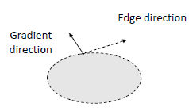

$J$ is a vector field that points in the direction of $steepsdt ascent$ in the intensity function.
The magnitude of the gradient is given by:
$$ |J(x)| = \sqrt{\left( \frac{\partial I}{\partial x} \right)^2 + \left( \frac{\partial I}{\partial y} \right)^2} $$
and indicate the strenght of the variation of the intenity, while the direction of the gradient is given by:
$$ \theta(x) = \arctan\left( \frac{\partial I / \partial y}{\partial I / \partial x} \right) $$
and indicate the direction of the greatest rate of increase of intensity.

Taking the derivatives of the image increases high frequencies and consequently the noise present in an image, for all frequency components, but especially for high frequencies. This can lead to a significant degradation in the quality of the edge detection results, as the noise can create false edges or obscure true edges in the image.

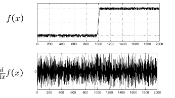

To avoid this problem, we can apply a low-pass filter to the image before computing the gradient. This is typically done by convolving the image with a Gaussian kernel, which smooths the image and reduces noise while preserving important structural information. Should be better if we derivate the Gaussian kernel and then convolve the image with the derivative of the Gaussian, this is known as the **Laplacian of Gaussian** (**LoG**) method.

This because, from a computational point of view, is better to derivate K instead of derivate I, because the convolution operation is linear and associative, so we can compute the derivative of the Gaussian kernel once and then convolve it with the image, is the same as convolving the image with the Gaussian kernel and then taking the derivative of the result, for the property of linearity and associativity of convolution.

$$J_{\sigma}(x) = \nabla (I * G_{\sigma})(x) = I * \nabla G_{\sigma}(x)$$ that can be computed efficiently using the separable property of the Gaussian kernel.

!!! tip "Edge Detection Steps"
    1. **Smooth** the image with a Gaussian filter to reduce noise.
    2. **Use** an edge detection operator to find edges.
    3. **Selection** of strong edges (non-maximum suppression, thresholding).
    4. **Linking** of edge points into segments (hysteresis thresholding).

There are two approcies to detect edges:

- **Gradient-base** with which we are looking for the max and min values of the first derivatives. Here, the edges are defined as a local change in intensity, and correspond to th **peaks** of the gradient magnitude.
  - Sobel, Prewitt, Canny etc.
- **Laplacian-base** with which we are looking for the **zero-crossing** of second derivates. Here, the edges are defined as points where the second derivates change sign, which correspond to the zero-crossing of the Laplacian of the image.
  - Laplacian of Gaussian (LoG), Difference of Gaussians (DoG) etc.

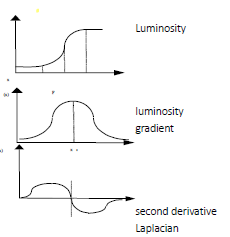

Everything is very beautiful, but the problem is that the image is a discrete representation, so the derivative is not defined at every point, and we need same way to approximate the derivates. On e way to do this is to use **finite difference methods**, which approximate the derivative by taking the difference between adjacent pixel values. This approach is realised by computing:

1. **forward difference**: $\Delta_h \left[f\right] = f(x+h) - f(x)$
2. **backward difference**: $\nabla_h \left[f\right] = f(x) - f(x-h)$
3. **central difference**: $\delta_h \left[f\right] = f(x+\frac{1}{2}h) - f(x-\frac{1}{2}h)$

For 2D dimension, we can compute the partial derivatives with respect to x and y using the central difference:
$$\frac{\partial I}{\partial x} \approx \frac{I(x+1, y) - I(x-1, y)}{2}$$
$$\frac{\partial I}{\partial y} \approx \frac{I(x,  y+1) - I(x, y-1)}{2}$$

This corrispond to convolution operation, that can be computed as a separable filter.

## Types of Edge Detectors

### Prewitt Operator

The Prewitt operator provides provides a central derivative in one direction and average filter in the other to suppress high-frequency noise.

- **Horizontal Gradient ($G_x$):** Computes the difference between the right and left columns across three rows.
- **Vertical Gradient ($G_y$):** Computes the difference between the bottom and top rows across three columns.

**Kernels:**

$$P_x = \begin{bmatrix} -1 & 0 & 1 \\ -1 & 0 & 1 \\ -1 & 0 & 1 \end{bmatrix}, \quad P_y = \begin{bmatrix} -1 & -1 & -1 \\ 0 & 0 & 0 \\ 1 & 1 & 1 \end{bmatrix}$$

This can be normalized by dividing by 1/6.

### Sobel Operator

The Sobel operator is technically a "weighted" version of the Prewitt operator. It is generally preferred in computer vision because it provides a more robust gradient estimate.

- **Center Weighting:** It gives higher weight (typically 2) to the center pixel in the smoothing direction.
- **Noise Suppression:** This increased weight helps provide better localization and reduces sensitivity to noise even further than the Prewitt mask.

**Kernels:**

$$S_x = \begin{bmatrix} -1 & 0 & 1 \\ -2 & 0 & 2 \\ -1 & 0 & 1 \end{bmatrix}, \quad S_y = \begin{bmatrix} -1 & -2 & -1 \\ 0 & 0 & 0 \\ 1 & 2 & 1 \end{bmatrix}$$

### Frei-Chen Operator

The **Frei-Chen operator** instead of just looking for horizontal and vertical changes, it treats a $3 \times 3$ neighborhood as a vector in a 9-dimensional space, projecting it onto a set of nine basis kernels.

The core innovation of Frei and Chen is the decomposition of a $3 \times 3$ image patch into nine orthogonal sub-spaces. These bases are categorized by the type of structural information they extract:

- **Edge Basis (4 kernels):** Used to detect edges at various orientations.
- **Line Basis (4 kernels):** Optimized for detecting thin lines or "ripples".
- **Average/DC Basis (1 kernel):** Represents the local average intensity.

While the Sobel operator is essentially a subset of the Frei-Chen edge basis.

Frei-Chen is designed to have a more uniform response to edges at all angles, whereas Sobel can be slightly biased toward horizontal and vertical orientations.
The Frei-Chen edge kernels use $\sqrt{2}$ as a weighting factor for the center-neighbor pixels, compared to Sobel's integer weight of 2.

**Kernels:**

  **$G_x$:** $\frac{1}{2+\sqrt{2}} \begin{bmatrix} 1 & \sqrt{2} & 1 \\ 0 & 0 & 0 \\ -1 & -\sqrt{2} & -1 \end{bmatrix}$

  **$G_y$:** $\frac{1}{2+\sqrt{2}} \begin{bmatrix} 1 & 0 & -1 \\ \sqrt{2} & 0 & -\sqrt{2} \\ 1 & 0 & -1 \end{bmatrix}$

  (Note the $\sqrt{2}$ factor for improved rotational invariance).

To detect an edge, the algorithm calculates the **projection** of the local image neighborhood onto the "Edge Subspace." The strength of the edge is determined by the angle between the image vector and the subspace.

If the vector is close to the subspace spanned by the edge kernels, the pixel is likely part of an edge. This geometric approach makes it more robust for discriminating between actual edges and line-like structures or noise.

---

After apply one of these operators, we can compute _thresholding_ to identify **strong edges**. This step is important because the convolutional operation can produce noise and this is manifested as more edges than the real ones.

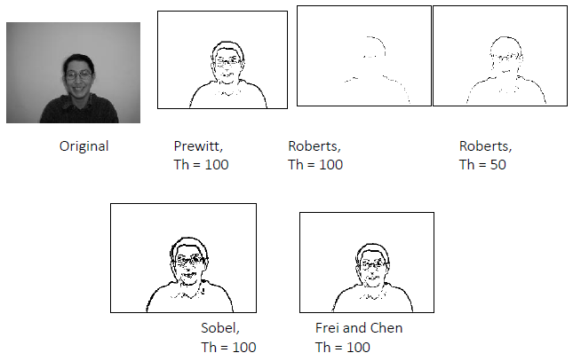

## Canny Edge Detector

John Canny developed an edge detection algorithm, designed with three specific performance criteria in mind:

1. **Maximize Signal-to-Noise Ratio**: edges in real-world images exist alongside random variations in intensity. His algorithm aims to suppress these noise-induced false edges while still detecting genuine intensity changes that represent object boundaries. This is achieved through **Gaussian smoothing combined with gradient computation**, which emphasizes significant intensity changes while diminishing the impact of small, random variations.
2. **Good Localization**: an edge detector should not just find edges ensuring that detected edges are positioned as close as possible to the true edges in the original image. The localization property is achieved through **non-maximum suppression**.
3. **Single Response**: a problem with earlier edge detectors was their tendency to produce multiple responses to a single edge. Canny’s algorithm addresses this through a combination of non-maximum suppression and **hysteresis thresholding**, ensuring that each true edge in the image generates exactly one detected edge in the output. This produces clean, thin edge lines that accurately represent the structure of the image.

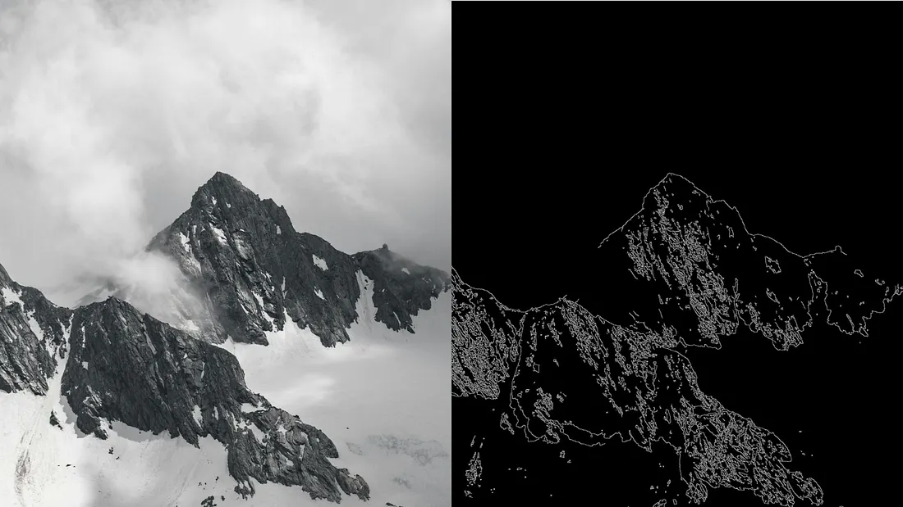

!!!tip **STEPS** "Canny Edge Detection Algorithm"
    1. **Gaussian Smoothing**
    2.  **Gradient Computation**
    3.  **Non-Maximum Suppression**
    4.  **Locating edges by finding zero-crossings**
    5.  **Hysteresis Thresholding**

Random variations in pixel intensity can create _false edges_ or _break true ones_. Gaussian smoothing suppresses high-frequency noise while preserving important structural information.

- The choice of $\sigma$ (sigma) determines the scale of the edges to be detected; a larger $\sigma$ finds thicker, more prominent edges.

After the algorithm computes the intensity gradient of the smoothed image using finite difference approximations to find areas of rapid intensity change, to compute gradient magnitude and direction for each pixel.

Locate edges by finding zero-crossings along the edge normal directions with **non-maximum suppression**. Gradient magnitude produces multiple adjacent pixels all respond to the same edge. To achieve the goal of "minimal response," the algorithm thins the blurred edges. It identifies local maxima in the gradient magnitude along the direction of the gradient.

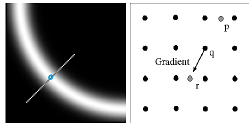

A pixel $P$ is considered a valid edge only if its gradient magnitude is greater than or equal to its neighbors ($P_1$ and $P_2$) along the gradient direction:

$$\text{if } \begin{cases} Grad(P) \geq Grad(P_1) \\ Grad(P) \geq Grad(P_2) \end{cases} \Rightarrow P \text{ is a valid edge}$$

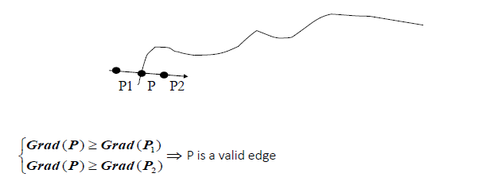

Since the gradient direction may not point directly at a neighboring pixel, Canny often uses linear interpolation to estimate the gradient values at points $P_1$ and $P_2$.

If $|Grad_x(i,j)| > |Grad_y(i,j)|$, the slope $m$ is calculated as $Grad_y / Grad_x$. The values for interpolation are then derived using $m$ and the surrounding 8-neighborhood pixels:

$$
Grad(P_1) = Grad(1, -1) \cdot m + Grad(1, 0) \cdot (1-m) \\
Grad(P_2) = Grad(-1, 1) \cdot m + Grad(-1, 0) \cdot (1-m)
$$

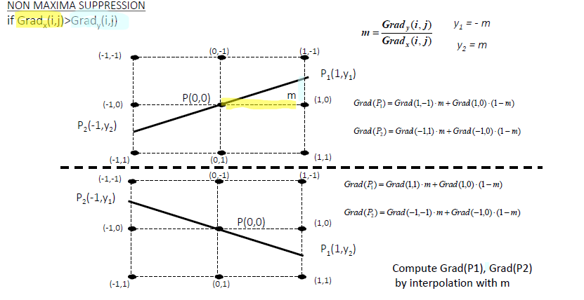

If $|Grad_x(i,j)| < |Grad_y(i,j)|$, it signifies that the vertical component of the gradient is dominant, meaning the edge is oriented more horizontally. We calculate the inverse slope $1/m$ to perform sub-pixel interpolation.

$$1/m = \frac{Grad_x(i,j)}{Grad_y(i,j)}, -1 \leq 1/m \leq 1$$

The values for interpolation are then derived using $m$ and the surrounding 8-neighborhood pixels:

$$
Grad(P_1) = Grad(0, 1) \cdot (1 - |1/m|) + Grad(1, 1) \cdot |1/m| \\
Grad(P_2) = Grad(0, -1) \cdot (1 - |1/m|) + Grad(-1, -1) \cdot |1/m|
$$

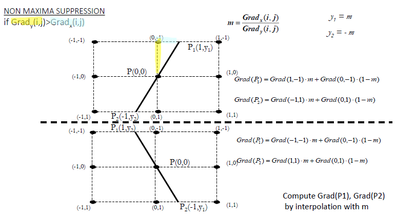

After non-maximum suppression, we need to decide which responses are true edges. Using a single threshold creates a difficult choice:

- A high threshold misses faint but important edges
- A low threshold includes too many noise-induced false edges.

Canny's solution is **Hysteresis Thresholding** that uses two thresholds:

- a high threshold to identify strong edge pixels. Pixels with gradient magnitude (M) greater than or equal to the high threshold ($T_{high}$) are immediately classified as definite edge pixels.
- a low threshold to identify weak edge pixels. Pixels with gradient magnitude between the low threshold ($T_{low}$) and high threshold ($T_{high}$) are marked as potential edge pixels.
- Non-edges: Pixels with gradient magnitude less than the low threshold ($T_{low}$) are immediately discarded. These represent locations where we have high confidence that no edge exists.

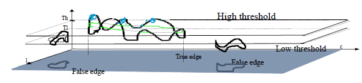

$$
E(p) =\begin{cases}
1 & \text{if } p \in G_{strong} \\
1 & \text{if } p \in G_{weak} \text{ AND } \exists q \in \Omega(p) \text{ such that } E(q) = 1 \\
0 & \text{otherwise}
\end{cases}
$$

$T$: the ratio of $T_{high}$ to $T_{low}$ is often set between 2:1 and 3:1.

The algorithm then connects weak edge pixels to strong edge pixels if they are adjacent, ensuring that true edges are preserved while minimizing noise.

## LoG and Zero-Crossing

The combination of the **Laplacian of Gaussian (LoG)** and **Zero Crossing** detection represents a powerful second-derivative approach to edge detection. Unlike gradient-based methods that search for peaks in the first derivative, this method focuses on finding the exact mathematical "inflection point" where the intensity change is steepest.

The Laplacian ($\nabla^2$) is a second-order derivative operator that is extremely sensitive to noise. To make it useful for images, we must first smooth the signal.

1. **Gaussian Smoothing:** The image is convolved with a Gaussian filter $G(x, y, \sigma)$ to remove high-frequency noise. $$ \nabla G*{\sigma}(x) = \left(\frac{\partial^2 G*{\sigma}}{\partial x^2}, \frac{\partial^2 G\_{\sigma}}{\partial y^2} \right) (x) = \left[-x -y\right]\frac{1}{\sigma^2}e^{-\frac{x^2 + y^2}{2\sigma^2}}$$
2. **Laplacian Operator:** The Laplacian is applied to the smoothed result. It calculates the sum of second-order partial derivatives:

$$\nabla^2 I = \frac{\partial^2 I}{\partial x^2} + \frac{\partial^2 I}{\partial y^2}$$

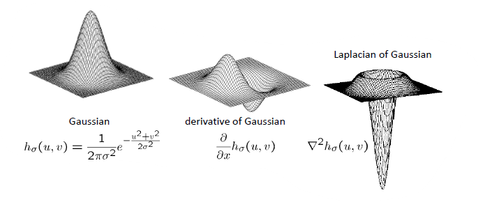
By the property of convolution, these two steps can be combined into a single kernel,
$$LoG(x, y) = -\frac{1}{\pi\sigma^4} \left[ 1 - \frac{x^2 + y^2}{2\sigma^2} \right] e^{-\frac{x^2 + y^2}{2\sigma^2}}$$

The edges are identified by finding points where the Laplacian changes sign.
A pixel is identified as a zero crossing if its value is on one side of a threshold $t$ while at least one of its neighbors is on the opposite side. Mathematically, this is defined as:

- $(I(x) < t)$ **AND** at least one neighbor $(N(I(x)) > t)$
- **OR** vice versa

The threshold $t$ is typically very small (e.g., $t=1$ when using Gaussian smoothing with $\sigma = 1 \text{ to } 2$). This small value helps distinguish significant transitions from minor numerical fluctuations.

### Pros

- **Threshold Sensitivity:** The detector is not highly sensitive to the exact value of the threshold. Because the zero crossing represents a mathematical transition from positive to negative, the crossing point remains relatively stable even if the signal magnitude varies.

### Cons

- **Corner/Angle Failure:** LoG edge detectors struggle with discontinuities such as sharp **angles** or corners. In these areas, the second derivative can become poorly defined or result in distorted edge localization.
- **Closed Edges:** The method is very sensitive to small, closed edges. This can result in "spotted" noise or the detection of tiny, irrelevant structures that a gradient-based method (like Canny) might ignore.
- **Isotropic Nature:** Because the Laplacian is rotationally invariant, it does not provide the edge orientation information that first-derivative operators (like Sobel) offer.

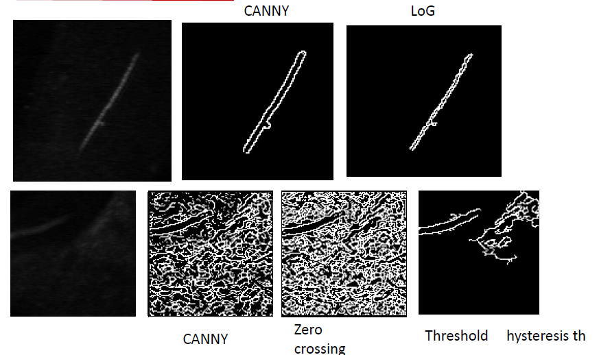

The **Difference of Gaussians** is often used to approximate the LoG because it is computationally more efficient while yielding nearly identical results for feature detection.
