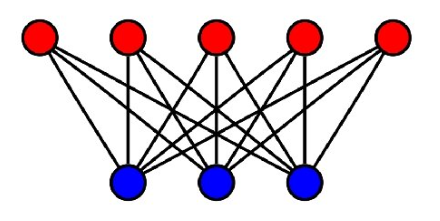

# Graph Theory

Parent: [[Graph_Analytics_MOC]]

I grafi sono strutture matematiche discrete che rappresentano insiemi di oggetti (nodi) e le relazioni tra di essi (archi). La teoria dei grafi fornisce un quadro formale per analizzare e comprendere queste strutture, consentendo di studiare le proprietà dei grafi e di sviluppare algoritmi per risolvere problemi complessi.

> Un **grafo** G = (V, E) è costituito da V, un insieme non vuoto di vertici (o nodi) ed E, un insieme di archi. Ogni arco ha uno o due vertici associati, chiamati estremi. Un arco si dice che collega i suoi estremi.

> Un **sottografo di un grafo** $G = (V, E)$ è un grafo $H = (W, F)$ tale che $W \subseteq V$ (l'insieme dei vertici di $H$ è un sottoinsieme dei vertici di $G$). $F \subseteq E$ (l'insieme degli archi di $H$ è un sottoinsieme degli archi di $G$). Affinché $H$ sia un grafo valido, ogni arco in $F$ deve avere i propri estremi contenuti in $W$. Non si possono ereditare gli archi se si lasciano indietro i vertici a cui sono collegati; la coerenza topologica non ammette "archi orfani".

> oUn sottografo $H$ di $G$ è definito sottografo proprio se $H \neq G$. In altri termini, $H$ è un sottografo proprio se è ottenuto rimuovendo almeno un vertice o almeno un arco dal grafo originale.

Un grafo in cui ogni arco collega due vertici diversi e in cui nessun arco collega la stessa coppia di vertici è chiamato **grafo semplice**. Di conseguenza, quando c'è un arco di un grafo semplice associato a {u, v}, possiamo anche dire che {u, v} è un arco del grafo.
Un arco non può collegare un vertice a se stesso.
Non può esistere più di un arco che colleghi la stessa coppia di vertici.

I grafi che possono avere più archi che collegano gli stessi vertici sono chiamati **multigrafi**. Quando ci sono m archi diversi associati alla stessa coppia non ordinata di vertici {u, v}, diciamo anche che {u, v} è un arco di molteplicità m.

Un arco che collega un vertice a se stesso è chiamato **loop**. Un grafo che può avere loop è chiamato **pseudografo**.

## Grafi non orientati

> Un **grafo non orientato** è un grafo in cui gli archi non hanno una direzione specifica. In altre parole, se c'è un arco tra i vertici $u$ e $v$, si può viaggiare da $u$ a $v$ e da $v$ a $u$ senza restrizioni.

Due vertici $u$ e $v$ in un grafo non orientato $G$ sono definiti **adiacenti** (o vicini) se esiste un arco $e$ che li connette. In questo contesto, $u$ e $v$ sono detti estremi dell'arco $e$. Un arco $e$ si dice **incidente** ai vertici $u$ e $v$ se questi ultimi sono i suoi punti terminali. L'arco $e$, di conseguenza, stabilisce una connessione diretta tra i due nodi.

Un **grafo completo** è un grafo in cui ogni coppia di vertici distinti è connessa da un arco. In un grafo completo con $n$ vertici, ci sono $\binom{n}{2} = \frac{n(n-1)}{2}$ archi, poiché ogni coppia di vertici contribuisce con un arco.

L'insieme di tutti i vicini () di un vertice $v \in V$, denotato con $N(v)$, è chiamato **intorno** (**Neighborhoods**) di $v$.Intorno di un SottoinsiemeSia $A \subseteq V$ un sottoinsieme di vertici. L'intorno di $A$, denotato con $N(A)$, è l'insieme di tutti i vertici di $G$ adiacenti ad almeno un vertice contenuto in $A$. Formalmente:$$N(A) = \bigcup_{v \in A} N(v)$$

Il **grado di un vertice** $v$ in un grafo non orientato, indicato con $\deg(v)$, rappresenta il numero di archi incidenti su di esso. Il self-loop contribuisce per due unità al grado del vertice. perchè questo riflette il fatto che ogni arco ha due estremità e in questo caso, entrambe le estremità "toccano" lo stesso vertice.

> **Il Lemma della Stretta di Mano (Handshaking Lemma)**
> Il lemma stabilisce che la somma dei gradi $$\sum_{v \in V} \deg(v) = 2|E|$$ Ogni arco $e = \{u, v\}$ contribuisce esattamente con una unità al grado del vertice $u$ e con una unità al grado del vertice $v$. Di conseguenza, nel conteggio totale dei gradi, ogni singolo arco viene contato esattamente due volte per via del fatto che può essere percorsa in entrambi i versi essendo non direzionato.

## Grafi orientati

> Un **grafo orientato** (o **digrafo**), è un grafo in cui gli archi hanno una direzione specifica. In un digrafo, un arco che collega i vertici $u$ e $v$ è rappresentato come una coppia ordinata $(u, v)$, indicando che l'arco va da $u$ a $v$. In un digrafo, la direzione degli archi è fondamentale e determina le relazioni tra i vertici.

> Un **arco orientato** è associato a una coppia ordinata di vertici $(u, v)$.
>
> - $u$ è il vertice iniziale (o origine).
> - $v$ è il vertice finale (o termine).Si dice che l'arco "esce" da $u$ ed "entra" in $v$.

Poiché la direzione conta, dobbiamo distinguere tra due tipi di grado per ogni vertice $v$:

- **Grado Entrante** ($\deg^-(v)$): Il numero di archi che hanno $v$ come vertice finale.
- **Grado Uscente** ($\deg^+(v)$): Il numero di archi che hanno $v$ come vertice iniziale.

Il **grado totale di un vertice** $v$, definito come la somma del suo grado entrante e del suo grado uscente. $$\deg(v) = \deg^-(v) + \deg^+(v)$$ Se presente un self-loop nella somma del grado totale, il cappio contribuisce con 2, come avviene nei grafi non orientati.

> **Il Lemma della Stretta di Mano per Digrafi**
> In un grafo orientato, la somma dei gradi entranti è uguale alla somma dei gradi uscenti, ed entrambe sono uguali al numero totale di archi $|E|$:$$\sum_{v \in V} \deg^-(v) = \sum_{v \in V} \deg^+(v) = |E|$$

## Bipartite Graphs

Un grafo semplice $G = (V, E)$ si dice **bipartito** se l'insieme dei suoi vertici $V$ può essere partizionato in due sottoinsiemi disgiunti $V_1$ e $V_2$ tali che ogni arco in $E$ colleghi un vertice di $V_1$ con un vertice di $V_2$.
In termini formali, per ogni arco $\{u, v\} \in E$, si ha che:$u \in V_1$ e $v \in V_2$, oppure$u \in V_2$ e $v \in V_1$.Quando questa condizione è soddisfatta, la coppia $(V_1, V_2)$ viene chiamata bipartizione dell'insieme dei vertici $V$.2.

La caratteristica distintiva di un grafo bipartito è che non esistono archi che colleghino due vertici appartenenti allo stesso sottoinsieme. Se $u, w \in V_1$, allora $\{u, w\} \notin E$. Se $v, z \in V_2$, allora $\{v, z\} \notin E$. In pratica, i vertici all'interno di $V_1$ (o $V_2$) non comunicano mai direttamente, ma solo attraverso i vertici dell'altro sottoinsieme. Questa struttura è particolarmente utile in molte applicazioni, come la modellazione di relazioni tra due gruppi distinti di entità (ad esempio, studenti e corsi, o clienti e prodotti).

## Graph Navigation

La **navigazione** in un grafo si riferisce al processo di esplorazione dei vertici e degli archi del grafo per raggiungere un obiettivo specifico, come trovare un percorso tra due vertici, visitare tutti i vertici o determinare se esiste un ciclo. Esistono diversi algoritmi di navigazione, ognuno con caratteristiche e applicazioni specifiche.

I nodi raggiungibili in un grafo sono tutti quei vertici che possono essere visitati partendo da un nodo sorgente specifico, seguendo una sequenza di archi (cammino).

In un grafo è non orientato, la raggiungibilità è una relazione simmetrica: se $u$ raggiunge $v$, allora $v$ raggiunge $u$; mentre in un grafo orientato, la raggiungibilità è una relazione asimmetrica: se $u$ raggiunge $v$, non è necessariamente vero che $v$ raggiunge $u$.

La raggiungibilità definisce la struttura macroscopica del grafo:

- **Componente Connessa**: Un insieme di nodi in cui ogni nodo è raggiungibile da qualsiasi altro nodo dell'insieme.
- **Grafo Fortemente Connesso** (nei grafi orientati): Un grafo in cui, per ogni coppia di nodi $(u, v)$, esiste sia un cammino da $u$ a $v$ che un cammino da $v$ a $u$.

Esistono due approcci principali, uno algoritmico e uno algebrico:

- **Approccio Algoritmico (BFS/DFS)**: Partendo dal nodo sorgente, si esplora il grafo "a macchia d'olio" (Breadth-First Search) o in profondità (Depth-First Search). Tutti i nodi marcati come "visitati" alla fine del processo costituiscono l'insieme dei nodi raggiungibili. La complessità è $O(|V| + |E|)$.
- **Approccio Algebrico (Matrice di Adiacenza)**: Come accennato in precedenza, se analizziamo la matrice $A$, un nodo $j$ è raggiungibile dal nodo $i$ in esattamente $k$ passi se l'elemento $(i, j)$ della matrice $A^k$ è maggiore di zero:$$(A^k)_{ij} > 0$$

### Depth-First Search (DFS)

La **Depth-First Search (DFS)** è una strategia di esplorazione che punta a procedere il più lontano possibile lungo ogni ramo prima di tornare sui propri passi (backtracking).

1. Si parte da un vertice sorgente (scelto arbitrariamente o per specifica).
2. Si visita un vicino non ancora esplorato e si prosegue immediatamente da quest'ultimo.
3. Quando si raggiunge un vertice che non ha più vicini non visitati (un "vicolo cieco"), si torna indietro al vertice precedente per cercare altri rami inesplorati.

### Breadth-First Search (BFS)

La **Breadth-First Search (BFS)** una strategia di esplorazione che procede "per livelli". Visita sistematicamente tutti i vicini di un vertice prima di passare ai vicini di questi ultimi.

1. Si parte da un vertice sorgente e si visita tutti i suoi vicini immediati.
2. Successivamente, si visita ogni vicino dei vicini appena visitati, e così via, procedendo a strati successivi del grafo.
3. Solo dopo aver esaurito i vicini diretti, si passa a esplorare i nodi a distanza 2, poi 3, e così via.

## Connectivity

La **connettività** è la proprietà che definisce quanto un grafo sia "unito" o quanto sia facile muoversi tra i suoi vertici. Un grafo che non è connesso può essere visto come un insieme di frammenti isolati.

Una **componente connessa** di un grafo $G$ è un sottografo connesso di $G$ che non è un sottografo proprio di un altro sottografo connesso di $G$. In altri termini, una componente connessa di un grafo $G$ è un sottografo connesso massimale di $G$.Un grafo $G$ che non è connesso presenta due o più componenti connesse che sono disgiunte e la cui unione costituisce il grafo $G$ stesso.

- **Vertici di Taglio** (o **Punti di Articolazione**): Sono vertici la cui rimozione (insieme a tutti gli archi incidenti) produce un sottografo con un numero maggiore di componenti connesse. La rimozione di un vertice di taglio da un grafo connesso genera un sottografo non connesso.
- **Archi di Taglio** (o **Ponti**): Un arco la cui rimozione produce un grafo con più componenti connesse rispetto al grafo originale.

Per quantificare la robustezza di un grafo, definiamo i seguenti parametri:

- **Connettività dei vertici $\kappa(G)$**: Il numero minimo di vertici che devono essere rimossi per disconnettere il grafo o ridurlo a un singolo vertice.
- **Connettività degli archi $\lambda(G)$**: Il numero minimo di archi che devono essere rimossi per disconnettere il grafo.

### Connectivity in Undirected Graphs

Un grafo non orientato è chiamato connesso se esiste un percorso tra ogni coppia di vertici distinti del grafo. Un grafo non orientato che non è connesso è detto disconnesso. Diciamo che disconnettiamo un grafo quando rimuoviamo vertici o archi, o entrambi, per produrre un sottografo disconnesso.
Gli algoritmi di ricerca come DFS o BFS possono essere utilizzati per esplorare un grafo e determinare se è connesso. Se, partendo da un vertice qualsiasi, è possibile visitare tutti gli altri vertici del grafo, allora il grafo è connesso. Se invece ci sono vertici che non possono essere raggiunti, il grafo è disconnesso.

### Connectivity in Directed Graphs

Un grafo orientato è **fortemente connesso** se esiste un percorso da $a$ a $b$ e da $b$ ad $a$ ogni volta che $a$ e $b$ sono vertici del grafo.Affinché un grafo orientato sia fortemente connesso, deve esserci una sequenza di archi orientati da qualsiasi vertice del grafo verso ogni altro vertice.

Un grafo orientato è **debolmente connesso** se esiste un percorso tra ogni coppia di vertici nel grafo non orientato sottostante.

Per analizzare la connettività di un grafo (sia esso orientato o non orientato), possiamo utilizzare algoritmi di ricerca come DFS o BFS. Questi algoritmi ci permettono di esplorare il grafo e determinare se tutti i vertici sono raggiungibili l'uno dall'altro, identificando così le componenti connesse.

## Paths, Walks, Trails, Cycles and Circuits

Una **passeggiata** (**walk**) rappresenta la modalità più generica per descrivere il movimento all'interno di un grafo. Se iniziamo da un vertice e ci muoviamo lungo un arco per raggiungere un nuovo vertice, stiamo effettuando una passeggiata. In un grafo orientato (directed graph), il movimento deve seguire necessariamente la direzione indicata dalle frecce.

In un grafo semplice, una passeggiata è formalmente rappresentata da una sequenza di vertici $v_0, v_1, \dots, v_k$, dove ogni coppia di vertici consecutivi è connessa da un arco.

- **Passeggiata Chiusa**: Se il vertice iniziale e quello finale coincidono ($v_0 = v_k$).
- **Passeggiata Aperta**: Se il vertice iniziale e quello finale sono distinti ($v_0 \neq v_k$).

Un **trail** è una passeggiata in cui tutti gli archi sono distinti quindi non è consentito percorrere lo stesso arco più di una volta, ma è possibile visitare lo stesso vertice più volte.

Informalmente, un **path** è una sequenza di archi che inizia in un vertice e si sposta di nodo in nodo attraverso gli archi del grafo. In questo caso i veritici devono essere distinti, quindi non è consentito visitare lo stesso vertice più di una volta. Un path è un trail, ma un trail non è necessariamente un path.

> Sia $n$ un intero non negativo e $G$ un grafo non orientato. Un **path** di lunghezza $n$ da $u$ a $v$ è una sequenza di $n$ archi $e_1, \dots, e_n$ per i quali esiste una sequenza di vertici $x_0 = u, x_1, \dots, x_n = v$ tale che ogni arco $e_i$ abbia come estremi $x_{i-1}$ e $x_i$.

In un grafo semplice, il percorso è identificato univocamente dalla sequenza dei suoi vertici $(x_0, x_1, \dots, x_n)$.

Un path è un **circuito** se inizia e finisce nello stesso vertice ($u = v$) e ha lunghezza maggiore di zero. Quiindi corrisponde ad un trail chiuso.

> Un **ciclo** è un percorso con almeno un arco i cui vertici iniziali e finali sono gli stessi e dove tutti gli altri vertici sono distinti. Quindi corrisponde ad un path chiuso che non è un circuito.

Un ciclo semplice è un ciclo senza archi o vertici ripetuti (eccetto la ripetizione richiesta del primo e dell'ultimo vertice). La lunghezza di un percorso o di un ciclo è il numero di archi.

| Termine            | Archi ripetuti? | Vertici ripetuti? | Chiuso? |
| ------------------ | --------------- | ----------------- | ------- |
| Walk (Passeggiata) | Sì              | Sì                | No/Sì   |
| Trail (Percorso)   | No              | Sì                | No      |
| Path (Cammino)     | No              | No                | No      |
| Circuit (Circuito) | No              | Sì                | Sì      |
| Cycle (Ciclo)      | No              | No                | Sì      |

### Eulerian paths and circuits

La teoria dei grafi nacque da Eulero che voleva trovare un percorso che attraversasse tutti i ponti di Königsberg una sola volta. Eulero comprese che la geografia specifica della città non era rilevante. Ciò che contava era la struttura delle connessioni.

Egli trasformò la mappa in quello che oggi chiamiamo multigrafo:

- le zone della città (divise dal fiume Pregel) divennero vertici (nodi).
- I ponti divennero archi (collegamenti).

Analizzando la configurazione della città, si ottiene la seguente distribuzione dei gradi (ricordando che il grado è il numero di archi incidenti):

- Isola centrale (A): Grado 5 (cinque ponti).
- Riva Nord (C): Grado 3 (tre ponti).
- Riva Sud (B): Grado 3 (tre ponti).
- Penisola Est (D): Grado 3 (tre ponti).

Una soluzione non esiste perchè per poter percorrere un intero grafo passando per ogni arco esattamente una volta, Eulero stabilì una regola che ogni volta che si "entra" in un vertice tramite un ponte, si deve poter "uscire" tramite un altro ponte non ancora utilizzato. Formalmente, ogni transito attraverso un vertice intermedio consuma esattamente due archi incidenti a quel vertice. Pertanto, affinché sia possibile entrare e uscire ogni volta senza riutilizzare archi già percorsi, la somma degli archi incidenti (ovvero il grado del vertice) deve essere necessariamente pari.

Un cammino può avere al massimo due vertici di grado dispari: il punto di partenza e il punto di arrivo.

Nel caso di Königsberg, tutti e quattro i vertici hanno un grado dispari (5, 3, 3, 3).

Poiché il numero di vertici con grado dispari è superiore a due, non esiste un cammino che attraversi ogni ponte una sola volta.

Poiché non sono tutti pari, non esiste nemmeno un ciclo euleriano (che inizi e finisca nello stesso punto).

Un grafo connesso ammette un **circuito euleriano** se esiste un trail chiuso che include ogni arco del grafo esattamente una volta. La condizione necessaria e sufficiente è che ogni vertice abbia grado pari.

> Un grafo $G = (V, E)$ è **euleriano** se e solo se è connesso e:$$\forall v \in V, \deg(v) \equiv 0 \pmod 2$$

> Un grafo $G = (V, E)$ è **semi-euleriano** se e solo se è connesso e il numero di vertici con grado dispari è esattamente due:$$|\{v \in V : \deg(v) \equiv 1 \pmod 2\}| = 2$$

Se il grafo è semi-euleriano, allora esiste un **cammino euleriano** che inizia in uno dei due vertici di grado dispari e termina nell'altro. Questi due vertici saranno necessariamente il punto di inizio e il punto di fine del percorso.

### Hamiltonian Paths and Circuits

Cammino di Hamilton: Un percorso semplice che passa attraverso ogni vertice esattamente una volta.

Circuito di Hamilton: Un circuito semplice che passa attraverso ogni vertice esattamente una volta (ad eccezione del ritorno al vertice iniziale).

### Shortest Paths

Lo **shortest path problem** cerca di individuare il percorso più "rapido" o efficiente tra due vertici.

Il problema del cammino minimo può essere formulato in tre varianti principali:

1. **Single-Source Shortest Path**: Dato un **singolo nodo sorgente**, l'obiettivo è trovare il percorso più rapido per raggiungere **tutti gli altri nodi** del grafo.
2. **Single-Pair Shortest Path**: Dati un nodo **sorgente** e un nodo **destinazione** specifici, si cerca il percorso più rapido (se esiste) tra i due.
3. **All-Pairs Shortest Path**: L'obiettivo è trovare i cammini minimi tra **ogni possibile coppia** di vertici del grafo.

La natura del problema varia significativamente in base alla struttura del grafo. Possiamo avere grafi pesati o non pesati.

> **Unweighted Graphs**
> In un grafo non pesato, ogni arco ha lo stesso "costo" o "peso" (generalmente considerato come 1). L'obiettivo è trovare un percorso che minimizzi il numero di archi attraversati tra due vertici.

Per i grafi non pesati, l'algoritmo di ricerca in ampiezza (BFS) è ottimale. Esplorando il grafo a livelli, garantisce di trovare il cammino con il minor numero di archi in tempo $O(|V| + |E|)$.

> **Weighted Graphs**
> Un grafo si dice pesato quando a ogni arco è associato un numero reale (peso), che può rappresentare distanza, costo o tempo.

L'obiettivo è trovare un percorso tra due vertici tale che la somma dei pesi degli archi costituenti sia minimizzata.

- **Algoritmo di Dijkstra**: Ideale per grafi con pesi degli archi non negativi.
- **Algoritmo di Bellman-Ford**: Necessario se il grafo contiene archi con pesi negativi (purché non vi siano cicli negativi).
- **Algoritmo di Floyd-Warshall**: Utilizzato per risolvere il problema del cammino minimo tra tutte le coppie di vertici in un grafo pesato. Utilizza la programmazione dinamica per confrontare iterativamente tutti i possibili percorsi attraverso il grafo tra ogni coppia di vertici.
- **Algoritmo di A\***: Un algoritmo di ricerca euristica che utilizza una funzione di stima (euristica) per guidare la ricerca verso la destinazione, spesso utilizzato in grafi pesati per trovare il cammino più breve in modo efficiente.
- **Algoritmo di Viterbi**: Un algoritmo dinamico utilizzato principalmente per trovare il percorso più probabile in _modelli di Markov nascosti_ (HMM), ma può essere adattato per risolvere problemi di cammino minimo in grafi pesati, specialmente quando si desidera massimizzare la probabilità piuttosto che minimizzare un costo.
- **Algoritmo di Johnson**: Un algoritmo efficiente per trovare i cammini minimi tra tutte le coppie di vertici in un grafo pesato, specialmente quando il grafo è sparso. Combina l'algoritmo di Bellman-Ford per gestire i pesi negativi e l'algoritmo di Dijkstra per calcolare i cammini minimi.
-

## Trees and Forests

> Un **albero** è un grafo non orientato connesso privo di circuiti semplici.

Un grafo non orientato è un albero se e solo se esiste un unico percorso semplice tra qualsiasi coppia di vertici.

**Relazione Vertici-Archi**: In un albero con $n$ vertici, il numero di archi è esattamente $n - 1$.

> Una **foresta** è un grafo non orientato privo di circuiti semplici. Formalmente, è l'unione disgiunta di uno o più alberi. Se un albero è una struttura solitaria, la foresta è una collezione di alberi che non si toccano.

### Traversing a Tree

Esistono metodi sistematici per visitare tutti i vertici di un albero:

- **Preordine** (**Preorder**): Visita la radice, poi ricorsivamente i sottoalberi.
- **Inordine** (**Inorder**): Visita il sottoalbero sinistro, poi la radice, poi il destro (tipico degli alberi binari).
- **Postordine** (**Postorder**): Visita i sottoalberi e infine la radice.
- **Level Order**: Visita i nodi livello per livello, dall'alto verso il basso.

### Spanning Trees

> Dato un grafo semplice $G$, un **albero di copertura** è un sottografo di $G$ che è un albero e contiene tutti i vertici di $G$.

#### Minimum Spanning Trees

In un grafo pesato connesso, l'albero di copertura minimo è quello in cui la somma dei pesi degli archi è la minore possibile. Per trovarlo, gli algoritmi standard sono:

- **Algoritmo di Prim**: Costruisce l'albero partendo da un nodo e aggiungendo l'arco più economico connesso ai nodi già scelti.
- **Algoritmo di Kruskal**: Seleziona gli archi in ordine di peso crescente, assicurandosi di non creare cicli.
- **Algoritmo di Eagle**: Un approccio più efficiente per grafi densi, che utilizza una struttura dati chiamata "heap" per gestire gli archi.

## Spectral Graph Theory

La **teoria spettrale dei grafi** è un ramo della teoria dei grafi che studia le proprietà dei grafi attraverso l'analisi degli **autovettori** e degli **autovalori** associati a matrici che rappresentano il grafo, come la matrice di adiacenza o la matrice laplaciana.
Questa teoria fornisce strumenti per comprendere la struttura, il comportamento dei grafi e informazioni sulle loro proprietà globali, come la connettività ecc che non potrebbero essere evidenti solo osservando la struttura del grafo.

> **Recap: Autovettori e autovalori**
> Gli autovalori e autovettori descrivono come una trasformazione lineare (rappresentata da una matrice quadrata $A$) agisce sullo spazio vettoriale.
> Un vettore non nullo $v$ è un autovettore di una matrice $A$ se, applicando la trasformazione, il vettore non cambia direzione, ma viene solo allungato o contratto di un fattore $\lambda$ detto l'**autovalore**.
> L'equazione fondamentale è:$$Av = \lambda v$$ Per trovare gli autovalori, si risolve l'equazione caratteristica, derivata dall'imporre che il sistema $(A - \lambda I)v = 0$ abbia soluzioni non banali:$$\det(A - \lambda I) = 0$$

Per analizzare il grafo Spectral Graph Theory utilizza principalmente due matrici:

- **Matrice di Adiacenza**: Una matrice quadrata $A$ di dimensione $n \times n$ (dove $n$ è il numero di vertici del grafo) in cui l'elemento $A_{ij}$ è 1 se esiste un arco tra i vertici $i$ e $j$, e 0 altrimenti. Gli autovalori di $A$ sono legati alla densità del grafo e al numero di cammini tra i nodi.
- **Matrice Laplaciana**: Una matrice $L$ definita come $
 L = D - A$, dove $D$ è la matrice diagonale dei gradi dei vertici (con $D_{ii}$ pari al grado del vertice $i$) e $A$ è la matrice di adiacenza del grafo. $L$ è sempre semidefinita positiva. L'autovalore più piccolo è sempre $0$, e il numero di autovalori uguali a zero indica il numero di componenti connesse del grafo.
