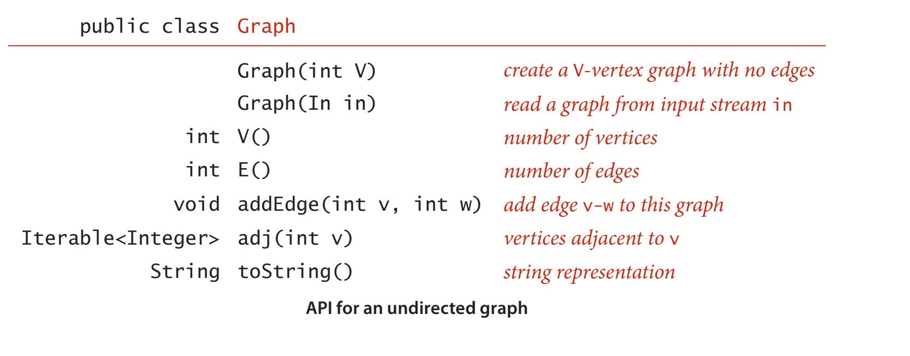
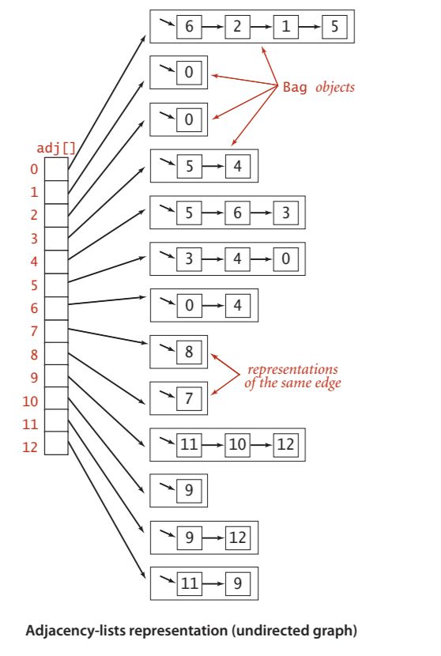
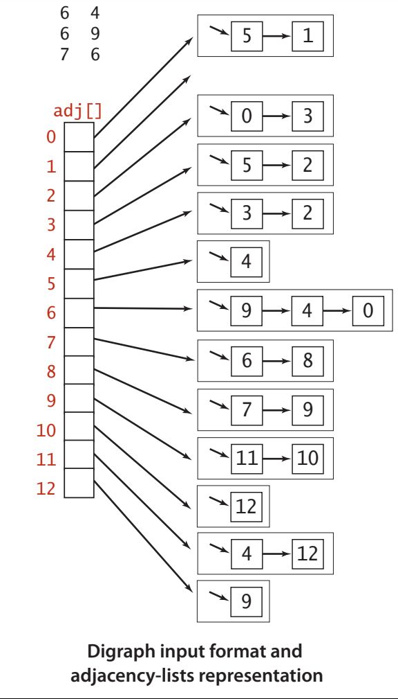
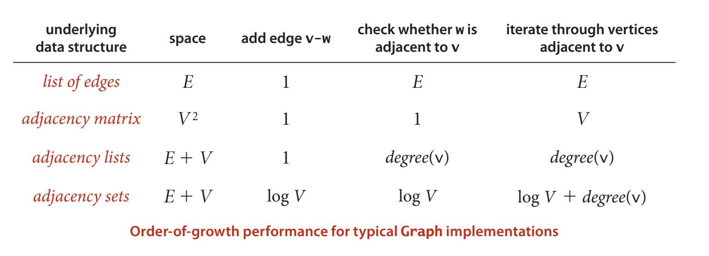
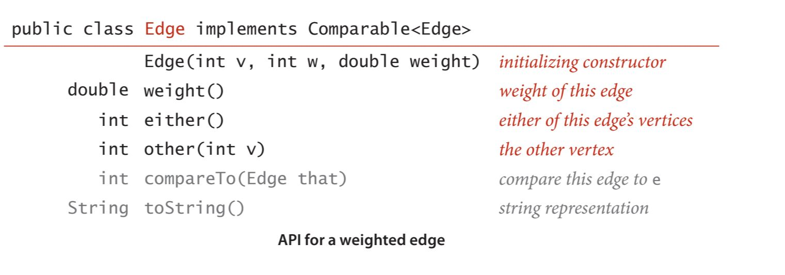
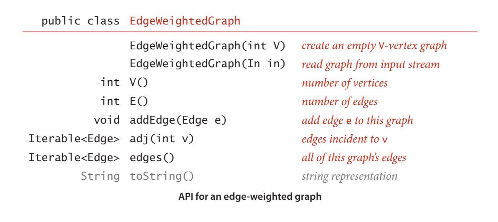
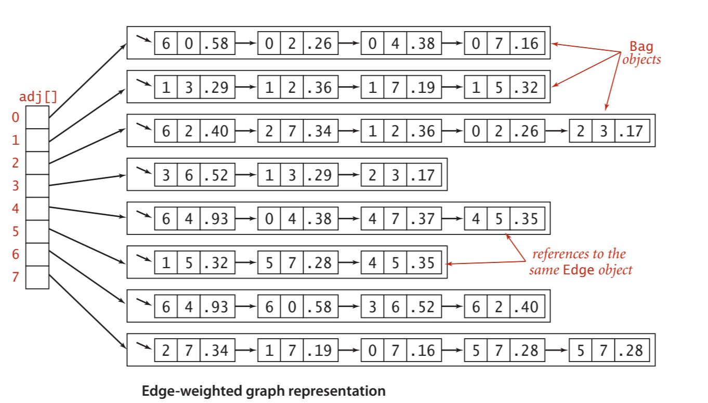
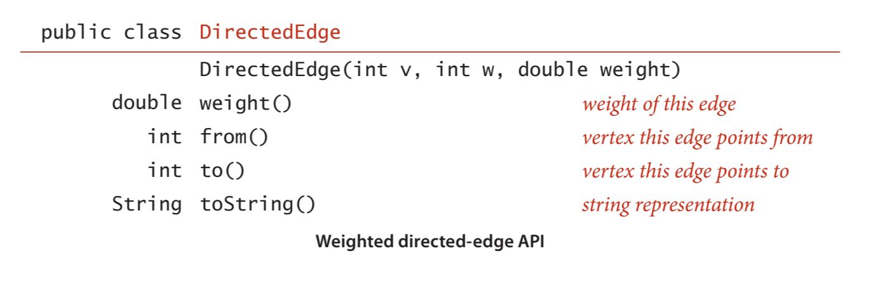
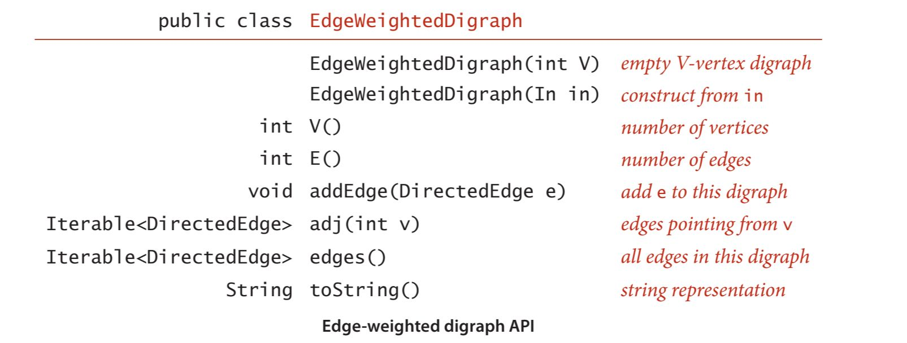
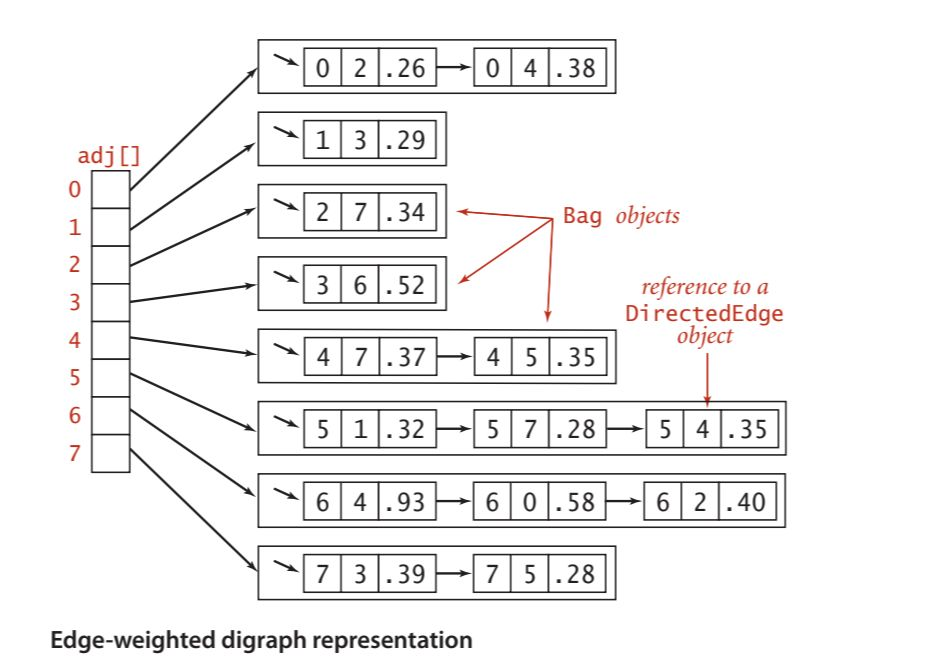

# Graph Strorage

Parent: [[Graph_Analytics_MOC]]

## Densità del grafo

La **densità di un grafo** è definita come il rapporto tra il numero di archi presenti nel grafo e il numero massimo di archi che potrebbero essere presenti in un grafo completo con lo stesso numero di nodi. La formula per calcolare la densità di un grafo dipende dal tipo di grafo:

Per un grafo non orientato: $D_U = \frac{E}{max_U(V)} = \frac{2E}{V(V-1)}$
Per un grafo orientato: $D_D = \frac{E}{max_D(V)} = \frac{E}{V(V-1)} = \frac{1}{2} \cdot D_U(V)$

dove il massimo numero di archi in un grafo completo con $V$ nodi è dato da:

- Per un grafo non orientato: $max_U(V) = \binom{V}{2}= \frac{V(V-1)}{2}$
- Per un grafo orientato: $max_D(V) = 2 \binom{V}{2}= V(V-1) = 2 max_U(V)$

La misura di densità è compresa tra 0 e 1, dove 0 indica un grafo **grafo completamente sparso** e 1 indica un **grafo completo**. Se la densità è 0.5, significa che il grafo ha la metà degli archi possibili rispetto a un grafo completo con lo stesso numero di nodi e quindi è considerato un grafo **moderatamente denso**.

Nell'analisi spettrale, la densità si definise dall'analisi dell'**autovalore dominante** ($\lambda_1$) della matrice di adiacenza $A$.

L'autovalore massimo $\lambda_1(A)$, detto **raggio spettrale**, è il principale indicatore della densità. Esiste una relazione fondamentale tra $\lambda_1$ e il grado dei nodi:

$$d_{media} \leq \lambda_1 \leq d_{max}$$

All'aumentare del numero di archi, il valore di $\lambda_1$ cresce. Se il grafo è $k$-regolare (ogni nodo ha esattamente $k$ vicini), allora $\lambda_1 = k$.
Un $\lambda_1$ elevato indica che il grafo non è solo denso globalmente, ma possiede un "core" di nodi fortemente interconnessi. In pratica, la matrice "pesa" di più perché ci sono più connessioni che contribuiscono alla sua intensità trasformativa.

L'autovalore principale è direttamente proporzionale alla densità dei collegamenti. $\lambda_1 \approx \frac{2|E|}{|V|}$, corrisponde al grado medio del grafo. Più archi aggiungi al sistema, più alto sarà il valore di $\lambda_1$.
Se il grafo è regolare, questa approssimazione diventa un'uguaglianza esatta.
($\lambda_1 \approx |V|-1$). Quando l'autovalore massimo si avvicina al numero totale di nodi meno uno ($n-1$)- Il grafo è estremamente denso. Si sta approssimando un "grafo completo" (o clique), in cui ogni singolo nodo è connesso a tutti gli altri.
($\lambda_1 \approx 2$). Se $\lambda_1$ ha un valore molto basso, vicino a 2 (specialmente per grafi con molti nodi $n$). Il grafo è molto sparso. È probabile che il grafo sia un semplice ciclo o un cammino lineare. In queste strutture, ogni nodo ha solo 2 vicini (o meno), rendendo la rete estremamente "sottile" e fragile.

La densità del grafo è una misura importante per comprendere la struttura del grafo e può influenzare le prestazioni degli algoritmi di analisi dei grafi. Ci guida in sulla scelta della rappresentazione del grafo sul calcolatore.

## Rappresentazione dei grafi

Abbiamo due requisiti fondamentali:

- avere lo spazio necessario per ospitare i tipi di grafici che incontreremo nelle applicazioni.
- sviluppare implementazioni efficienti in termini di tempo dei metodi di istanza dei grafici, i metodi di base di cui abbiamo bisogno per sviluppare client di elaborazione dei grafici.

Una **matrice di adiacenza**, dove manteniamo un array booleano V per V, con la voce nella riga v e nella colonna w definita come vera se c'è un arco adiacente sia al vertice v che al vertice w nel grafo, e falsa altrimenti. Questa rappresentazione fallisce al primo conteggio: i grafi con milioni di vertici sono comuni e il costo in termini di spazio per i valori booleani V 2 necessari è proibitivo.

Un **array di archi**, utilizzando una classe Edge
con due variabili di istanza di tipo int. Questa rappresentazione diretta è semplice, ma fallisce al secondo punto: l'implementazione di adj() comporterebbe l'esame di tutti gli archi nel grafo.

Un **array di liste di adiacenza**, dove manteniamo un array indicizzato per vertice contenente elenchi dei vertici adiacenti a ciascun vertice. Questa struttura dati soddisfa entrambi i requisiti.
Viene usata principalmente per la rappresentazione di grafi non densi.
Si tiene traccia di tutti i vertici adiacenti a ciascun vertice su una lista concatenata associata a quel vertice. Manteniamo un array di liste in modo che, dato un vertice, possiamo accedere immediatamente alla sua lista. Per implementare le liste, usiamo le _liste concatenate_, in modo da poter aggiungere nuovi archi in tempo costante e iterare attraverso i vertici adiacenti in tempo costante per ogni vertice adiacente.

Per aggiungere un arco che connette v e w, aggiungiamo w alla lista di adiacenza di v e v alla lista di adiacenza di w. Pertanto, ogni arco appare due volte nella struttura dati. Questa implementazione del grafo raggiunge le seguenti caratteristiche prestazionali:

- Utilizzo dello spazio proporzionale a V + E
- Il tempo per aggiungere un arco è costante.
- Il tempo per iterare attraverso i vertici adiacenti a un vertice è proporzionale al numero di vertici adiacenti.

Anche per i grafi diretti, si usa la rappresentazione delle liste di adiacenza, in cui un arco v->w è rappresentato come un nodo di lista contenente w nell'elenco concatenato corrispondente a v. Questa rappresentazione è essenzialmente la stessa dei grafi non orientati, ma è ancora più semplice perché ogni arco si verifica solo una volta.

Un'altra rappresentazione di un grafo può avvenire tramite la modellazione degli edge, invece dei vertici.

Quindi andiamo a modellare un grafo come una collezione di oggetti Edge, dove ogni Edge contiene informazioni sui vertici che collega e, eventualmente, altri attributi come il peso dell'arco. In questo modo, possiamo rappresentare anche grafi pesati.

Potremmo anche con la rappresentazione a matrice di adiacenza, in cui, invece di usare valori booleani per gli edge, mettiamo il peso di quello'edge.
Invece, nella rappresentazione a liste di adiacenza, possiamo definire un nodo che contiene sia un vertice che un peso da inserire nelle liste di adiacenza.

Lo stesso vale per i grafi diretti, dove ogni arco v->w è rappresentato come un nodo di lista contenente w e il peso dell'arco nell'elenco concatenato corrispondente a v.

Lo svantaggio di questa rappresentazione è che, se il grafo è molto denso, potremmo finire con molte voci nella lista di adiacenza, rendendo l'iterazione attraverso i vertici adiacenti più costosa. Tuttavia, per grafi più sparsi, questa rappresentazione è efficiente in termini di spazio e tempo.
