# **BIG DATA E DATA SCIENCE**

Il termine **Big Data** si riferisce a datasets con una stragrande quantità di dati e che i database software non sono in grado di gestirli, memorizzarli e analizzarli.

I Big Data sono enormi e diversificati insiemi di dati strutturati, semi strutturati e non strutturati, generati in tempo reale e in continuo aumento, specialmente negli ultimi anni che si producono valanghe di dati.

I Big Data vengono descritti nelle loro **quattro V**:

* **Volume**, per la vasta quantità che vengono generai e memorizzati e che aumenterà sempre di più;
* **Velocità**, con la quale vengono generati, scambiati e processati. Permettono di prendere decisioni;
* **Varietà**, si riferisce ai diversi tipi di dati in uso, come dati strutturati, non, semi strutturati ecc.;
* **Veridicità**, dai dati si possono estrarre informazioni affidabili, nonostante anche loro possono presentare errori, imprecisioni ecc.
* **Valore**, spesso si cita anche la quinta V, e che si riferisce alla capacitò di mettere in risalto gli enormi benefici che possono essere ottenuti analizzando i Big Data per estrarre conoscenza o informazioni nascoste che l’uomo noterebbe molto difficilmente;

Per **data science** si intende il processo di estrazione dai dati di informazioni utili che generano conoscenza, tramite tecniche matematiche e statistiche e che tramite queste informazioni estratte permette di prendere decisioni.

Il **principio di Bonferroni** serve a correggere il livello di significatività quando si eseguono molti test statistici contemporaneamente, al fine di ridurre il rischio di falsi positivi (errori di tipo I). La correzione si ottiene dividendo il livello di significatività originale (ad esempio 0,05) per il numero di test effettuati, rendendo ogni singolo test più conservativo e meno propenso a dichiarare un risultato statisticamente significativo per puro caso.

Il **Machine Learning** si basa sulla creazione di modelli in grado di **apprendere dai dati** per fare previsioni o prendere decisioni in modo automatico. La **Data Mining** analizza grandi quantità di dati per trovare pattern, correlazioni o informazioni utili che magari non erano subito evidenti.

Sono termini simili, ma nati in contesti diversi, il primo del campo dell’AI e il secondo nell’ambito dei DB.

Una volta che il modello è stato addestrato, questo può essere usato per fare previsione su nuovi dati che questo non ha mai visto che sono i dati reali. Questi oltre che a produrre un output, vengono anche inseriti nel modello, o almeno quelli più significati, perché altrimenti potremmo modificare in maniera significativa l’apprendimento del modello e predirre un fatto per un altro. Inoltre, non abbiamo bisogno di molti dati perché ad un certo punto il livello di apprendimento del modello si stabilizzerà e non imparerà più niente dai dati perché ha appreso tutto quello che poteva apprendere.

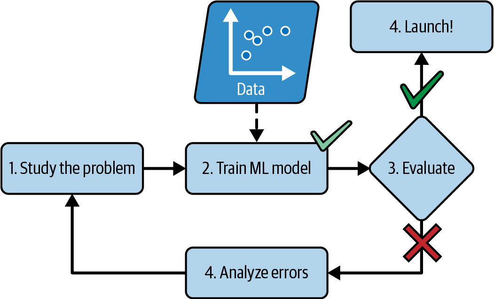

## **1.2 Data CentricAI**

L’avvento dei Big Data ha portato ad un cambiamento di approccio da **model-driven** basato su modelli a **data-driven** basato sui dati, significa che, se si hanno molti dati è possibile usarli per fare qualunque cosa, validare qualunque tesi e opportunamente gestiti.

Data centric AI è un framework per sviluppare, iterare e gestire il mantenimento dei dati per sistemi di AI. Comprende attività che coinvolge la preparazione dei dati, il training, l’inferenza dei dati visto che le buone performance non dipendono solo dal modello ma anche da quanto buoni sono i dati usati per addestrarlo.

Quindi non ci si basa più solo su un architettura **model-centric AI** dove l’attenzione è data solo al modello. Questo approccio prevede di raffinare il modello, gli iperparametri e le tecniche di ottimizzazione del modello. I dati vengono considerati come fissi.

Mentre con l’approccio **data-centric AI** l’attenzione non è solo data al modello, ma ci si concentra più sui dati e a come avere dei dati di qualità per produrre dei buoni modelli. Questo perché i modelli AI hanno raggiunto già una maturità oltre il quale per ora non si può andare, e quindi in vantaggio è dato dalla qualità dei dati usati per l’addestramento di essi.

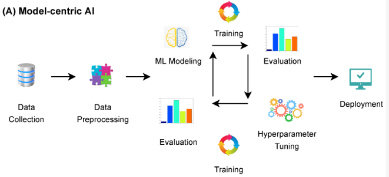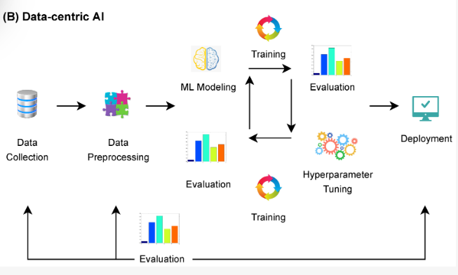

Viene oggi combinata con **MLOps.** un framework che integra le pratiche di sviluppo software con le esigenze operative del machine learning, permettendo una gestione strutturata e scalabile dei dati, dei modelli e dei processi lungo l’intero ciclo di vita dell’AI.

Un framework data-centric efficace si fonda su tre principi:

1. **Riproducibilità** — ogni dataset e versione deve essere tracciabile.
2. **Qualità misurabile** — i dati devono avere metriche di qualità (completezza, coerenza, bilanciamento).
3. **Aggiornabilità continua** — i dati devono poter evolvere con il contesto applicativo.

Ci sono tre pipeline tipiche per il ML:

* + **Data pipeline**
  + **ML model pipeline**
  + **Serving (Code) pipeline**

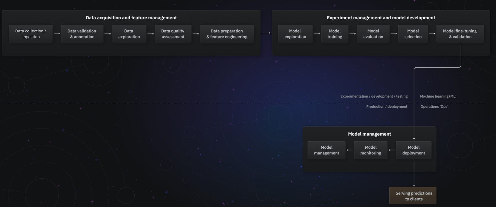

**DATA PIPELINE**

### **1.2.1 Data Collection**

Una volta definito l’obiettivo che vogliamo raggiungere la prima cosa da fare e raccogliere i dati (**data collection**) necessari e utili per la creazione del nostro modello. Se i dati provengono da diverse fonti è necessario intraprendere delle azioni di **data integration** per creare un unico dataset con le informazioni necessarie. L’integrazione è complessa perché le fonti:

* **usano schemi diversi** (es. “customer\_id” vs “id\_cliente”);
* **hanno formati diversi** (CSV, JSON, SQL, sensori IoT);
* **rappresentano gli stessi concetti in modi diversi** (es. valuta, data, unità di misura);
* **possono contenere errori, duplicati o valori mancanti**.

Il processo richiede quindi **matching degli attributi** (quali colonne corrispondono) e **trasformazione dei valori** (come convertirli nel formato corretto). Prima, la data integration veniva realizzata con **sistemi basati su regole**, come “se il campo date è nel formato MM/DD/YYYY, convertirlo in DD-MM-YYYY”; o **sistemi ETL (Extract–Transform–Load**), ma questi metodi sono **accurati ma poco scalabili**, perché ogni nuova sorgente richiede tempo e intervento manuale.

In seguito, l’integrazione venne **automatizzata** usando algoritmi di *machine learning* che apprendono le trasformazioni corrette dai dati già allineati.

L’idea è di **formulare la trasformazione come un problema di classificazione**:

* **Input:** un valore sorgente (es. “U.S.”, “United States”, “USA”).
* **Output:** il valore di destinazione normalizzato (es. “United States”).

Il modello può essere addestrato su esempi generati da regole o dataset già integrati, e poi applicato a **nuovi record non visti**. In pratica, il classificatore apprende le regole implicite che collegano i valori tra fonti diverse.

La **Raw Data Synthesis** è una tecnica in cui i dati non vengono semplicemente raccolti, ma **generati artificialmente** in modo controllato, per simulare fenomeni che nel mondo reale sono troppo rari, costosi o difficili da ottenere. Si utilizza la sintesi di dati quando:

* i **dati reali sono difficili o costosi da ottenere** (es. guasti industriali, frodi bancarie, eventi medici rari);
* si vuole **ampliare un dataset** troppo piccolo per addestrare un modello complesso;
* si desidera **simulare scenari ipotetici** per testare la robustezza del modello.

Le tecniche possono variare in complessità:

* **Regole empiriche:** creare manualmente anomalie basandosi su conoscenza del dominio (es. “se la tensione supera il 150% del normale, genera un’anomalia”).
* **Modelli statistici:** generare campioni con distribuzioni controllate (es. Gaussian noise, data augmentation).
* **Modelli generativi:** usare reti neurali per creare dati realistici, come:
  + **GANs (Generative Adversarial Networks)**
  + **VAEs (Variational Autoencoders)**
  + **Diffusion Models**

Questi modelli imparano la distribuzione dei dati reali e possono poi creare nuovi esempi con variazioni controllate.

La raccolta dei dati è un’attività complessa e costosa che richiedere una buona conoscenza del dominio operativo. Questa attività può richiedere molto tempo ed è molto importate da svolgere correttamente, in quanto su questi dati sarà prodotto il modello. Per il principio **GIGO** (**Garbage-in**, **Garbage-out**), se mettiamo dati con scarsa qualità, affetti da rumore e bias, il modello non sarà buono, ma schifo.

**Bias** Il **bias** in un modello di machine learning è una tendenza sistematica dell’algoritmo a commettere errori in una certa direzione, spesso dovuta ad assunzioni semplificative fatte durante l’apprendimento o alla presenza di dati distorti. Ci sono vari tipi di bias:

* **Bias Induttivo** Il bias induttivo è l'insieme di ipotesi aggiuntive che un algoritmo di apprendimento fa per giustificare le sue inferenze induttive, come se fossero inferenze deduttive basate sui dati di addestramento e sulla nuova istanza.
* **Bias Term** Questo è un parametro specifico in alcuni modelli, in particolare nei modelli lineari come i classificatori lineari. Nel caso degli iperpiani (usati dai classificatori lineari), i coefficienti w1, ..., wn definiscono l'angolo dell'iperpiano, mentre l'ultimo coefficiente, w0, chiamato **bias**, determina lo scostamento (offset) dell'iperpiano dall'origine del sistema di coordinate. Un valore più alto del bias sposta il classificatore più lontano dall'origine, mentre un bias di 0 lo fa intersecare con l'origine.
* **Bias da Dati Sbilanciati**: Si verifica quando un modello viene addestrato su un set di dati in cui una classe è significativamente più rappresentata di altre. Avere dati sbilanciati ha un impatto negativo sulle prestazioni del modello. C'è il rischio di addestrare un modello distorto verso la previsione della classe di maggioranza. Ciò può portare a prestazioni inferiori su metriche come il recall per la classe di minoranza, anche se l'accuratezza generale potrebbe sembrare accettabile.

### **1.2.2 Data Exploration & Validation**

Lo scopo principale della **data exploration** è evidenziare le caratteristiche rilevanti di ciascuna feature contenuta in un set di dati, utilizzando metodi grafici e calcolando statistiche riassuntive, e identificare l'intensità delle relazioni sottostanti tra gli attributi.

L’a**nalisi univariata** ha lo scopo di valutare la tendenza dei valori di un dato attributo a disporsi attorno a uno specifico valore centrale (posizione), misurare la propensione della variabile ad assumere un intervallo più o meno ampio di valori (dispersione) ed estrarre informazioni sulla distribuzione di probabilità.

Lo scopo principale della **data validation** è verificare che il dataset rispetti i requisiti di qualità e consistenza necessari per addestrare un modello di machine learning affidabile. Questa fase mira a individuare e gestire anomalie, errori, valori mancanti, incoerenze semantiche o tipologiche che potrebbero compromettere le prestazioni o introdurre bias nel modello.

### **1.2.3 Data Wrangling**

* **Validazione dei dati:** Identificare e rimuovere anomalie e incongruenze. Ciò può includere la verifica che i valori siano all'interno di intervalli ammissibili e che i codici siano corretti.
* **Gestione dei valori mancanti:** Tecniche come l'eliminazione di record con valori mancanti o l'imputazione (sostituzione con valori probabili).
* **Identificazione e gestione degli outlier:** Rilevare e trattare valori anomali, che possono essere errori o reali eventi rari.
* **Correzione delle incongruenze:** Risolvere discrepanze dovute a diversi sistemi di codifica o unità di misura.
* **Eliminazione dei dati duplicati:** Identificare e unire o rimuovere record che rappresentano la stessa entità.
* **Standardizzazione e trasformazione dei dati:** Convertire i dati in formati omogenei e applicare trasformazioni (es. normalizzazione, discretizzazione, aggregazione) per migliorare l'accuratezza e l'efficienza degli algoritmi di apprendimento.
* Tutte queste azioni (e molte, moltissime altre) vengo effettuate per migliorare la qualità dei dati, in mod che il modello apprendo le relazioni importante fra esse. Se i dati fanno cagare, i modello farà cagare ancora di più; può aver imparato troppo i dati (**overfitting**) oppure può non aver appreso tutte le relazioni fra i dati (**undefitting**), non essendo, in entrambi i casi, in grado di **generalizzare**.

La **data quality** può essere definita come il grado in cui i dati sono idonei per il loro uso previsto. Dati di alta qualità sono essenziali per ottenere risultati accurati ed efficaci dai sistemi di Business Intelligence e dai modelli decisionali. Il principio **garbage in garbage out** (**GIGO**) sottolinea che dati inaccurati o di scarsa qualità portano inevitabilmente a informazioni e decisioni errate.

* **Accuratezza:** Il grado di conformità di una misurazione a uno standard o a un valore vero. I dati devono essere corretti e rappresentare ciò che era
* inteso dalla fonte originale.
* **Completezza:** La misura in cui tutti i dati richiesti sono conosciuti, rispetto a profondità, ampiezza e portata. I dati non dovrebbero includere un numero elevato di valori mancanti per evitare di compromettere l'accuratezza delle analisi.
* **Coerenza:** Il grado in cui un insieme di dati è equivalente in database ridondanti o distribuiti. La forma e il contenuto dei dati devono essere coerenti tra diverse fonti dopo le procedure di integrazione.
* **Tempestività:** I dati devono essere disponibili in tempo utile e rappresentare lo stato attuale del business. I dati "datati" possono portare a modelli e pattern obsoleti.
* **Rilevanza:** La misura in cui i dati sono utili nel contesto previsto e soddisfano le esigenze del sistema di Business Intelligence per aggiungere valore reale alle analisi.
* **Interpretabilità:** Il significato dei dati dovrebbe essere ben compreso e correttamente interpretato dagli analisti, anche grazie alla documentazione disponibile nei metadati.
* **Accessibilità:** I dati devono essere **facilmente accessibili** dagli analisti e dalle applicazioni di supporto decisionale.
* **Affidabilità:** Una caratteristica dell'infrastruttura informativa per archiviare e recuperare informazioni in modo accessibile, sicuro, manutenibile e veloce.
* **Non-ridondanza:** La ripetizione e la ridondanza dei dati dovrebbero essere evitate per prevenire sprechi di memoria e possibili incongruenze, a meno che la denormalizzazione non migliori i tempi di risposta.
* **Validità:** La corrispondenza tra i valori effettivi e attesi di una data variabile, in base a definizioni di dati accettabili.
* **Ricchezza:** Tutti gli elementi di dati richiesti sono inclusi nel set di dati, fornendo una rappresentazione sufficientemente dimensionale del soggetto.
* **Veracità:** (Specifico per Big Data) Conformità ai fatti: accuratezza, qualità, veridicità o affidabilità dei dati.

Le fonti di scarsa qualità dei dati, spesso definite come **rumore**, possono essere molteplici:

* **Fonti di informazione inaffidabili, dispositivi di misurazione scadenti, errori di battitura, confusione dell'utente e molte altre** ragioni.
* **Rumore stocastico**: Variazioni naturali o errori umani occasionali.
* **Rumore sistematico**: Errori che trascinano tutti i valori nella stessa direzione (es. termometro mal calibrato).
* **Errori di misurazione e di raccolta dati**: Problemi derivanti dal processo di misurazione stesso (es. valore registrato diverso dal valore vero) o errori nell'omissione/inclusione inappropriata di dati.
* **Valori mancanti**: Dati non registrati, non disponibili o rimossi.
* **Valori errati o outlier**: Dati insoliti dovuti a malfunzionamenti di dispositivi, errori di registrazione/trasmissione o vere anomalie.
* **Incoerenze**: Discrepanze dovute a cambiamenti nei sistemi di codifica o alla presenza di dati espressi in unità di misura eterogenee.
* **Dati duplicati**: Record multipli che si riferiscono alla stessa entità.

### **1.2.4 DATA VISUALIZATION**

La data visualization è utile anche per mostrare i risulta del modello a chi non capisce cosa si è fatto con le azioni di ML. Quando rappresentiamo i dati è necessario che vengono rappresentati in modo da evitare **misleading**, cioè che chi legge la rappresentazione trae dai dati informazioni sbagliate.
Bisogna quindi usare delle rappresentazioni che siano utili a chi le osserva e noi a noi che le rappresentiamo.

La **data visualization**, o più precisamente **information visualization**, consiste nel rappresentare visivamente le informazioni che derivano dall'elaborazione dei dati grezzi. Non si tratta quindi solo di "dati" in senso stretto, ma della loro interpretazione e sintesi in forma visuale.

Oltre a essere uno strumento di analisi, la data visualization è anche un mezzo di **comunicazione**, soprattutto quando si devono presentare i risultati di modelli complessi, come quelli di **machine learning**, a un pubblico non tecnico.

È importante che i dati vengano rappresentati in modo chiaro e corretto, evitando ogni forma di **misleading**, cioè rappresentazioni che possono indurre in errore l’osservatore, portandolo a trarre conclusioni sbagliate. La scelta del tipo di grafico, dei colori, delle proporzioni e dell’ordine degli elementi deve essere guidata non solo dalla chiarezza, ma anche dall'efficacia comunicativa.

Una visualizzazione efficace dei dati deve facilitare la comprensione e la comunicazione delle informazioni. I seguenti principi aiutano a creare rappresentazioni chiare e significative:

1. **Conoscere il pubblico:** Adatta il livello di dettaglio e la tipologia di visualizzazione alle esigenze degli utenti.
2. **Semplicità e chiarezza:** Evita elementi superflui che possano distrarre. Un design pulito migliora l'interpretazione.
3. **Scelta del grafico appropriato:**
4. **Uso efficace dei colori:** Evidenzia le informazioni importanti senza eccessi. Assicurati che la combinazione cromatica sia accessibile a tutti.
5. **Fornire contesto:** Titoli, etichette e annotazioni migliorano la comprensione e l'interpretazione dei dati.
6. **Evita la distorsione dei dati:** Rappresenta le informazioni in modo accurato per non generare interpretazioni errate.
7. **Minimizza il "rumore" visivo**: Riduci gli elementi decorativi inutili che potrebbero confondere l'utente.

La rappresentazione dei dati deve considerare diversi fattori:

* **Adeguatezza al tipo di dato:** La scelta della visualizzazione deve rispettare la natura degli attributi (categorici, numerici, binari, ecc.).
* **Struttura dei dati:** Dati tabellari, transazionali o spaziotemporali richiedono modelli di rappresentazione specifici.
* **Obiettivi dell'analisi:** La rappresentazione varia a seconda dello scopo (classificazione, analisi di associazioni, data warehousing, ecc.).

### **1.2.5 DATA PREPARATION**

. Fatto questo è possibile intraprendere alcune azioni per preparare i dati, in modo che il modello li comprenda meglio e impari le relazioni più importanti che ci sono fra i dati.

#### **FEATURE SELECTION**

Consiste di eliminare dal dataset un sottoinsieme di variabili che non sono considerate rilevanti ai fini delle attività di data mining. Grazie alla presenza di meno colonne, gli algoritmi di apprendimento possono essere eseguiti più rapidamente sul dataset ridotto rispetto a quello originale.

**Schema-indipendent** che selezionano le feature senza considerare uno specifico algoritmo di apprendimento; la rilevanza delle feature è valutata con metriche statistiche o informazioni intrinseche ai dati.

I **metodi filtro** selezionano gli attributi rilevanti prima di passare alla successiva fase di apprendimento e sono quindi indipendenti dall'algoritmo specifico utilizzato. Sono state proposte diverse metriche statistiche alternative per valutare la capacità predittiva e la rilevanza di un gruppo di attributi.

Un esempio può essere quello della **mutua informazione** che misura la dipendenza statistica tra due variabili quantificando la quantità di informazioni che una variabile contiene sull’altra.

**Schema-dependent** che selezionano le feature in funzione di uno specifico algoritmo di apprendimento o di un modello predittivo; la rilevanza delle feature dipende dal comportamento del modello usato.

I **metodi wrapper** sono in grado di valutare **l’accurancy**, poiché valutano un gruppo di variabili utilizzando lo stesso algoritmo di classificazione o regressione utilizzato per prevedere il valore della variabile target. Ogni volta, l'algoritmo utilizza un diverso sottoinsieme di attributi per l'apprendimento, identificato da un motore di ricerca che lavora sull'intero set di tutte le possibili combinazioni di variabili e seleziona il set di attributi che garantisce il miglior risultato in termini di accuratezza. Questi algoritmi hanno un costo computazionale molto elevato, infatti hanno un approccio greedy. Alcuni esempi di algoritmi sono:

* **Backward elimination**La backward elimination è una tecnica di selezione delle funzionalità che inizia con tutte le funzionalità disponibili e rimuove progressivamente le funzionalità meno significative una per una. L'obiettivo è quello di eliminare le funzionalità che non contribuiscono molto al potere predittivo di un determinato modello.
* **Forward selection**La forward selection è l'opposto dell'eliminazione all'indietro. Invece di iniziare con tutte le funzionalità, la selezione in avanti inizia senza funzionalità e le aggiunge una per una in base alla loro significatività statistica e all'impatto sulle prestazioni del modello.

Per i **metodi embedded**, il processo di selezione degli attributi si trova all'interno dell'algoritmo di apprendimento, in modo che la selezione del set ottimale di attributi venga effettuata direttamente durante la fase di generazione del modello.

#### **FEATURE DISCRETIZATION**

Nella **discretizzazione**, convertiamo le variabili continue in feature discrete, raggruppando le feature continue in gruppi (**bin**). Successivamente, ordiniamo i valori originali in tali intervalli. Questi intervalli, che ora sono valori discreti, vengono quindi gestiti come **dati categorici**.

La sfida nella discretizzazione consiste nell'identificare le soglie o i limiti che definiscono gli intervalli in cui verranno ordinati i valori continui

L'obiettivo di un algoritmo di discretizzazione è determinare il minor numero possibile di intervalli senza perdere in modo significativo le informazioni. I tipi di algoritmi di binning possono essere:

* **non supervisionati** che quantizzano ogni attributo senza conoscere le classi del training set;
  + **Equal-width binning** è un algoritmo non supervisionato, che divide l’intervallo dei valori in sotto intervalli di uguale ampiezza.
    *(es. età 0–100 divisa in 5 classi da 20 anni ciascuna).*
  + **Equal-frequency binning**: ogni intervallo contiene circa lo stesso numero di istanze.
  + **Clustering-based binning**: usa algoritmi come k-means per creare gruppi naturali.
* **supervisionati**, invece, quantizzano tenendo conto delle classi del trainng set.
* **Entropy-based discretization** (come nei decision tree, basata su information gain).
* **ChiMerge / Chi2 discretization**: unisce intervalli se statisticamente simili rispetto al target

La discretizzazione può rendere i dati più facili da gestire e da interpretare. Trasformando variabili numeriche continue in categorie ottenendo rappresentazioni più intuitive che aiutano sia l’algoritmo a cogliere strutture latenti. Alcuni modelli, come i **modelli probabilistici** o gli **alberi decisionali**, traggono beneficio da feature discrete perché possono costruire regole più chiare e robuste. Inoltre, la discretizzazione rende il modello meno sensibile a valori anomali: un outlier molto grande, inserito in un intervallo ampio, non altera significativamente la rappresentazione dei dati. Infine, riducendo la granularità dei dati, si diminuisce anche la complessità computazionale.

Gli svantaggi del discretizzare porta ad una **perdita di informazione**.

La qualità della discretizzazione dipende molto da come vengono scelti i “bin”: se sono troppi, si rischia di ottenere categorie troppo frammentate, quasi simili ai dati originali; se sono troppo pochi, invece, si semplifica eccessivamente, sacrificando la variabilità presente nei dati.

#### **PROIEZIONE**

La **proiezione** è un’operazione di **riduzione della dimensionalità** che consiste nel trasformare i dati originali in un nuovo spazio con **meno variabili**, preservando però quanto più possibile l’informazione utile.

#### **SAMPLING**

Esistono diverse strategie per affrontare il problema dello squilibrio di classe:

**Sovracampionamento (Oversampling)**: Questa tecnica mira ad **aumentare il numero di istanze nella classe minoritaria**. Un approccio comune è la **replicazione casuale** di istanze della classe minoritaria. Tecniche più sofisticate includono la generazione di nuove istanze sintetiche per la classe minoritaria, come la tecnica **SMOTE (Synthetic Minority Over-sampling Technique)**. SMOTE crea nuove istanze positive in punti intermedi lungo i segmenti di linea che uniscono un'istanza positiva a uno dei suoi k-vicini più prossimi scelti casualmente.

**Sottocampionamento (Undersampling)**: Questa tecnica mira a **ridurre il numero di istanze nella classe maggioritaria**. Ciò può essere fatto **rimuovendo casualmente** istanze dalla classe maggioritaria. Tuttavia, la rimozione di istanze può comportare la perdita di informazioni preziose.

**SMOTE** **Synthetic Minority Over-sampling** Technique una tecnica di sovra campionamento che genera esempi sintetici della classe minoritaria invece di duplicare semplicemente le istanze esistenti.

1. SMOTE sceglie casualmente un punto dalla classe minoritaria.
2. Trova i vicini più vicini dove vengono individuate le istanze della classe minoritaria più vicine a quella selezionata.
3. Si sceglie uno di questi vicini e si genera un punto sintetico sulla linea che collega entrambi i punti, a una distanza casuale.

Questo processo viene ripetuto finché non viene raggiunto l'equilibrio desiderato tra le classi. Con SMOTE si riduce il rischio di overfitting che può derivare dalla duplicazione dei dati esistenti e **migliora le prestazioni del modello** perché il modello diventa più sensibile alla classe minoritaria, migliorando l'accuratezza, la precisione e il recall per quella classe.

### **1.2.6 Data Labeling**

Ottenuti i dati grezzi, questi vengono etichettati (**data labeling**), cioè, viene attribuito loro un significato che può essere interpretato dal modello di ML.

Spesso è un’attività svolta dall’uomo e risulta essere un’attività molto costosa sia in termini monetari che di tempo. La **crowdsourced labeling** è una tecnica di etichettatura dei dati basata sulla **collaborazione di un grande numero di persone**, spesso non esperte, reclutate tramite piattaforme online per annotare grandi volumi di dati.

Per velocizzare il processo di etichettatura dei dati, è possibile impiegare modelli di *machine learning* in grado di effettuare classificazioni automatiche. In particolare, l’approccio di **Semi-Supervised Labeling** rappresenta una via di mezzo tra *supervised learning* (apprendimento supervisionato) e *unsupervised learning* (non supervisionato).

Questo metodo combina un piccolo insieme di dati **etichettati (labeled)** con un grande insieme di dati **non etichettati (unlabeled)**, sfruttando le informazioni disponibili per estendere in modo intelligente le etichette mancanti.

Una delle tecniche più utilizzate in questo contesto è il **self-training**: si parte addestrando un classificatore sui dati etichettati, poi si utilizza il modello per generare predizioni sui dati non etichettati. Le predizioni considerate più “sicure”, cioè con un’elevata probabilità di correttezza, vengono utilizzate per assegnare **pseudo-etichette** ai dati non etichettati. In seguito, il modello viene riaddestrato includendo sia i dati originali etichettati sia quelli pseudo-etichettati, migliorando progressivamente la propria accuratezza.

Un’altra variante efficace è il **co-training**, o *consensus labeling*, che prevede l’uso di più modelli di machine learning – basati su algoritmi o insiemi di feature differenti – per etichettare i dati non etichettati. Quando più modelli concordano sulla stessa etichetta, essa viene considerata affidabile. Questo approccio riduce la probabilità di errore legata alle debolezze di un singolo modello, ottenendo una maggiore robustezza complessiva.

Accanto al semi-supervised labeling, un’altra strategia molto diffusa è l’**Active Learning**, un approccio iterativo e *human-in-the-loop* in cui il modello collabora con l’essere umano nel processo di etichettatura. Inizialmente, il modello viene addestrato su un piccolo insieme di dati etichettati; successivamente, analizza i dati non etichettati e seleziona quelli su cui è più incerto, ovvero i campioni che ritiene più informativi per migliorare la propria conoscenza.

Questi campioni vengono poi **inviati a un esperto umano**, che li etichetta manualmente. Le nuove etichette vengono aggiunte al dataset, il modello viene riaddestrato e il processo viene ripetuto. Ad ogni iterazione, il modello diventa più preciso e richiede l’intervento umano solo sui casi più ambigui, ottimizzando tempi e risorse.

**Distant Supervision** è una tecnica di **etichettatura automatica dei dati** appartenente alla famiglia della *weak supervision*, cioè delle metodologie che mirano a ridurre (o eliminare) la necessità di etichettare manualmente i dataset. Invece di affidarsi a esseri umani o regole scritte a mano, il distant supervision usa **fonti di conoscenza esterne già strutturate** — come basi di conoscenza (Knowledge Base), ontologie, dizionari o database annotati — per **assegnare etichette automaticamente** a nuovi dati non etichettati.

**Funzionamento generale**

1. **Fonte di conoscenza (Knowledge Base)**
   Una risorsa strutturata che contiene relazioni note tra entità (es. Wikipedia infoboxes, Wikidata, DBpedia, Freebase, PubMed, ecc.).
2. **Matching tra dati grezzi e conoscenza**
   Si cercano nei dati non etichettati (testi, immagini, log, ecc.) esempi che corrispondono alle entità o relazioni note nella base di conoscenza.
3. **Assegnazione automatica di etichette**
   Quando si trova una corrispondenza, si assegna al campione l’etichetta corrispondente (es. relazione, categoria o classe).
   Ad esempio, se una frase contiene “Paris” e “France”, e la base di conoscenza dice che *Paris is in France*, la frase viene etichettata con *relation: located\_in*.
4. **Addestramento del modello supervisionato**
   I dati etichettati automaticamente (che possono essere rumorosi) vengono poi usati per addestrare un modello di machine learning.
   Questo modello impara a generalizzare, cioè a riconoscere la stessa relazione anche in casi non esplicitamente presenti nella base di conoscenza.

La sfida principale nell’etichettatura dei dati consiste nel trovare un equilibrio tra **qualità delle etichette**, **quantità dei dati etichettati** e **costo economico**. uttavia, scegliere la **strategia di etichettatura più adatta** richiede una buona conoscenza del dominio, poiché è necessario bilanciare diversi compromessi. Un’ulteriore difficoltà deriva dalla **soggettività** del processo di etichettatura: in alcuni casi, non esiste un’unica risposta corretta e gli annotatori possono interpretare diversamente gli stessi dati.

### **1.2.5 Data Storage e retrieval**

**Data Storage and** **retrieval** riguarda il modo in cui i dati vengono **memorizzati, organizzati e recuperati** in modo efficiente, sicuro e scalabile, così da supportare tutte le fasi successive: preparazione, addestramento, inferenza e monitoraggio.

Vediamola nel dettaglio.

La **Data Storage** si occupa di **dove e come vengono salvati i dati** che dipende dalla natura dei dati. L’obiettivo è stimare e bilanciare il costo delle operazioni nei sistemi di amministrazione dei dati. Garantendo

* **Affidabilità:** i dati devono essere conservati in modo sicuro e ridondante (replica, backup, fault tolerance).
* **Scalabilità:** il sistema deve poter gestire grandi volumi di dati (*big data*) e crescere senza perdita di efficienza.
* **Accessibilità:** i dati devono essere facilmente accessibili per le pipeline di training, inferenza e analisi.

La **Data Retrieval** è il processo di **ricerca, filtraggio e accesso ai dati** archiviati per usarli in modo efficace.

**Caratteristiche fondamentali:**

* **Efficienza:** tempi di query e latenza ridotti.
* **Indicizzazione e caching:** per velocizzare la ricerca (ad esempio tramite indici su feature chiave o embedding vettoriali).
* **Versioning:** per poter risalire alla versione esatta dei dati usata in una specifica fase di training (fondamentale per la tracciabilità MLOps).
* **Sicurezza e access control:** solo utenti o sistemi autorizzati devono poter accedere ai dati.

La **Query Acceleration** serve per velocizzare il recupero dei dati (data retrieval) durante le interrogazioni a un database o a un sistema di archiviazione.
SI fa un **Index Selection** che consiste nel creare **indici ottimali** sulle colonne o sulle feature più utilizzate nelle query, così da **minimizzare gli accessi al disco** durante l’elaborazione.Inoltre, con la **Query Rewriting** si è in grado di **ottimizzare automaticamente delle query**, in cui il sistema analizza e riformula le interrogazioni per **evitare operazioni ridondanti o costose**.

In particolare, identifica:

* **sotto-query ripetute** o calcoli identici che possono essere eseguiti una sola volta e riutilizzati;
* **join o filtri** che possono essere riorganizzati per ridurre il carico computazionale;
* possibilità di **caching** dei risultati intermedi.

In ambiti più avanzati, si usano anche tecniche di **data retrieval intelligente**, come:

* **Vector databases** (es. *FAISS*, *Pinecone*, *Weaviate*) per la ricerca semantica su embedding di testo o immagini.
* **Feature store**: sistemi specializzati che conservano e gestiscono le *feature* pronte per il training o l’inferenza.

### **1.2.6 Inferenza**

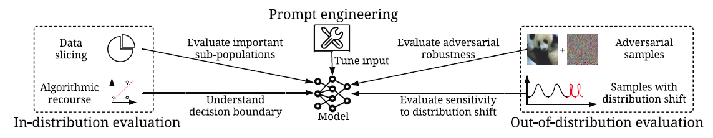

**Inference Data Development** si riferisce alla preparazione e gestione dei dati utilizzati nella fase di inferenza di un modello di machine learning, cioè quando il modello, già addestrato, deve essere applicato a nuovi dati per fare previsioni o classificazioni.

I dati usati in inferenza devono seguire **lo stesso schema, formato e distribuzione statistica** dei dati di addestramento. Se i dati in ingresso differiscono (per esempio, per cambiamenti nel dominio o nella sorgente), si rischia il cosiddetto **data drift**, che riduce l’accuratezza del modello. Serve un processo di preprocessing automatizzato, simile a quello usato in training, ma adattato al contesto operativo.

I dati d’inferenza devono riflettere la **realtà corrente**. In domini dinamici (come finanza, sanità o IoT), ciò richiede un aggiornamento continuo per evitare che il modello resti “fuori tempo”. I risultati delle predizioni possono essere usati per **migliorare continuamente i dati**. Se, ad esempio, si scopre che il modello sbaglia più spesso in certe condizioni, questi casi possono essere ri-etichettati e reinseriti nel ciclo di training.

La **In-distribution Evaluation** è eseguita su dati che provengono dalla stessa distribuzione statistica dei dati di addestramento. Il modello viene testato su dati “simili” a quelli che ha già visto durante il training con l’obiettivo di verificare quanto bene il modello ha imparato a generalizzare all’interno del dominio noto.

**Metriche tipiche:** accuratezza, precision, recall, F1-score, AUC — le classiche metriche di performance.

**Rischio:** un modello può ottenere ottimi risultati in questa fase ma fallire completamente quando incontra dati “fuori distribuzione”.

**Data Slicing** → è una tecnica di **valutazione e diagnostica post-addestramento**. Serve per capire su quali sottoinsiemi di dati (età, genere, condizioni particolari, categorie di prodotto, ecc.) il modello funziona bene o male.
Quindi è un modo per analizzare le prestazioni **in-distribution** ma anche per individuare **bias** o comportamenti anomali in specifiche *slice* dei dati. Poiché la creazione manuale delle *slice* può essere lenta e soggettiva, sono stati sviluppati metodi di **automated slicing**, come **SliceFinder**. Questo strumento identifica automaticamente gruppi di dati che:

* sono **interpretabili** (cioè, descritti da pochi feature);
* mostrano **problemi di performance**, ossia aree dove il modello commette più errori o mostra bias.

**Algorithmic Recourse (Controfattuali)** → è parte delle tecniche di **analisi interpretativa e di fairness** dell’inferenza. Serve a comprendere **come** e **perché** il modello prende una decisione, e cosa si potrebbe modificare nei dati per ottenere un esito diverso. Si tratta di una forma di “debugging intelligente” del modello, utile sia per la trasparenza che per la compliance (ad esempio, in ambito finanziario o medico).

Invece la **Out-of-distribution (OOD) Evaluation** testa la robustezza e la capacità di generalizzazione del modello su dati diversi da quelli di addestramento cioè, dati che seguono una distribuzione differente per capire se il modello riesce a mantenere buone prestazioni anche in scenari non visti, un requisito essenziale in applicazioni reali dove i dati cambiano continuamente (si pensi a sensori, mercati, o contesti sociali).

I modelli spesso **collassano** fuori distribuzione facendo previsioni con alta sicurezza anche su dati completamente sconosciuti. Serve quindi introdurre **metriche di detection OOD**, ossia indicatori che permettano di capire quando un input non appartiene alla distribuzione nota.

**Adversarial Samples ->** sono input valutamente modificati con piccole perturbazioni per indurre il modello a fare **predizioni errate**. L’obiettivo non è tanto “ingannare” il modello, quanto **testare la sua robustezza**.Questi esempi permettono di:

* individuare **vulnerabilità** del modello;
* migliorare la **sicurezza** e la **stabilità** del sistema;
* sviluppare strategie di **robust training**, cioè addestramento resistente alle perturbazioni (adversarial training).

**Distribution Shift Evaluation ->** testare il modello su dati che provengono da una distribuzione diversa rispetto a quella usata durante l’addestramento, si osserva cosa succede quando cambia il contesto reale.

Ci sono due modi per introdurre uno *shift* di distribuzione:

1. **Shift naturale**, quando i dati cambiano nel tempo, nello spazio o nel dominio.
   Esempio: un modello di previsione meteorologica addestrato su dati europei potrebbe non generalizzare bene ai dati tropicali.
2. **Shift sintetico**,generato intenzionalmente per testare specifici scenari:
   * **Covariate shift:** cambia la distribuzione degli *input* (es. nuove condizioni ambientali).
   * **Label shift:** cambia la distribuzione delle *etichette* (es. alcune classi diventano più frequenti).
   * **General shift:** cambiano sia input che label.

**MODEL PIPELINE**

Dopo aver preparato i dati, il modello deve essere addestrato. La principale difficoltà non risiede tanto nella scelta dell’algoritmo — che può essere affrontata in modo iterativo, provando diverse soluzioni — quanto nella valutazione del modello e nella definizione dei criteri che deve soddisfare per essere considerato adeguato al task che stiamo modellando.
Un approccio per individuare il modello più adatto consiste nel addestrarne diversi e selezionare quello con le prestazioni migliori, pur riconoscendo che questa procedura è costosa in termini computazionali.
Una volta completato l’addestramento, è possibile ottimizzare i parametri tramite tecniche di ricerca degli iperparametri e confrontare il modello risultante con altri modelli che affrontano lo stesso task, al fine di valutare in modo oggettivo la sua qualità.

MLOps richiede una gestione delle versioni e della riproducibilità durante l'addestramento e la sperimentazione.

* **Tracciamento degli Artefatti:** Tutti i dettagli (versione del codice sorgente, algoritmi scelti, iperparametri, *loss function* e metriche di ottimizzazione) devono essere registrati per ogni esecuzione di addestramento.
* **Metadati ML:** L'archivio dei metadati ML registra le informazioni su ogni esecuzione della pipeline, inclusi puntatori agli artefatti intermedi (dati preparati, anomalie di convalida) e metriche di valutazione del modello.
* **Feature Store:** L'uso di un *Feature Store* centralizzato garantisce che le *feature* utilizzate per l'addestramento continuo siano coerenti con quelle usate per l'inferenza, prevenendo la *Training-Serving Skew*.

Creato il modello che soddisfa la task che stiamo modellando lo si può deployare… e qui comincia l’inferno, perché l’ambiente di produzione è diverso dall’ambiente in cui andrà effettivamente ad operare. Per evitare che i programmatori si impicchino, il modello deve superare rigorosi controlli prima di essere effettivamente operativo<:

* **Verifica dell'Ambiente di Esecuzione (Runtime Environments):** È necessario assicurare che il modello sia **tecnicamente fattibile** nell'ambiente di produzione di destinazione. Spesso, i modelli validati nell'ambiente di sviluppo non sono immediatamente pronti per il deployment. Questo può richiedere che il modello venga riscritto da zero, potenzialmente da un team o in un linguaggio diverso (ad esempio, da Python a C++);
* **Valutazione dei Rischi del Modello:** Le organizzazioni devono anticipare e minimizzare i rischi prima del deployment. Le fonti di rischio includono *bug*, la bassa qualità dei dati di training, discrepanze significative tra i dati di training e quelli di produzione, e rischi etici o legali (es. *bias*):
* **Ottimizzazione delle Performance:** È comune che i modelli debbano essere ottimizzati per la produzione. Per i modelli di Deep Learning, ciò include tecniche come la **Quantization** o il **Pruning**, che riducono le dimensioni e la latenza del modello, rendendone l'inferenza più veloce e meno costosa in termini di risorse.

Sperando che nessuno programmatore si sia suicidato durante questa fase, si può passare al **deployment** del modello che grazie ad MLOps e tutto automatizzato.

L'MLOps estende le pratiche DevOps per automatizzare il testing, la validazione e il deployment della **pipeline ML completa**, La pipeline CI/CD si attiva quando viene eseguito il commit di nuovo codice sorgente e pacchettizza il modello e i suoi componenti, L'output della fase di CD è il rilascio di una pipeline di cui è stato eseguito il deployment, in grado di eseguire automaticamente e periodicamente il training e il serving del modello,

Il deployment richiede la creazione di un pacchetto distribuibile (*artifact*) contenente il codice del modello e della sua pre-elaborazione, gli iperparametri, il modello addestrato e l'ambiente di esecuzione, comprese le librerie con versioni specifiche.

Ma, secondo voi, il lavoro è finito qui?? MA OVVIAMENTO NO!

Dopo averlo deployato il modello deve essere monitorato e manutenuto continuamente. Il modello con il tempo e con l’operatività va in contro a vari problemi.

**Model Decay** Nel tempo, il modello ML può degradare o comportarsi in modo anomalo, rendendo le prestazioni passate non più una garanzia di risultati futuri, Questo degrado è dovuto al fatto che i modelli non riescono ad adattarsi ai cambiamenti nelle dinamiche dell'ambiente. Subisce dei drift per via dei dati da quello che è il suo obiettivo:

* **Data Drift (o Covariate Shift):** La **distribuzione dei dati di input cambia** significativamente (ad esempio, le abitudini dei clienti evolvono), rendendo il modello addestrato non più pertinente per i nuovi dati.
* **Concept Drift:** La **relazione tra gli input e gli output del modello cambia** (ad esempio, i criteri per il *credit risk* si modificano), anche se le distribuzioni degli input rimangono stabili. Questo riduce l'accuratezza del modello e può renderlo obsoleto se non viene affrontato.
* **Training-Serving Skew:** Si verifica quando il modello è stato addestrato su un dataset artificialmente costruito o pulito che non rappresenta completamente il mondo reale in produzione, il che porta a una discrepanza tra l'ambiente di addestramento e quello di erogazione delle previsioni.

Per affrontare questo problema e catturare i pattern in evoluzione, è necessario riaddestrare i modelli di produzione di frequente utilizzando i dati più recenti.

Quando il monitoraggio rileva un degrado o un drift significativo, si attiva un **ciclo di feedback (feedback loop)** che innesca l'iterazione e la manutenzione. Questa è la fase di **Continuous Training (CT)**.

L'addestramento continuo (CT) può essere attivato da: una pianificazione definita; la disponibilità di nuovi dati etichettati (*ground truth*); o il superamento di una soglia di degrado delle prestazioni in produzione. Il **costo** del riaddestramento deve essere bilanciato con il guadagno di performance atteso.

È fondamentale gestire il *feedback loop* quando i dati utilizzati per l'addestramento futuro sono influenzati dalle previsioni del modello stesso in produzione. Questo ciclo può amplificare i bias o gli errori se non vengono utilizzate strategie di test sicure (es. *shadow testing* o *A/B testing*).

Dopo il deployment, la governance (BASTAAAA) MLOps garantisce che il sistema rimanga affidabile, conforme e tracciabile. Questo è reso possibile da un robusto **Audit Trail AI** che si occupa della:

* **Tracciabilità (Traceability):** L'audit trail registra gli *Inference Logs* per ogni richiesta di previsione, inclusi timestamp, input, output e ID univoco della versione del modello. L'obiettivo è ricostruire completamente e accuratamente la sequenza di attività che hanno portato a un risultato specifico.
* **Supervisione Umana (Human Oversight):** Per i sistemi ad **alto rischio**, l'audit trail deve registrare meticolosamente ogni intervento umano, come l'**override** (sostituzione della decisione dell'IA) o la modifica di un output, con la motivazione dell'operatore.
* T**rasparenza (Transparency):** È necessario registrare le logiche di **Explainability (XAI)** per comprendere il motivo di una specifica previsione, un requisito chiave per la supervisione umana efficace.
* **Artefatti Statici:** L'Audit Trail AI maturo non si limita ai log dinamici, ma integra artefatti statici versionati che forniscono contesto, come le **Model Cards** (panoramica di performance, usi previsti e limiti) e i **Datasheets for Datasets** (provenienza, composizione e rischi dei dati)

## **1.3 Generalizzazione**

L’obiettivo di quando si addestra un modello è la **generalizzazione**, la capacità di un modello di prevedere correttamente su nuove istanze che non sono state viste durante l'addestramento. L'obiettivo fondamentale dell'apprendimento automatico è indurre funzioni **generali** da esempi specifici di addestramento.

Uno delle principali cause che possono portare all’overfitting, sono i dati e come loro sono rappresentati, ma non solo. Anche la complessità del modello può portare all’overfitting. Se il modello è troppo complesso rispetto ai dati che gli forniamo, tende ad apprendere troppo i dati, e quindi andare in overfitting.

In certe situazioni, per risolvere overfitting, possiamo semplicemente aumentare la quantità di dati, perché la loro scarsità può essere un problema. Però dobbiamo tenere conto anche che i modelli, dopo una certa quantità di dati non apprendono più niente. Queste vengono chiamate **learning curve** un grafico che mostra i progressi nell'esperienza di una specifica metrica durante l'addestramento di un modello.

Un esempio è l’**errore nel tempo**. Questa misura l'errore del nostro modello, cioè quanto è scadente il nostro modello. Quindi, più bassa sarà la nostra perdita, migliori saranno le prestazioni del nostro modello.

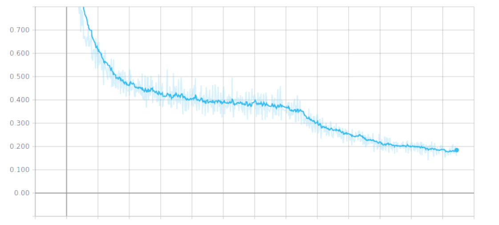

In questo caso, nel lungo termine, l’errore diminuisce nel tempo, quindi il modello sta imparando.

Un’altra rappresentazione molto utile è quella che combina la **perdita di addestramento** con la **perdita di convalida** nel tempo.

La perdita di addestramento indica quanto bene il modello si adatta ai dati di addestramento, mentre la perdita di convalida indica quanto bene il modello si adatta ai nuovi dati.

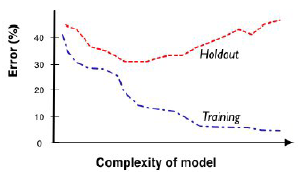

In questo caso, possiamo vedere invece, come all’aumentare della complessità del modello, la perdita sul training diminuisce, segno che il modello sta apprendo bene, ma dalla curva dell’**holdout** vediamo che non è in grado di generalizzare, perché l’errore aumenta. Questo significa che il modello è in overfitting e non è in grado di valutare correttamente dati mai visti. 😐

L'obiettivo fondamentale dell'apprendimento automatico è indurre funzioni **generali** da esempi specifici di addestramento. La capacità di generalizzazione di un modello è strettamente legata al trade-off tra bias ed errore di test.

* 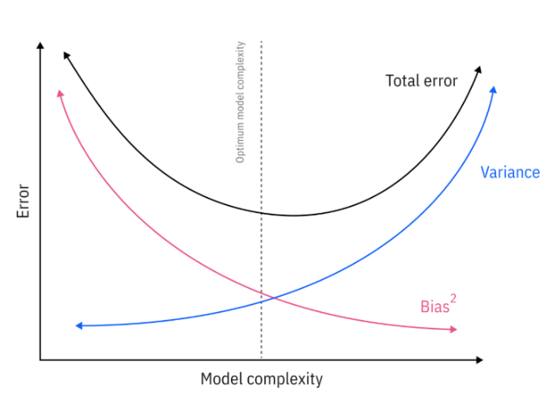Un modello con un **bias elevato** è eccessivamente semplificato e potrebbe non riuscire a catturare la struttura sottostante dei dati (underfitting), compromettendo la generalizzazione.
* Modelli con un **bias basso** sono più complessi, ma con set di addestramento piccoli possono soffrire di alta varianza e portare all'overfitting, che è l'incapacità di generalizzare a nuovi dati.

L’**errore di generalizzazione (EMSE: Expected Mean Squared Error)** si può scomporre in tre componenti fondamentali:

[Errore]=Bias2+Varianza+Rumore

**Bias**: è l’errore dovuto alle assunzioni errate o semplificative del modello. È alto se il modello è troppo semplice.

**Varianza**: è la sensibilità del modello ai dati di addestramento. Se cambia molto da un dataset all’altro, ha alta varianza (es. overfitting).

**Rumore**: è l’errore intrinseco e non eliminabile nei dati, dovuto a imprecisioni o casualità.

L'obiettivo principale del machine learning è di ridurre l'errore di generalizzazione del modello. Per farlo,**è necessario trovare il giusto equilibrio tra bias e varianza** (**Bias-Variance Trade-off**)

La scelta del giusto modello dipende dalle esigenze del problema.

1. **Valutare la complessità del modello**: modelli semplici come le regressioni lineari hanno un alto bias e bassa varianza, mentre i modelli complessi come le reti neurali hanno un basso bias e alta varianza.
2. **Dimensione del dataset**: aumentando la dimensione del dataset, è possibile ridurre la varianza del modello. Infatti, con più dati di addestramento, il modello avrà maggiori informazioni per generalizzare e ridurre l'adattamento ai dati di addestramento.
3. **Regolarizzazione**: la regolarizzazione è una tecnica utilizzata per controllare la complessità del modello. Ad esempio, la regolarizzazione L1 e L2 possono aiutare a ridurre la varianza del modello.
4. **Selezione delle feature**: la selezione delle feature è un'altra tecnica utilizzata per controllare la complessità del modello. Rimuovere le feature non rilevanti o ridondanti può aiutare a ridurre la varianza del modello.

Per vedere l’andamento del modello, conviene dividere i dati del dataset in **training set** e **testing set**. In generale il 75% dei dati è per il training in modo che possano essere coperti tutti i casi possibili, mentre il 25% è usato per il test e verificare che l’algoritmo funzioni correttamente. Questo dipende dalla quantità di dati che abbiamo.

Sul test set, andiamo a verificare l’andamento del modello su dati che non ha mai visto prima. Serve per valutare la capacità di generalizzazione e rilevare l’overfitting

In certi casi, conviene creare una terza parte, detta **validation set** che ci serve, quando non ci basta addestrare un solo modello, ma dobbiamo anche scegliere l’architettura migliore o i parametri ottimali (**hyperparameters**).

* Il modello si allena sul train set.
* Si misura la performance sul validation set per confrontare varianti e scegliere quella che funziona meglio.
* Infine, si valuta sul test set per avere una stima imparziale delle prestazioni reali.

Se abbiamo pochi dati conviene usare la **cross-validation** (**K-cross validation**), una tecnica statistica che consiste nel dividere il dataset in più parti (**fold**) e nel valutare il modello su dati che non ha mai visto durante l’addestramento, ripetendo questa procedura più volte. Questo insieme simula l'arrivo di nuovi dati reali, permettendo una stima non ottimistica dell'errore di generalizzazione del modello in produzione. La procedura viene eseguita k volte (le **run**). In ogni run-iesima:

1. Una delle k partizioni viene utilizzata come set di test.
2. Le restanti k-1 partizioni vengono utilizzate come set di training per addestrare un modello .
3. Il modello viene applicato al set di test per ottenere una stima dell'errore (o accuratezza) della generalizzazione
   L'errore di test complessivo
4. viene quindi calcolato come la media degli errori ottenuti in ciascuna delle k run:

La media delle prestazioni su diverse partizioni fornisce una stima più affidabile di come il modello si comporterà su dati non visti rispetto a una singola divisione train-test (**holdout method**).

Eseguendo k run, si ottengono k stime delle prestazioni, consentendo di valutare la variabilità della performance del modello in diverse configurazioni di dati di training e test.

La scelta del valore di k può influenzare i risultati. Valori comuni per k sono 5 e 10. Un piccolo valore di k può portare a un set di training più piccolo in ogni run, risultando in una stima più pessimistica dell'errore di generalizzazione. Un valore elevato di k (fino a N, noto come **leave-one-out**) utilizza quasi tutti i dati per l'addestramento in ogni run, riducendo la distorsione nella stima dell'errore, ma può essere computazionalmente costoso e può produrre risultati fuorvianti in alcuni casi.

**Holdout Method**: Il dataset viene diviso in due insiemi disgiunti: un **insieme di addestramento** (utilizzato per la selezione del modello) e un **insieme di test** (utilizzato per stimare il tasso di errore di generalizzazione, err\_test).

**Nested Cross-Validation**: Quando sono presenti iperparametri da sintonizzare, si può utilizzare la **nested cross-validation**, che include un ciclo interno di cross-validation per la selezione degli iperparametri e un ciclo esterno per la valutazione del modello con gli iperparametri ottimali.

**Stratified Cross-Validation:** In questo modoI vari fold che vengono creati rispettando le proporzioni delle classi del dataset originale.

# **MODELLI DI MACHINE LEARNIG**

I modelli di Machine Learning possono essere classificati in base al tipo di apprendimento.

**Supervised learning** è una modalità di apprendimento con la quale la macchina impara da un dataset e di etichettato, cioè i dati in input sono associati a un altro. Questo dataset è usato per creare il modello e le regole per fare previsioni. È possibile risolvere problemi di classificazione o di regressione nel caso di previsione numerica.

**Unsupervised learning** è una modalità di apprendimento in cui invece si usano dati non etichettati; quindi, l'algoritmo con i suoi dadi di input deve capire i pattern che esistono. Produce un modello descrittivo piuttosto che un modello predittivo e si basano sulla definizione di una metrica per calcolare la distanza fra i dati di input e l'algoritmo userà questa distanza per raggruppare in base alla distanza che ne definisce la somiglianza, permettono quindi di fare clustering e di ridurre la dimensionalità dei dati.

**Associative learning** è una tecnica usata per **identificare associazioni interessanti e ricorrenti tra gruppi di record** in un set di dati di grandi dimensioni. Sono una tecnica per **scoprire relazioni tra variabili in grandi database**. L'obiettivo è identificare modelli e ricorrenze regolari all'interno di un ampio set di transazioni

**Instance-based learning** tecniche che un tipo di apprendimento automatico che fa previsioni per nuovi dati confrontandoli direttamente con esempi di formazione memorizzati, anziché costruire un modello astratto.
L'algoritmo memorizza l'intero set di dati di training senza creare un modello semplificato. Quando viene presentata una nuova istanza non classificata, l'algoritmo la confronta con tutte le istanze memorizzate usando una **metrica di similarità**, come la distanza in uno spazio di feature, viene utilizzata per determinare quali istanze memorizzate sono più "simili" alla nuova istanza.
La previsione per la nuova istanza viene quindi derivata dalle etichette o dai valori dei suoi vicini più simili nei dati di training.

**Clustering** L'analisi dei cluster raggruppa gli oggetti dati in base alle informazioni trovate solo nei dati che descrivono gli oggetti e le loro relazioni. L'obiettivo è che gli oggetti all'interno di un gruppo siano simili (o correlati) tra loro e diversi (o non correlati) dagli oggetti in altri gruppi. Maggiore è la somiglianza (o l'omogeneità) all'interno di un gruppo e maggiore è la differenza tra i gruppi, migliore o più distinta è la clusterizzazione. Questa tecnica può essere utile se volessimo avere delle etichette per dati non etichettati, visto che si tratta di un’attività costosa. In alcuni casi, tuttavia, l'analisi dei cluster viene utilizzata per la sintesi dei dati al fine di ridurre la dimensione dei dati.

**Reinforcement learning** è una modalità di apprendimento basato sull’interazione con l'ambiente e di un agente che ogni volta che compilazione riceva una ricompensa o una penalità che migliora la qualità della previsione. Ciò che si cerca di fare è di massimizzare la ricompensa totale nel lungo termine sono usati nell'ottimizzazione delle decisioni e per fare simulazioni

La differenza fra le modalità di apprendimento dipende dai dati che abbiamo a disposizione e dal problema che dobbiamo risolvere.

L’output del modello non sempre è comprensibile, ciò non sempre si sa come il modello abbaia dato quel risulto, alcuni modelli, come le ANN, sono black-box; mentre altri sono with-box, cioè che è possibile capire il motivo dietro la scelta del modello. Ci sono modelli spiegabili, come il DecisionTree, o alcuni modelli di che sfruttano la regressione, in quanto producono delle funzioni, altri un po' meno, come il RandomForest.

**DECISION TREE**

Gli alberi decisionali sono modelli di ML supervised che vengono creati ricorsivamente partendo dal dataset iniziale. Sono uno fra i modelli più facilmente spiegabili perché produco un albero dove i nodi intermedi sono i punti decisionali. Quindi seguendo l’albero è possibile capire come la decisione viene presa.

**Algoritmo C4.5** Secondo questo algoritmo, per la costruzione dell’albero si parte dalla feature che permette di splittare il dataset in modo più puro possibile. Per **purità** si intende che i sottoinsiemi creati contengono prevalentemente istanze della stessa classe. SI utilizza la metrica dell’**information gain** per capire quale feature usare per lo splitting dell’insieme.

L’**information gain** è la differenza tra l'entropia prima della divisione e l'entropia media dopo la divisione.

dove:

* S è il dataset,
* A è la caratteristica usata per dividere,
* v sono i valori possibili della caratteristica A,
* Sv è il sottoinsieme di S dove A=v,
* ∣Sv∣ è la dimensione del sottoinsieme,
* Si fa la media pesata delle entropie dei sottoinsiemi.

L’attributo che fornisce la maggiore riduzione dell’entropia (cioè, più informativo) viene scelto come **nodo decisionale**.

L'**entropia** è una metrica per misurare l'impurità in un dato attributo. Specifica la casualità nei dati. In un albero decisionale, l'obiettivo è ridurre l'entropia del set di dati creando sottoinsiemi di dati più puri. Poiché l'entropia è una misura dell'impurità, diminuendo l'entropia, stiamo aumentando la purezza dei dati.

Pi è la probabilità di selezionare casualmente un esempio nella classe i.

Il logaritmo dà un valore negativo, e quindi un segno '-' viene utilizzato nella formula dell'entropia per negare questi valori negativi.

Dobbiamo fare attenzione quando abbiamo degli identificatori come feature, perché l’albero assocerà ad ogni identificatore, l’etichetta e imparerà che una relazione che non ha senso. In generale, durante la fa di EDA, gli attribuiti identificatore vengono rimossi.

Un dare meno peso agli identificatori, se dovessimo tenerli, è quelle di andare a normalizzare l’information gain e quindi di andarlo a dividere per l’**intrinsic\_info(att)** che indica quanti elementi ci sono per ogni insieme dopo lo split.

**REGRESSIONE**

La regressione come modello di machine learning cerca di imparare la retta che tende ad avere il minor errore da tutti i datapoint che abbiamo nel dataset. Quindi l’obiettivo è quello di trovare la giusta combinazione di parametri che permettono di minimizzare l’R-square, MAE, MSE.

Un problema della regressione è che eventuali outlier possono influenzare la retta e di conseguenza l’attività di regressione del modello. Per questi, o li rimuoviamo oppure possiamo usare misure come MSE, che tendono a dare un peso maggiore ad errori molto grandi.

**LOGISTIC REGRESSION**

La logistic regression non è un modello di regressione, ma di classificazione (anche multi-classe). A differenza della regressione lineare che usa una retta, la logistic regression usa la sigmoide come funzione per effettuare la classificazione. Quello che cerca di fare il modello è di trovare la giusta combinazione di parametri in modo che la y sia compresa tra 0 e 1- Avere questo è un po’ difficile; infatti, quello che si fa è di definire la y come il rapporto tra P+/P(**odds**) e di fare il logaritmo in modo da avere sempre valori al di sopra dello zero.

Risolvendola otteniamo:

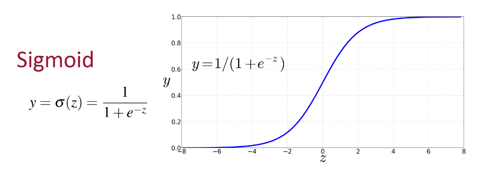

Il problema della logistic regression è che è spiegabile, ma difficile farlo.

**k-Nearest Neighbors**

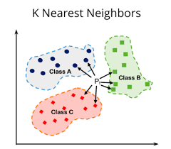Un **k-Nearest Neighbors** rappresenta ogni campione come un punto dati in uno spazio d-dimensionale, dove d è il numero di attributi.

Data un'istanza di test, calcoliamo la sua prossimità alle istanze di training. I vicini più prossimi di k di una data istanza di test z si riferiscono ai k esempi di training più vicini a z.

Importante è scegliere il valore corretto per k. Se k è troppo piccolo, allora il classificatore del vicino più prossimo potrebbe essere suscettibile di overfitting a causa del rumore, ovvero esempi etichettati in modo errato nei dati di training. D'altro canto, se k è troppo grande, il classificatore del vicino più prossimo potrebbe classificare in modo errato l'istanza di test perché il suo elenco di vicini più prossimi include esempi di training che si trovano molto lontano dal suo vicinato.

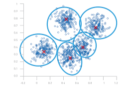**K-means**

Il K-means è un metodo di quantizzazione vettoriale che definisce un modello in termini di un centroide, che di solito è la media di un gruppo di punti, ed è tipicamente applicato a oggetti in uno spazio continuo n-dimensionale. Il centroide non corrisponde quasi mai a un punto dati effettivo.

1. scegliamo K centroidi iniziali, dove K è un iperparametro e indicata il numero di cluster che vogliamo creare;
2. ogni punto viene quindi assegnato al centroide più vicino e ogni raccolta di punti assegnata a un centroide è un cluster;
3. Il centroide di ogni cluster viene quindi aggiornato in base ai punti assegnati al cluster.
4. Ripetiamo i passaggi di assegnazione e aggiornamento finché nessun punto cambia cluster o, finché i centroidi rimangono gli stessi

Per assegnare un punto al centroide più vicino, abbiamo bisogno di una misura di prossimità che quantifichi la nozione di "più vicino" si può usare la **distanza euclidea** anche se si possono scegliere tipi di misura diversi per il tipo di dato che usiamo come ad esempio, la **distanza di Manhattan** può essere utilizzata per i dati euclidei, o la **misura di Jaccard** per i documenti.

Per la funzione obiettivo, che misura la qualità di un clustering, utilizziamo la **somma dell'errore quadratico** (**SSE**), che è anche nota come dispersione. Calcoliamo l'errore di ogni data-point, ovvero la sua distanza dal centroide più vicino, e calcoliamo la somma totale degli errori quadratici. Dati due diversi set di cluster prodotti da due diverse serie di K-means, il migliore è quello con l'errore quadratico più piccolo poiché ciò significa che i centroidi di questo clustering sono una migliore rappresentazione dei punti nel loro cluster.

**Scelta del centroide iniziale**

Si posizionamento del centroide iniziale potrebbe essere anche fatto in modo casuale, ma se i centroidi iniziali non sono ben distribuiti, l'algoritmo può convergere a una soluzione subottimale invece di trovare il miglior raggruppamento. Questo accade perché l'algoritmo è **sensibile alla posizione iniziale** dei centroidi. Oppure se alcuni centroidi iniziali vengono scelti in zone **molto dense**, alcuni cluster risulteranno **sovraffollati**, mentre altri saranno quasi vuoti o completamente assenti. Questo porta a una distribuzione **non uniforme** dei punti tra i cluster.

Un approccio alternativo è quello di prendere un campione di punti e di raggrupparli utilizzando una tecnica di clustering gerarchico. K cluster vengono estratti dal clustering gerarchico e i centroidi di tali cluster vengono utilizzati come centroidi iniziali. Questo approccio spesso funziona bene, ma è pratico solo se

* il campione è relativamente piccolo, ad esempio, da poche centinaia a poche migliaia (il clustering gerarchico è costoso)
* K è relativamente piccolo rispetto alla dimensione del campione.

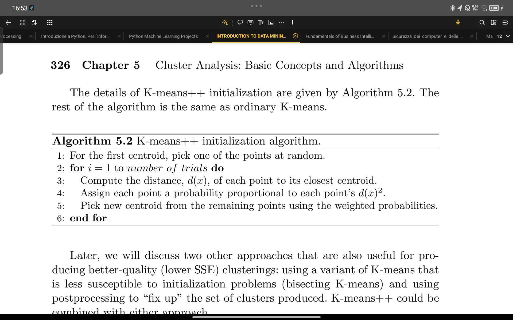Un approccio migliore è il **K-mean++** nel quale si sceglie la posizione del primo centroide a caso e poi gli altri rimanenti si posizionando il più lontano possibile dal primo. La posizione è scelta, in modo che il nuovo centroide, abbia distanza proporzionale al quadrato della sua distanza dal centroide più vicino.

L'**elbow plot** è una tecnica utilizzata per determinare il numero ottimale di cluster in un algoritmo di clustering.

L'idea è di calcolare la **somma delle distanze quadratiche (interna)** di ogni punto all'interno di ciascun cluster (chiamata **inertia**) per vari valori di **K** (il numero di cluster).

Si esegue l'algoritmo K-means per diversi valori di K (ad esempio da 1 a 10) e si traccia un grafico della **somma delle distanze** rispetto ai valori di K.

In genere, quando si aumenta K, la somma delle distanze diminuirà, poiché più cluster permettono una migliore separazione dei dati.

L'**elbow** si riferisce al punto in cui l'ulteriore aumento del numero di cluster non porta a un miglioramento significativo della somma delle distanze (cioè la curva si appiattisce). Questo punto indica il numero ottimale di cluster, poiché oltre a questo punto, il guadagno in termini di separazione dei dati diminuisce.

Quindi serve a **determinare il numero di cluster ottimale** per un algoritmo di clustering, riducendo il rischio di overfitting (troppi cluster) o underfitting (pochi cluster), e **valutare la qualità del clustering** perché un numero eccessivo di cluster potrebbe suggerire che i dati non sono ben separabili, mentre un numero troppo basso potrebbe indicare che il modello non comprende la complessità dei dati.

**CLUSTERIZZAZIONE GERARCHICA**

La clusterizzazione gerarchica è un algoritmo di machine learning non supervisionato che crea una struttura ad albero (**dendrogramma**) per mostrare i cluster annidati in modo gerarchico, senza dover specificare il numero di cluster in anticipo. Esistono due approcci principali: l'**agglomerativo** (bottom-up), che unisce i punti dati più simili in cluster più grandi, e il **divisivo** (top-down), che inizia con un unico grande cluster e lo divide progressivamente.

Per la divisione si parte da un punto appartenente al proprio cluster. Dopo di che consideriamo gli elementi migliori, cioè più vicini. Quello più vicino farà parte del primo cluster. Poi per poter continuare nella clusterizzazione, per poter considerare anche i cluster, si deve trovare un modo per potere modellare il cluster. Ad esempio, se supponiamo di trovarci in uno spazio euclideo, possiamo calcolare il centroide per quel cluster. L’algoritmo continua fino a quando abbiamo raggiunto un certo numero di cluster, fino a quanto abbiamo raggiunto un unico cluster ecc… ci sono varia implementazione di questo modello

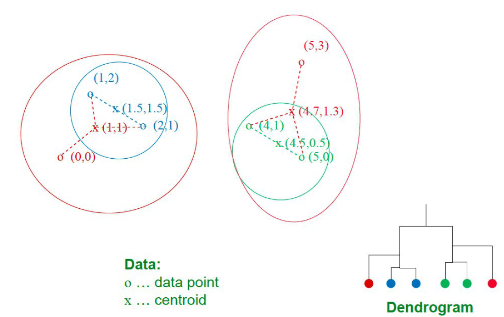

Per certi tipi di dati, si parla di **clusteroide**, si tratta sempre di un centroide che però può non esistere perché nella realtà non esiste, come ad esempio quando i dati sono embeddings di parole, il valore medio a quel punto può rappresentare una parola non esistente.

**DBSCAN**

**DBSCAN** (**Density-Based Spatial Clustering of Applications with Noise**) è un metodo di clustering che separa le regioni di istanze sulla base della **densità**. Con questa tecnica siamo in grado di separare le istanze anche con una forma arbitraria determinando automaticamente anche il numero di cluster necessari.

Nell’approccio **center-based**, la densità è definita sulla base della distanza da un particolare punto, contando i punti vicini ad esso che si trovano ad un certo raggio **Eps** di distanza da esso. Questo si tratta di un approccio naïve che fallisce perché la densità dipende dalla distanza.

**Definizione 1:** L’**Eps-nighborhood di un punto *p***, denominato con *Eps(p)*, è definito come: *NEps(p) = {q ∈ D | dist(p, q) ≤ Eps}*

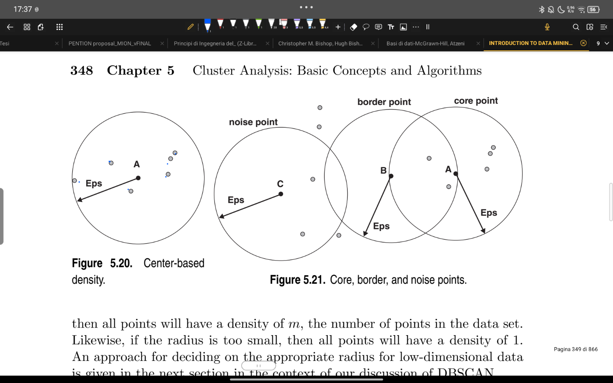

Ci sono tre tipi di punti:

* **core**: questi punti si trovano all'interno di un cluster basato sulla densità. Un punto è un punto core se ci sono almeno MinPts entro una distanza di Eps, dove MinPts ed Eps sono parametri specificati dall'utente.
* **border**: un punto di confine non è un punto core, ma rientra nell'

intorno di un punto core. Un punto di confine può rientrare nell'intorno di diversi punti core.

* **noisy**: un punto di rumore è qualsiasi punto che non sia né un punto core né un punto di confine.

**Algoritmo**

1: Etichettare tutti i punti come punti core, di confine o di rumore.

2: Eliminare i punti di rumore.

3: Inserire un bordo tra tutti i punti core entro una distanza Eps l'uno dall'altro.

4: Trasformare ogni gruppo di punti core connessi in un cluster separato. 5: Assegnare ogni punto di confine a uno dei cluster dei punti core associati.

Eps e MinPts sono gli iperparametri che devono essere scelti per l buon funzionamento del modello.

**Definizione 2:** Un punto *p* è **direttamente densità raggiungibile** da un punto *q* rispetto a *Eps*, *MinPts* se:

* *p ∈ NEps(q)* e
* |NEps(q)| ≥ *MinPts* (condizione del punto centrale).

La raggiungibilità diretta della densità è **simmetrica** per coppie di **punti centrali**, ma n**on simmetrico** quando sono coinvolti un punto centrale e un punto di confine.

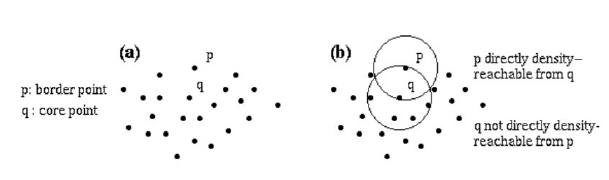

**Definizione 3:** Un punto p è **density-reachable** da un punto q rispettando Eps e MinPts se esiste una catena di punti p1->p2->…->pn se:

* P1=q
* Pn= p
* Per ogni i= 1, …, n-1, pi+1 è **directly density reacheble** da pi

Questa relazione è trasnsitiva, ma non simmetrica per la condizione di **directly density reacheble**

**Definizione 4:** Un punto p è **density connected** ad un punto q rispettando Eps e MinPts se c’è un punto ‘o’ per entrambi, p e q sono density- reacheble from o rispettando Eps e MinPts

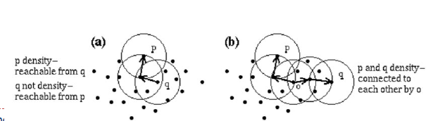

**Definizione 5:** Sia B un database. Un cluster C che rispetta Eps e MinPts e che non sia un sotto insieme vuoto di D se soddisfa:

* un qualunque punto p, q : se p appartiene a C q è density-reachable from p che rispetti Eps e MinPts, allora q appartiene a C (**Massimalità**)
* un qualunque punto p, e appartenenti a C : p è density-connected to q rispettando Eps e MinPts (**Connettività**)

**Definizione 6:** Siano C1, … Ck cluster di D che rispettino i parametri Epsi e MinPtsi. Il **rumore** è definito come l’insieme di punti di D che non appartengono a nessun cluster. noise = { p ∈ D | ∀ i: p ∉ C*i*}

Una variante è **HDBSCAN** (**Hierarchical DBSCAN**) è un algoritmo basato sulla densità che costruisce cluster in una struttura gerarchica ad albero. Anche in questo, non è necessario prestabilire il numero di cluster, li stabilisce in automatico l’algoritmo. DBSCAN richiede un ε ben scelto e fallisce se i cluster hanno **densità diverse**. **HDBSCAN** risolve questo creando una **gerarchia di cluster** in base alla densità e scegliendo automaticamente i cluster più stabili.

Quest’algoritmo si basa su concetto di **core distance**, definita come:

Questa misura quanto il punto è denso:

* Se è piccolo, significa che attorno a xxx ci sono molti vicini ravvicinati → zona densa.
* Se è grande, il punto è in una zona più sparsa.

La **Mutual Reachability Distance** (**MRD**) stabilisce che due punti Xp e Xq sono tali se:

Significa che:

* Se entrambi i punti sono in regioni dense, la loro distanza mutua è quasi uguale alla distanza euclidea.
* Se invece uno dei due è in una zona poco densa, la MRD diventa grande, anche se i due punti non sono così lontani nello spazio.

>>La mutual reachability distance riformula la distanza fra punti, imponendo che due punti siano “vicini” solo se entrambi stanno in zone dense.

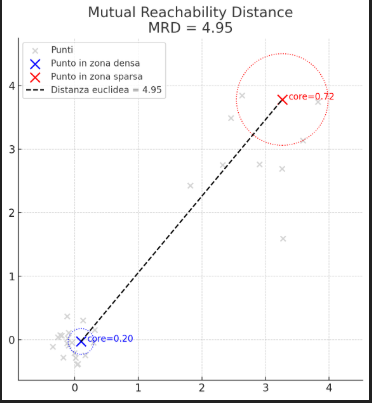

* In **blu** un punto dentro a un cluster molto denso → core distance piccola.
* In **rosso** un punto in una zona più sparsa → core distance più grande.
* La linea tratteggiata nera è la **distanza euclidea pura** tra i due punti.
* I cerchi rappresentano le rispettive **core distance**.

La **MRD** è il massimo tra queste tre quantità.
Quindi, anche se i due punti non sono lontanissimi nello spazio, la distanza effettiva usata da HDBSCAN viene gonfiata perché uno dei due è in una regione poco densa. 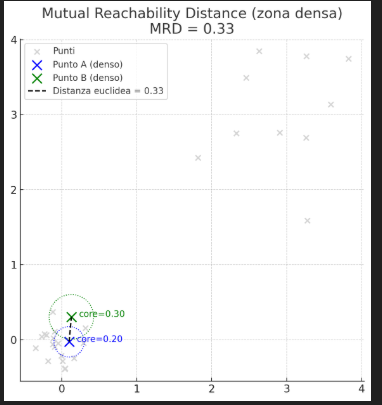

* Le **core distance** (cerchi blu e verde) sono piccole.
* La **distanza euclidea** tra i due punti (tratteggio nero) è molto simile a queste.
* La **MRD** qui praticamente coincide con la distanza euclidea, perché i due punti vivono in una zona ad alta densità.

In altre parole:

* se sei in una zona densa → MRD ≈ distanza euclidea;
* se sei vicino a un punto isolato → MRD diventa più grande e penalizza l’associazione.

Il motivo per cui si usa MRD è che così si migliora la robustezza dell’algoritmo dagli outliers e alla variazione di densità di punti, assicurandosi anche che i punti sparsi da altri (**noisy**) siano almeno alla loro distanza principale.

Queste misure vengono utilizzate per costruire il grafo che inizialmente è connesso. Fatto questo si calcola il **Minimum Spanning Tree** (**MST**), quindi l’albero con i cammini minimi.

**MRD ≈ distanza euclidea**

Quindi i punti si collegano facilmente nel grafo. Nel *Minimum Spanning Tree* (MST) di HDBSCAN, questi archi avranno peso basso. Il cluster viene consolidato e riconosciuto come regione ad alta densità.

**MRD ≫ distanza euclidea** (perché il punto sparso “gonfia” la misura).

Nel grafo, l’arco tra i due punti avrà peso alto → collegamento debole. L’algoritmo, quando taglia il MST a diversi livelli di densità, “rompe” questi legami per primi. I punti sparsi diventano **rumore/outlier** o si staccano in micro-cluster instabili.

HDBSCAN costruisce una **gerarchia di cluster** ordinata per densità, e poi sceglie quelli più stabili.

La MRD assicura che:

* i cluster **veri** (zone dense) sopravvivono a molti livelli → vengono selezionati;
* i punti **isolati** o “ponti” tra cluster non riescono a tenere uniti gruppi → vengono scartati come rumore.

HDBSCAN fa anche azioni di **pruning** se si verificano certe condizioni, andando a creare un **Condensed Cluster Tree** (**CCT**). La logica del pruning è:

* si attraversa la gerarchia dalla radice verso il basso e ad ogni divisione del cluster si verifica se:
  + entrambi i figli hanno ≥ MinPts => divisione valida
  + entrambi i bambini hanno < MinPts, => cluster scompare a questo livello
  + solo un figlio ha < MinPts => quel figlio è considerato **noisy**, il genitore continua

In questo modo si ottiene un albero più semplice e interpretabile, in cui ogni livello rappresenta una certa soglia di densità.

Per selezionare i cluster nel CCT, possiamo selezionare tutti i nodi foglia. Questi sono cluster con un valore di ε basso nella gerarchia e che non possono essere ulteriormente splittati.

Un altro metodo è quello di andare a calcolare l’**EOM**, **Excess Of Mass**. L’idea alla base di questo è che un cluster è classificato come buono, se sopravvive a lungo nella gerarchia: si forma a un certo livello di densità, poi “muore” a un altro livello più basso, e durante quel percorso contiene molti punti per molto tempo, cioè, ha un “eccesso di massa” rispetto al rumore o alle suddivisioni.

Formalmente:

* Ogni cluster candidato Ci ha un **livello massimo** di densità (o minimo di distanza) in cui “nasce” εmax.
* Ha anche un **livello minimo** (o massimo di distanza) in cui “muore” εmin
* Per ogni punto xj∈Ci, si può definire la densità (o distanza) massima a cui resta membro del cluster.

La **stabilità** del cluster è definita come:

L’algoritmo EoM percorre l’albero condensato dal basso (foglie) verso l’alto, decidendo per ogni sotto cluster se è meglio selezionarlo o lasciare che venga sostituito dal suo genitore, comparando le somme di stabilità. In questo modo si assicura che:

1. Non vengano estratti cluster che sono “troppo piccoli” o instabili.
2. Non vi siano cluster che si sovrappongono (su una stessa “ramificazione” dell’albero) si sceglie solo uno per ramo.
3. Si massimizzi la stabilità globale combinata dei cluster estratti.

**MODELLI** **ENSAMBLE**

Per metodi ensemble si intende quando un algoritmo utilizza **più modelli** contemporaneamente per migliorare le sue performances predittive. I metodi ensemble solitamente raggiungono **performances elevatissime**, soprattutto se rapportati ai classificatori singoli. Obv, richiedono **molto più tempo di addestramento**, in quanto al posto di un solo classificatore devono essere addestrati centinaia o migliaia di classificatori.

Il **bootstrap sampling** è una tecnica statistica di campionamento con ripetizione. per stimare la variabilità di una statistica (media, varianza, mediana, ecc.) senza fare assunzioni forti sulla distribuzione dei dati. Il bootstrap viene usato per creare molteplici varianti artificiali di un dataset, a partire da un unico campione osservato. La caratteristica distintiva del bootstrap è che, per creare un nuovo dataset, si estrae casualmente (con rimpiazzo) dal dataset originale lo stesso numero di osservazioni.

Supponiamo di avere un dataset D con n osservazioni.

1. Estrazione con ripetizione: si selezionano n elementi da D, scegliendo ogni volta un elemento a caso, ma rimettendolo dentro. Quindi un’osservazione può essere scelta più volte, mentre un’altra può non essere scelta mai.
2. Questo processo genera un nuovo dataset Db, chiamato bootstrap sample.
3. Si possono generare molti bootstrap sample (D1, D2,...,Db) ripetendo questo procedimento più volte.

Una proprietà interessante è che circa il 63% delle osservazioni originali comparirà, in media, almeno una volta in ciascun campione bootstrap, mentre il resto delle osservazioni (circa il 37%) non verrà selezionato. Queste osservazioni non incluse sono chiamate out-of-bag samples (*OOB*), e hanno un ruolo molto importante, per esempio nella stima dell’errore nei metodi ensemble come il **bagging** (**Bootstrap Aggregating)**. L’idea alla base del bagging è che invece di addestrare un singolo modello su un unico dataset, si addestrano **molti modelli**, ognuno su una **variante diversa** dello stesso dataset, ottenuta attraverso una tecnica chiamata **bootstrap**.

Ogni campione bootstrap viene usato per addestrare un **modello indipendente.** Alla fine, quando arriva il momento di fare una predizione, si aggregano tutte le predizioni individuali:

* **Nel caso della classificazione**, si utilizza il **voto di maggioranza**: la classe più predetta è quella scelta.
* **Nel caso della regressione**, si calcola invece la **media** delle predizioni.

Il bagging si basa su un principio statistico: la media di molte stime indipendenti è meno variabile di una singola stima. Se i modelli che si addestrano sono abbastanza diversi tra loro, ma non troppo sbagliati individualmente, la loro combinazione riduce significativamente l’errore totale, in particolare la varianza, lasciando quasi invariato il bias. Questo rende il bagging ideale per modelli che tendono a **overfittare**. Un'applicazione famosa del bagging è il metodo delle **Random Forest**, che estende il bagging introducendo anche una selezione casuale delle feature in fase di addestramento degli alberi, rendendoli ancora più diversificati tra loro.

Naturalmente, il bagging ha anche dei limiti, non aiuta molto quando il problema principale è l’alta bias: se il modello base è troppo semplice per rappresentare correttamente il fenomeno, il bagging non potrà compensare questa mancanza. Inoltre, può risultare **computazionalmente costoso**, perché richiede l’addestramento di molti modelli.

**Stacking** (abbreviazione di stacked generalization) è una **tecnica di ensemble** che combina diversi modelli (**base learners**) tramite un **modello finale** detto **meta-learner** o **meta-model**. Può essere considerato come una generalizzazione deli due metodi precedenti che impongono delle regole più rigide per il voting e l’addestramento dei modelli.

1. Si addestrano diversi modelli su tutto il dataset di training. Ogni modello produce le proprie predizioni.
2. Queste diventano le nuove feature, andando a formare un nuovo dataset etichettato.
3. On questo nuovo dataset viene addestrato un modello finale da cui impara **quale base learner “fidarsi di più”** in certe condizioni.

# **3. VALUTAZIONE DEI MODELLI**

## **3.1 Metriche di valutazione per modelli di classificazione**

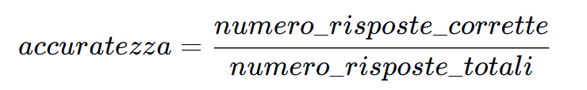Per valutare i modelli di classificazione, vengono utilizzate diverse metriche basate la principale è l’**accuracy** che ci indica quante volte il nostro modello ha correttamente classificato un item nel nostro dataset rispetto al totale.

Non ci permette di comprendere il **contesto** nel quale stiamo operando. Da sola non va bene, conviene accompagnarla insieme alla **matrice di confusione**, le cui dimensioni dipendono dal numero di feature che abbiamo.

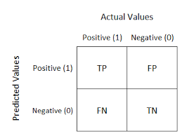

✅ **True Positive TP**🡪Il modello prevede positivo e in effetti è positivo.

❌ **False Positive FP🡪**Il modello prevede positivo ma è negativo (**errore tipo I**). Falso allarme 😌

✅ **True Negative TN**🡪Il modello prevede negativo e in effetti è negativo.

❌ **False Negative FN**🡪Il modello prevede negativo ma è positivo (errore tipo II). Mancata rilevazione. 😨

Dalla matrice di confusione si possono calcolare varie metriche.

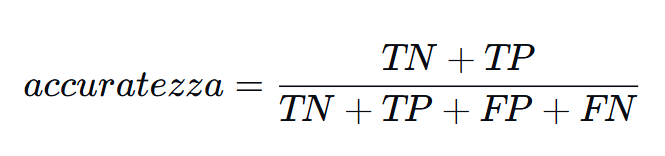

La **precision** indica quante classi classificate come positive che sono effettivamente positive. È sensibile allo sbilanciamento delle classi.

La **recall (o Sensibilità)** indica fra tutte le istanze effettivamente positive, quante il modello ha individuato correttamente. È sensibile allo sbilanciamento delle classi.

La **specificità** indica fra le istanze negative quante ne sono state correttamente identificate come negative.

Quando abbiamo più feature calcoliamo queste metriche per tutte. Un classificatore sarà buono se le metriche di tutte le feature che consideriamo sono buone. In queste situazioni possiamo calcolare delle misure aggregate basate sulla media:

La **macro-average** calcola la metrica delle prestazioni di ogni classe (ad esempio, precisione, richiamo) e quindi prende la media aritmetica in tutte le classi dando lo stesso **peso a ciascuna classe**, indipendentemente dal numero di istanze.

La **micro- average**, aggrega i conteggi di veri positivi, falsi positivi e falsi negativi in tutte le classi e quindi calcola la metrica delle prestazioni in base ai conteggi totali basandosi anche sul **peso a ogni istanza**, indipendentemente dall'etichetta della classe e dal numero di casi nella classe

Micro-Precision = Micro-Recall =

Macro-Precision = Macro-Recall =

L’**F1-score** è la media armonica tra Precision e Recall. Serve per trovare un equilibrio tra questi due valori.

L'**Fβ-score** è una generalizzazione dell'F1-score, calcolata tramite media armonica ponderata che permette di dare maggiore importanza a Precision o Recall a seconda delle necessità del problema, utilizzando un parametro **β**.

Se **β > 1**, dà più peso al Recall (importante se i falsi negativi sono più gravi).

Se **β < 1**, dà più peso alla Precision (utile quando i falsi positivi sono più problematici).

Se **β = 1**, il risultato è l’F1-score, che bilancia Precision e Recall in modo uguale.

**ROC Curve e AUC**: La Curva Caratteristica Operativa del Ricevitore (ROC) traccia il tasso di veri positivi (TPR) contro il tasso di falsi positivi (FPR) a diverse soglie di classificazione. L'Area Sotto la Curva ROC (AUC) fornisce una misura aggregata delle prestazioni del classificatore. Si cerca di massimizzare i TP (recall) e di minimizzare gli FP (precision)

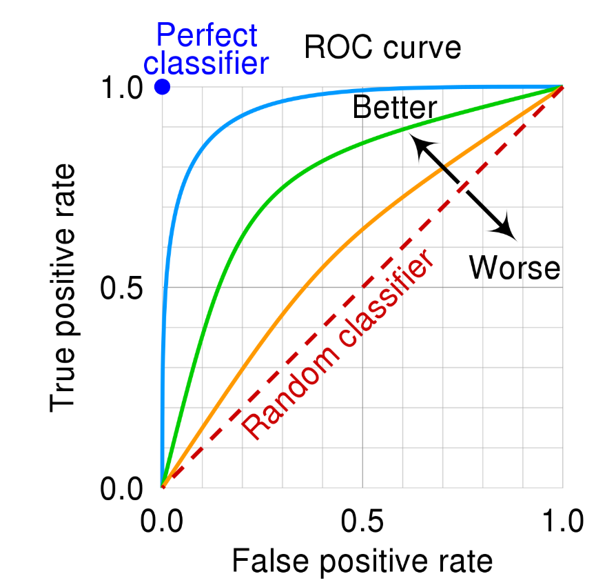

## **3.2 Metriche di valutazione per modelli di regressione**

Per i modelli di regressione, le prestazioni vengono valutate utilizzando l'analisi dei **residui** cioè la differenza tra i valori osservati e quelli previsti e metriche come:

**MSE - Mean Squared Error:** La media dei quadrati dei residui.

Valori più bassi indicano un modello che si adatta meglio ai dati. È molto sensibile agli outliers.

**MAE - Mean Absolute Error**: La media dei valori assoluti dei residui.

più robusto rispetto al MSE agli outliers perché non eleva al quadrato l’errore. Anche qui, valori più bassi indicano migliori prestazioni

**MAPE - Mean Absolute Percent Error** misura l’errore in percentuale rispetto ai valori osservati.

È utile quando vuoi capire l’errore relativo, ma non va usato se i valori osservati possono essere zero (o molto vicini a zero) perché diverge.

**R-squared (Coefficiente di Determinazione)**: La proporzione della varianza nella variabile dipendente che è prevedibile dalla variabile indipendente.

Va da 0 a 1 (o anche negativo se il modello è peggiore di una media costante). Un valore più alto indica un modello migliore.

**F-statistic**: Una misura complessiva di quanto la varianza spiegata dal modello superi la varianza residua.

Un valore alto di F e un corrispondente p-value basso indicano che almeno uno dei predittori è significativo.

dove:

* n = numero di osservazioni
* p = numero di predittori (variabili indipendenti)
* yi = valore osservato
* = valore predetto dal modello
* = media dei valori osservati
* SSreg = somma dei quadrati della regressione (spiegata)
* SSres = somma dei quadrati dei residui (non spiegata)

## **3.3 Metriche di valutazione per gli algoritmi di clustering**

La valutazione di modelli di clustering è meno diretta a causa dell'assenza di un attributo target. Si utilizzano misure di **coesione**, quanto sono simili gli oggetti all'interno di un cluster e **separazione** quanto sono distinti i diversi cluster.

Esistono metriche supervisionate, dove conosciamo il target, quindi confrontiamo il risultato della predizione con questo. Un esempio è il **RandIndex** che misura la similarità fra due partizioni, nel nostro caso fra quello previso e l’output atteso. L'indice Rand è calcolato come segue:

Dove:

* a rappresenta il conteggio delle coppie di elementi che appartengono allo stesso cluster in entrambi i metodi di clustering.
* b indica il numero di coppie di elementi assegnate a cluster diversi in entrambi gli approcci di clustering.
* n sta per il numero complessivo di elementi raggruppati.
* indica il conteggio totale delle coppie di elementi nel set di dati.

L'indice Rand varia tra 0 e 1, dove:

1. Un valore pari a 1 indica un accordo completo tra i due cluster, il che significa che tutte le coppie di punti dati sono raggruppate insieme o separatamente in entrambi i cluster.
2. Un valore pari a 0 suggerisce che non c'è accordo, oltre a ciò che potrebbe essere attribuito al caso.

Considera tutte le coppie di punti:

1. Stesso cluster in entrambi => accordi
2. Cluster diversi in entrambi => accordo
3. In caso contrario => disaccordo

Tuttavia, il Rand Index non considera la possibilità di accordi casuali tra i due cluster. Per tenere conto del caso, viene spesso utilizzato Adjusted Rand Index (ARI). L'ARI aggiusta l'indice Rand per fornire una misura che può produrre un valore negativo quando l'accordo è peggiore del previsto solo per caso e un valore di 1 per l'accordo perfetto.

L'**Adjusted Rand Index** (ARI) è una variante dell'Indice Rand (RI) che aggiusta in base al caso, quando valuta la somiglianza tra due raggruppamenti di dati. È una misura utilizzata nell'analisi dei clustering per valutare quanto bene i cluster prodotti da diversi metodi o algoritmi concordano tra loro o con un clustering di riferimento. L'ARI affronta questa limitazione correggendo gli accordi casuali. Calcola l'indice Rand considerando la somiglianza prevista tra due raggruppamenti casuali degli stessi dati.

La formula per l’ARI è la seguente:

dove:

1. **R:** il valore dell'indice Rand
2. **E:** Il valore atteso dell'indice Rand per i cluster casuali.
3. **Max(R):** il valore massimo raggiungibile dell'indice Rand (sempre 1).

Questa formula prende l'indice di Rand (R) e lo aggiusta considerando l'accordo atteso dovuto alla probabilità casuale (E).

Il valore ARI risultante varia da -1 (cluster completamente opposti) a 1 (cluster identici), dove 0 indica una concordanza non migliore di casuale.

L’ARI è ampiamente utilizzato nell'analisi dei clustering perché fornisce una misura più accurata della somiglianza tra i cluster tenendo conto degli accordi casuali. È particolarmente utile quando si valutano gli algoritmi di clustering su set di dati con dimensioni o strutture di cluster variabili.

Un’altra metrica di tipo non supervisionata è la **silhouette score** che misura quanto simile è un datapoint agli altri che appartengono al suo cluster. Esso considera due aspetti:

1. **Coesione (a(i))**: la vicinanza di un punto dati ad altri punti nel proprio cluster.
2. **Separazione (b(i))**: la distanza di un punto dati dai punti nel cluster vicino più vicino.

Per ogni datapoint la silhouette score è calcolata come:

* **+1**: Clustering perfetto: il punto è lontano da altri cluster e ben abbinato al proprio cluster.
* **0**: Clustering borderline: il punto è equidistante tra due cluster.
* **-1**: Clustering scadente: il punto è più vicino a un altro cluster che al proprio.

Il **mean silhouette score** in tutti i punti dati di un set di dati fornisce una misura complessiva della qualità del cluster, è calcolata come:

* Un **punteggio medio più alto** indica cluster ben definiti e compatti.
* Un **punteggio medio più basso** suggerisce cluster sovrapposti o scarsamente separati.

**Punti di forza**

* **Valutazione non supervisionata**: funziona senza la necessità di vere etichette di cluster, il che lo rende ideale per l'apprendimento non supervisionato.
* **Promuove un buon clustering**: premia i cluster che sono sia compatti (coesione) che ben separati (separazione).
* **Intuizione visiva**: i grafici di silhouette forniscono una comprensione grafica della qualità dei cluster.

**Limitazioni**

* **Sensibilità metrica della distanza**: funziona meglio con la distanza euclidea; fatica con le metriche non euclidee.
* **Sensibilità alla forma del cluster**: presuppone cluster sferici; meno efficace per forme irregolari (ad esempio, in DBSCAN).
* **Scalabilità**: computazionalmente costosa per set di dati di grandi dimensioni a causa dei calcoli della distanza a coppie.

# **EXPLAINABLE AI**

L’**interpretabilità** può essere definita come il grado con cui una persona capisce i motivi per cui una certa scelta è stata presa.

Lo stesso concetto può essere applicato ai modelli di ML, quindi capire come un modello e su quali feature, prende determinate decisioni. Non tutti i modelli sono spiegabili, ci sono i modelli:

* **Black box**, che non si possono spiegare e dipende da come il modello è costruito,
* **With box**, che possono essere spiegare in una maniera più o meno facile.

È importante capire come il modello fa certe scelte per diversi motivi:

* **Fairness (Equità):** per assicurarsi che il modello non introduca discriminazioni o bias nei confronti di gruppi specifici.
* **Privacy:** per garantire che il modello non riveli informazioni sensibili o dati personali in maniera non controllata.
* **Causalità:** per capire le relazioni causa-effetto tra le feature e le predizioni, evitando correlazioni spurie.
* **Trust (Fiducia):** la trasparenza sulle decisioni del modello aumenta la fiducia degli utenti e degli stakeholder.
* **Robustness and reliability (Robustezza e affidabilità):** comprendere il comportamento del modello aiuta a prevedere come reagirà a dati nuovi o rumorosi, migliorandone la stabilità.
* **Accountability (Responsabilità):** permette di attribuire correttamente responsabilità in caso di errori o decisioni impattanti.

**Tassonomia dell’interpretabilità dei modelli**

Possiamo distinguere tra interpretabilità per progettazione e interpretabilità post-hoc.

L'**interpretabilità per progettazione** significa addestrare modelli intrinsecamente interpretabili, come l'uso della regressione logistica invece di una foresta casuale. L'**interpretabilità post-hoc** significa che utilizziamo un metodo di interpretabilità dopo che il modello è stato addestrato.

I metodi di interpretazione post-hoc possono essere **indipendenti dal modello**, come l'importanza delle caratteristiche della permutazione, oppure **specifici per modello**, come l'analisi delle caratteristiche apprese da una rete neurale. I metodi indipendenti dal modello possono essere ulteriormente suddivisi in **metodi locali** che si concentrano sull'spiegazione delle previsioni individuali, e **metodi globali** che si concentrano su dataset.

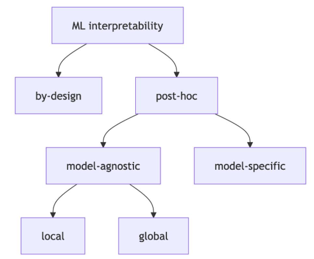

Le principali strategie applicate per l’interpretabilità dei modelli sono:

* **feature summry statistics**, metriche riassuntive che danno un singolo valore per ogni feature, per capire quali sono quelloe che inlfuenzano maggiormente il modello
* **learned weigths**, osservare direttamente i parametri appresi dal modello, questo è possibile sono
* **data points**, usare esempi, realistici o generati, per spiegare il comportamento del modello
* **intrinsically interpretable model** modelli progettati per essere comprensibili di per sé o modelli black-box approssimati da versioni più semplici.

**Proprietà delle spiegazioni**

* **Accuratezza (Accuracy)** – Quanto bene la spiegazione predice dati non visti.
* **Fedeltà (Fidelity)** – Quanto strettamente la spiegazione corrisponde alle predizioni del modello black-box originale.
* **Coerenza (Consistency)** – Quanto sono simili le spiegazioni tra modelli addestrati sullo stesso compito con output simili.
* **Stabilità (Stability)** – Quanto sono simili le spiegazioni per istanze simili.
* **Comprensibilità (Comprehensibility)** – Quanto facilmente un essere umano può capire la spiegazione.
* **Grado di importanza (Degree of Importance)** – Quanto bene la spiegazione riflette la rilevanza di ciascuna feature o condizione.
* **Rappresentatività (Representativeness)** – Quante istanze sono coperte dalla spiegazione.

**INTERPRETABILITY BY DESIGN**

**Modello di regressione**

Il modello di regressione cerca di imparare con che peso le varie feature prodotto l’output, che è data come somma pesata di quest’ultime.

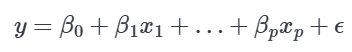

ε è l’errore che si commette e si modella seconda la distribuzione gaussiana. Per trovare il miglior coefficiente si deve minimizzare la differenza dei quadrati fra il valore effettivo e quello stimato dal modello:

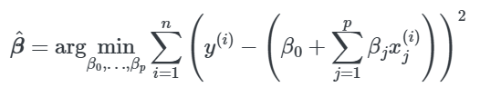

La linearità di questo modello lo rende semplice da spiegare, ed è per questo che viene usato in molti ambiti. Se il modello è quello "corretto" dipende dal fatto che le relazioni nei dati soddisfino determinati presupposti

* **Normalità** Si presume che il risultato target, date le caratteristiche, segua una distribuzione normale. Se questa ipotesi viene violata, gli intervalli di confidenza stimati dei pesi delle caratteristiche non sono validi.
* **Omoschedasticità** (varianza costante) Si presume che la varianza dei termini di errore sia costante sull'intero spazio delle caratteristiche.
* **Indipendenza** Si presume che ogni istanza sia indipendente da qualsiasi altra. Per i dati dipendenti, sono necessari modelli di regressione lineare speciali, come i modelli a effetti misti o GEE. Se si utilizza il modello di regressione lineare "normale", si potrebbero trarre conclusioni errate dal modello.
* **Caratteristiche fisse** Le caratteristiche di input sono considerate "fisse". Fisse significa che sono trattate come "costanti date" e non come variabili statistiche. Ciò implica che siano esenti da errori di misura. Si tratta di un'ipotesi piuttosto irrealistica. Senza tale ipotesi, tuttavia, si dovrebbero adattare modelli di errore di misura molto complessi che tengano conto degli errori di misura delle caratteristiche di input. E di solito non si desidera farlo.
* **Assenza di multicollinearità** Non si vogliono caratteristiche fortemente correlate perché ciò compromette la stima dei pesi. In una situazione in cui due caratteristiche sono fortemente correlate, diventa problematico stimare i pesi perché gli effetti delle caratteristiche sono additivi e diventa indeterminabile a quale delle caratteristiche correlate attribuire gli effetti.

L'interpretazione di un peso nel modello di regressione lineare dipende dal tipo di caratteristica corrispondente.

* **Caratteristica numerica**: aumentando la caratteristica numerica di un'unità, il risultato stimato varia in base al suo peso.
* **Caratteristica binaria**: una caratteristica che assume uno dei due valori possibili per ogni istanza. Cambiando la caratteristica dalla categoria di riferimento all'altra categoria, il risultato stimato varia in base al peso della caratteristica.
* **Caratteristica categoriale con più categorie**: una caratteristica con un numero fisso di valori possibili. Una soluzione per gestire più categorie è la codifica one-hot, ovvero ogni categoria ha una propria colonna binaria.
* **Intercetta** : L'intercetta è il peso della caratteristica per la "caratteristica costante", che è sempre 1 per tutte le istanze. L'interpretazione è: per un'istanza con tutti i valori numerici delle caratteristiche a zero e i valori delle caratteristiche categoriali alle categorie di riferimento, la previsione del modello è il peso dell'intercetta. L'interpretazione dell'intercetta di solito non è rilevante perché le istanze con tutti i valori delle caratteristiche a zero spesso non hanno senso. L'interpretazione è significativa solo quando le caratteristiche sono state standardizzate (media pari a zero, deviazione standard pari a uno). Quindi l'intercetta riflette il risultato previsto di un'istanza in cui tutte le caratteristiche sono al loro valore medio.

L’importanza di una feature per un modello lineare può essere spiegata tramite il suo t-student, che misura il peso stimato scalato in base al suo errore standard

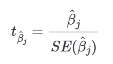 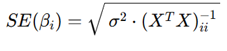

* SE() è l’errore assoluto, che indica quanto precisa è la stima

L'importanza di una caratteristica aumenta con l'aumentare del peso, maggiore è la varianza del peso stimato (= minore è la certezza del valore corretto), minore è l'importanza della caratteristica.

Le feature spesso sono misurate con scale diverse e quindi per rendere i pesi stimati più comparabili, si scalano. Le informazioni sui pesi possono essere visualizzate in un **weighted plot**

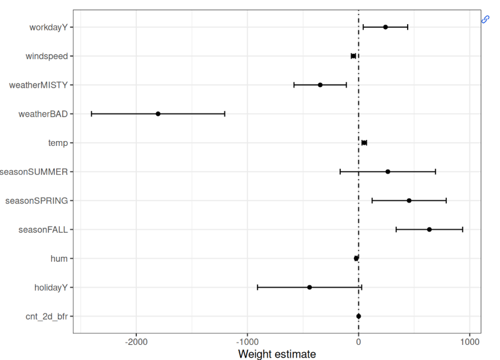

Ma analizzare le feature da sole non è abbastanza, in quanto ci possono essere delle relazioni fra loro che possono influenzare la decisione del modello. Inoltre, i pesi dipendono dalla scala delle caratteristiche e saranno diversi se si ha una caratteristica che misura. Il peso cambierà, ma gli effetti effettivi sui dati non cambieranno. È anche importante conoscere la distribuzione della caratteristica nei dati perché, se si ha una varianza molto bassa, significa che quasi tutte le istanze hanno contributi simili da questa caratteristica.

L’**effect plot** visualizza quanto le combinazioni di pesi e feature contribuiscono alle predizioni- L’effect è calcolato come:

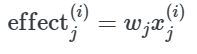 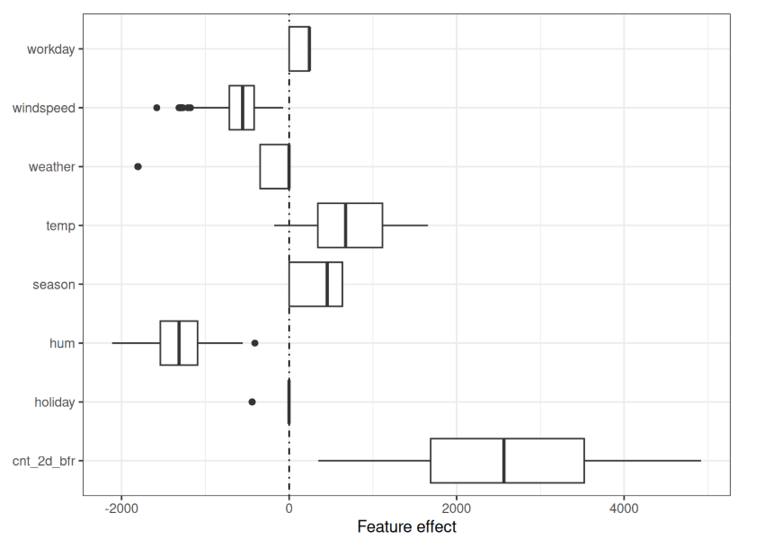

Si fissa un punto di riferimento nello spazio delle feature (tipicamente la media o un'istanza reale), si varia una singola feature lungo un intervallo plausibile, si rimanda tutto al modello e si osserva come cambia la predizione. Un'interpretazione degli effetti specifici dell'istanza ha senso solo in confronto alla distribuzione dell'effetto per ciascuna caratteristica.

**Logist regression**

Nell’interpretazione della logistic regression i pesi non influenzano la probabilità:

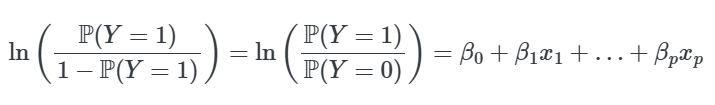

La regressione logistica è moltiplicativa, cioè a livello di probabilità, la regressione logistica non è lineare nelle features. Questo significa che un aumento di un'unità nelle features non aumenta la probabilità di , ma invece cambia la probabilità moltiplicatamente di

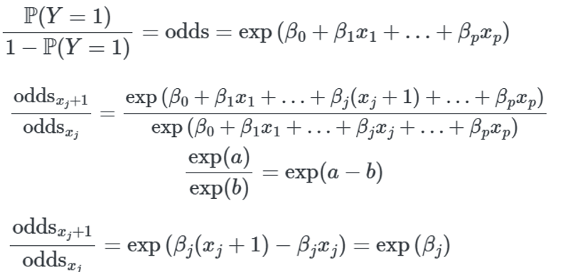

Una variazione di una caratteristica di un'unità modifica il rapporto di probabilità (moltiplicativo) di un fattore di exp(). Potremmo anche interpretarlo così: Un cambiamento in di un'unità aumenta il logaritmico odds ratio del valore del corrispondente peso. Ad esempio, se hai probabilità di 2, significa che la probabilità per Y=1 è il doppio di Y=0. Se hai un peso (logaritmic odds ratio) di 0,7, allora aumenta la caratteristica rispettivamdnte di un'unità moltiplica le probabilità per exp(0,7) (circa 2), e le probabilità cambiano a 4.

Le interpretazioni per il modello di regressione logistica cambiano con diversi tipi di feature:

* **feature numerica**: Se si aumenta il valore di di un'unità, le probabilità stimate cambiano di un fattore di exp().
* **feature categorica binaria**: uno dei due valori della caratteristica è la categoria di riferimento Modificando dalla categoria di riferimento all'altra categoria cambia le probabilità stimate di un fattore di exp().
* **feature categorica multiclasse** una soluzione per gestire più categorie è la codifica one-hot. Per una caratteristica categoriale con L categorie sono necessarie solo L-1 colonne, altrimenti è sovra parametrizzata. La categoria L-esima è quindi la categoria di riferimento. È possibile utilizzare qualsiasi altra codifica utilizzabile nella regressione lineare. L'interpretazione per ciascuna categoria è quindi equivalente all'interpretazione delle caratteristiche binarie.
* **Intercept** : Quando tutte le caratteristiche numeriche sono zero e le caratteristiche categoriali sono nella categoria di riferimento, le probabilità stimate sono exp(). L'interpretazione del peso dell'intercetta non è rilevante.

**Decision tree**

La relazione

dove:

* **M**: numero di nodi foglia (regioni) nell’albero.
* **Rₘ**: l’insieme delle istanze che ricadono nel nodo foglia *m*.
* **I(x ∈ Rₘ)**: funzione indicatrice → vale 1 se l’istanza *x* appartiene alla regione *Rₘ*, altrimenti vale 0.
* **cₘ**: valore predetto per la regione *Rₘ*, pari alla media del valore target di tutte le istanze di training presenti in quella foglia.

descrive la relazione tra l’output y e le feature x. Ogni istanza cade esattamente in un’unica foglia, e la sua predizione corrisponde alla media del target associata a quella foglia.

CART (Classification And Regression Trees) funziona:

1. selezionando la feature e la soglia che **massimizzano la purezza** dei sottoinsiemi (cioè minimizzano la varianza nel caso di regressione o l’impurità, come Gini/entropia, nel caso di classificazione).
2. Si divide il dataset in base a questa feature.
3. Si ripete il processo ricorsivamente per ciascun sottoinsieme fino a raggiungere un criterio di arresto (numero minimo di istanze nel nodo, profondità massima, miglioramento minimo della purezza).

Quindi:

* **Nodo radice**: rappresenta l’intero dataset iniziale.
* **Nodi interni**: contengono decisioni basate su feature specifiche. Ogni nodo interno divide i dati in due sottoinsiemi in base a una soglia (per problemi numerici) o una categoria (per feature categoriche).
* **Foglie (leaf nodes)**: rappresentano la predizione finale.
  + In **regressione**, la predizione è la media dei target nel nodo.
  + In **classificazione**, la predizione è la classe più frequente nel nodo.

L'interpretazione è semplice si parte dal nodo radice, si passa ai nodi successivi e gli archi indicano quali sottoinsiemi si stanno osservando. Una volta raggiunto il nodo foglia, il nodo indica il risultato previsto. Tutti gli archi sono collegati tramite "AND".

* Se caratteristica è [più piccolo/più grande] della soglia c AND, allora il risultato previsto è il valore medio di delle istanze in quel nodo.

La feature importance può esser calcolata esaminando tutte le suddivisioni per cui la caratteristica è stata utilizzata e misurando quanto abbia ridotto la varianza o l'indice di Gini rispetto al nodo genitore. La somma di tutte le importanze è scalata a 100. Ciò significa che ogni importanza può essere interpretata come una quota dell'importanza complessiva del modello.

Gli alberi con profondità inferiori e meno nodi sono più facili da interpretare. Molti iperparametri controllano direttamente o indirettamente la profondità dell'albero e/o il numero di nodi. Alcuni di essi interagiscono con la dimensione dei dati, quindi assicurati di scegliere iperparametri che controllano direttamente il numero di nodi e la profondità dell'albero se hai requisiti specifici di interpretabilità. Il Gini index ha un bias che attribuisce maggiore importanza alle caratteristiche numeriche e categoriche con molte categorie

**LOCAL MODEL-AGNOSTIC METHODS**

**Ceteris Paribus Plots**

Questo è uno degli algoritmi più semplici e alla base dei molti altri. Consiste nell’andare a fissare una istanza di una feature e modifichiamo il suo valore nel dominio di essa, lasciando fisse le altre features. In questo modo vediamo come variano le predizione man mano che una certa feature cambia. Plottando i cambiamente otteniamo delle curve che ci mostrano quant’è sensibile al predizione al variare della feature che stiamo modificando.

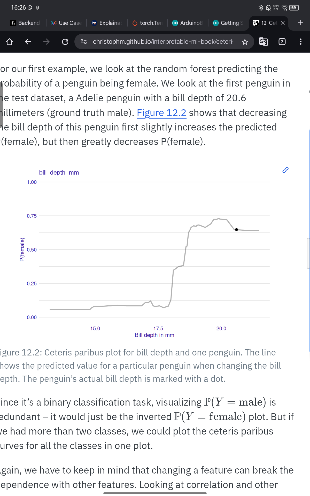

Questo grafico mostra come la predizione cambia, andando a modificare i valori per una certa feature di una istanza del nostro dataset.

Questo modello considera le feature scorrelate fra loro, quindi modificare una feature senza cambiare le altre può portare a combinazioni di valori mai osservate, che possono poco realistiche, e di creare casualità non vere.

Confrontando tutte le caratteristiche affiancate con un asse y condiviso, possiamo vedere quale caratteristica ha maggiore influenza sulla previsione di questo punto dati, anche se la correlazione tra le caratteristiche è un problema.

**Individual Conditional Expectation (ICE)**

Una soluzione migliore è ICE, che si tratta di una variazione di CPP, ma che illustra i cambiamenti per tutte le istanze del dataset, sempre al variare di una unica feature lasciando le altre fisse. Quindi otteniamo tante CPP lines che ci danno una maggiore interpretabilità del modello.

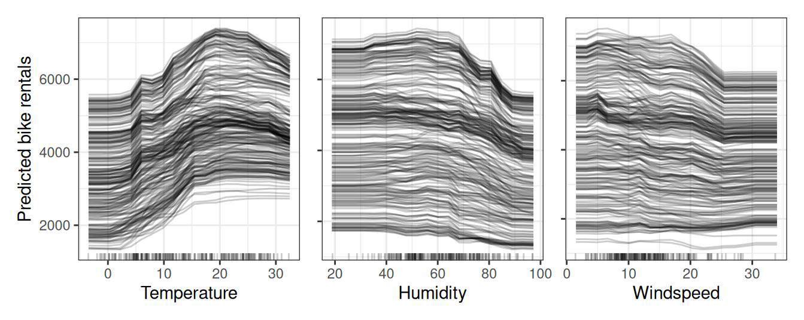Dai plot, si è in grado di vedere se la coerenza di curve al cambiamento (zone più fiite) e le variazioni. Avolte può essere difficile stabilire se le curve ICE differiscono tra i punti dati perché partono da previsioni diverse. Una soluzione semplice è centrare le curve in un certo punto della caratteristica e visualizzare solo la differenza nella previsione fino a quel punto. Il grafico risultante è chiamato grafico **ICE centrato** (**c-ICE**). Ancorare le curve all'estremità inferiore della caratteristica è una buona scelta

Questo tipo di plot ha però gli stessi problemi di CPP

**Local interpretable model-agnostic explanations (LIME)**

LIME è un modello post-hoc che testa cosa succede al modello quando gli diamo variazioni dei dati. LIME genera nuovi dati dati perturbati e vedendo le loro predizioni.

LIME è traina un modello basandosi sulle istanze nell’intorno del punto che stiamo considerando. Quindi creiamo un modello lineare solo per i punti di quella zona. Se lo applichiamo ad un punto fuori dall’intorno non funzionerebbe bene. Questo tipo di accuratezza è anche chiamato **fedeltà locale**.

Questa può essere spiegata matematicamente tramite:

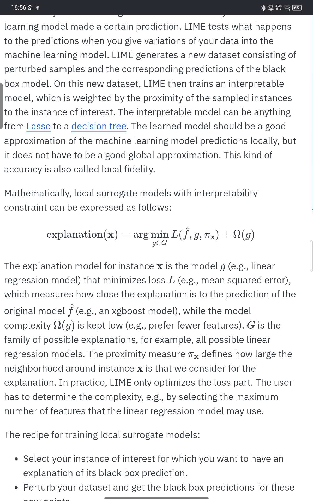

L’explanation per l’istanza x è il modello g che minimizza la loss L che misura quanto vicina è la explaination alla predizione del modello originale f^, mentre la complessità Ω(g) è mantenuta bassa.

indica la grandezza dell’intorno che consideriamo. Sulla base di come definiamo l’intorno possiamo avere diversi risultati.

STEPS

* Seleziona l'istanza di interesse per la quale vuoi avere una spiegazione della sua previsione black box.
* Perturba il tuo dataset e ottieni le previsioni black box per questi nuovi punti.
* Pesa i nuovi campioni in base alla loro vicinanza all'istanza di interesse.
* Addestra un modello ponderato e interpretabile sul dataset con le variazioni.
* Spiega la previsione interpretando il modello locale.

Il modo in cui LIME genera le variazioni dei dati dipende dal tipo di dato.

Nel caso di dati tabulari, LIME crea nuovi campioni perturbando singolarmente ogni caratteristica, partendo da una distribuzione normale con media e deviazione standard ricavate dalla caratteristica. I campioni LIME non vengono prelevati attorno all'istanza di interesse, ma dal centro di massa dei dati di training, il che è problematico. Tuttavia, aumenta la probabilità che il risultato per alcune delle previsioni dei punti campione differisca dal punto dati di interesse e che LIME possa apprendere almeno una spiegazione.

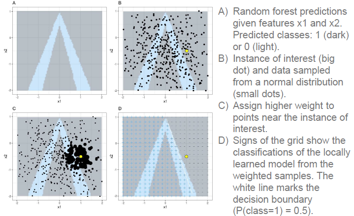

Definire un intorno significativo attorno a un punto è difficile. LIME utilizza un kernel di smoothing esponenziale per definire l'intorno. Un kernel di smoothing è una funzione che accetta due istanze di dati e restituisce una misura di prossimità. La larghezza del kernel determina la grandezza dell'intorno:

* una larghezza del kernel ridotta significa che un'istanza deve essere molto vicina per influenzare il modello locale;
* una larghezza del kernel maggiore significa che anche le istanze più lontane influenzano il modello.

La spiegazione locale generata da LIME può **cambiare drasticamente** al variare della larghezza del kernel. In spazi ad alta dimensionalità, quasi tutti i punti sono “lontani” tra loro (fenomeno della **maledizione della dimensionalità**), quindi definire un intorno significativo diventa particolarmente complicato.

**Counterfactual Explanations**

Le **counterfactual explanations** sono un approccio di **interpretable AI** che a parità di condizioni cerca di spiegare cosa sarebbe cambiato se questa istanza avesse avuto valori differenti di alcune feature

Sono chiamate “controfattuali” perché mostrano **cosa sarebbe successo in uno scenario ipotetico**, non quello reale.

Data un’istanza e una predizione , uno scenario controfattuale è una nuova istanza tale che produca un risultato desiderato . La spiegazione controfattuale di una previsione descrive la più piccola modifica ai valori delle caratteristiche che modifica la previsione in un output predefinito.

Quindi, modifichiamo i valori delle caratteristiche di un'istanza prima di effettuare le previsioni e analizziamo come cambia la previsione. Siamo interessati a scenari in cui la previsione cambia in modo rilevante, come un ribaltamento nella classe prevista, o in cui la previsione raggiunge una certa soglia.

I counterfactual model soffrono dell'**effetto Rashomon**. Ogni controfattuale racconta un modo diverse su come si è raggiunto un certo risultato. Possono essere tutti sono validi, ma non c’è una spiegazione unica su come cambiare l’esito. Però possiamo dire che mon tutti i controfattuali sono realistici, semplici o azionabili. Alcuni potrebbero richiedere cambiamenti impossibili o poco pratici. Quindi dobbiamo scegliere quelli più ragionevoli e lo si può fare definendo dei criteri che prevedono che:

* un'istanza controfattuale produca la previsione predefinita il più fedelmente possibile;
* un'istanza controfattuale abbia valori di caratteristica che siano probabili;
* si generino molteplici spiegazioni controfattuali diverse, in modo che il soggetto decisionale abbia accesso a molteplici modi validi per generare un risultato diverso
* un controfattuale dovrebbe essere il più simile possibile all'istanza per quanto riguarda i valori delle caratteristiche.

Wachter, Mittelstadt e Russell propongono di minimizzare la funzione di loss così definita:

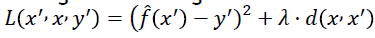

dove:

* f^(x’) è la previsione del modello per il controfattuale x′,
* y’ è l’output desiderato dall’utente
* d(x, x’) è la distanza tra l’istanza originale e il contraffattuale, calcolata tramite la distanza di Manhattan definita:

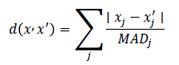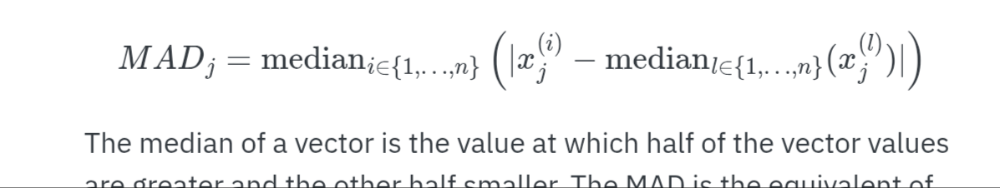

MAD serve a scalare tute le feature per renderle confrontabili. La MAD è l'equivalente della varianza di una feature, ma invece di usare la media come centro e sommare sulle distanze al quadrato, usiamo la mediana come centro e sommiamo sulle distanze assolute.

* è un parametro di bilanciamento tra similarità e accuratezza
  + **piccolo** dà più peso al **termine di previsione;** l'ottimizzazione cerca punti con il **risultato desiderato**, anche se sono **lontani** dall'istanza originale.
  + **grande dà** più peso al **termine di distanza;** L'ottimizzazione preferisce **controfattuali vicini** all'istanza originale, anche se la previsione è **meno accurata**.

La loss misura quanto il risultato previsto del controfattuale è lontano dal risultato predefinito e quanto il controfattuale è lontano dall'istanza di interesse

**STEPS**

1. Selezionare un'istanza x da spiegare, il risultato desiderato y’, una tolleranza e un valore iniziale di , basso in generale.
2. Campionare un'istanza casuale come controfattuale iniziale.
3. Ottimizzare la perdita con il controfattuale campionato inizialmente come punto di partenza.
4. Mentre
   * aumentiamo
   * ottimizziamo la loss con il controfattuale corrente come punto di partenza
   * ritorna il contraffattale che minimizza la loss

Gli step 2 e 4 e si ritorna la lista dei contraffalle o quello che minimizza la loss.

Il metodo prende in considerazione solo il primo e il secondo criterio, non gli ultimi due ("produrre controfattuali con solo poche modifiche alle caratteristiche e valori probabili delle caratteristiche").

𝑑 non preferisce soluzioni sparse, poiché aumentare 10 caratteristiche di 1 fornirà la stessa distanza a 𝑥 di aumentare una caratteristica di 10. Le combinazioni di caratteristiche non realistiche non vengono penalizzate. Il metodo non gestisce bene le caratteristiche categoriali con molti livelli diversi.

**Shapley Values**

Gli shapley values sono un concetto che deriva dalla teoria dei giochi cooperativi. Dato un gioco in cui molti giocatori cooperano per un guadagno complessivo, lo shapley value fornisce un modo equo il guadagno sulla base del loro contributo marginale.

Il "gioco" è il compito di previsione per una singola istanza del set di dati. Il "guadagno" è la previsione effettiva per questa istanza meno la previsione media per tutte le istanze. I "giocatori" sono i valori delle caratteristiche dell'istanza che collaborano per ricevere il guadagno (= prevedere un certo valore).

Lo shapley value è il contributo marginale pesato medio delle feature rispetto a tutte le coalizioni.

Le **coalizioni** sono tutte le possibili combinazioni di feature che possono portare all predizioni. Quindi per ogni coalizione si calcola il contributo della feature e si fa la media fra tutti i contributi delle varie coalizioni.

Stimando i valori di Shapley per tutti i valori delle caratteristiche, otteniamo la distribuzione completa della previsione (meno la media) tra i valori delle caratteristiche.

**Shapley value**: Il valore della j-th feature è il contributo della predizione di quella particolare istanza comparata per la media delle predizioni del dataset.

Nella definizione si parla di distribuzione equa, ma cosa vuol dire distribuire equamente? Sono stati definiti 4 assiomi per esprimere questo problema:

1. **efficienza,**
2. **simmetria,**
3. **linearità**
4. **dummy player**.

Definiamo

* è l’insieme che contiene tutti i giocatori.
* è un sottoinsieme di (ovvero ). Rappresenta un gruppo qualsiasi di partecipanti alla grande coalizione .
* è un elemento di (cioè ).
* è una funzione valore che associa a ciascun sottoinsieme di giocatori un numero reale.

Si noti che rappresenta il valore della grande coalizione.

Quando un giocatore si unisce a un sottoinsieme di giocatori , il **contributo marginale** di rispetto a è definito come la variazione di valore dovuta all’ingresso del giocatore nel gruppo.

*v*(*S*∪{*i*}) −*v*(*S*)

Il contributo marginale misura il valore aggiunto dal giocatore *i* quando si è unito al gruppo di giocatori *S*

Questo contributo marginale può essere nullo, positivo o addirittura negativo.

Il **valore di Shapley** del giocatore , dato l’insieme e la funzione valore , è definito da:

**Efficienza**: tutte le entrate *v(N)* della grande coalizione *N* vengono ridistribuite tra tutti i giocatori (né più, né meno

Il valore di Shapley ϕ misura l'importo che i giocatori riceveranno. Questo assioma di *efficienza*afferma semplicemente che la somma di ciò che ciascun giocatore riceverà deve essere uguale a ciò che la grande coalizione ha prodotto.

**Simmetria** : i giocatori *i* e *j* che contribuiscono in egual misura a tutti i sottoinsiemi della coalizione *S* ricevono la stessa quota.

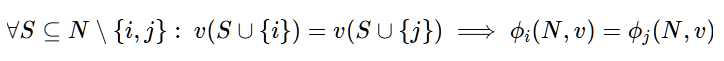

In parole povere, questo assioma significa che se *tu* ed *io* contribuiamo sempre con la stessa somma a tutte le sotto-coalizioni, allora *tu* ed *io* dovremmo ricevere la stessa somma.

**Linearità** : siano *(N, v* ₁ *)* e *(N, v* ₂ *)* due giochi di coalizione; i valori dei giochi possono essere combinati in modo additivo.

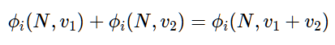

Questa regola viene utilizzata per definire come distribuire i payoff di un gioco costruito combinando due giochi in modo lineare. Supponiamo di avere due giochi con gli stessi giocatori *N* ma con funzioni valore diverse *v* ₁ e *v* ₂. Supponiamo di definire un nuovo gioco cooperativo per il quale la funzione valore non è altro che la somma di queste due funzioni valore *v* ₁ + *v* ₂ *.* Questo assioma afferma che il valore di Shapley del nostro nuovo gioco può essere calcolato semplicemente sommando il valore di Shapley di ciascun gioco.

**Giocatore fittizio** : Chi non contribuisce non riceve nulla.

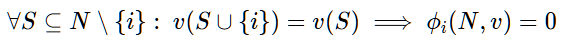

Quest'ultimo assioma è di per sé piuttosto semplice da comprendere. Sebbene possa sollevare legittimi interrogativi etici quando viene utilizzato in ambiti come l'economia (si è lavorato molto su come modificarlo), in ambiti come l'apprendimento automatico, quest'ultimo assioma non pone tali problemi quando si cerca, ad esempio, di misurare il contributo delle variabili alle previsioni di un modello.

***Si può dimostrare che, per un gioco di coalizione (N, v), il valore di Shapley è l'unica divisione del payoff che divide il payoff totale v(N) della grande coalizione N e che soddisfa gli assiomi di Simmetria, Linearità e Giocatore fittizio.***

Dato un insieme di giocatori *N* e una funzione valore *v* , il valore Shapley del giocatore *i* è dato da:

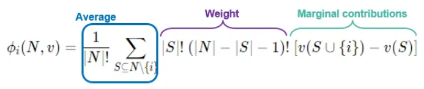

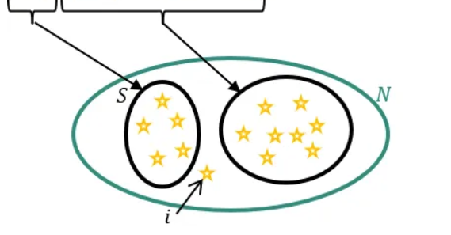

per un sottoinsieme *S* , il peso è il *prodotto* del numero di permutazioni di *S* e del numero di permutazioni del complemento di *S* e *i* (cioè; N\{S∪{i}}

Sebbene l'equazione precedente sia una definizione comune del valore di Shapley, che è la soluzione ai 4 assiomi di equità, spesso troviamo un'altra formulazione equivalente che ha il vantaggio di essere più facile da calcolare.

Per introdurre la notazione, supponiamo di essere in una partita con quattro giocatori: N={P1, P2, P3, P4}.

* Sia σ l'insieme con tutte le permutazioni di N. Ad esempio, se | *N* |=4, allora l'insieme σ={(P1, P2, P3, P4), (P1, P2, P4, P3), (P1, P4, P2, P3), (P4, P1, P2, P3), (P4, P1, P3, P2), …, (P4, P3, P2, P1)} contiene le 4!=24 permutazioni di *N.*
* Sia *Q(σ* ⱼ *, i)* la coalizione dei *predecessori* del giocatore *i* in *σ* ⱼ dove *σ* ⱼ è un elemento di *σ.* Ad esempio, se *σ* ⱼ *=* (P1, P4, P2, P3) e *i =* P2, allora *Q(σ* ⱼ *, i) = {* P1, P4 *}.*

Con questa nuova natazione, il valore di Shapley per il giocatore *i* è definito come la media del suo contributo marginale su tutte le permutazioni in σ:

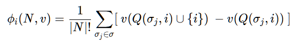

Dove in questa equazione, *σ* ⱼ si estende su tutte le | *N* |! permutazioni dei giocatori nell'insieme *N* e *Q(σ* ⱼ *, i) è* l'insieme dei giocatori predecessori di *i* in *σ* ⱼ.

Di seguito forniremo due esempi che mostrano come utilizzare questo metodo per calcolare il valore di Shapley.

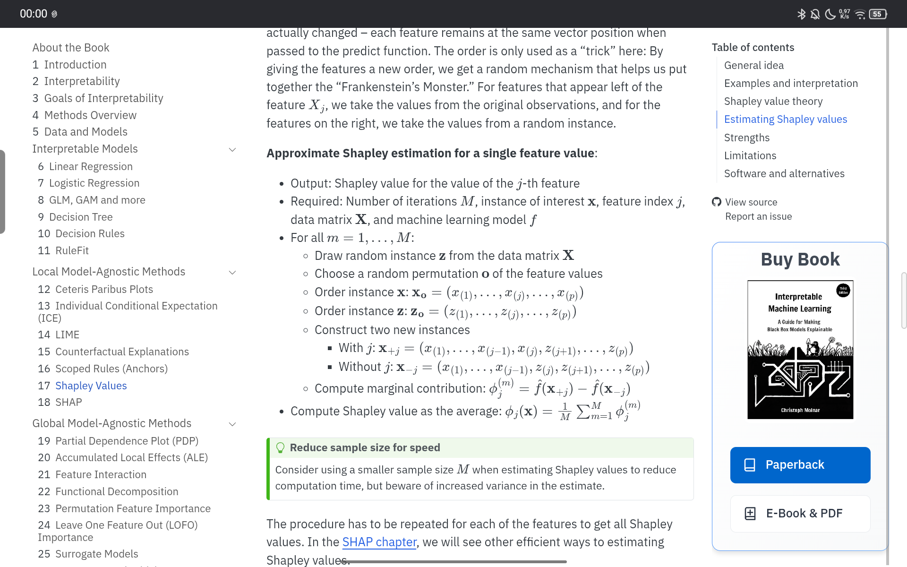

**Global Model-Agnostic Methods**

**Partial Dependence Plot (PDP)**

Il **partial dependence plot** (PDP o PD) mostra l'effetto marginale che una o due caratteristiche hanno sul risultato previsto di un modello di apprendimento automatico. Un grafico a dipendenza parziale può mostrare se la relazione tra il target e una caratteristica è lineare, monotona o più complessa.

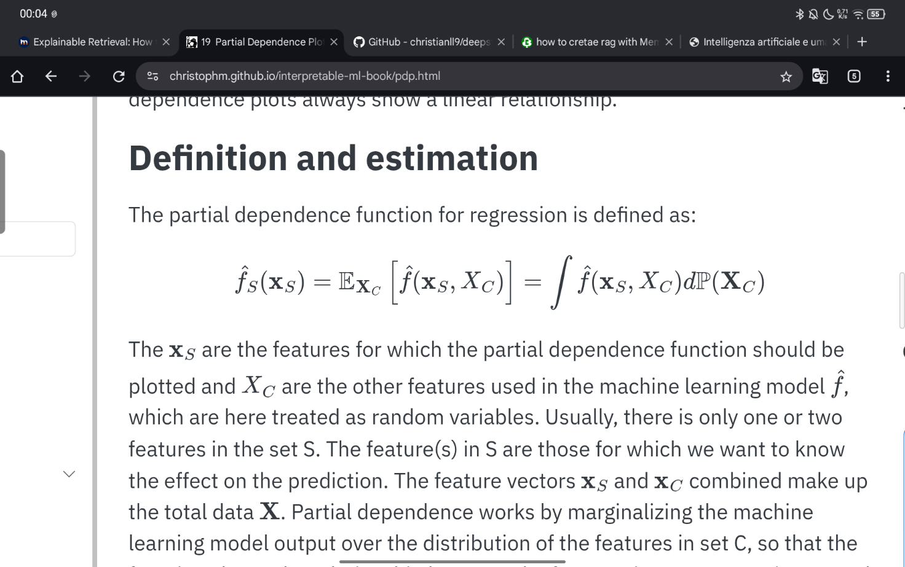

* sono le feature per cui plottare il PDP
* le altre usate dal modello

Il PDP funziona calcolando la probabilità marginale rispetto alla distribuzione delle feature in C.

La funzione può anche essere stimata con il metodo di Monte Carlo:

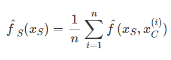

Che è l’equivalente di aggregare tutte le curve delle ICE plot

La funzione parziale ci dice per un dato valore (o i valore) delle caratteristiche S qual è l'effetto marginale medio sulla previsione. Si assume che le caratteristiche in C non siano correlate con quelle in S.

Se questa assunzione viene violata, le medie calcolate per il grafico PDP includono dati molto improbabili o impossibili.

Per la classificazione in cui il modello fornisce probabilità, il grafico di dipendenza parziale mostra la probabilità per una certa classe dati valori diversi per una o le caratteristiche in S.

Per le caratteristiche categoriche, la dipendenza parziale è molto facile da calcolare. Per ciascuna delle categorie, otteniamo una stima PDP forzando tutte le istanze di dati ad avere la stessa categoria.

**Permutation Feature Importance**

La **Permutation Feature Importance** (**PFI**) misura l'aumento dell'errore di previsione del modello dopo aver permutato i valori della caratteristica, interrompendo la relazione tra la caratteristica e il risultato reale.

Una caratteristica è "importante" se lo shuffling dei suoi valori aumenta l'errore del modello, perché in questo caso il modello si è basato su tale caratteristica per la previsione. Una caratteristica è "irrilevante" se lo shuffling dei suoi valori non modifica l'errore del modello, perché in questo caso il modello ha ignorato tale caratteristica per la previsione.

Fisher, Rudin e Dominici hanno proposto una versione della PFI indipendente dal modello, chiamata **model reliance**.

I tre suggeriscono di splittare il dataset a metà e swappare i valori delle feature j-iesima delle due metà invece di permutare la caratteristica j. e si desidera una stima più accurata, è possibile stimare l'errore di permutazione della caratteristica j associando ogni istanza al valore della caratteristica j di ogni altra istanza (tranne che con se stessa).

Stimare il PFI su dati non utilizzati per l'addestramento del modello per evitare risultati eccessivamente ottimistici, soprattutto con modelli di overfitting. Il PFI sui dati di addestramento può erroneamente evidenziare caratteristiche irrilevanti come importanti a causa dell'overfitting del modello.

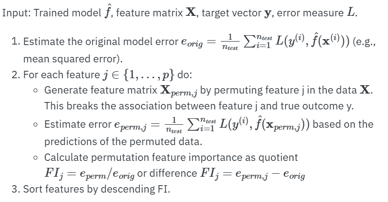

Essendo che ci sono caratteristiche che fra loro sono dipendenti, lo shuffling può produrre punti irrealisti o improbabili che poi verranno usati per il calcolo della PFI. La versione marginale ignora queste dipendenze => versione condizionale che campiona dalla distribuzione ) invece che da quella marginale. In questo modo abbiamo punti più reali.

L'importanza delle caratteristiche condizionali ha un'interpretazione diversa dal PFI marginale:

* Il PFI misura l'aumento della perdita dovuto alla perdita delle informazioni sulle caratteristiche.
* L'importanza condizionale misura l'aumento della perdita dovuto alla perdita di informazioni esclusive di quella caratteristica, informazioni non codificate in altre caratteristiche.

**Leave-One-Covariate-Out (LOCO)**

Il LOCO, è simile alla PFI, ma i valori inziali della feature j vengono sostituiti alla media, mediana o zero aggirando il riaddestramento del modello base F. L’errore di previsione del modello Fj riaddestrato su j viene confrontato con l’errore di predizione del modello F, rimuovendo una variabile per volta e ri-addestrando il modello per osservare quanto peggiorano le prestazioni. Misura quanto ogni singola variabile contribuisce alla performance del modello.

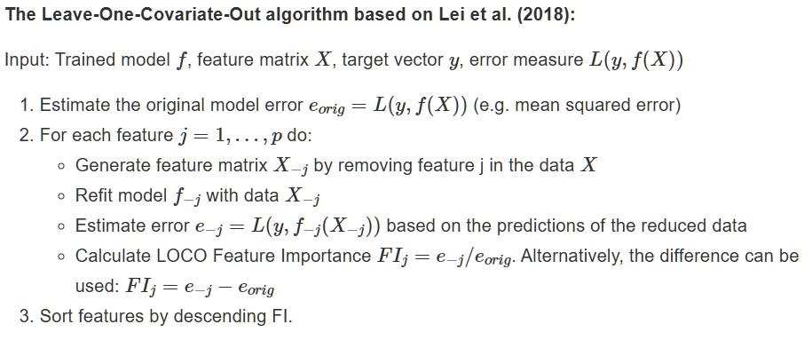

# **FAIRNESS**

Il modello apprendendo dai dati che gli forniamo può essere accurato in senso matematico, ma ingiusto nel senso sociale. Il motivo di questa **unfairness** dipende dai dati di cui siamo a disposizione e che vengono usati per trainare il modello e che lo portano a penalizzare certe categorie meno rappresentate.

Questo è un problema perché il modello trovando questi pattern discriminatori rafforza queste idee; quindi, è necessario intervenire per correggere la previsione dei modelli. CI sono tre tipi di bias in cui il modello può incorrere:

* **preesistenti**, quelli presenti nella società non è colpa del modello, ma dai dati. Una idea per risolverli può essere quella di rimuovere i dati pericolosi, ma sarebbe sbagliato per vari motivi: può essere correlata ad altre colonne che poi fungeranno da proxy per fare altre assunzioni discriminatorie. Una soluzione può essere fare augmentation.
* **tecnici**, che dipende dalle decisioni che facciamo quando prepariamo il modello per l’addestramento. Facciamo assunzioni sbagliate, non comprendiamo bene o dati e li manipoliamo in modo sbagliato, realtà poco o per nulla modellate ecc…
* **emergenti**, derivanti da distorsioni che nei dati non sono stati notati e che emergono quando li usano per addestrare il modello

**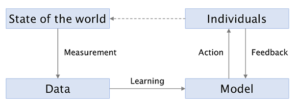**

I modelli di ML non sono delle pipeline neutre, il problema nasce già quando effettuiamo una misurazione del mondo che osserviamo perché aggiungiamo soggettività che vanno ad inficiare le decisioni del modello visto che si allena su quei dati che sono contaminati da nostre assunzioni e incomprensioni.

**Attributi protetti**: attributi che suddividono una popolazione in gruppi i cui risultati dovrebbero essere omogenei. Esempi includono razza, genere, casta e religione. Gli attributi protetti non sono universali, ma specifici per ogni applicazione.

**Gruppo privilegiato**: valore di un attributo protetto che indica un gruppo che storicamente ha goduto di un vantaggio sistematico. Può essere difficile accertare quali individui protetti appartengano a ciascun gruppo.

**Etichetta favorevole**: un'etichetta il cui valore corrisponde a un risultato che offre un vantaggio al destinatario. L'opposto è un'etichetta sfavorevole.

I modelli non rivelano “la verità”: trovano pattern nella rappresentazione che hai costruito tu, con tutti i limiti e le distorsioni del caso.

Quando il modello agisce, non si limita a riflettere il mondo: lo modifica. E poiché gli umani reagiscono alle decisioni dei modelli, queste azioni creano nuovi dati che alterano il processo di apprendimento successivo

Le risposte delle persone alle azioni modificano il mondo e, di conseguenza, i dati futuri. A volte questo feedback è esplicito, a volte è implicito o conflittuale.

La **fairness** in un sistema di machine learning è la proprietà per cui le decisioni prodotte dal modello non risultano sistematicamente svantaggiose per individui o gruppi, a parità di condizioni rilevanti, e non riproducono o amplificano distorsioni ingiustificate presenti nei dati o generate dal sistema stesso. Fairness non significa che il modello ignora le differenze tra gruppi, ma che **non basa le sue decisioni su differenze che non hanno legittima giustificazione**.

**Misurazione della fairness**

Per quanto riguarda la classificazione voglio definire per un target ignoto una etichetta partendo dai covariati. Sappiamo che modellare la classificazione solo con l’accuratezza è sbagliato… ma quello che vorremmo è che

l(0, 1) = l(1, 0) = 1 TP=TN

l(1, 1) = l(0, 0) = 0. FN=FP

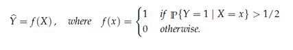

(L’1/2 dipende dalla definizione della loss, può essere diveso)

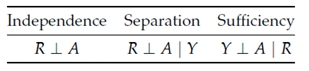

dove:

* R è la soglia
* A la variabile protetta
* Y valore reale

Con l’**indipendenza** si cerca di valutare che A sia indipendente da R, allora qualsiasi classificatore Ŷ = 1{R > t} soddisfa l'indipendenza fintanto che la soglia è indipendente dall'appartenenza al gruppo.

Questo significa che

cioè la previsione deve essere la stessa indipendentemente dal valore della classe dell’attributo sensibili. Questa condizione è detta anche **disparity impact** o **demografic parity**. Il problema è che sembra che stesso tasso di successo tra gruppi li tratti allo stesso modo, ma può **nascondere differenze nella qualità delle decisioni** e portare a svantaggi sistematici per alcuni gruppi. È un esempio di come criteri matematici di fairness possano sembrare giusti “in media”, ma produrre effetti ingiusti nella realtà.

La **separation** è definita come l’indipendenza di R da A ma anche da Y. Il motivo di ciò è che la variabile target fornisce un modo naturale di suddividere la popolazione in strati.

Un particolare gruppo demografico (𝐴 = 𝑎) può essere sovrarappresentato o sottorappresentato in questi strati definiti da 𝑌. Un decisore potrebbe quindi sostenere che è giustificato accettare più o meno individui da un dato gruppo 𝑎, a seconda della loro rappresentanza in questi strati.

Formalmente significa:

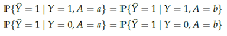

**Equalized odds**

Per tutti i gruppi, stessa TPR e FPR

Di conseguenza dobbiamo **egualizzare l’error rate fra i gruppi**, l'uguaglianza dei tassi di errore può portare a un predittore che è complessivamente meno accurato e che ha prestazioni peggiori per alcuni gruppi di quanto potrebbe altrimenti.

La **sufficienza** (mai usata) stabilisce che La classe che devo predire deve essere indipendente dall’attributo sensibile, dato il modello di predizione. n altre parole: se conosci , non hai bisogno di conoscere il gruppo per stimare . Formalmente:

Garantisce che il modello **tratta equamente l’informazione tra gruppi**, perché la probabilità di successo effettivo dato il punteggio predetto è la stessa per tutti i gruppi.

**Bias Mitigation**

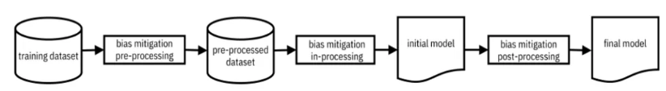

Gli **algoritmi di pre-elaborazione** comportano la modifica del set di dati prima dell'addestramento del modello per rimuovere o ridurre il bias presente nei dati. Gli algoritmi di pre-elaborazione sono utili quando il bias nei dati è noto o può essere facilmente identificato. Il principale vantaggio della pre-elaborazione è che è indipendente dal modello, permettendo flessibilità nella scelta dei classificatori in base ai requisiti applicativi.

Gli **algoritmi di elaborazione interna** mirano a ridurre il bias durante il processo di addestramento del modello. Gli algoritmi di elaborazione interna sono utili quando il bias nei dati non è facilmente identificabile o quando il set di dati è troppo grande per essere pre-elaborato. Le tecniche di in-processing sono specifiche per modello e richiedono la ri-implementazione degli algoritmi di apprendimento includendo i vincoli di equità.

Gli **algoritmi di post-elaborazione** prevedono la modifica dell'output del modello dopo che è stato addestrato. Gli algoritmi di post-elaborazione sono utili quando il modello è già stato addestrato e la distorsione nelle previsioni viene identificata dopo l’implementazione. Il loro vantaggio è che non richiedono riaddestramento dei classificatori.

# **FREQUENT ITEMSET ANALYSIS AND ASSOCIATION RULE MINING**

Le **regole associative** sono utilizzate per **identificare associazioni interessanti e ricorrenti tra gruppi di record** in un set di dati di grandi dimensioni. Sono una tecnica per **scoprire relazioni tra variabili in grandi database**. L'obiettivo è identificare modelli e ricorrenze regolari all'interno di un ampio set di transazioni.

Una regola è un'implicazione del tipo Y ⇒ Z, con il significato "se Y è vero, allora Z è anche vero".

Le regole associative sono spesso rappresentate nella forma **X −→ Y**.

**X** è chiamato **antecedente** (**body**) della regola. Contiene una congiunzione di condizioni di test sugli attributi.

**Y** è chiamato **conseguente** (**head**) della regola. Contiene l'etichetta di classe prevista o, nel contesto delle associazioni di itemset, l'itemset associato.

X e Y sono **itemset** e devono essere **disgiunti (X ∩ Y = ∅)**. Un itemset è un sottoinsieme di un insieme di oggetti I = {i1, i2, ..., in}.

Una **transazione** **T** rappresenta un itemset generico registrato in un database in congiunzione con un'attività o un ciclo di attività.

Le regole associative vengono valutate in base a due misure principali: **supporto** e **confidenza**.

Il **Supporto (s)** determina **quanto spesso una regola è applicabile** a un dato set di dati. Indica la frequenza con cui l'itemset formato dall'unione di antecedente e conseguente appare nelle transazioni. Formalmente, per una regola L ⇒ H (o X −→ Y), il supporto è

dove

* **f** è la frequenza, anche detta **support count** **σ**,
  X è frequente se supera una certa soglia detta, **minsup**.
* **m** è il numero totale di transazioni (**N**).

Il supporto si riferisce all'itemset piuttosto che alla regola.

La **Confidenza (c)** determina **con quale frequenza gli item nel conseguente (Y) appaiono nelle transazioni che contengono l'antecedente (X)**. Misura l'affidabilità dell'inferenza fatta da una regola. Indica la proporzione di transazioni che contengono il set H tra quelle che includono il set L.

La confidenza approssima la probabilità condizionata Pr {H ⊆ T | L ⊆ T}. Formalmente, la confidenza è

Le regole con un supporto s ≥ smin e una confidenza p ≥ pmin (dove smin e pmin sono valori soglia minimi prefissati) sono considerate **regole forti**.

Quando si estraggono itemset frequenti (es. {pane, burro}) e si generano regole associative (es. {pane} → {burro}), si ottengono moltissime regole. Ma non tutte sono significative: alcune possono sembrare forti solo perché gli oggetti sono frequenti di per sé.

Allora per considerare le regole più importanti calcoliamo l’**interesse** (**lift**) una misura della significatività di una regola associativa. È definita come:

## **4.1 Processo di Mining**

Il principale problema del mining delle regole, non è individuarle, ma mantenere in memoria tutti gli items frequenti trovati con il loro relativo contatore di supporto. Infatti, durante le fasi di esplorazione dello spazio delle combinazioni di item, il numero potenziale di *itemset* cresce in maniera esponenziale rispetto al numero totale di attributi presenti nel dataset.

Il mining delle regole avviene in due fasi principali:

* **Generazione di itemset frequenti** Trovare tutti gli itemset che soddisfano la soglia di supporto minimo (minsup). Questa fase è computazionalmente più onerosa.
* **Generazione di regole:** Estrarre tutte le regole ad alta confidenza dagli itemset frequenti trovati nella fase precedente. Queste regole sono chiamate regole forti. Il calcolo della confidenza per queste regole non richiede ulteriori scansioni del set di dati se i conteggi di supporto sono già noti.

Per l’identificazione degli itemset frequenti, l’approccio più semplice sarebbe quelle **brute force** che però ci impiegherebbe troppo tempo per scorrere tutte le possibili combinazioni che su un insieme I di k elementi corrisponderebbe ad avere 2K-1 frequent itemset. Un approccio brute-force per trovare itemset frequenti consiste nel determinare il conteggio del supporto per ogni **itemset candidato** confrontando ogni candidato con ogni transazione. Se il candidato è contenuto in una transazione, il suo conteggio del supporto verrà incrementato. Ad esempio, il supporto per {Pane, Latte} viene incrementato tre volte perché l'itemset è contenuto nelle transazioni 1, 4 e 5. Un tale approccio può essere molto costoso perché richiede confronti O(NMw), dove N è il numero di transazioni, M = 2k −1 è il numero di itemset candidati e w è la larghezza massima della transazione. La larghezza della transazione è il numero di elementi presenti in una transazione.

Un modo per ridurre la complessità dell’algoritmo è quello di applicare il **principio della monotonicità** che stabilisce che, se un insieme di items è frequente allora lo saranno anche i sottoinsiemi. DI conseguenza possiamo dire che, se non sono frequenti degli item, anche i loro sottoinsiemi non lo sono

Supponiamo di avere un insieme di **n item** possibili, numerati da 1 a . Vogliamo contare per ogni coppia (con ) quante transazioni la contengono.

#### **Triangular Matrix**

Si usa un array monodimensionale che codifica **tutte le coppie** possibili , con . L’idea è di ordinare le coppie in ordine lessicografico: .

Si definisce una funzione di hash che data la coppia calcola l’indice nell’array monodimensionale:

In pratica: si salta tutto quello che sta “prima” di nell’ordinamento lexicografico. Ogni posizione del vettore tiene un intero (contatore) per la coppia. Anche se la coppia non appare in nessuna transazione, tenerne il contatore = 0. Spazio richiesto: contatori. Se ogni contatore è un intero (es. 4 byte), serve memoria pari a ~ dimensione contatore.

#### **Metodo Triples**

Si memorizzano solo le coppie che **effettivamente compaiono almeno una volta** (cioè, con contatore > 0), evitando di allocare spazio per coppie che non esistono in nessuna transazione. Si usa una struttura di dati che contiene per ogni coppia apparente una tripletta , dove è il contatore della coppia .

#### **APRIORI ALGORITHM**

Il suo obiettivo principale è identificare i sottoinsiemi di elementi (itemset) che sono frequenti nel database e, successivamente, generare regole da questi itemset frequenti. Questo algoritmo funziona solo sulla carta, perché nella realtà ci mette molto tempo a convergere.

L'algoritmo Apriori opera in due fasi principali:

**FASE1-Generazione di itemset** **frequenti**

In questa fase, l'algoritmo trova tutti gli itemset che soddisfano una soglia minima di supporto definita dall'utente. Utilizza un approccio **bottom-up** e **level-wise** per generare gli itemset frequenti.

Inizia trovando tutti gli item singoli (1-itemset) che soddisfano il supporto minimo, per poi estendere iterativamente questi itemset per trovare itemset di dimensioni maggiori (k-itemset) basandosi sugli itemset frequenti di dimensione k-1 trovati nel passo precedente. Questo processo continua finché non vengono trovati ulteriori itemset frequenti

L'efficacia dell'algoritmo Apriori si basa sul **principio di monotonicità**.

Sulla base di questo se un sottoinsieme di dimensione k-1 di un k-itemset candidato non è presente nell'insieme degli (k-1) itemset frequenti (Fk-1), allora il k-itemset candidato viene scartato.

Viene eseguita una nuova scansione del dataset per contare il supporto di ciascun k-itemset candidato rimasto in Ck. Per velocizzare questo processo, possono essere utilizzate strutture dati come gli hash tree per raggruppare i candidati e confrontarli efficientemente con le transazioni.

I k-itemset candidati il cui supporto è maggiore o uguale alla soglia minima di supporto vengono aggiunti all'insieme dei k-itemset frequenti (Fk).

Il processo si ripete (tornando al passo 2) incrementando k finché non vengono più generati k-itemset frequenti (Fk è vuoto).

**FASE2-Generazione di regole forti**

Una volta identificati gli itemset frequenti, l'algoritmo genera regole associative da questi itemset. Queste regole sono valutate in base a misure come la confidenza

Se la confidenza della regola supera la **soglia minima di confidenza** predefinita, la regola viene considerata una **regola forte** e viene inclusa nell'insieme delle regole associative scoperte.

**Potatura basata sulla confidenza**: se una regola ha una bassa confidenza, tutte le regole generate da essa che hanno lo stesso antecedente ma un conseguente più ampio avranno una confidenza non superiore.

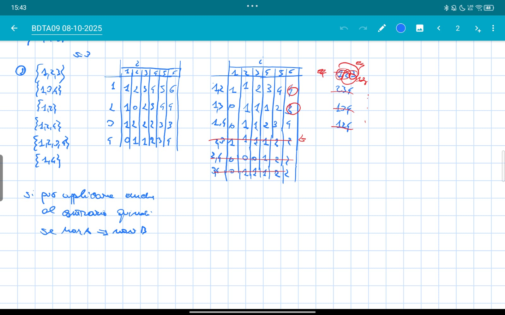

IL problema dell’algoritmo a priori è la quantità di memoria di cui ha bisogno per memorizzare i singoli elementi e le coppie

#### **PCY (Park, Chen, and Yu) ALGORITHM**

Questi tre tizi notarono che nella prima parte dell’algoritmo c’era spazio inutilizzato che poteva essere riutilizzato. Il loro approccio consiste nel prima passo di calcolare le coppie, ma di non memorizzarle, ma di calcolare l’hash tramite una funzione di hash e memorizzare questo. Il contatore, in questo modo, viene incrementato sulla base degli hash calcolati.

PCY riepiloga la tabella hash come bitmap, con un bit per bucket.

Bit = 1 →bucket è frequente; Bit = 0 →bucket è poco frequente

Alla regola della monotonicità, non si considerano frequenti anche gli hash che non superano una certa soglia di supporto. Però non possiamo dire che, se l’hash non è frequente anche i singoli lo sono.

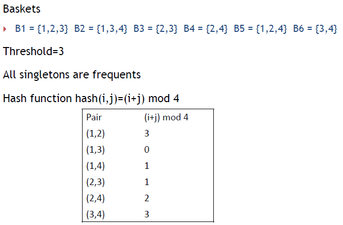 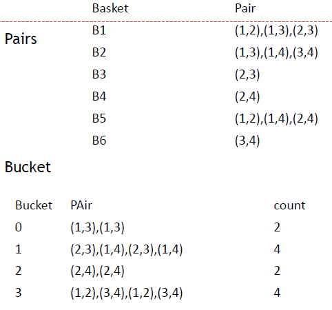

#### **LIMITED-PASS ALGORTIHM**

Non sempre siamo interessati a tutti i frequent items, infatti questo algoritmo si basa su delle approssimazioni per trovarle. Obv non è preciso, infatti può non trovare tutti quelli che sono presenti. SI tratta di una ottimizzazione dell’Apriori, infatti si svolge sono i due fasi:

Viene definito un sottoinsieme del dataset su cui trovare i frequent items e si rapporta anche il support alla dimensione del subset. Gli elementi che appartengo a questo subset vengono assunti come frequent items di tutto il dataset.

Questo però può generare falsi positivi e falsi negativi.

I falsi positivi possono essere rimossi andando a contare la frequenza di questi nell’intero dataset e se non superano il support possono essere eliminati. Mentre i falsi negativi non si possono conoscere a priori; una soluzione potrebbe essere di andare a prendere un secondo subset e veder se l’intersezione con il primo genera degli elementi….; oppure possiamo ridurre la soglia ma aumenterebbe i falsi positivi che possono essere semplicemente individuati.

#### **SON (Savasere, Omiecinski, and Navathe) ALGORITHM**

L’idea di questi tizi e quella di dividere tutto il dataset in subset di uguale dimensione e di scalare il support sulla base di esso. Come l’algoritmo di prima, ma i diversi subset verranno elaborati da diversi computer. Abbiamo quindi k insiemi di possibili frequent items.

Possiamo considerare frequente un elemento solo se risulta frequente in tutti i subset, perché la somma dei supporti dei vari subset deve essere maggiore o uguale al supporto dell’intero dataset.

Abbiamo fatto un passaggio attraverso i dati mentre leggevamo ogni pezzo e lo elaboravamo. In un secondo passaggio, contiamo tutti i set di elementi candidati e selezioniamo quelli che hanno supporto almeno s come set di elementi frequenti

#### **Toivonen’s Algorithm**

Questo cerca di evitare le passate multiple come avviene nell’Apriori cercando di fare una passata su un campione ridotto e un passaggio completo sui dati. Non sempre produrrà un risultato, ma basterà cambiare il subset e ripetere l’algoritmo.

1. Si estrae senza sostituzione un campione casuale del database completo . Il campione ha dimensione piccole
2. .Su , con una soglia “abbassata” rispetto a quella vera (minsupp), e troviamo l’insieme degli itemset che risultano frequenti in con la soglia ridotta.
   Il **negative border** del campione sono quegli itemset che non sono frequenti nel campione, ma tutte le loro immediate sottostringhe (subset di un elemento in meno) sì sono frequent items nel campione.
   Questa struttura serve per garantire la correttezza. Se ci fosse qualche itemset frequente nel database completo che non appare nel campione, allora c’è un elemento nel negative border che sarà frequente nel dataset completo. (Teorema di copertura)
3. Si crea la collezione di candidati da verificare su :
   Si esegue una scansione del database completo , contando il supporto per tutti gli itemset in .

* Se nessun elemento del **negative border** risulta frequent nel dataset completo (cioè nessun ha supporto ≥ minsupp in ), allora **l’insieme filtrata secondo il supporto reale** è esattamente l’insieme dei frequent itemsets di .
* Se invece qualche elemento del **negative border** risulta frequent in , significa che abbiamo “perso” un itemset che era frequente in ma non in . In questo caso l’algoritmo fallisce e dobbiamo **ripetere** con un campione diverso.

1. Facciamo un passaggio attraverso l'intero set di dati, contando tutti i set di elementi che sono frequenti nel campione o che si trovano nel bordo negativo. Possiamo avere due possibili risultati:
   1. Nessun membro del bordo negativo è frequente nell'intero set di dati In questo caso, l'insieme corretto di set di elementi frequenti è esattamente quei set di elementi del campione che sono risultati frequenti nell'intero
   2. Non possiamo essere sicuri che non ci siano alcuni insiemi ancora più grandi, né nel bordo negativo né nella raccolta di insiemi di elementi frequenti per il campione che sono anche frequenti nell'intero. Non possiamo dare alcuna risposta in questo momento e dobbiamo ripetere l'algoritmo con un nuovo campione casuale

# **Finding Similar Items**

Una prima misura di similarità è quella di Jaccard. La similarità di Jaccard su un insieme S e T è definita come |S ∩ T |/|S ∪ T |, cioè, il rapporto tra la dimensione dell'intersezione di S e T e la dimensione della loro unione.

Questa misura può essere applicata in molte applicazioni, una di queste è la similarità fra i documenti.

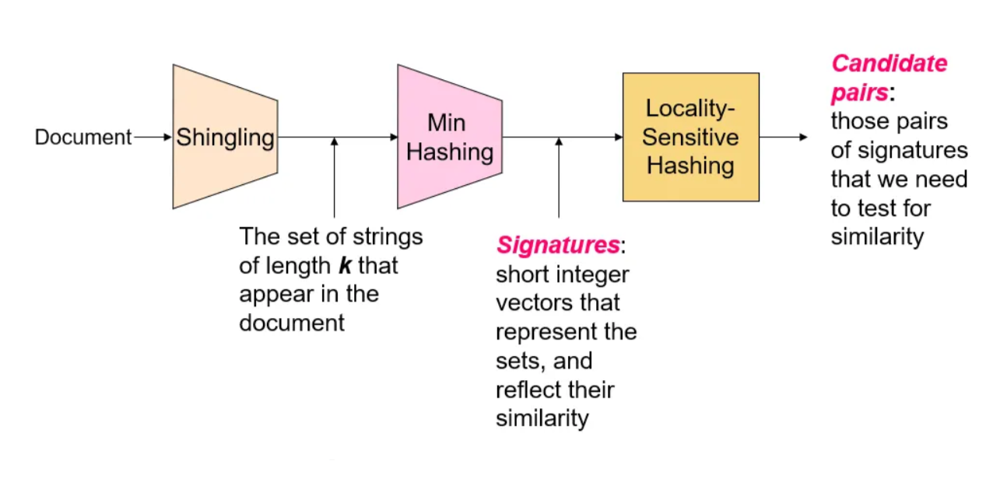

## **5.1 Shingling**

La prima cosa da fare è rappresentare in qualche modo l’insieme di parole (docs) per individuare costrutti simili ecc…

Una delle prime tecniche usate era quella del Bag Of Word (BoW) in cui ogni documento del nostro corpus viene rappresentato contando quante volte ogni parola appare in esso. Oppure si può indicare per ogni documento la presenza o assenza di quella parola tramite un valore booleano.

Il problema oltre che nel dovere gestire una matrice sparsa è che non viene mantenuta la sequenzialità delle parole che per un testo è una caratteristica importante.

Una soluzione è quella dello **shingling** (**n-gram IR**). Invece delle parole rappresentiamo i documenti come una sequenza di k caratteri, considerando tutte le possibili combinazioni che si possono avere. Ovviamente questo può generare parole senza senso. L’importante è quindi scegliere la dimensione k perché, ad esempio, se fosse k=1 (=tutte le lettere dell’alfabeto) tutti i documenti sarebbero simili; mentre un k>>grande genererebbe una matrice troppo grande. In generale il numero k=5, ma obd diepnde da situazione a situazione e possiamo fine-tunarlo.

## **5.2 Hashing Shingles**

Anche con un k adeguato le operazioni da svolgere possono essere troppe e quindi ci impiegheremmo troppo tempo per eseguirle. Una soluzione è quella di comprimere la matrice, questa è detta **signature**, ma la compressione deve mantenere la similarità. Questo significa che andando a calcolare la similarità fra documenti della matrice compressa questa deve essere uguale alla similarità fra i documenti della matrice originale.

Una soluzione potrebbe essere quella di applicare la classica funzione di hashing, ma questa non conserva la similarità durante la trasformazione.

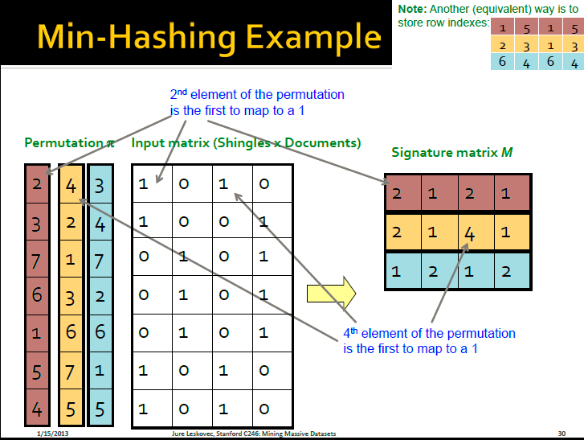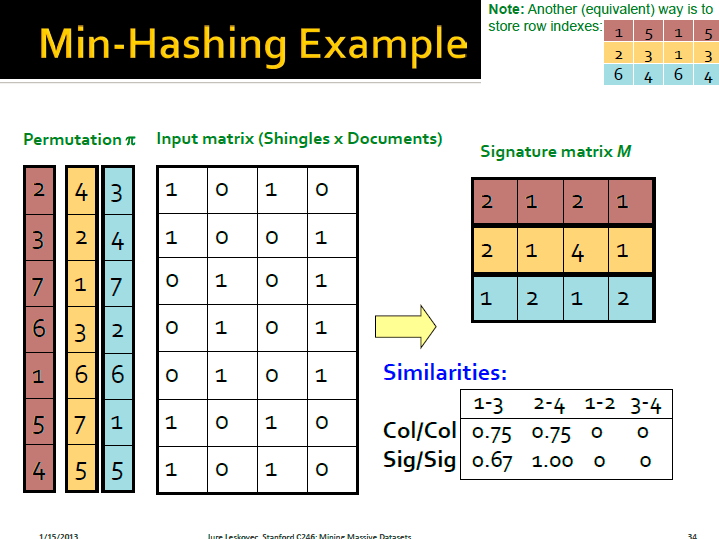

Una soluzione migliore è quella

1. di applicare un certo numero N di permutazione con cui andiamo a cambiare la posizione delle righe stabilendo un ordine a cazzum.
2. ricostruiamo la matrice con il nuovo ordine
3. e creiamo una terza matrice, dove andiamo a mettere l’indice del primo 1 che troviamo. Per ogni permutazione che i fa si crea una nuova riga
4. dopodiché si può calcolare la similarità, e si nota che questa è vicina a quella della matrice originale. Obv più azioni di permutazione facciamo e più ci avviciniamo alla similarità della matrice originale.

Si può dimostrare che la:

Pr[h(D1) -h(D2)] ==sim\_jaccard(D1, D2)

Essendo che la matrice è sparsa perché ci sono elementi che non hanno niente in comune, possiamo dire che

sim\_jaccard= ==

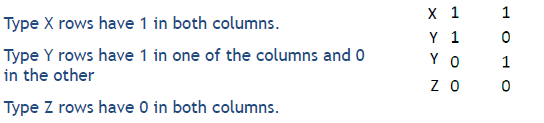

Consideriamo la probabilità h(D1) = h(D2). Data una permutazione random delle righe e procedendo dall’alto, la probabilità di incontrare una riga di tipo X prima di Y è . Se la prima riga è X, allora sicuramente h(D1) = h(D2).; se la prima è Y l'insieme con un 1 ottiene quella riga come valore minhash, mentre l'insieme con uno 0 in quella riga ottiene sicuramente una riga più in basso nell'elenco permutato. Quindi, sappiamo che h(S1) ≠ h(S2) se incontriamo per la prima volta una riga di tipo Y.

La probabilità che h(S1) = h(S2) è pari alla probabilità che la prima riga

utile sia di tipo X:

Pr[h(S1) = h(S2)] =x/(x + y) = SIM(S1, S2)

Quindi la probabilità che due insiemi abbiano lo stesso valore di Minhash è esattamente uguale alla loro similarità di Jaccard.

Un altro modo per poter calcolare la Minhash signature in maniera più efficace è quella di definire una **funzione di hash universale** che mappa i documenti in N bucket. Risulta essere più efficace perché riduciamo il numero di confronti che effettuiamo rispetto che confrontare ogni singolo documento fra di loro. Il problema che se N è troppo grande ci saranno poche collisioni.

Invece di scegliere N permutazioni casuali di righe, scegliamo N a caso funzioni di hash H1, H2, . . ., Hn sulle righe. Costruiamo la firma considerando ogni riga nell'ordine dato. Sia SIG(i, c) l'elemento della matrice di firma per la funzione hash i-esima e la colonna c. Inizialmente, impostato SIG(i, c) a ∞ per ogni *i* e *c*. Gestiamo la riga *r* procedendo come segue:

* Calcola H1(R), H2(R), . . ., Hn(R).
* Per ogni colonna *c*:
  + Se ha 0 nella riga *r*, non fare nulla.
  + se ha 1 nella riga *r*, allora per ogni *i* = 1, 2, . . ., n sostituiamo a SIG(i,c) il minore tra il valore corrente di SIG(i, c) e Hi(r).

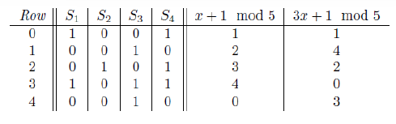

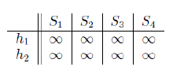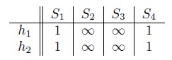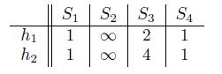

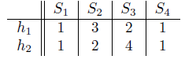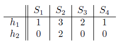

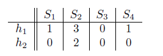

Più permutazioni facciamo e più ci avviciniamo alla similarità di Jaccard. Se non ne abbiamo abbastanza facciamo delle approssimazioni

Questa tecnica può essere velocizzata facendo un troncamente del numero di permutazioni. Se si ha un sottoinsieme abbastanza grande da non avere spazi vuoti, qui, possiamo metterci degli infiniti senza avere problemi nell’esecuzione dell’algoritmo. Questo perché e quindi la similarità la si può cmq calcolare facendo questo confronto. Il problema nasce quando abbiamo troppi infiniti, perché può capitare di fare confronti fra infiniti e li non sappiamo come comportarci.

## **5.3 Locality-Sensitive Hashing**

Anche con queste ottimizzazioni, trovare documenti simili può essere computazionalmente complesso se il numero di coppie di documenti è troppo alto, anche se non ci sono troppi documenti.

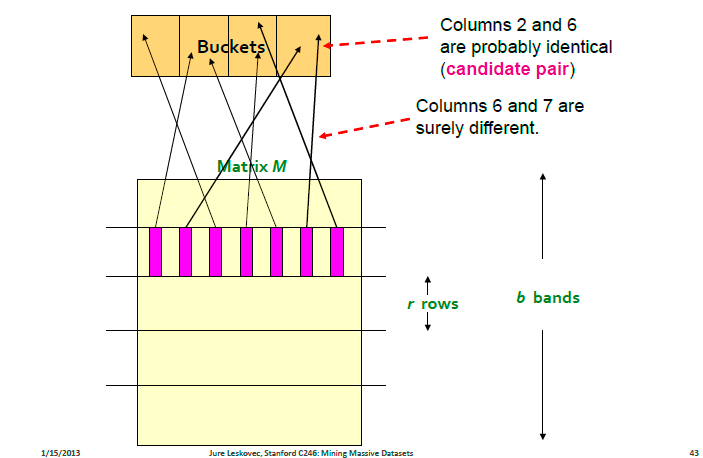Con la tecnica di **locality-sensitive hashing** (**LSH**) siamo in grado di ridurre i confronti che dobbiamo effettuare per trovare i documenti simili.

L’idea alla base è di dividere la matrice delle signatures in ***b*** **bande** ognuno con ***r*** **righe**.Ogni banda ha una propria funzione di hash che prende i vettori ***r*** e gli hasha in un **bucket** il cui numero viene scelto sulla base delle performance, facendo varie prove. I documenti che hanno la stessa signature, ma che appartengono a bande diverse, non saranno hashate nello stesso bucket.

Se due documenti hanno lo stesso hash nella stessa banda, vengono considerati **candidati simili**. Mentre, i documenti che sono diversi andranno a finire in bucket diversi.

Se due documenti hanno **similarità Jaccard alta**, allora hanno alta probabilità di **collidere in almeno una banda**, mentre, se sono dissimili, la probabilità di collisione rimane bassa.

Matematicamente, la probabilità che **due firme con similarità s** siano considerate candidate simili, e cioè che una signature concorda con tutte le righe di almeno una banda, è:

dove:

* = similarità Jaccard tra i due documenti,
* = righe per banda,
* = la probabilità che le firme siano concordanti in tutte le righe di una certa banda
* = probabilità che le firme siano discordanti in almeno una riga di una certa banda
* = numero di bande.
* probabilità che le firme siano discordanti in almeno una riga di una ogni banda

Cambiare e permette di regolare il **punto di soglia** di similarità:

* più bande → più permissivo,
* più righe per banda → più severo.

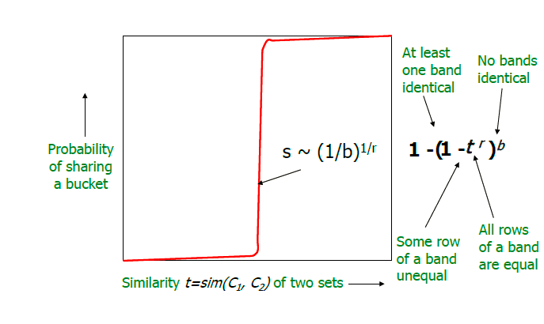

**Parametri consigliati**

* Scegli b e r in modo che t ≈ (1/b)1/r (soglia target).
* Più firme (n = *br*) migliorano l’accuratezza ma aumentano il costo.

L’utilizzo del LSH consente di **ridurre drasticamente il numero di confronti necessari** durante la ricerca di elementi simili. Invece di confrontare ogni elemento con tutti gli altri — operazione molto costosa in termini di tempo — l’algoritmo concentra l’attenzione solo sugli oggetti che finiscono nello stesso bucket, ossia quelli che con maggiore probabilità sono effettivamente simili.

Questo approccio si traduce in **un’elevata efficienza computazionale**, particolarmente vantaggiosa quando si lavora con dataset di grandi dimensioni o con spazi vettoriali ad alta dimensionalità.

Inoltre, il metodo è **altamente parametrizzabile**: è possibile regolare diversi fattori (come il numero di funzioni hash o di bande) per bilanciare il compromesso tra **falsi positivi** e **falsi negativi**, adattando così il comportamento dell’algoritmo alle esigenze specifiche dell’applicazione.

# **Text Analysis**

L’obiettivo principale dell’accesso ai dati testuali è mettere in contatto l’utente con l’informazione rilevante nel momento più opportuno. Esistono due modalità principali:

* **pull**: l’utente formula una query per cercare informazioni, quindi è l’utente che chiede informazioni;
* **push**: il sistema suggerisce proattivamente contenuti potenzialmente

rilevanti, senza che gli utenti glieli chiedano, ad esempio i sistemi di raccomandazioni.

Un **sistema di text retrieval** permette all’utente di recuperare documenti rilevanti sulla base di una query, cioè tramite testo (documento) cercano di ottenere documenti rilevanti alla query che hanno posto.

Il tutto può essere molto complesso perché le query sono di dimensione molto inferiori dei documenti e spesso l’utente non si esprime bene su quello che desidera. Poi anche se la query va bene, è importante che il sistema ritorni documenti che siano effettivamente rilevanti anche se questo è soggettivo e dipende dal soggetto e dalle informazioni che sta cercando.

La principale differenza con i database e che questi lavorano su dati strutturati; le query sono formali e precise e ritornano esattamente quello che l’utente a chiesta e soprattutto tutte le informazioni che matchano con la query. I sistemi di text retrieval, invece, si basano su dati non strutturati e la query, anche se correttamente formulata, non ritorna tutti i possibili risultati, ma solo le che soddisfano esattamente la query. Ci possono esser documenti rilevanti che non vengono recuperati perché non direttamente correlati.

I **modelli di information/text retrieval** permettono all’utente di formulare una query e sulla base di questa, di ottenere i documenti rilevanti per la query che è stata formulata. Per fare questo è necessario avere documenti e rappresentarli in un certo modo per poter recuperarli sulla base della query.

Quindi dato un insieme ***C*** di documenti dai quali si costruirà il vocabolario ***V*** del modello di retrieval, l’obiettivo è quello che data una query o un insieme di query ***Q*** di ottenere i documenti rilevanti per quella query ***R(q)***. Di solito si considera un’approssimazione ***R’(q)*** perché la rilevanza è un criterio abbastanza soggettivo sulla base della persona che analizza i documenti.

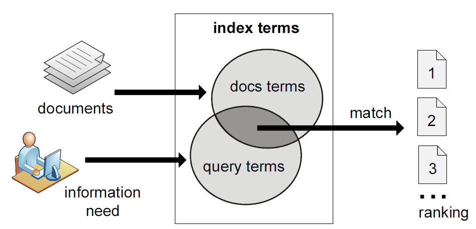

In generale i documenti vengono rappresentate tramite una **matrice termine documenti** o **bag of word**, dove sulle colonne troviamo i documenti e sulle righe le parole del vocabolario. Nella intersezione è rappresentata una informazione sulla presenza o meno della parola in quel documento.

## **6.1 MODELLO BOOLEANO**

Uno dei primi modelli fu il **modello booleano** che rappresentava nella matrice termini documenti la presenza o l’assenza della parola nel documento tramite 0 o 1. Questo modello funzionava ma non andava bene perché per un vocabolario molto elevato si aveva una matrice sparsa e il modello di IR restituiva solo i documenti che matchano perfettamente alla query, senza possibilità di avere documenti che matchavano parzialmente. Quindi non si ha un ranking, ma i documenti vengono etichettati solo come non rilevanti o rilevanti (**document selection**).

## **6.2 MODELLO A SPAZI VETTORIALI**

Una soluzione a questi problemi fu il **modello a spazi vettoriali** che rappresenta i documenti tramite vettori nello spazio vettoriale formato dalle parole del vocabolario.

Le componenti del vettore sono le frequenze con il quale ogni termine che forma il documento appare.

Avere la frequenza come rappresentazione è un problema perché ci sono parole che possono essere ripetute molte volte nel documento/i è quindi viene considerato rilevante. Però una parola che compare tante volte, anche in tanti documenti non è una parola importante al fine della discriminazione dei documenti e quindi si deve penalizzare il peso che quella parola dà.

Definiamo la frequenza di una parola nella collezione di documenti come:

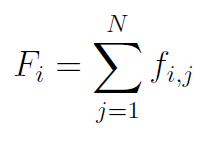

La **document frequency *ni*** di un termine ki è il numero di documenti in cui appare. È utile a capire la genericità/specificità di un termine nella collezione. Un modo per rappresentare la frequenza è quello del **TF-IDF term frequency- Inverse document frequency** che penalizza le parole troppo frequenti in modo da far scendere di ranking i documenti che le contengono in modo di avere in come documenti più rilevanti, più specifici.

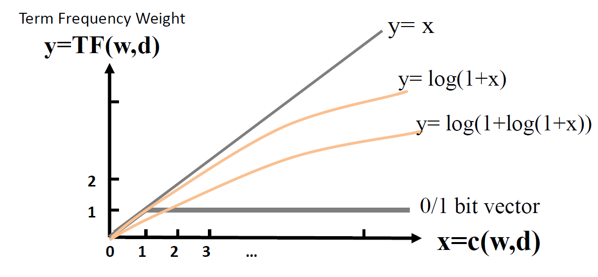La frequenza può essere normalizzata perché altrimenti troppo dipendente dalla lunghezza dei documenti e quindi verrebbero considerati più importanti anche se non lo sono.

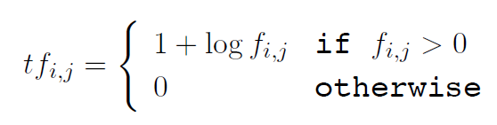

Ci sono altre tecniche di normalizzazione come **BM25 (Best Matching 25) Transformation**. Il termine cresce **non linearmente** con la frequenza in modo da evitare di dare troppo peso ai termini ripetuti. Idocumenti lunghi non vengono penalizzati né favoriti eccessivamente.

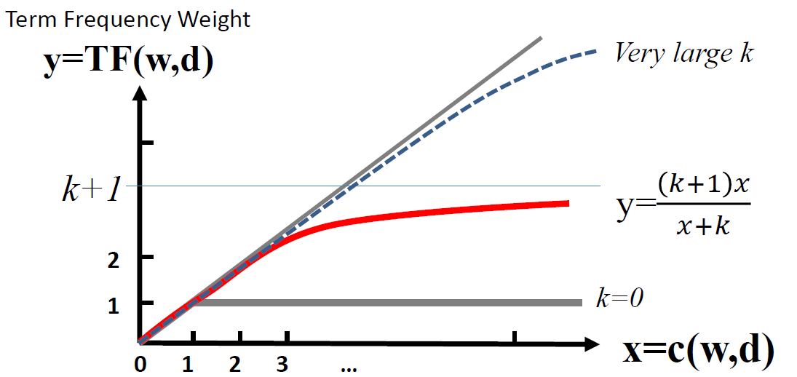

La TF viene attenuata grazie all’IDF che misura quanto un termine è informativo, cioè quanto aiuta a distinguere i documenti. Per ogni documelnto la IDF è definita come:

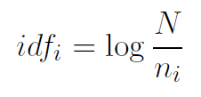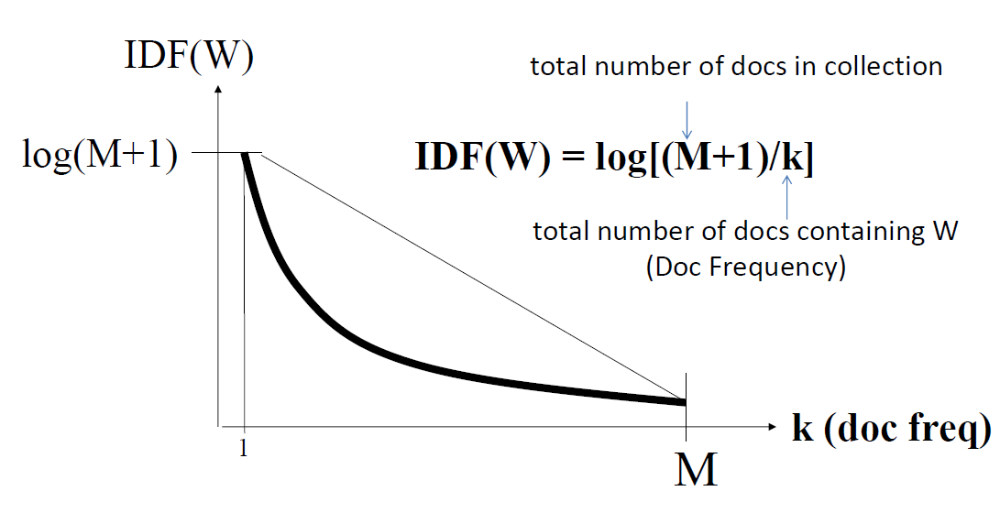

Il peso per ogni parola è definito come:

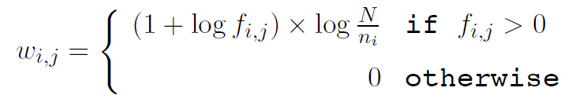

Nello spazio vettoriale il documento è rappresentato come

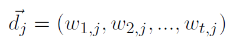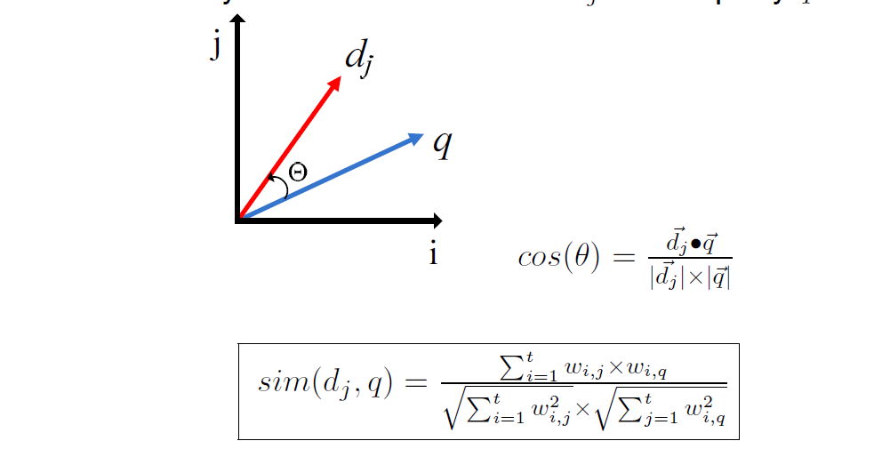

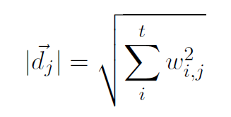

Utilizziamo come misura di similarità la **cosine** **similarity** perché è indipendente dalla lunghezza del documento; quindi, documenti simili anche se hanno lunghezze diverse saranno considerati lo stesso importanti. Usando metriche come la distanza euclidea o Manhattan, se un documento fosse troppo lungo rispetto alla query potrebbe non essere considerato simile e quindi irrilevante.

Il modello a spazi vettoriali supera i limiti di quello booleano (ranking, partial matching), ma ha ancora un problema; le parole del vocabolario essendo i versori degli assi dello spazio creano un angolo di 90°. Geometricamente vuol dire che sono linearmente indipendenti e questo si traduce che le parole non dipendono le une dalle altre, cosa non vera all’interno di un testo dove il significato delle parole può assumere sfumature diverse a seconda dal contesto. Un altro problema è che lavoriamo con vettori sparsi se il vocabolario è molto grande.

**Document Normalization**

La lunghezza di un documento può essere un problema perché sarebbero i favoriti nel recupero di documenti più importanti, visto che hanno più probabilità di avere gli index term. Per migliorare il retrieval possiamo effettuare una normalizzazione della lunghezza dei documenti secondo il numero dei byte, numero delle parole ecc.

L’idea è che i documenti più lunghi non dovrebbero essere penalizzati o favoriti in modo lineare. La **pivoted normalization** cerca un punto di equilibrio, **pivot**, nella lunghezza media dei documenti.

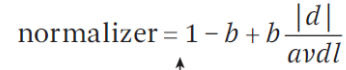

* Se , il fattore di normalizzazione ≈ 1 → nessuna correzione.
* Se , il denominatore cresce → il peso viene ridotto.
* Se , il denominatore cala → il peso viene aumentato.

In altre parole:

* Documenti lunghi → penalizzati un po’.
* Documenti brevi → potenziati un po’.
* Tutto calibrato dal parametro **b**, che regola la forza della correzione. La formula del normalizzatore è un’interpolazione tra 1 e la lunghezza normalizzata dei documenti, controllata da un parametro **b**.
  + Se impostiamo b = 0, il valore del normalizzatore sarà 1, cioè nessuna normalizzazione della lunghezza.
  + Se invece impostiamo **b** a un valore diverso da zero, il valore del normalizzatore sarà più alto per i documenti più lunghi della media, e più basso per quelli più corti.
  + Regolando **b** (da 0 a 1), possiamo quindi controllare il grado di normalizzazione della lunghezza.

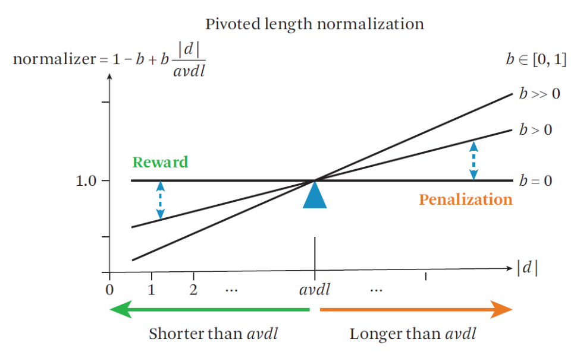

## **6.3 MODELLI PROBABILISTICI**

Nei **modelli probabilistici**, la funzione di ranking viene definita sulla base della **probabilità che un determinato documento *d* sia rilevante per una query *q***, cioè
dove **R ∈ {0, 1}** è una variabile casuale binaria che indica la rilevanza (1 = rilevante, 0 = non rilevante).

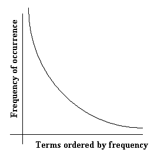La distribuzione delle frequenze delle parole è **fortemente sbilanciata**:

* poche parole hanno **frequenze molto alte**,
* mentre **molte parole** compaiono **con frequenze molto basse**.

Questo fenomeno è descritto dalla **legge di Zipf**, che può essere espressa come:

dove:

* **r** è la **posizione (rank)** della parola nella classifica di frequenza,
* **f** è la **frequenza** della parola,
* **k** è una **costante**.

In altre parole, **la frequenza della parola di rango r è inversamente proporzionale al suo rango**.
Equivalentemente, si può dire che il **prodotto tra il rango di una parola (r)** e la **sua probabilità di occorrenza (P(r))** è approssimativamente costante:

Per la lingua inglese, questa costante **c ≈ 0.1**.

### **6.3.1 Language model**

I modelli di linguaggio sono modelli probabilistici che assegnano una probabilità di occorre alle parole che possono essere presenti nella frase. La frase è vista come un insieme di eventi, che sarebbe le parole, che sono influenzati da eventi precedenti.

L’obiettivo è calcolare la probabilità di una frase che è definita come:

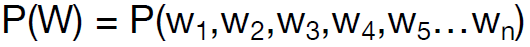

E quindi la probabilità che una parola appaia date le precedenti:

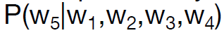

Per calcolare la probabilità condizionata, applichiamo la **chain rule per le probabilità** definita come:

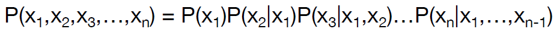

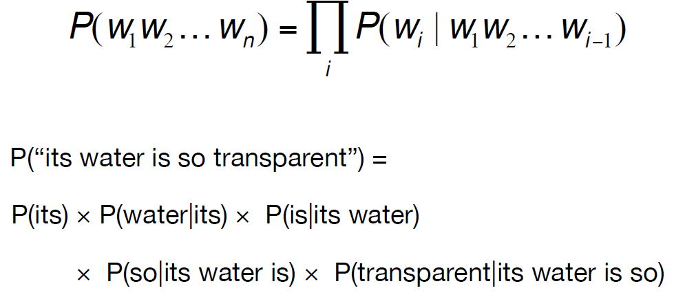

Dal punto di vista computazionale è troppo complesso da fare per via dell’elevato numero di frasi che possiamo avere per definire la probabilità condizionata. Una soluzione secondo l’**assunzione Markoviana** è che la probabilità di una parola dipende solo da un numero limitato di parole precedenti e no da tutte. In questo caso:

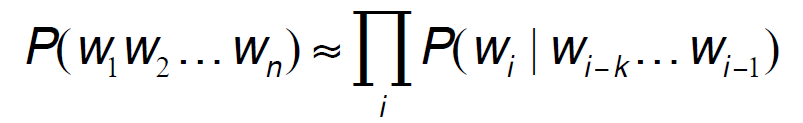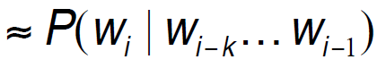

dove k indica il numero di parole precedenti che consideriamo per produrre la prossima. Quindi usiamo un approccio basato su N-grammi. Questa semplificazione a dei limiti perché perdiamo delle informazioni di contesto, considerandone uno limitato, perché alcune parole all’interno del testo possono dipendere anche se sono molto lontano fra loro.

Per il calcolo della probabilità nel caso degli N-grammi, la calcoliamo tramite la **Maximum likehood estimate MLE**, definita come:

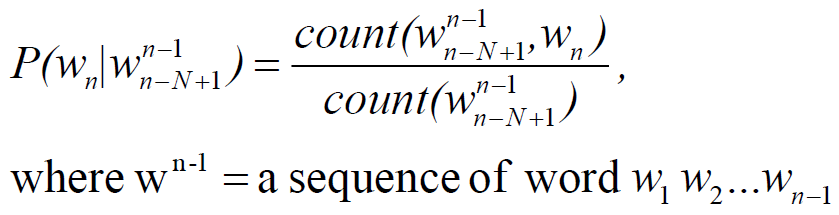

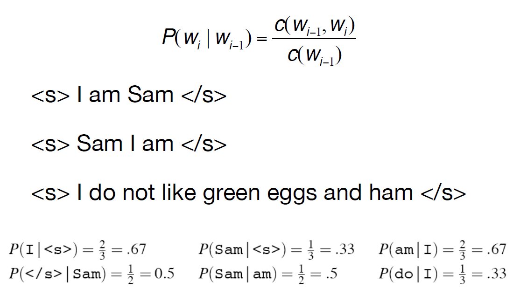

Il limite della MLE e che, se un N-gramma non è mai apparso allora la MLE=0. Allora usiamo lo **stimatore di Laplace** che consiste nell’aggiungere a tutte le probabilità una piccola quantità per evitare valori nulli

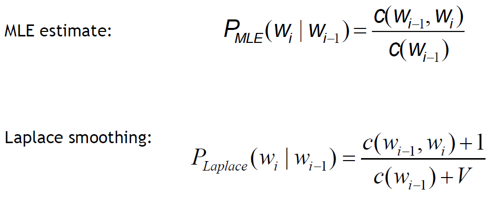

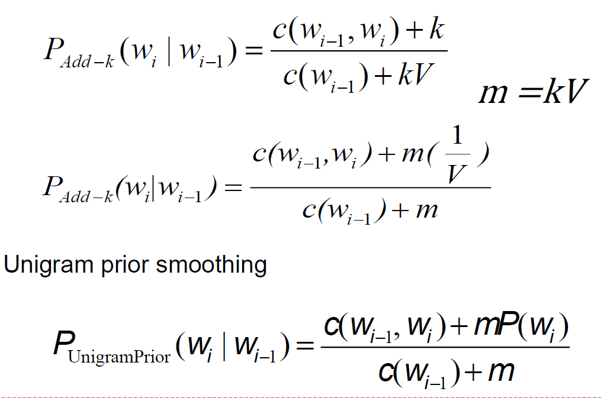

Un secondo problema è che effettuando dei prodotti il calcolo computazionale per contesti molto lunghi può essere pesante. Allora si trasformarmi il prodotto in somma passando in uno spazio logaritmico.

### **6.3.2 The Query Likelihood Retrieval Model**

L’idea alla base della QLR è che l’utente usa le parole per potere recuperare il documento che spera di recuperare. Man mano che trova i documenti cambia la query con le parole che sono presenti nei documenti che vengono recuperare da query precedenti. Quindi raffina via via la query.

Abbiamo fatto le seguenti assunzioni:

* ogni parola della query è **indipendente** dalle altre;
* ogni parola è ottenuta da un **documento ideale immaginario** che soddisfa il bisogno informativo dell’utente.

Poiché stiamo calcolando la verosimiglianza di una query, la probabilità totale è la probabilità di questa particolare query, che è una sequenza di parole. Poiché presupponiamo che ogni parola venga generata indipendentemente, la probabilità della query è semplicemente il prodotto della probabilità di ciascuna parola della query, dove la probabilità di ciascuna parola è semplicemente la frequenza relativa della parola nel documento.

Abbiamo ipotizzato che ogni parola di query debba essere estratta dal documento presente nella mente dell'utente; per risolvere questo problema, dobbiamo supporre che l'utente avrebbe potuto estrarre una parola non necessariamente dal documento.

Invece di estrarre una parola direttamente dal documento, immaginiamo che l’utente la estragga da un **modello di linguaggio del documento**.

Si assume che questo modello **non assegni probabilità zero a nessuna parola**.

In questa visione, il processo cambia leggermente: l’utente ha in mente **un modello probabilistico (una distribuzione di parole)**, non un documento ideale specifico, anche se tale modello deve comunque essere **stimato a partire dai documenti del corpus**. L’utente può quindi generare la query seguendo un procedimento simile a prima. La differenza principale è che ora:

* si assume che il modello **non assegni probabilità nulla a nessuna parola**,
* quindi è possibile “estrarre” anche parole che **non compaiono nel documento**.

Per evitare che la probabilità di una parola sia zero, usiamo tecniche di **smoothing**. Formalmente una query *q* contiene le parole

*q* = *w1, w2, . . . , wn*

tale che |q| = *n*. La funzione di punteggio o classificazione è quindi la probabilità che osservando *q* dato che un utente sta pensando a un particolare documento *d*. Questo è il prodotto delle probabilità di tutte le singole parole, che si basa sull'indipendenza:

*p(q* | *d)* = *p(w*1 | *d)* × *p(w*2 | *d)* × . . . × *p (wn* | *d)*.

Ila funzione di punteggio del documento per una certa query è definita come:

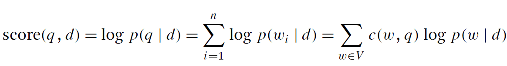

Utilizzando il logaritmo manteniamo l'ordine di questi documenti e contemporaneamente risolviamo il problema dell'underflow.

Sommiamo tutte le parole possibili nel vocabolario *V* e iterare ogni parola nella query, ma in realtà stiamo considerando solo le parole nella query perché se una parola non fosse nella query, il suo contributo alla somma sarebbe zero.

L'unica parte che non conosciamo è questo modello linguistico del documento, *p(w* | *d)*.

Per stimarla usiamo la MLE, che normalizza le frequenze delle parole nel documento in base alla lunghezza del documento.

Pertanto, tutte le parole che hanno lo stesso conteggio di frequenza avranno una probabilità uguale con questo metodo di stima. Si noti che le parole che non sono presenti nel documento avranno probabilità zero.

In altre parole, si presuppone che l'utente campiona una parola dal documento per formulare la query e non vi è alcuna possibilità di campionare qualsiasi parola che non è presente nel documento.

Per assegnare una probabilità diversa da zero alle parole che non sono state osservate nel documento, applichiamo tecniche di *smoothing*.

Lo smoothing del modello linguistico consiste nel tentare di recuperare il modello per l'intero articolo. Naturalmente, di solito non conosciamo le parole non osservate nell’abstract; quindi, è per questo che lo smoothing è in realtà un problema complesso.

La domanda chiave qui è quale probabilità assegnare a quelle parole non osservate, esistono molti approcci diversi per risolvere questo problema.

Un'idea molto utile per il recupero è quella di lasciare che la probabilità di una parola non osservata sia proporzionale alla sua probabilità, così come fornita da un modello linguistico di riferimento. Ciò significa che se non si osserva la parola nel corpus, assumeremo che la sua probabilità sia governata da un altro modello linguistico di riferimento da noi costruito. Questo ci dirà quali parole non osservate hanno una probabilità maggiore rispetto ad altre parole non osservate. Nel caso del recupero, una scelta naturale sarebbe quella di prendere il LM della collezione come LM di riferimento. Vale a dire che se non si osserva una parola nel documento, assumeremo che la probabilità di questa parola sia proporzionale alla probabilità della parola nell'intera raccolta

Formalmente:

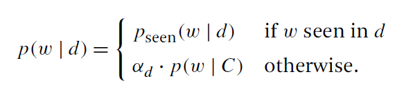

Se la parola venisse visualizzata nel documento, la probabilità sarebbe scontata

Stima MLE *prevista.* Altrimenti, se la parola non viene visualizzata nel documento, lasceremoche la probabilità sia proporzionale alla probabilità della parola nella raccolta *p(w* | *C)*, con il coefficiente *αd* che controlla la quantità di massa di probabilità che assegniamo. Sostituendo otteniamo:

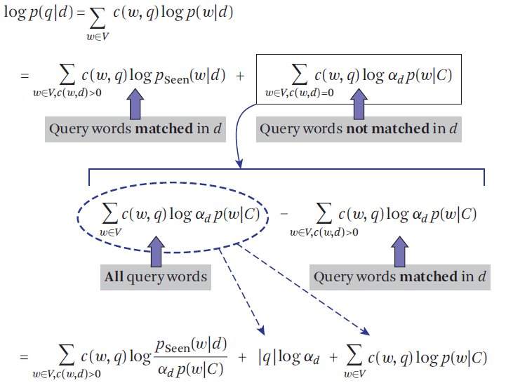

In questa formula, abbiamo una somma su tutte le parole di query, scritta sotto forma di somma sul vocabolario del corpus, ma in realtà stiamo sommando le parole di query, poiché ogni parola è ponderata in base alla sua frequenza nella query.

Questo modo di scrivere questa somma è utile in alcune trasformazioni. Nel nostro metodo di smoothing, assumiamo che le parole che non sono osservate nel documento abbiano una forma di probabilità leggermente diversa.

Utilizzando questa forma, possiamo scomporre questa somma in due parti:

* una su tutte le parole di query che sono state trovate nel documento
* e l'altra su tutte le parole che non sono state trovate. Queste parole non trovate hanno una forma di probabilità diversa a causa della nostra ipotesi sullo smoothing.

Possiamo quindi riscrivere la seconda somma (delle parole di query non trovate in d) come differenza tra i punteggi di tutte le parole del vocabolario meno tutte le parole di query trovate in d.

Questo è in realtà molto utile, poiché parte della somma su tutti w ∈ V può ora essere scritta come |q| log αd. Inoltre, la somma delle parole di query corrispondenti in d è in termini di parole che osserviamo nella query. Proprio come nel modello dello spazio vettoriale, ora siamo in grado di calcolare una somma di termini nell'intersezione del vettore di query e del vettore del documento.

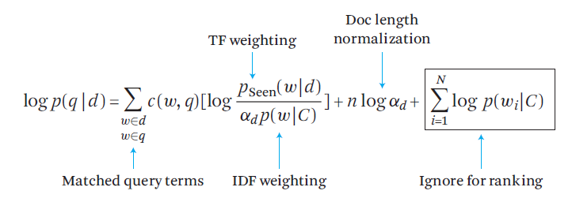

Se analizziamo più approfonditamente questa riscrittura, possiamo vedere come ci offrirebbe due vantaggi.

Il primo vantaggio è che ci aiuta a comprendere meglio la funzione di ranking. In particolare, mostreremo che da questa formula possiamo vedere la connessione tra lo smoothing utilizzando un modello di linguaggio di raccolta con euristiche di ponderazione simili alla ponderazione TF-IDF e alla normalizzazione della lunghezza.

Il secondo vantaggio è che ci consente anche di calcolare la verosimiglianza della query in modo più efficiente, poiché dobbiamo considerare solo i termini corrispondenti nella query.

Vediamo che la parte principale della formula è una somma sui termini di query corrispondenti. Questo è molto meglio che calcolare la somma su tutte le parole. Dopo aver smoothato il documento utilizzando il modello di linguaggio di raccolta, avremmo probabilità diverse da zero per tutte le parole w ∈ V .

Questa nuova forma della formula è molto più facile da calcolare. È anche interessante notare che l'ultimo termine è indipendente dal documento valutato; quindi, può essere ignorato per la classificazione. Ignorare questo termine non influirà sull'ordine dei documenti, poiché si tratterebbe semplicemente dello stesso valore aggiunto al punteggio finale di ciascun documento.

All'interno della somma, vediamo anche che ogni termine di query corrispondente contribuirebbe a un peso. Questo peso assomiglia alla ponderazione TF-IDF dei modelli di spazio vettoriale.

Se volessimo implementare questa funzione utilizzando un linguaggio di programmazione, dovremmo comunque calcolare alcune variabili; in particolare, dovremo sapere come stimare la probabilità di una parola e come impostare αd. Per rispondere a queste domande, dobbiamo pensare a metodi di smoothing specifici, in cui definiamo pseen e αd.

Parleremo di due diversi metodi di smoothing.

Lo **smoothing di Jelinek–Mercer** è una tecnica utilizzata nei modelli di linguaggio per l’information retrieval per gestire il problema delle parole non presenti in un documento. L’idea di base è combinare due fonti di informazione: da un lato la stima di **massima verosimiglianza** calcolata sulle frequenze delle parole nel documento stesso, e dall’altro il **modello linguistico del corpus** complessivo, che rappresenta le probabilità di background delle parole.

Questa combinazione avviene tramite un’**interpolazione lineare**, controllata da un parametro compreso tra 0 e 1. Valori di più alti danno maggiore peso al modello di background, aumentando così il livello di smoothing, mentre valori più bassi privilegiano le frequenze locali del documento.

P(w∣Md)=(1−λ)⋅PML(w∣d)+λ⋅P(w∣C)

Dove:

* è la probabilità della parola secondo il modello di linguaggio del documento con smoothing;
* è la **stima di massima verosimiglianza**, cioè la frequenza relativa della parola nel documento;
* è la probabilità della parola nel **corpus** complessivo (modello di background);
* è il **parametro di smoothing** che controlla il peso assegnato al modello di background.

Il secondo è lo **smoothing a priori di Dirichlet**, o **smoothing bayesiano**.

Proprio come per lo smoothing di Jelinek-Mercer, utilizzeremo il modello del linguaggio di raccolta, ma in questo caso lo combineremo con la stima MLE in un modo leggermente diverso. La formula può essere vista inizialmente come un'interpolazione della probabilità MLE e del modello del linguaggio di raccolta, come in precedenza. Invece, tuttavia, αd non è semplicemente un λ fisso, ma un coefficiente dinamico che accetta μ > 0 come parametro.

Se impostiamo μ a una costante, l'effetto è che un documento lungo otterrebbe in realtà un coefficiente inferiore. Pertanto, un documento lungo avrebbe meno smoothing del previsto, quindi questo sembra avere più senso rispetto allo smoothing a coefficiente fisso. I due coefficienti |d|/|d|+μ e

*αd=* μ /|d|+μ sommano comunque a uno, fornendoci un modello di probabilità valido.

Questo smoothing può essere inteso come un'interpolazione dinamica dei coefficienti. Un altro modo per comprendere questa formula, ancora più facile da ricordare, è riscrivere questo metodo di smoothing in questa forma

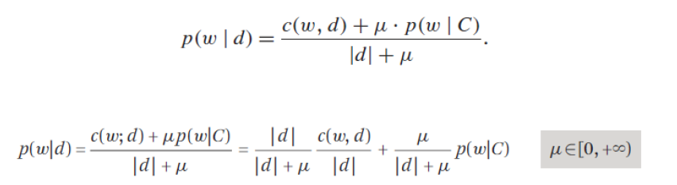

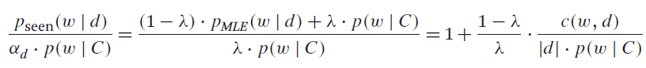

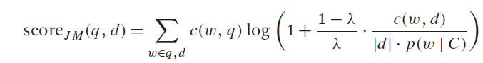

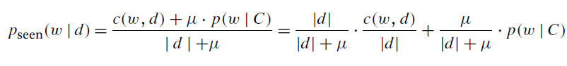

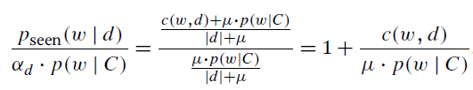

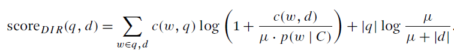

# **Computational Lexical Semantics**

**Computational Lexical Semantics** è il ramo della linguistica computazionale che si occupa di rappresentare e analizzare il significato delle parole (cioè, la semantica lessicale) in modo che possa essere elaborato da un computer.

Sviluppa modelli computazionali del significato lessicale, cioè algoritmi e rappresentazioni che catturano:

* il **significato** di singole parole,
* le **relazioni semantiche** tra parole (come sinonimia, antonimia, iperonimia, meronimia),
* e il modo in cui le parole contribuiscono al **significato complessivo** di una frase o testo.

Il **lemma** è la forma canonica di una parola che può avere varie inflessioni a seconda del contesto. Il **sense**, invece, è il significato che assume. Il lemma può avere più sense, allora è **polisemantica**. I significati e e le parole possono essre in relazione fra di loro nella frase.

* **Sinonimo ⬄ intercambiabilità**anche se non sempre è vero perché dipende dal contesto se formale o meno formale; quindi, anche se hanno un significato simile, non può essere cambiata. Questo è definito nel **principio del contrasto** quando una lingua possiede due forme diverse, quelle forme non possono avere esattamente lo stesso significato in tutti i contesti. Una differenza formale implica almeno una sfumatura semantica differente.
  Quindi possiamo avere **true sinonimy** e **near perfect sinonimy** che si devono adattare al contesto.
* **Similarity not ⬄ intercambiabilità**le parole possono avere significato simile, ma non essere sinonimi e quini danno sfumature diverse di significato
* **Word relatedness**
  consiste nel raggruppare parole indipendenti fra loro ma che indicano uno stesso concetto/campo semantico. Le si individua tramite co-occorenze.
* **Anonimia**quando le parole hanno significato opposto. Se esiste una scala di valore risulta più difficile individuare la parola con il significato opposto.
* **Iperonimia (is a)** una parola ha un significato più specifico di un’altra
* **Meronimia** è la relazione tra la parte è l’intero
* **Olonomia** la relazione fra l’intero e la parte. La **proprietà transitiva** limita la significatività.
* **Connotazione** significato positivo negativo che la parola trasmette, il sentimento. Certe parole possono assumere sentimenti diversi a seconda del contesto.

I dizionari spesso elencano molti significati molto dettagliati per catturare le sfumature del senso delle parole, il che è logico, poiché il loro obiettivo è aiutare chi sta imparando una lingua.

Per scopi computazionali, invece, non servono distinzioni così fini: è spesso più utile raggruppare o unire i vari sensi in categorie più ampie. Le definizioni dei dizionari spesso presentano **circolarità**. Ad esempio, la parola *right* (destra) si riferisce direttamente a sé stessa, mentre *left* (sinistra) lo fa in modo implicito attraverso l’espressione “questo lato del corpo”.

Questo tipo di circolarità è **intrinseco a tutti i dizionari**, perché il linguaggio è un sistema chiuso di significati che si rimandano l’un l’altro.

Nella **linguistica computazionale** si adotta una logica simile: il **significato di una parola** è definito attraverso le sue **relazioni con altri significati**.

## **7.1 WORDNET**

Per rappresentare tutto questo si usa **WordNet** un database lessicale che crea un grafo fra le parole e le relazioni che esistono fra loro.

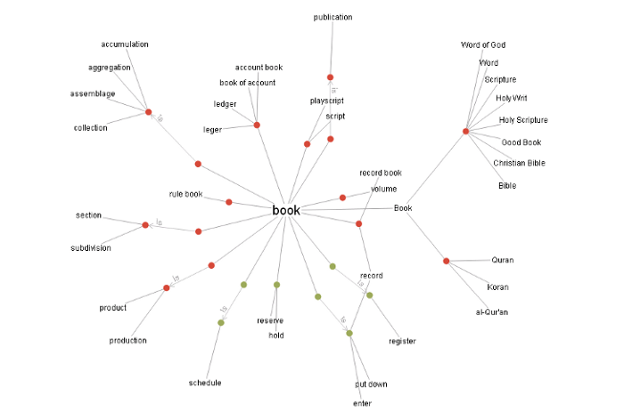Ogni nodo è chiamato **synset** ed è un raggruppamento di parole che hanno significato simile. NON rappresenta un concetto, anche se lo si può intendere dalle parole che appartengono al synset. Ogni synset è formato da un **glossis** che fornisce definizioni, esempi di uso e il PoS. Sno presenti anche le *relazioni* con le altre parole che sono modellate dagli archi.

WordNet è alla base di molti compiti NLP:

* **Word Sense Disambiguation (WSD)** capire quale senso di una parola è usato in un contesto.
* **Semantic Similarity** calcolare quanto due parole o frasi siano simili nel significato.
* **Information Retrieval** migliorare la ricerca semantica di documenti.
* **Text Classification e Summarization** rappresentare il significato in modo strutturato.
* **Ontologie e Knowledge Graphs** come base per costruire reti di conoscenza più ampie (es. ConceptNet, BabelNet).

### **7.1.1 Word Sense Disambiguation**

Per determinare il senso delle parole possiamo addestrare un modello supervised se abbiamo un dataset etichettato con i significati di ogni parola. Gli algoritmi supervisionati basati su corpora etichettati con i sensi delle parole sono quelli che ottengono le migliori prestazioni nella disambiguazione del significato ma questo tipo di dati etichettati manualmente è costoso e limitato.

Un’alternativa è ottenere una supervisione indiretta da **dizionari, thesauri** o basi di conoscenza simili. Questi metodi, che non utilizzano testi etichettati manualmente, vengono detti **weakly supervised**.

L'**algoritmo di Lesk** si basa sull'idea che le parole che appaiono insieme nel testo siano in qualche modo correlate e che la relazione e il contesto corrispondente delle parole possano essere estratti attraverso le definizioni delle parole di interesse e le altre parole utilizzate intorno ad esse.

**STEPS**

1. **Seleziona parola**: scegli la parola di cui vuoi determinare il significato corretto, **parola target**.
2. **Finestra di definizione del contesto**: identifica un gruppo di parole vicine attorno alla parola di destinazione. Questa raccolta di parole è nota come **finestra di contesto**.
3. **Confronta le definizioni**: Confronta le definizioni del dizionario della parola di destinazione con le definizioni delle parole all'interno della finestra del contesto.
4. **Conta sovrapposizioni**: Conta il numero di parole che appaiono sia nelle definizioni della parola di destinazione che nelle definizioni delle parole nella finestra del contesto. Esclude le stop word.
5. **Scegli la definizione più sovrapposta**: seleziona la definizione della parola target che ha il numero più alto di parole sovrapposte dal passaggio 4. Questa definizione scelta rappresenta il significato più probabile della parola target nel suo contesto attuale.

## **7.2 Vector semantics and embeddings**

Un altro modo per rappresentare il significato delle parole e le relazioni fra esse e di usare i **vettori numerici** in uno spazio vettoriale.

L’idea nasce dal **Distributional Hypothesis** (Harris, 1954):

“Le parole che appaiono in contesti simili tendono ad avere significati simili.”

Se due parole compaiono spesso negli stessi contesti, i loro vettori saranno vicini nello spazio semantico. Quindi il significato dipende della distribuzione delle parole vicine alla parola che consideriamo. Questi modelli sono chiamati **embeddings**.

La rappresentazione vettoriale si basa su due intuizioni principali:

1. Il significato di una parola può essere determinato osservando la distribuzione di co-occorrenza delle parole in un corpus: parole che condividono contesti simili sono semanticamente correlate.
2. La parola può essere rappresentata come punto in uno spazio a N dimensioni, dove la vicinanza tra punti riflette la somiglianza semantica tra le parole.

Combinando questi approcci è possibile creare automaticamente lo spazio dal testo senza supervisione o etichettatura delle parole, in quanto ci si basa su approcci statistici delle parole semanticamente vicine.

Ci sono due principali modi di rappresentazione degli embeddings:

1. **Rappresentazioni vettoriali sparse**
   * Matrici di co-occorrenza delle parole ponderate tramite **mutual information**
2. **Rappresentazioni vettoriali dense**

* Decomposizione ai valori singolari (SVD) e Latent Semantic Analysis (LSA)
* Modelli ispirati alle reti neurali (skip-grams, CBOW)
* Embeddings contestualizzati

### **7.2.1 Rappresentazione vettoriali sparse**

Rappresentiamo tramite una matrice **term-document** quanto spesso la parola occorre nel documento, oppure tramite una **term-term matrix** che rappresenta come le parole co-occorrono fra loro.

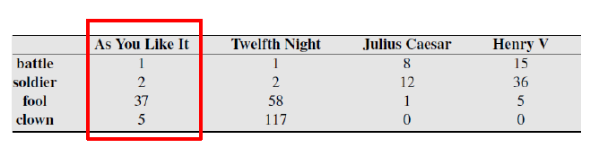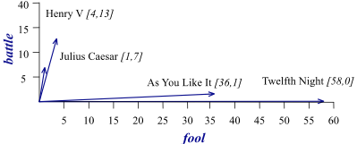

La matrice è di dimensione VxD, dove sulle colonne ci sono i documenti, mentre sulle righe le parole del vocabolario. Nelle intersezioni troviamo il numero di volte che la parola appare nel documento, la frequenza.

La matrice **term-context matrix** è di dimensione VxV. Nelle celle della matrice è rappresentato il numero di volte che le parole co-occorrono nello stesso documento.

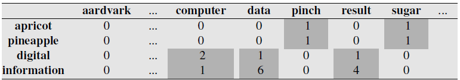

Entrambe le rappresentazioni si traducono in vettori nello spazio e per rappresentare le frequenze possiamo usare la TF-IDF e come misura di similarità, la cosine similarity. Un’altra rappresentazione può essere quella della **pointise mutual information** che misura quanto spesso due eventi x e y occorrono comparando cosa ci aspetteremmo se fossero indipendenti. La PMIè definita come :

La PMI va a [-inf; +inf]. Valori negativi indicano che la co-occorrenza avviene meno di quanto ci aspettiamo, ma non ci da informazioni utili per creare le relazioni semantiche. Allora con Le co-occorrenze rare o casuali non vengono amplificate negativamente, evitando rumore nella matrice. Le co-occorrenze rare o casuali non vengono amplificate negativamente, evitando rumore nella matrice.

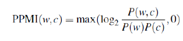

Se avessimo una matrice term-context, fij è il numero di volte che la parola occorre nel contesto.

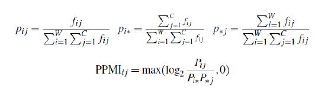

Con queste rappresentazioni otteniamo **vettori sparsi e lunghi**, perché ogni parola co-occorre solo con una parte limitata del vocabolario. Questo rende i calcoli **pesanti e poco efficienti**.

Per risolvere il problema **vettori densi e corti** che riducono la dimensionalità delle matrici sparse catturando comunque le relazioni semantiche con il vantaggio di velocizzare i calcoli e usare meno spazio per la rappresentazione.

Alcune tecniche sono:

* **Latent Semantic Analysis (LSA)**: usa la **decomposizione ai valori singolari (SVD)** per trasformare la matrice sparsa in una rappresentazione più compatta e continua.
* **Word embeddings** (Word2Vec, GloVe, FastText): apprendono vettori densi direttamente dai dati, di dimensioni tipicamente 100–300, che catturano le relazioni semantiche in modo molto più efficiente.
* **Embeddings contestualizzati** (BERT, GPT): generano vettori densi **variabili a seconda del contesto**, risolvendo anche il problema della polisemia.

### **7.2.2 Latent semantic analysis**

La **Latent Semantic Analysis (LSA)**, o **Latent Semantic Indexing (LSI)** che serve a scoprire la **struttura latente** in una collezione di testi. È usata soprattutto per la **riduzione della dimensionalità** e per individuare **relazioni semantiche** tra termini e documenti.

Il processo funziona così:

1. Si costruisce una **matrice termine-documento**, dove ogni riga rappresenta un termine e ogni colonna un documento.
2. Si applica la **Singular Value Decomposition (SVD)** per scomporre la matrice in tre componenti (U, Σ e Vᵀ), che rappresentano rispettivamente lo spazio dei termini, i valori singolari e lo spazio dei documenti.
3. Si mantengono solo i **k valori singolari principali**, riducendo così la dimensionalità.
4. In questo **nuovo spazio semantico ridotto**, termini e documenti che compaiono in contesti simili risultano **vicini tra loro**.
5. Le **similarità semantiche** tra parole o documenti si calcolano tramite la **cosine similarity**.

La SVD permette di scrivere:

dove:

1. A, la matrice di input di dimensione MxN
2. U matrice delle **relazioni tra termini e concetti**, di dimensione MxK
3. è la matrice **diagonale dei valori singolari**, che indica **quanto ciascun concetto contribuisce** alla struttura complessiva dei dati; di dimensione KxK
4. V matrice delle **relazioni tra documenti e concetti**, di dimensione NxK.
5. M sono i documenti, N i termini e K i concetti che corrisponde al rank(A)

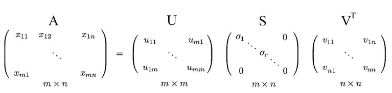

La SVD trova le **direzioni principali** in cui i dati variano maggiormente e le separa dal “rumore”. In pratica:

* I **valori singolari più grandi** (in ) catturano i pattern semantici più forti.
* Quelli piccoli rappresentano dettagli o rumore che possono essere eliminati.

Ogni parola o documento viene proiettato in uno **spazio semantico di dimensione** . Le **componenti principali** catturano le associazioni semantiche più forti. Le informazioni irrilevanti o casuali vengono eliminate

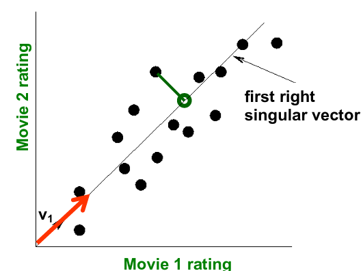Invece di usare due coordinate (x,y) per descrivere le posizioni dei punti, usiamo solo una coordinata z • La posizione del punto è la sua posizione lungo il vettore v1, ma come lo scegliamo? Ridurciamo al minimo l'errore di ricostruzione

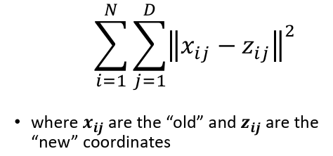

U :Fornisce le coordinate dei punti nell'asse di proiezione

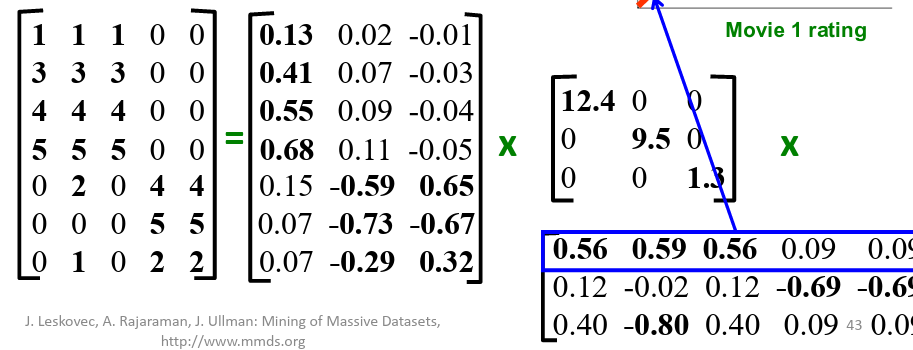

Usando solo i primi **k** valori singolari, si ottiene una **matrice ridotta** , chiamata , in cui ogni riga (una per parola) ha **k dimensioni**.

Questa riga diventa quindi un **vettore denso a k dimensioni** che rappresenta la parola, sostituendo le righe ad **altissima dimensionalità** della matrice originale . Questo metodo è chiamato **SVD troncata**.

La SVD è **parametrizzata da k**, ovvero dal numero di dimensioni della rappresentazione di ogni parola, che di solito varia tra **500 e 1000**.

In genere si mantengono le **dimensioni di ordine più alto**, ma per alcuni compiti può essere utile **eliminare le primissime componenti** (ad esempio le prime 50), poiché possono rappresentare variazioni troppo generali e non informative. Gli **embedding densi ottenuti con SVD** a volte funzionano meglio delle **matrici PPMI sparse** in compiti come la **misurazione della similarità tra parole**. Questo accade per diversi motivi:

* **Denoising**: le dimensioni di ordine inferiore possono catturare **informazioni irrilevanti o rumore**; ridurle aiuta a mantenere solo i pattern semantici significativi.
* **Troncamento**: limitare il numero di dimensioni consente al modello di **generalizzare meglio** su dati non visti.
* **Semplificazione per i classificatori**: un numero minore di dimensioni rende più facile assegnare **pesi appropriati** alle caratteristiche utili per un dato compito.
* **Cattura di co-occorrenze di ordine superiore**: i modelli densi riescono a rappresentare meglio **relazioni semantiche indirette**, non solo le co-occorrenze immediate tra parole.

### **7.2.3 Word embeddings**

I **word embeddings** sono rappresentazioni numeriche delle parole in uno **spazio vettoriale continuo e denso**. Ogni parola viene trasformata in un vettore di numeri reali che cattura il suo **significato semantico** in base al contesto d’uso nei testi. L’idea chiave è che **parole con significati simili** appaiono in **contesti simili**; quindi, avranno **vettori vicini** nello spazio semantico.

Word2Vec **impara il significato delle parole** osservando in quali contesti appaiono in grandi quantità di testo. Due parole che appaiono in contesti simili avranno vettori simili. Il modello può essere allenato in due modi principali:

1. **CBOW (Continuous Bag of Words)** che predice una parola data dal contesto circostante
2. **Skip-Gram** che invece, dato il termine centrale, predice le parole vicine

Durante l’addestramento, Word2Vec usa una **rete neurale molto semplice** (uno strato nascosto) che, in realtà, non serve per la classificazione ma per ottenere i **pesi dei neuroni**: questi diventano i **vettori delle parole**.

L’approccio è statico, quindi associato un dato embeddings per ogni parola del vocabolario. Infatti, si utilizza un approccio self-supervised che permette di evitare l’etichettatura da parte dell’uomo. L’approccio usato, prevedere se una parola candidata c’è un “vicino” del termine target t.

Si considerano la parola target t e una parola di contesto vicina c come esempi positivi. Le parole vicine dipendono dalla dimensione delle **finestra di contesto**.

Si estraggono casualmente altre parole dal vocabolario per ottenere esempi negativi (cioè, parole che non compaiono nel contesto di t).

Si utilizza la regressione logistica per addestrare un classificatore in grado di distinguere i casi positivi da quelli negativi.

I pesi appresi dal modello diventano le rappresentazioni vettoriali (embeddings) delle parole.

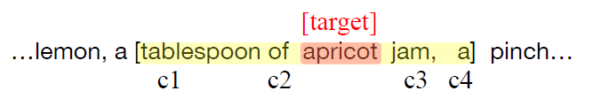

Si addestra un classificatore a cui vengono forniti coppie (parola, contesto), in modo che il modello assegni a ciascuna coppia una probabilità che essa rappresenti un contesto:

* : probabilità che che la parola e il contesto compaiano realmente insieme.
* : probabilità che la coppia non sia valida.

Per la similarità calcoliamo la cosine similarity visto che sono vettori che però dobbiamo normalizzare essendo che non si tratta di una probabilità. L’obiettivo dell’apprendimento è **modificare i vettori delle parole** in modo che:

* sì **massimizzi la somiglianza** tra le coppie (w, c₊), cioè tra la parola target e i **contesti positivi** (quelli che compaiono realmente insieme nei testi);
* sì **minimizzi la somiglianza** tra le coppie (w, c₋), cioè tra la parola target e i **contesti negativi** (parole scelte casualmente che non appaiono in quel contesto).

La funzione di loss usato è la seguente:

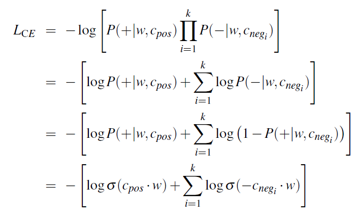

Usiamo lo **stochastic gradient descent (SGD)** per addestrare il modello e ottenere gli embedding per ogni parola target *t* e per ogni parola di contesto che vengono modificati iterativamente per massimizzare la funzione di loss.

Nel modello skip-gram, in realtà si imparano **due rappresentazioni** (embedding) distinte per ogni parola *w*: una come **parola target** (*w*) e una come **parola di contesto** (*c*). Questi due insiemi di vettori sono memorizzati in **due matrici**:

* la **matrice T** (target embeddings)
* la **matrice C** (context embeddings)

In molti casi, le due rappresentazioni vengono **sommate** per ottenere un unico vettore finale che rappresenta la parola *i*. In alternativa, si può **scartare la matrice C** e usare solo i vettori di **T** come rappresentazione finale delle parole.

Due parole hanno una **co-occorrenza di primo ordine** (associazione **sintagmatica**) se **compaiono spesso vicine** l’una all’altra in un testo.
Ad esempio, *wrote* (“scrisse”) è un’associata di primo ordine di *book* (“libro”) o *poem* (“poesia”).

Due parole hanno invece una **co-occorrenza di secondo ordine** (associazione **paradigmatica**) se **hanno vicini simili**, anche se non appaiono necessariamente insieme.
Per esempio, *wrote* è un’associata di secondo ordine di parole come *said* (“disse”) o *remarked* (“osservò”), perché tendono a comparire in contesti simili.

Una proprietà semantica fondamentale degli **embedding** è la loro capacità di **rappresentare relazioni tra parole** ciò che viene chiamato **modello del parallelogramma**.

In pratica, le relazioni semantiche si manifestano **come relazioni geometriche tra vettori**.Ad esempio, nel celebre caso:

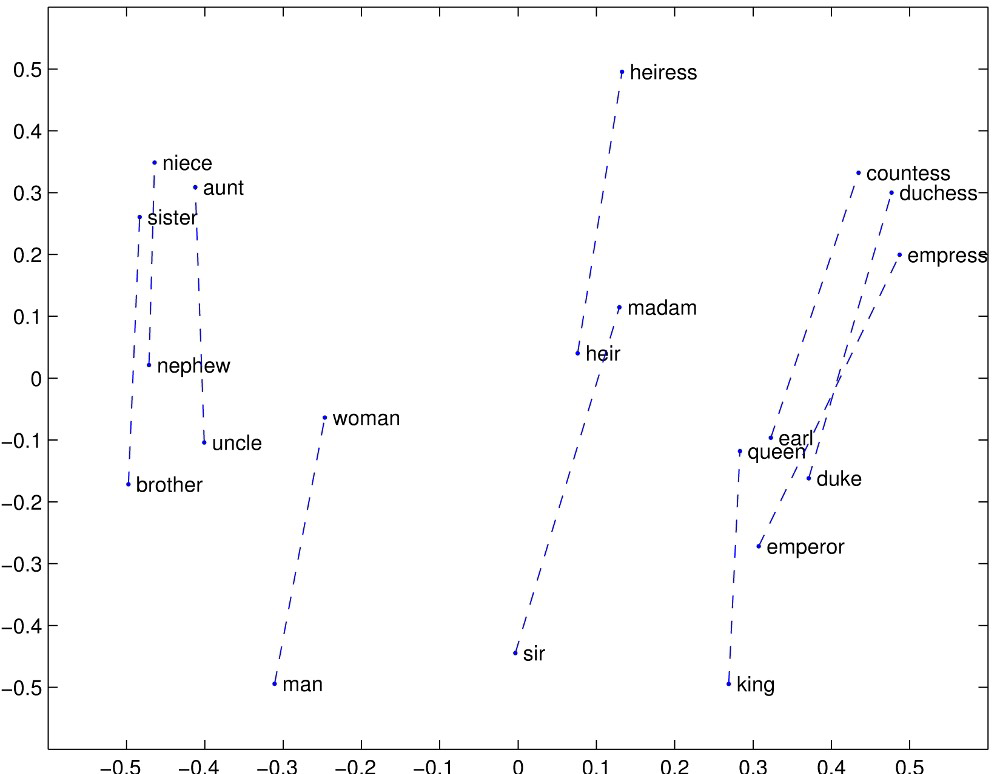Questo significa che la differenza tra *king* e *man* rappresenta una relazione concettuale (“essere di genere maschile”), e aggiungendo *woman* si ottiene un termine semanticamente analogo ma femminile (*queen*).

Gli embedding quindi non memorizzano solo le parole, ma anche **le relazioni latenti** tra di esse come genere, tempo verbale, grado, o categorie concettuali — in modo puramente **vettoriale e continuo**.

# **LLM**

È possibile creare modelli di linguaggio più complessi rispetto al semplice LM basato sulla probabilità bayesiana in cui bisognava modellare esplicitamente la distribuzione e la dipendenza fra le parole. Con le NN è possibile apprendere una funzione che modella dinamicamente la distribuzione delle parole e le relazioni che esistono fra esse.

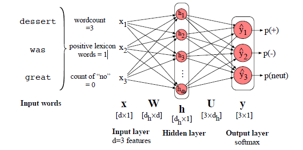

Un primo approccio consisteva nell’andare a creare un dataset da porre in input alla rete che si basa su statistiche della frase messa in input. Il principale problema era la creazione del dataset che non sempre rappresentava informazioni utili per il problema da risolvere.

Una soluzione migliore è stata quella di porre in input gli embeddings delle parole che riuscivano anche a catturare il contesto fra le parole e le relazioni fra loro. La NN ha bisogno che tutti gli input abbino la sessa dimensione quindi se gli embedding non erano tutti uguali si poteva:

* fare il padding con gli zero per i vettori più corti:
* truncate dei vettori più lunghi, ma con l rischio di perdere informazioni
* oppure si poteva calcolare la media fra gli embeddings e porre in input la media. Lo stesso si può fare con il massimo. Questo è detto **pooling**.

I LM modellavano la probabilità di apparire di una parola data una certa sequenza di parole apparse in precedenza. Lo stesso viene fatto con le NN nella fase di forward della rete, ma stavolta le parole sono gli embeddings che permettono una maggiore generalizzazione.

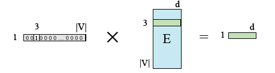

L’input (o più) può essere considerato con una rappresentazione one-hot e moltiplicandolo per la matrice dei pesi degli embeddings selezioniamo la rega rilevante per quella parola. In questo modo creiamo l’embeddings layer che facendolo processare dalla rete produrrà la probabilità della distribuzione sulle parole.

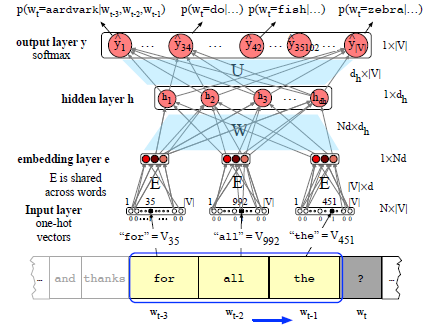

A ogni passo temporale t la rete calcola un embedding d-dimensionale per ciascuno degli N token di contesto (moltiplicando un vettore one-hot per la matrice di embedding E) e concatena i tre per ottenere l'embedding e. Questo embedding e viene moltiplicato per la matrice dei pesi W e quindi viene applicata una funzione di attivazione elemento per elemento per produrre il livello nascosto h, che viene poi moltiplicato per un'altra matrice dei pesi U. Un livello softmax predice a ogni nodo di output i la probabilità che la parola successiva wt sia la parola del vocabolario Vi.

La semplice MLP ha dei limiti nella modellazione del linguaggio. Uno è l’**assenza di memoria**, quindi non può rappresentare dipendenze sequenziale, visto che ogni token è considerato indipendente dagli altri. Per ottenere questo tipo di informazione bisognerebbe impilare l’intera sequenza in input, facendo esplodere dimensione e complessità.

Non è capace di modellare **dipendenze non lineari e a lungo raggio**. Le strutture linguistiche non sono puramente locali e non rispettano confini fissi.

**LLM**

Per tutti questi problemi si è passati a modelli più complessi e con moltissimoi parametri che sono gli **LLM**, **Large Language Models**. Questi sono basati sull’architettura **transformer** (vedi appunti Deep Learning) per costruire **rappresentazioni distribuite** che catturano sintassi, semantica, stile. L’obiettivo non è più solo predire il token successivo, ma generare testo coerente, interagire con l’utente, eseguire ragionamenti e acquisire informazioni implicite.

Alla classica architettura del trasformer viene aggiunta un’altra componente, la

**Language Modelling Head** che ha il compito di produrre una distribuzione di probabilità sui token del vocabolario per la prossima parola.

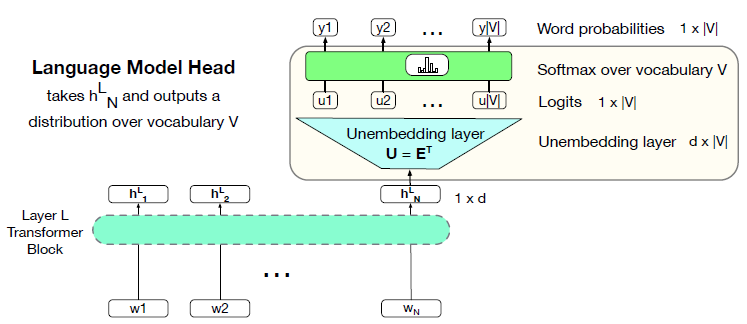

La prima componente è un linear layer che ha il compito di fare una proiezione dall’output che rappresenta l’ultima componente dell’embeddings prodotto dall’ultimo layer del trasformer ([1xd]) al vettore di logit, o score vectore, che ha un singolo score per ogni token del vocabolario ([1xV]).

Questo è chiamato **unembedding layer** e può essere imparato anche se molto spesso è legato alla matrice degli embedding E. Con questo vincolo, **weight typing**, utilizziamo gli stessi pesi per due matrici diverse nel modello, quindi nella fase di input del trasformer, la matrice degli embeddings ([|V|x d]) viene utilizzata per mappare da un vettore one-hot sul vocabolario (di forma [1x|V|]) ad un embedding (di forma [1xd]).

E poi, nella LMH viene trasposta ([dx|V|]) viene utilizzata per mappare di nuovo da un embedding ([1xd]) a un vettore sul vocabolario ([1x|V|]).

Nel processo di apprendimento, E sarà ottimizzato per essere in grado di eseguire entrambe queste mappature.

I logits prodotti da questa trasformazione vengono converti in probabilià con la softmax sul vocabolario.

Possiamo usare queste probabilità per fare cose come assegnare una probabilità a un dato testo. Ma l'uso più importante è generare testo, cosa che facciamo **campionando** una parola da queste probabilità y.

**Sampling**

Il modo più semplice per generare token è quella della **greedy deconding** con il quale prendiamo la parola con la probabilità maggiore:

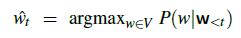

Fa una scelta localmente ottimale, indipendentemente dal fatto che si riveli o meno la scelta migliore a posteriori. Questo rende il modello estremamente prevedibile e il testo risulta essere generico e ripetitivo.

Si può optare per un **random sampling** che estrae **casualmente** una parola secondo la distribuzione di probabilità della parola più probabile. La parola campionata viene reinserita nella sequenza (autoregressivo)

Introduce **variazione e creatività** nella generazione e permette di evitare che il testo si blocchi su ripetizioni monotone, cosa che succede con il greedy decoding. Anche se può generare parole **improbabili o incoerenti** e di conseguenza la qualità del testo può essere molto variabile, specialmente se le probabilità sono uniformi o simili tra molte parole.

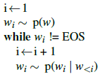

Un’altra tecnica è quella del **temperature sampling** che consiste nello scalare la distribuzione di probabilità prodotta dalla softmax di un fattore .

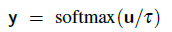

Il risultato è che abbiamo meno probabilità di generare token con una probabilità molto bassa e più probabilità di generare token con una probabilità più alta.

Con un (0,1], il modello è più conservativo (bassa temperatura), quindi questo vuol dire che tende a produrre probabilità più alte per le probabilià che sono già alte, e viceversa. Quindi è poco creativo.

Invece, con un >1, il modello è più creativo (alta temperatura), quindi tramite la softmax tende a produrre probabilità più vicini fra loro riducendo le differenze tra probabilità alte e basse, rendendo più uniforme la distribuzione

Il **top-k sampling** è una generalizzazione della greedy decoding. Invece di scegliere la singola parola più probabile da generare tronchiamo la distribuzione alle prime k parole più probabili.

1. Scegliamo in anticipo un numero di parole k
2. Per ogni parola nel vocabolario V, utilizziamo il modello linguistico per calcolare la verosimiglianza di questa parola dato il contesto p (wt | jw<t)
3. Ordiniamo le parole in base alla loro verosimiglianza e scartiamo qualsiasi parola che non sia tra le prime k parole più probabili.
4. Rinormalizziamo i punteggi delle k parole per ottenere una distribuzione di probabilità legittima.
5. Campioniamo casualmente una parola all'interno di queste restanti k parole più probabili in base alla sua probabilità.
   1. k = 1, il campionamento top-k è identico alla decodifica greedy.
   2. k > 1 ci porta talvolta a selezionare una parola che non è necessariamente la più probabile, ma è comunque sufficientemente probabile, e la cui scelta si traduce nella generazione di un testo più diverso ma comunque di qualità sufficientemente elevata.

Un problema con il campionamento top-k è che k è fisso, ma la forma della distribuzione di probabilità sulle parole varia in contesti diversi. Se impostiamo k = 10, a volte le prime 10 parole saranno molto probabili e includeranno la maggior parte della massa di probabilità, ma altre volte la distribuzione di probabilità sarà più piatta e le prime 10 parole includeranno solo una piccola parte della massa di probabilità. Un'alternativa, chiamata **top-p sampling** o **nucleus sampling**, consiste nel mantenere non le prime k parole, ma la p percentuale superiore della massa di probabilità. Si troncala distribuzione per rimuovere le parole molto improbabili, ma misurando la probabilità piuttosto che il numero di parole.

**Architetture**

Ci sono tre architetture per un LLM:

* encoder
* decoder
* encoder-decoder

L’**encoder-only** accetta come input una sequenza di token e restituisce in output una rappresentazione vettoriale per ciascun token. Gli encoder sono solitamente **masked language models**, cioè che vengono addestrati mascherando una parola e imparando a prevederla osservando le parole circostanti su entrambi i lati.

I modelli encoder non sono modelli generativi, ma vengono utilizzati per creare classificatori, identificare le relazioni fra le parole e nel generare astrazioni.

I **decoder-only**, invece sono utilizzati per produrre testo e quindi sono modelli che sono in grado di predirre la prossima parola sulla base delle altre.

Invece, l’**encoder-decoder** accetta come input una sequenza di token e restituisce in output una serie decoder di token. Ciò che lo differenzia dai modelli solo decoder è che un encoder-decoder ha una relazione molto più flessibile tra i token di input e i token di output, e questi vengono utilizzati per mappare diversi tipi di token. Ad esempio, le architetture encoder-decoder vengono utilizzate per la traduzione automatica, dove i token di input sono in una lingua e i token di output sono in un'altra lingua, e probabilmente di lunghezza diversa

dall'input. Le architetture encoder-decoder vengono utilizzate anche per il riconoscimento vocale, dove l'input è costituito da token che rappresentano il parlato e l'output da token che rappresentano il testo.

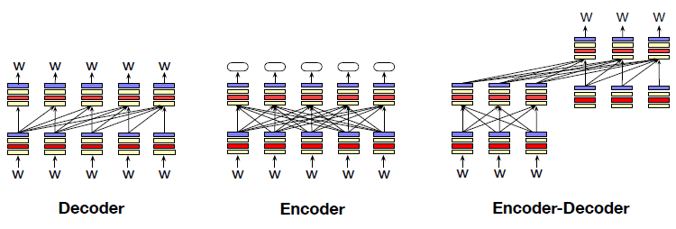

**Pretraining LLM**

Il pretraining del modello (SSL) consiste nell’allenare il modello su una grande quantità di corpora text, che non è necessario etichettare, per imparare le relazioni che esistono fra le parole. L’obiettivo è sempre quello di minimizzare la funzione di loss che per un LLM è definita come:

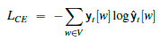

è la distrubuzione per conoscere la parola successiva ed è rappresentatacome un one-hot vector che avrà 1 per la parola che predirà. Quindi al tempo t la CEL può essere semplificata come la negative log probability che il modello assegni alla prossima parola:

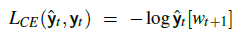

Ad ogni posizione t dell’input il modello prende la sequenza e la usa per calcolare la distribuzione per . Per la , diamo al modello la sequenza per stima la sua probabilità. Questa idea secondo cui forniamo sempre al modello la sequenza cronologica corretta per predire la parola successiva ed è chiamata **teacher forcing**.

L’addestramento di un LLM è molto complesso per via della grande quantità di dati e di risorse hw necessario. Un altro aspetto di quando si allena un LLM è che viene trainato su dati abbastanza generici, per settori specifici potrebbe non essere in gradi di generare del testo coerente e adatta. Quindi è possibile riaddestrare LLM per poterlo adattare a certi task più specifiche.

Questa modalità è detta **fine-tuning** in cui non si riaddestrano completamente i pesi del modello, ma si solo alcune parti, freezando i layer che vogliano che il processo di addestramento modifichi.

**BERT**