**IoT**

**IoT** (**Internet of Things**) refers to the possibility of the object to connect each other, creating a network, to communicate and coordinate via internet to do some action automatically.

Not everything is IoT, for example domotica, is not IoT, because there is always human that ask for an action and not all objects are connect each other.

So, we can consider IoT, also, a network of physical objects that use **sensor** to obtain data, information from the real world, and using API to synchronize their status to modify data and do some action.

**Digital twin** is also IoT. Digital twin is, data-driven virtual replica of a physical object, system, or process, connected to its real-world counterpart through a two-way flow of data from sensors and other sources. This virtual model provides real-time insights, enabling monitoring, simulation, prediction of future behaviour, and optimized decision-making throughout the lifecycle of the physical entity.

The representation of digital twin must not be a 3D copy, but can be, for example, a point in a space.

**Information encoding**

In the IoT device the information is represented in bit, so, only 0 and 1. So, to operate with digital system, we must convert the decimal representation to binary representation. We have some form of representation.

The simplest one is the **unsigned binary representation**, with which, if we have k number of bit to represent a number, we have 0-2K-1possible configuration.

Another method is the **signed binary representation**. In this case we can also represent negative number. The sign of number is the first bit most significative. 0 is used if the number is positive and a 1 is used if it is negative. In this case, we lose information, because a bit is use for the sign of number. Furthermore, this method represents the zero value with two configurations: one positive and one negative. Therefore, the numerical range becomes asymmetric: there is one more negative number than positive numbers.

To resolve this problem, we can represent number with **two’s complements method**. The most significant bit (MSB) indicates the sign. Positive numbers are represented in standard binary form. Negative numbers are obtained using the **two’s complement transformation** of their absolute value. To represent a negative number in two’s complement:

1. Write the absolute value in binary.
2. Invert all the bits (one’s complement).
3. Add 1 to the result.

The representable range with N bits is:

$$[-2^{\left\{N-1\right\};}…; 2^{\left\{N-1\right\}}- 1]$$

(for 8 bits: from –128 to +127).

And zero has a unique representation.

**Fixed point numbers** are numbers for which there is a fixed location of the point separating integers from fractional numbers. Thus, 15.3 is an example of a denary fixed-point number, 1010.1100 an example of a fixed-point binary number.

We have, with the 8-bit binary number, four digits before the binary

point and four digits after it. When two such binary numbers are added by a computing system, the procedure is to recognize that the fixed point is fixed the same in both numbers so we can ignore it for the addition, carry out the addition of the numbers, and then insert in the result the binary point in its fixed position.

Using fixed-point representation can be problematic for very large or very small numbers, because many zeros may appear between the integer part and the point (e.g., 0.000000000000023). To handle this, **scientific notation** is used: the number can be written as 0.23 × 10⁻¹³, 2.3 × 10⁻¹⁴, or 23 × 10⁻¹⁵.

Similarly, a binary number like 0.000001110010 can be represented as 110010 × 2⁻¹² or 11001.0 × 2⁻¹¹. This is called **floating-point representation**.

A floating-point number has the form **a × rᵉ**, where:

* **a** is the mantissa,
* **r** is the base (radix),
* **e** is the exponent.

For binary numbers, the base r = 2, so we write **a × 2ᵉ**. A computing system must store the **sign**, the **mantissa**, and the **exponent**, while the base can be implicit.

**MICROCONTROLLER**

A microcontroller (MCU) is a small computer on a integrate circuit board that is designed to control specific tasks within electronic systems. On the board are built on:

* A processor that runs instructions. Generally, are CPU single core
* Memory to store programs and data. There is not a cache
* Input/Output ports to connect with buttons, sensors, screens, etc.
* Communication ports (to connect with other devices).
* A/D D/A converters
* oscillator that pulses the clock signal (0-40 Hz)

The board, as the CPU, has some pins to communicate with other devices and the external world.

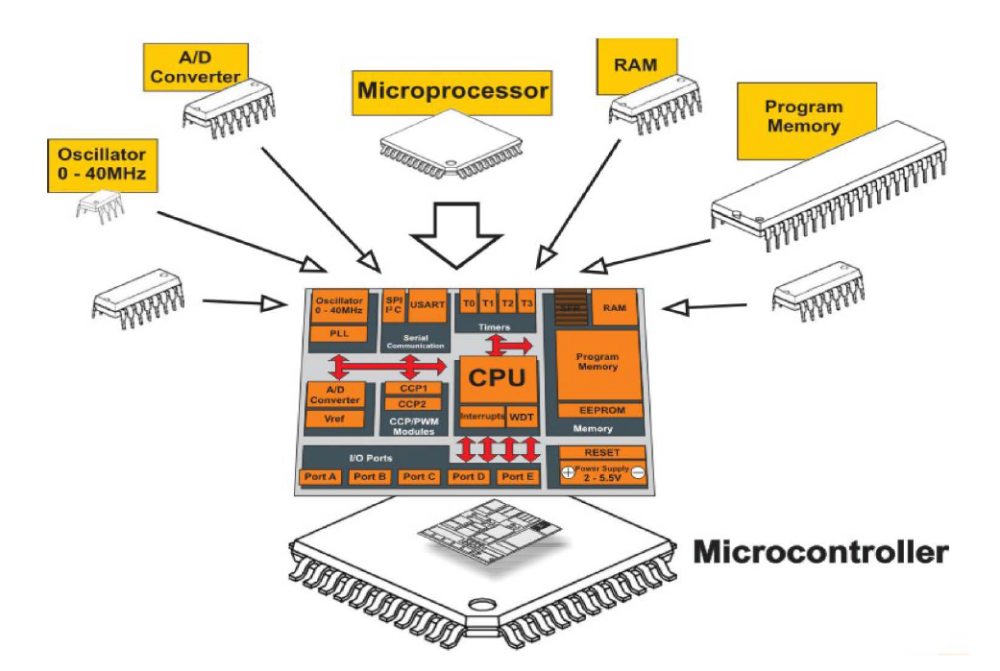

Usually, the microcontroller doesn’t have a OS, because they contain our program. But there are some microcontrollers, such as Raspberry, that have an OS.

Different from the normal CPU, microcontrollers don’t have the possibility to run program in parallel, so they don’t manage threads; have a **RISC (Reduced Instruction Set Computer)**, simplifies the instruction set, using fewer, simpler commands.

**Classification of Microcontrollers by Memory Architecture**

* **Harvard Memory Architecture Microcontroller**
  + Has separate memory for program and data.
  + Allows simultaneous access to both program and data memory, improving efficiency.
  + Common in microcontrollers that require faster data processing.
* **Von Neumann Memory Architecture Microcontroller**
  + Uses shared memory for both program and data.
  + Simplifies design but can be slower since the program and data share the same bus.

Microcontrollers, despite their versatility, can face several common issues. Timing errors can disrupt tasks, as precise clock cycles are essential for proper operation. Power instability may cause resets or unpredictable behaviour, while excessive heat from poor design or high ambient temperatures can damage the chip.

They are also sensitive to electromagnetic and radio-frequency interference, which can induce errors or erratic behaviour. Software bugs or coding mistakes further risk system malfunctions, and security vulnerabilities can expose devices to unauthorized access or malware. Finally, compatibility issues with other hardware can lead to errors or failures.

In short, microcontroller problems arise from physical limitations, software errors, integration challenges, or external threats.

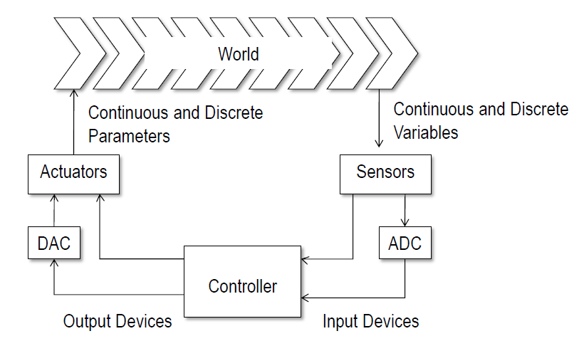

Obv, more controllers can communicate between us to solve same problems, coordinate to manage the action.

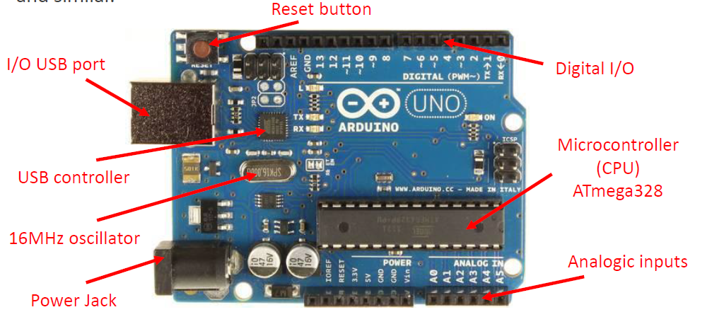

**Arduino**

1. Arduino is an **open-source** embedded board and software too
   1. Arduino board designs use a variety of microprocessors and controllers. The boards are equipped with sets of digital and analog input/output (I/O) pins that may be interfaced to various expansion boards ('shields') or breadboards (for prototyping) and other circuits. The boards feature serial communications interfaces, including USB on some models, which are also used for loading programs. The microcontrollers can be programmed using the C and C++ programming languages, using a standard API which is also known as the **Arduino Programming Language**, inspired by the Processing language and used with a modified version of the Processing IDE.

**SENSOR**

A **sensor** is a device that permit us to observe the real world and obtain some information. Sensor is a part of a **transducer**, an object that convert signal from one form to another physical form.

With sensor we can work in a time domain, so the information are in continuous domain; or in a discrete domain, so we must discretize the analog signal through a **discrete operation** and **quantizate operation**.

Do to that, we use ADC, a device that take in input an analog signal and generate as output a discrete signal.

The discrete operation consists of sample the signal according to:

**Nyquist-Shannon theorem**, it is possible to correctly reconstruct a signal from its samples if:

1. we use an ideal sampler, i.e. based on Dirac pulses.
2. if the signal has limited bandwidth.
3. if we use an fc≥2B.
4. if we use an ideal low-pass filter with fp≥B.

After that, we quantize the sampled signal, so, for each value taken we value the sample by discretizing the Y axis. We create equal intervals with which we divide the Y axis and associate the sample to the lower end of that interval.

Obviously, that operation introduce into the signal same noisy because it is an **approximation process**. When we sample in time, we take the exact value of the analog signal at specific instants. But when we quantize, you can no longer represent the continuous range of amplitudes, instead, we have only a finite set of discrete levels (determined by the number of bits of the ADC use to represent a value).

The **difference** between the real sample value and the quantized level is called **quantization error**. If we want a digital signal, we must code the discrete signal with binary coding.

Some examples of ADC are SAR and flash converter.

The **SAR** (**Successive Approximation**) **ADC** requires that the voltage at the converter input remains constant, at least for the entire duration of the conversion.

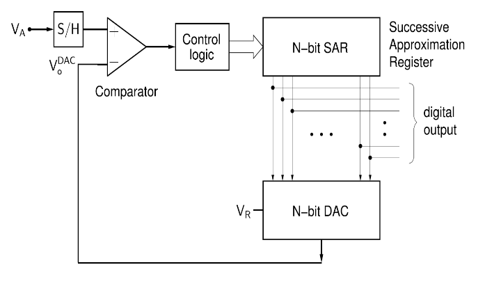It uses an DA converter inserted in a feedback circuit, in which the VDAC voltage produced by the DAC is compared, by means of a comparator, with the analog voltage to be converted Va. The output of the Vo comparator can therefore assume two states.

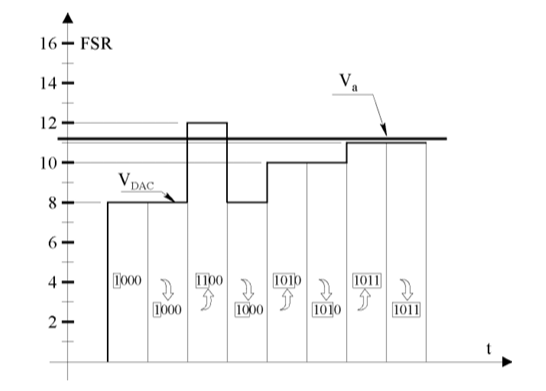

The overall value of the VDAC is now equal to 12q and the comparator will bring its output low. For this reason, the successive approximation register believes that the n-2 bit must be equal to 0 and goes on to determine the n-3 bit, in a perfectly analogous way. That is until VDAC converges into Va.

The quantization error is kept within ± 1/2 q

The entire conversion operation is performed in a number of steps equal to the number of bits n of the converter. The period of the clock pulses, i.e. the duration of each step, must be greater than the sum of the propagation delays of the circuits contained in the feedback loop, i.e. the counter, the DA converter and the comparator. For this reason, the successive approximation converter is not a very fast converter.

Instead, the **AD flash converter** is a fast converter for simultaneous comparison of the analog voltage Va with all possible discrete voltage values.

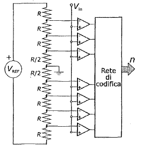The voltage at the other input is obtained by dividing the reference voltage Vref into 2n intervals of amplitude q, by means of calibrated resistances of value R. Only the first and last resistors have different values (respectively R/2 and 3R/2) to centre the indifference interval with respect to the quantization level.

**STATIONARY PARAMETERS**

1. **Sensitivity** is the ratio between the change in the output signal to the transducer and the corresponding change in the input quantity
2. **Resolution** corresponds with the smallest amount that can be measured; that is, with the slightest variation in the input causing an appreciable variation in the output.
3. **Calibration** action that corresponds with the measurement of the output quantity for known values of the input quantity to the transducer itself.
4. **Repeatability** The transducer is able to provide values of the output quantity that are not very different from each other, with the same input signal, in the same working conditions.
5. **Stability** is the ability of the transducer to maintain its operating characteristics unchanged for a certain period of time
6. **Hysteresis** Corresponds with the greatest difference between the two forward and return paths of the output of a transducer during the calibration cycle. It is expressed as a percentage of the full scale (% f.s.).
7. **Linearity** Corresponds with the maximum deviation, expressed in % of f.s., between the calibration curve and a straight reference line.

**DYNAMIC PARAMETERS**

**Response time** When we apply a step stress to the transducer (i.e. a step of the quantity to be measured) the output (response) will vary until it reaches, after a certain time, a new value.

– **rise time**: time taken to go from 10% to 90% of the final value

– **response time**: time taken to reach a predetermined percentage of the final value.

**RESISTIVE SENSORS**

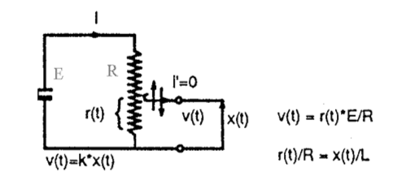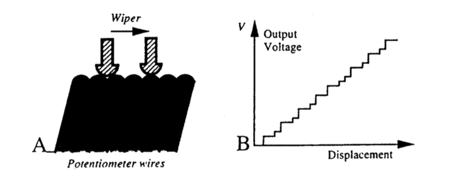**Potentiometric sensors** are devices that measure the linear or angular position of an object by converting mechanical motion into electrical resistance that depends linearly on the length of the conductor.

They consist of

1. A linear or circular resistor along which it slides
2. A cursor attached to the object to be measured
3. An output terminal from which the voltage is taken, a terminal taken from the resistor and one from the slider.

It returns a continuous signal, and the accuracy depends on the slider and resistor. One problem is that the cursor rubbing against the resistor wears it out and the tool loses linearity.

**THERMORESISTIVE SENSORS**

A thermoresistor sensor is a temperature sensor that uses the variation of resistance as a function of temperature. It is based on the fact that some materials change predictably with temperature, according to the law:

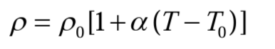

1. **PTC Positive Temperature Coefficient** α>0 and therefore the resistance increases with increasing temperature. Used for overload protection because when the current increases beyond a certain threshold, the PTC resistance increases rapidly, limiting the current.
2. **NTC Negative Temperature Coefficient** α<0 and therefore the resistance decreases with increasing temperature

**Piezoelectric effect** Some materials generate electric charges when subjected to mechanical stress, deformation, etc. This is because the stresses modify the non-symmetrical crystalline structure and by deforming, some charges untie from the crystal and generate charge carriers.

**Piezoresistive effect** (Strain-gauge, Strain-gage) It is the effect of variation of the resistivity of a suitable material when it is subjected to a deformation due to a stress applied to it. Resistivity varies inversely proportional to the force applied and the tension.

**SENSORI OTTICI**

Some examples can be optical **enconders** which are rotary angular position transducers. Their operation is based on whether or not a beam of light passes through. An encoder consists of a serrated disk on the axis of rotation, having binary coding (opaque/transparent corresponds to 0/1). This "marking" is read by an optical system consisting of an emitter (infrared LED) and detector (PHOTODIODE) pair "facing" each other between which the disk is interposed (transversely).

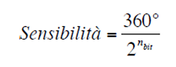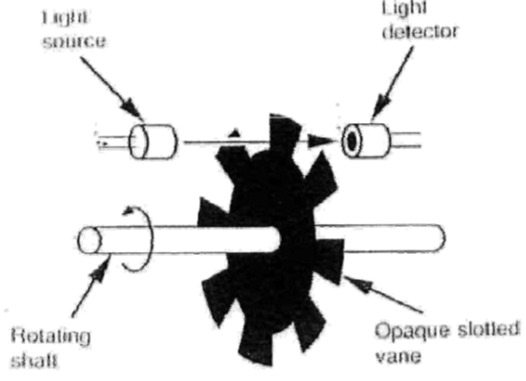

Absolute **encoders** are made up of N tracks with each a different distribution of opaque and transparent CT scans which, as we go inwards, allow us to understand in which part of the turn angle we find ourselves in an increasingly greater position.

The N tracks are hit at the same time thanks to the LEDs present one per track that light up or not depending on whether the use passes and provide a binary code then decoded with the **Grey code** in which two consecutive numbers differ from each other at most by a single bit. The reason why this particular coding is used is to minimize reading errors because only one bit changes for each number, which does not happen with normal binary code.

Incremental **encoders** it can be said that the (single) output of this type of transducer is a square wave having a frequency directly proportional to the angular speed of rotation of the axis. A single optical transducer reads a circular crown characterized by a "uniform hatch marking".

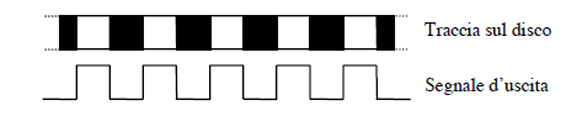

The incremental encoder has THREE outputs, two of which provide as many square waves as possible in quadrature (90° out of phase) in order to be able to obtain the direction of rotation (which is impossible if the output were unique); the third gives a single "rectangular pulse" at the angular position of zero (reference):

**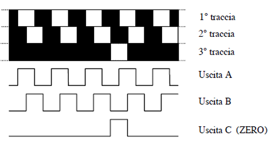**

**ULTRASONIC SENSORS**

The time-of-flight transducer measure distance using an electromagnetic wave is based on emitting a signal that travels until it collides with an object that causes electromagnetic wave to reflect and is sent back to the emitter which measures the time and calculates its distance.

**SMART SENSOR**

To use a sensor, we generally need to add signal conditioning circuitry, such as circuits which amplify and convert from analog to digital, to get the sensor signal in the right form, take account of any nonlinearities, and calibrate it. Additionally, we need to take account of drift, that is, a gradual change in the properties of a sensor over time. Some sensors have all these elements taken care of in a single package; they are called smart sensors.

The term smart sensor is thus used in discussing a sensor that is integrated with the required buffering and conditioning circuitry in a single element and provides functions beyond that of just a sensor.

Microcontrollers have multiple **General-Purpose Input/Output** (GPIO) pins and can be easily configured to implement **Maxim/Dallas semiconductor’s 1-Wire protocol**.

The 1-Wire data interface is reduced to the absolute minimum (single data line with a ground reference). The protocol is called 1-Wire because it uses 1 wire to transfer data.

1-Wire architecture uses a pull-up resistor to pull voltage off the data line at the master side.

Master and slave can be receivers and transmitters but transfer only one direction at a time (half duplex). The master initiates and controls all 1-Wire operations

It is a bit-oriented operation with data read and write, Least Significant bit (LSb) first, and is transferred in time slots

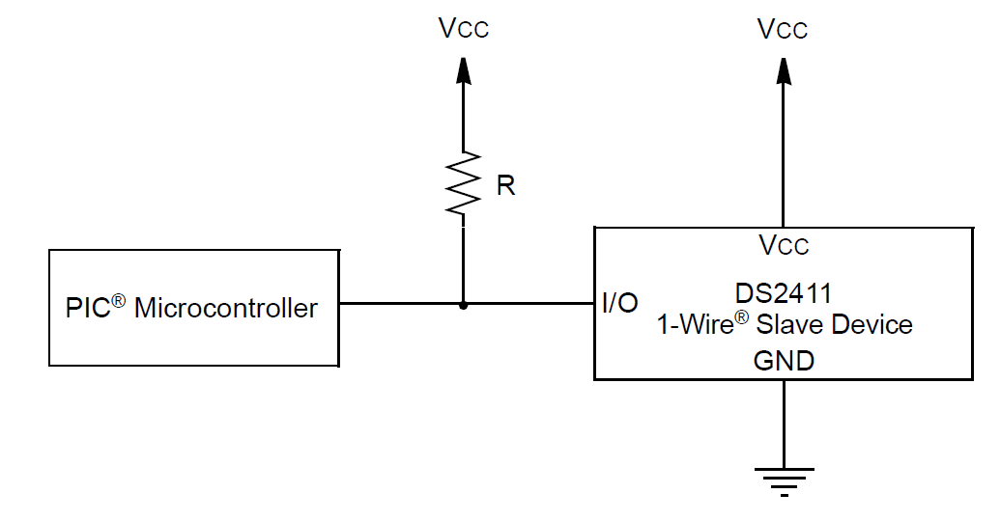

They system clock is not required as each part is self-clocked and synchronized by the falling edge of the master.

1. The four basic operation of a 1-Wire bus are Reset, Write 0 bit, Write 1 bit and Read bit.

The bust master initializes and controls all og the 1-Wire communication. A communication sequence starts when the bus master drives a defined length “Reset” pulse that synchronizes the entire bus. Every slave responds to the “Reset” pulse with a logic-low “Presence” pulse.

**SWITCH**

Switch generates an on/off signal that determines the that makes or breaks the circuit. Switches are available with normally open (NO) or normally closed (NC) contacts or can be configured as either by choice of the relevant contacts.

A problem with mechanical switches is that when a switch is closed or opened, **bounce** can occur, and the contacts do not make or open cleanly. This means that, when we press on the switch, metallic contact doesn’t pass instantly from open to close, or vice versa, due to their elasticity and mechanical vibrations, the contacts **bounce** several times before stabilizing. This “bounce” may produce amplitudes that change logic levels over perhaps 20 ms, and so a single switch change may give rise to a number of signals rather than just the required single one. There are several ways of eliminating these spurious signals. One way is to include in the software program a delay of approximately 20 ms after the first detected signal transition before any further signals are read.

**ACTUATORS**

Actuators are device that permit us to do some action in the real world. They are controlled by microcontroller. They can be use, also, to represent the condition of the circuit.

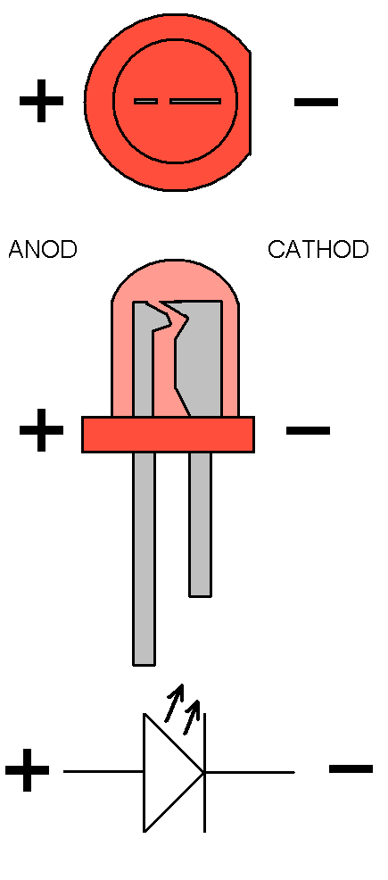A **LED** (***Light Emitting Diode***) is a simple actuator that turn on/off when it is alimented by current. In general, they are formed by a diod.

On the Arduino board, if we connect use the thirteen pins, it generates the input, but not only; it is connected to a LED build in the board, that can be used for debug.

An LED has two terminals: **anode** (+) and **cathode** (−). It must be plugged in properly, otherwise it won't light up.

Generally, good brightness is achieved by keeping the current between 10-20 mA. A **protective series resistor is always required** to ensure an acceptable current value without burning the component.

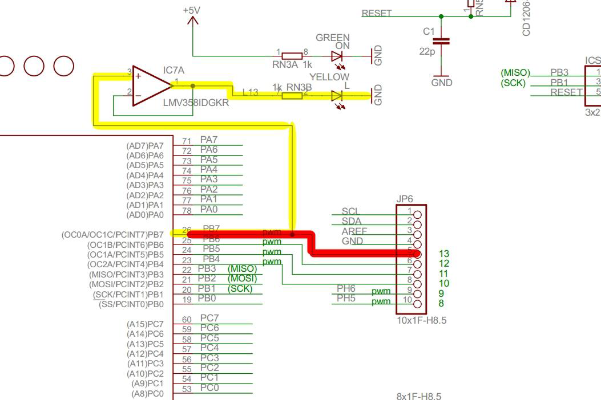

LED: a semiconductor diode that, when directly biased (forward biased), emits light thanks to the phenomenon of **electroluminescence**.

The color of the light emission depends on the semiconductor materials used

The behavior of the diode depends on the polarization applied to its terminals:

1. **Direct bias**: If the **anode** terminal is connected to a higher potential than the **cathode**, the potential barrier is reduced, and the diode conducts **current**.
2. **Reverse bias**: If the cathode is at a higher potential than the anode, the potential barrier strengthens and the diode **blocks the current**, unless the breakdown voltage is exceeded.

You can't connect an LED directly to a higher voltage source, it will burn out. A series resistor is needed to limit the current to the maximum value allowed for that LED.

**Forward voltage**: the minimum voltage after which the LED begins to conduct and illuminate; it depends on the color and the material

**RELAY**

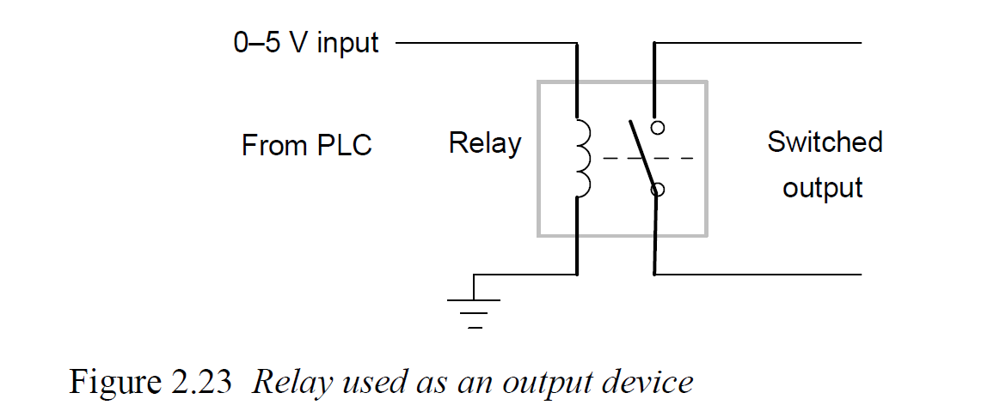The relay is a device used to control high current or voltage in a circuit. It’s formed by a solenoid, so, when current through in it, a magnetic field is produced and attracted ferrous metal. The consequence is the switch open and break the circuit.

**MOTORS**

**DC Motors** DC motors are alimented by DC current, and when the current pass in it, a cylinder of ferromagnetic material (**armature**) begin to rotate due to the current the magnetic field produced by permanent magnets.

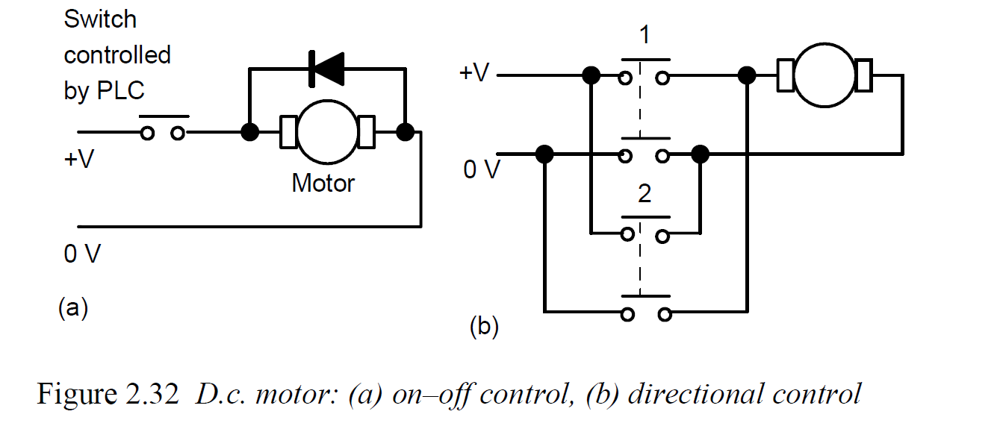

DC motor can be:

* **on-off control**, so when we press the button, the motor begins to rotate. In parallel on the motor, we can find a diode with the scope to limits the current intensity.
* **directional control**, this configuration permits us to control the rotation verse.

The speed of rotation can be change by changing the size of current to the armature. However, the voltage is fixed, so the increment of the current is obtained by electronic circuit. This can control the average value of the voltage, and hence current, by varying the time for which the constant DC voltage is switched on. The term **pulse width modulation** (**PWM**) is used because the width of the voltage pulses is used to control the average DC voltage applied to the armature.

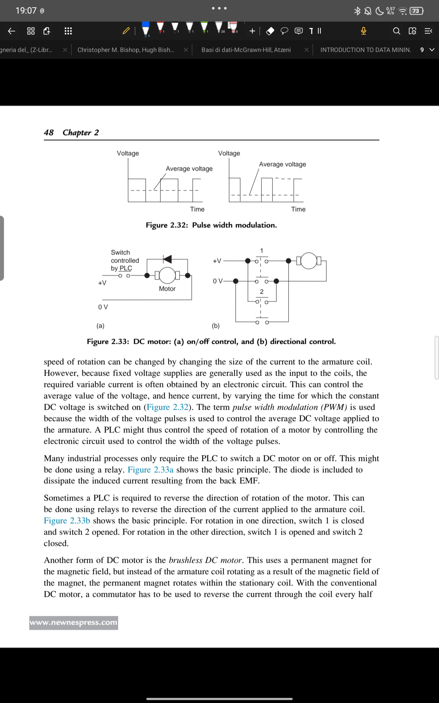

**Stepper motors** This type of motors produce a rotation through equal angles,

the **steps**, for each digital pulse supplied to its input- Thus, if one input

pulse produces a rotation of 1.8°, then 20 such pulses would give a rotation of 36.0° To obtain one complete revolution through 360°, 200 digital pulses would be required. The motor can thus be used for accurate angular positioning.

If a stepping motor is used to drive a continuous belt, it can be used to give

accurate linear positioning. Such a motor is used with computer printers, robots, machine tools, and a wide range of instruments for which accurate positioning is required.

**Smart Output**

There are actuators already controlled by a microcontroller or a digital circuit. In this case, they require a specific input defined with a communication protocol.

**Finite State Machines**

**COMMUNICATION PROTOCOL**

Th IoT applications can be an aggregation of different network where the devices can exchange messages to collaborate.

The communication protocols are based on the TCP/IP protocol. They could use TCP/IP protocol, but the IoT devices have low power consumption, use of limited bandwidth, the must be connected also when the connection is unstable… things that TCP/IP protocol doesn’t ensure because it projected for the computers that are more powerful than IoT devices.

There are several lightweight communication protocols designed for IoT and resource-constrained devices. These protocols usually run on top of the TCP/IP stack (sometimes directly on UDP) and are much simpler than heavy ones like HTTP.

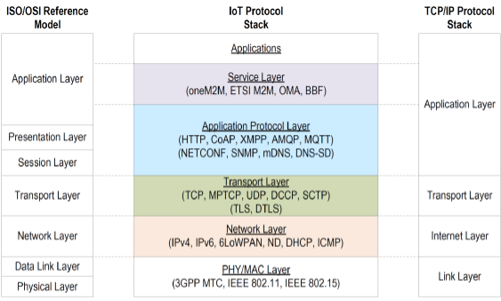

**Service Layers** ->Handles the physical transmission of data and basic data link functionalities. Deals with energy-efficient communication methods suitable for resource-constrained devices.

**Application Layers** ->Handles application-specific communication. CoAP (Constrained Application Protocol) and MQTT (Message Queuing Telemetry Transport) are particularly designed for IoT, offering lightweight alternatives to HTTP for constrained devices.

**Transport Layer** ->Ensures reliable data transfer. UDP is often preferred over TCP.TLS and DTLS provide security at this layer.

**Network layer** ->Manages addressing and routing. 6LoWPAN is particularly important for IoT as it allows IPv6 to be used over low-power wireless networks.

**PHY/MAC Layer** ->Provides standardized interfaces and common services for IoT applications, enabling interoperability between different IoT systems and platforms.

Not all IoT devices implement all layers of the protocol stack. The implementation varies depending on the device's capabilities, energy constraints, and intended use.

**Serial Communication**

This type of communication is used to communicate from the internal communication of the IoT devices. Meanwhile, the communications protocols are used to communicate with the external devices.

In this typer of communication, bits are transmitted thought one channel of communication in a sequential way, the same as the sender transmitted them.

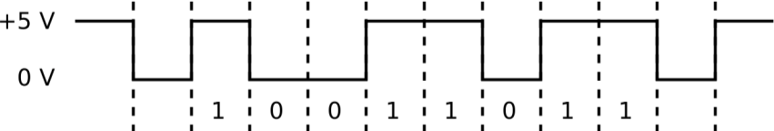

Generally, the bit 1 were written when the voltage is not 0; while the bit 0 were written with a zero voltage. However, this approach is quite sensitive to noise and interference, since all the information travels through just one line.

For this reason, single-ended serial communication has often been replaced by **differential signaling** techniques. In differential communication (such as RS-422, RS-485, or CAN bus), the signal is transmitted over two complementary wires. Instead of interpreting absolute voltage levels, the receiver reads the voltage difference between the two lines. This makes the communication far more resistant to electrical noise and allows for longer transmission distances and higher reliability.

The communication can be synchronous or asynchronous.

**Synchronous serial transmission** With this configuration RX and TX can use an additional common clock line to synchronize themselves with the clock signal, or the clock can be encoded into the data.

The clock line solution is simpler but may introduce problems in terms of distance. Meanwhile, the coding solution could be better.

One of the simplest schemes is **NRZ (Non-Return to Zero)**. In NRZ, a “1” might be represented by a high voltage and a “0” by a low voltage, and the signal stays at that level for the entire duration of the bit. The advantage is its simplicity and efficiency: every bit directly corresponds to a signal level. However, NRZ has a major weakness: if we have a long sequence of identical bits, for example a long string of zeros, the signal does not change for a while. This makes it hard for the receiver to keep track of timing and synchronization, since it relies on transitions to understand when one bit ends and the next begins.

To address this, more sophisticated methods such as **Manchester encoding** were introduced. In Manchester, every bit includes a transition in the middle of its time slot. Typically, a “0” is a transition from high to low, and a “1” is a transition from low to high. This ensures that the signal is always changing, which makes synchronization much easier. The cost, however, is that we need more bandwidth: because every bit contains two signal changes, the data rate is effectively halved compared to NRZ.

A variation of this idea is the **BMC (Biphase Mark Code)**. Like Manchester, it guarantees frequent transitions, but it follows a slightly different rule: there is always a transition at the start of every bit, and if the bit is a “1” there is an additional transition in the middle. This creates a clear pattern that is robust against errors and noise, though it also requires more bandwidth than NRZ.

Finally, there is **block coding**, which takes a different approach. Instead of encoding each bit individually, it groups bits into blocks and maps them into longer codewords. A well-known example is 4B/5B coding, where every group of 4 bits is translated into a 5-bit sequence. The extra bit may seem like wasted space, but the point is to avoid long runs of identical bits and to guarantee enough transitions for synchronization. This method strikes a balance between efficiency and reliability, and it is often used in real-world communication standards.

**Asynchronous serial transmission** In this case, RX and TX have two different clock signals. They have the same frequency, but have different phase, because if TX and RX were in phase, then both would switch (edge) at exactly the same time: the TX would change the data line just as the RX is trying to sample it. In that case, the receiver might read an unstable or undefined value, because the signal has not yet settled.

The **data is launched on one clock edge** (for example, the rising edge) and **sampled on the opposite clock edge** (for example, the falling edge). This introduces a half-period phase difference, which gives the data line enough time to stabilize before being read. On the RX side, a clock with a frequency that is a multiple of the baud rate (communication frequency) is used (8x,16x,24x...).

To synchronize the clocks, RX must be able to recognize an event (a transition) on the single data line. Usually 1 byte (8 bit) data packets are transmitted as follows:

* **start bit** indicates the start of the packet and is used for synchronization
* **payload** actual data
* **parity bit** used for error detection in RX
* **stop bit** one or more bits to indicate the end of the packet

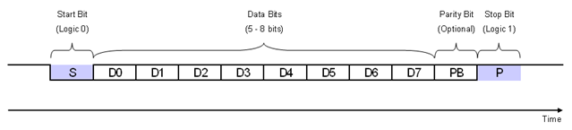

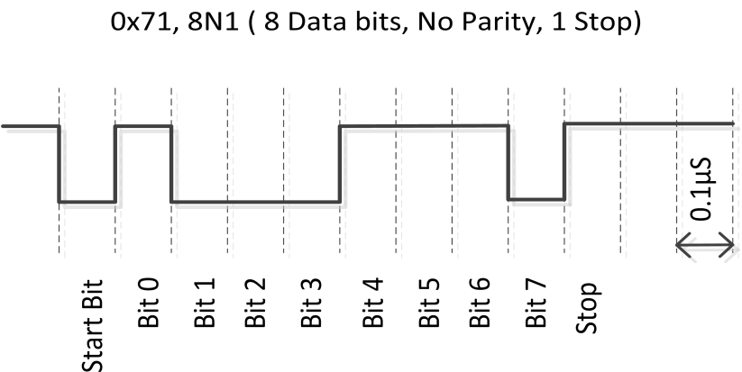

Among various serial standards most used in embedded systems.

**I2C** Is a synchronous, serial communication protocol designed to connect multiple integrated circuits using just **two wires**:

* **SDA (Serial Data Line):** carries the data.
* **SCL (Serial Clock Line):** carries the clock signal, generated by the master device
* and the **GND** where are connected all the devices.

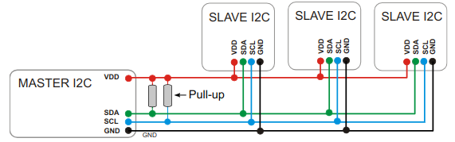Its architecture is a master/slave, so one device acts as the **master**, controlling the clock and initiating communication. Other devices act as **slaves**, each with a unique 7-bit (or sometimes 10-bit) address.

In the absence of communications, SCL is constantly at 1.

Communication begins with a **start condition** on the bus SDA, pulled low while SCL is high, and it ends with a **stop condition** where SDA goes high while SCL is high. These patterns are recognized by all devices on the bus.

When the SDA put start condition on the bus, SCL after a little time, go to 0. From this moment, data is sent in **8-bit bytes** and read from the destination slave. After each byte, the receiver must send an **ACK (acknowledge bit)** to confirm that the byte was received correctly. The reading happened on the edge of the signal.

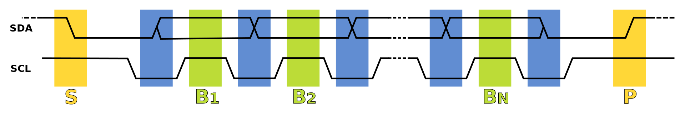

7 bits are used as address bit, so we can have 2^7 address, 16 of which are reserved

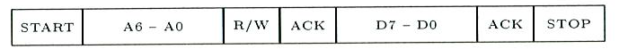

**SPI (Serial Peripheral Interface) protocol** Is a synchronous serial communication protocol designed for high-speed, short-distance communication, usually between a microcontroller (the master) and one or more peripherals (the slaves). Unlike I²C, which uses only two wires, SPI typically uses four main lines:

* **MOSI** (**Master** **Out**, **Slave** **In**): Data sent from master to slave.
* **MISO** (**Master** **In**, **Slave** **Out**): Data sent from slave to master.
* **SCLK** (**Serial** **Clock**): Clock generated by the master to synchronize communication.
* **SS/CS** (**Slave** **Select** or **Chip** **Select**): A separate line used to activate a specific slave device. To choose a slave, the signal is set to low.

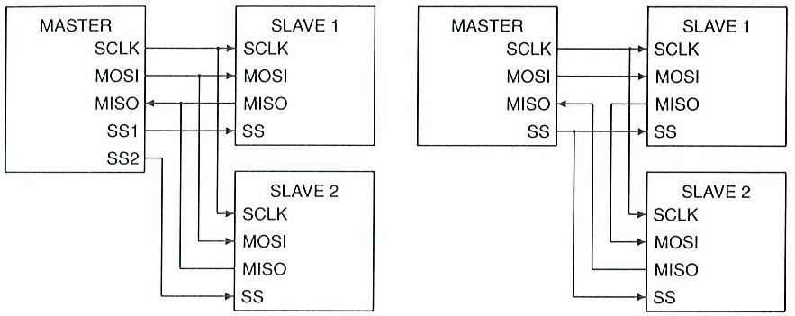

If we want more slave, we can configurate the net as **daisy chain connections**. This mean that the master communicates to data to a slave, and then this is responsible for sending data to receiver slave.

After selecting the slave by setting SS to 0, the clock is transmitted on SCLK, and the synchronous full-duplex communication begins.

1. Both devices load their8-bit data into their respective shift registers.
2. Master activates the SCLK (Serial Clock) line
3. On each clock pulse:
   1. The master device shifts out one bit from its register to the MOSI line.
   2. The slave device shifts in this bit from MOSI into its register.
   3. Simultaneously, the slave device shifts out one bit to the MISO line.
   4. The master device shifts in this bit from MISO into its register.

After 8 clock pulses, a full byte has been exchanged between devices.

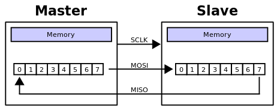

**RS-232 (Recommended Standard 232)** is a serial communication standard introduced for connecting computers and peripheral devices. It is an asynchronous communication protocol.

The RS-232 serial interface uses a **UART** (**Universal Asynchronous Receiver Transmitter**) protocol. RS-232 is **point-to-point**: it connects just two devices, usually a **DTE (Data Terminal Equipment)** like a computer and a **DCE (Data Communication Equipment)** like a modem.

This standard defines electronical layer. Use the **Unbalanced** transmission where there is only one line for transmission.

**RS-485 (Recommended Standard 485)** is a differential serial communication standard, it supports multiple devices on the same bus and can operate in half-duplex or full-duplex mode, depending on the setup.

Data is transmitted over two complementary wires, usually called **A** and **B**. The receiver reads the signal based on the **voltage difference** between the two lines rather than the absolute voltage.

**GLOBAL ARCHITECTURE**

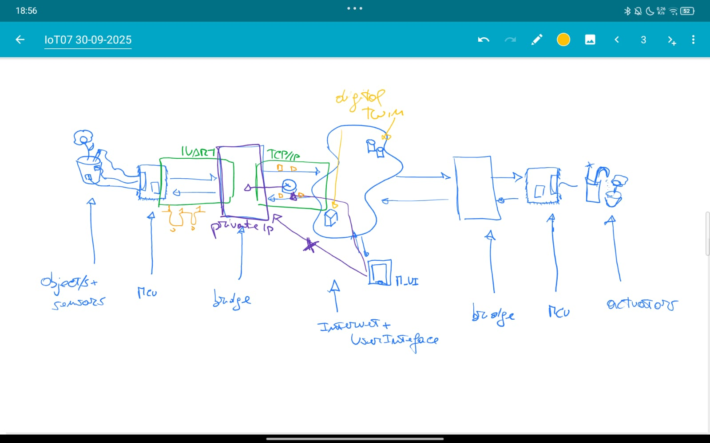

The **bridge** is a device that work as a universal traductor between physical sensors world and that a digital network. The bridge translates I²C, SPI, UART to TCP/IP, HTTP o MQTT. The bridge permits all devices that are connect in the net, to talk.

**Filter and data collector**: Instead of sending every single raw measurement to the cloud, it can do initial processing, filter out noise or irrelevant values, and then send only what is really needed. This reduces network traffic and speeds up operations.

Finally, the bridge can work **bidirectionally**. Not only does it collect data from sensors and send it to the cloud, but it can also receive command from cloud e transmit to actuators.

In the bridge, work AI component of the IoT system. So, with this, can update the state of the digital twin on the base of the real object. Another bridge can read the state and send to actuators commands to act in the real world.

**MQTT**

MQTT (Message Queuing Telemetry Transport) is a light-weight communication protocol for IoT devices that allow this to communicate spending less energy, computational power etc... respect to HTTP protocol. MQTT is based on TCP, it extends the TCP/IP stack, so it uses socket to create a communication channel between two endpoints.

It is a **publish/subscriber protocol**, where some device publics data, and who is interested to this data, sign itself to a **topic** where he can receive it. Publisher e subscriber doesn’t communicate directly, but there is a **broker** that intermediates. An MQTT broker is a server that receives all messages from the clients and then routes the messages to the appropriate destination clients. The communication is asynchronous in this way.

A version for sensor network exists (**MQTT-SN**), where TCP is substituted by UDP to transfer small messages (es. measurements, commands, etc.) since TCP is too complex for WSNs.

Topic can be identified by a flat or hierarchical name:

* **flat names** *sensors/*
* **Hierarchical names** are composed of labels separated by /. For example: */nodes/1/sensors/temp*

Topic subscriptions can exploit wildcards

* ‘+’ is used to represent a generic string at the specified tree level, e.g. “nodes/+/sensors” can be used to subscribe to “nodes/1/sensors”, “nodes/2/sensors”, etc.
* ‘#’ is used to represent a sub-tree, e.g. “nodes/#” subscribes to whatever topic whose name starts with “nodes/”

MQTT can be set with three types of reliability, called also **quality of service Qos**:

1. **Qos0, fire and forget**, based on TCP functionality. So, if the message has same problem during the transport, TCP try to resend it, until it arrives at destination, but this doesn’t mean that devices obtain the message.
2. **Qos1, at least once**, in this case sender send the massage until it receives the PUBACK. The message is memorized and re-sent every time, until the PUBACK is not received. The message can be duplicate considering that any control is done.
3. **Qos2, deliver exactly one**, the message is sent only one time. The receiver when receiving it memorize the message\_id to recognize duplicates and send PUBREC, that is not an ACK. PUBREC indicates, only that the message has been received e to communicate to sender, he can delete the message. The sender, after that, send PUBREL to notify that he has deleted the message when the receiver obtains PUBREL, delete the message\_id and send PUBCOMP to notify the receiver the end of communication.

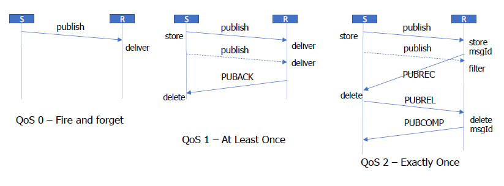

MQTT QoS levels can be coupled with additional setting at the broker side, to ensure delivery of messages also in presence of client disconnectors

* **RETAINED message**: The broker stores the last message for a specific topic. Each client that subscribes to that topic will receive the message immediately after subscribing. For each topic only one retained message will be stored by the broker.
* **PERSISTENT session**: The broker stores all the relevant information about clients: all subscriptions, all QoS 1-2 data not confirmed since the client was offline.

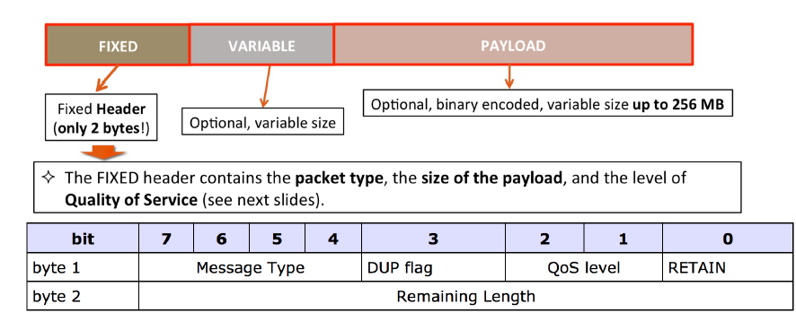