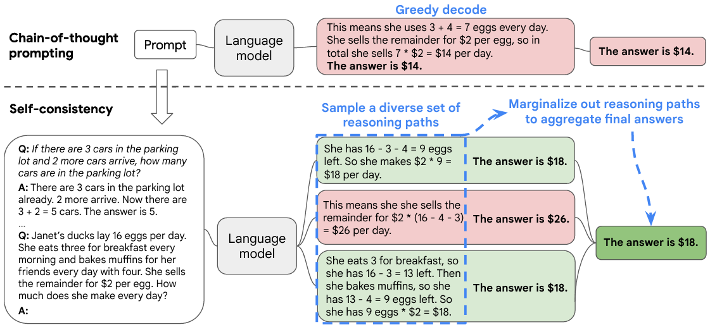

# Chain of Thought (CoT) Prompting

> Stato: #active
> Concetto Chiave: **Scomposizione Logica**
> Parent: [[2_Reasoning]]

Il **Chain of Thought (CoT)** è una tecnica di ragionamento basata sul prompting che consente agli agenti di pensare step-by-step, per risolvere problemi complessi. Invece di richiedere al modello di saltare direttamente dalla domanda alla soluzione, il CoT forza il sistema a "pensare ad alta voce". CoT è una serie di passaggi interemedi di ragionamento che portano al risdultato finale, e si riferisce a questo approccio come **chain-of-thought prompting**.

Nel prompting standard, i modelli di linguaggio tendono a rispondere direttamente alla domanda, senza esplicitare il processo di ragionamento che li ha portati alla risposta massimizzando la probabilità condizionata della risposta $y$ dato l'input $x$:

$$y^* = \arg\max_y P(y | x)$$

In questo scenario, il modello deve "comprimere" tutta la logica risolutiva in un singolo passaggio di calcolo (il passaggio attraverso i layer del Transformer).

Invece, con il CoT prompting, si introducono una sequenza di variabili latenti esplicite $z = \{z_1, z_2, \dots, z_n\}$, dove ogni $z_i$ rappresenta un "pensiero" o un passaggio logico intermedio. La distribuzione di probabilità congiunta diventa:

$$P(y, z_1, \dots, z_n | x) = \left( \prod_{i=1}^{n} P(z_i | x, z_{<i}) \right) P(y | x, z_{1 \dots n})$$

Questo aiuta il modello a comprendere meglio il problema e a generare risposte più accurate, soprattutto per problemi che richiedono più passaggi di ragionamento.

1. **Riduzione della Distanza Semantica:** Ogni $z_i$ riduce il gap logico tra $x$ e $y$, rendendo ogni singolo passo di predizione statisticamente più probabile e meno soggetto a drift.
2. **Allocazione Computazionale:** Poiché il costo computazionale di un LLM è proporzionale al numero di token generati, la CoT permette al modello di utilizzare più FLOPs per risolvere il problema (più token = più calcolo).
3. **Interpretabile:** La sequenza $z$ fornisce una traccia esplicita del processo di ragionamento, facilitando il debug e la comprensione del modello.

Esistono diverse varianti di CoT:

* **Few-Shot CoT:** Fornire al modello alcuni esempi $(x, z, y)$ nel prompt per mostrare lo stile di ragionamento desiderato.
* **Zero-Shot CoT:** Utilizzare il trigger prompt *"Pensiamo passo dopo passo"* (Kojima et al., 2022) per attivare la scomposizione logica senza esempi.
* **Self-Consistency:** Generare molteplici catene $z^{(k)}$ indipendenti e selezionare la risposta $y$ tramite voto di maggioranza:

$$y^* = \arg\max_y \sum_{k=1}^K \mathbb{1}(y_k = y)$$

!!!quote Reference
    [Chain-of-Thought Prompting Elicits Reasoning in Large Language Models](https://arxiv.org/abs/2201.11903)

## Self-consistency with CoT (CoT-SC)

La **Self-conistency** si basa sul concetto che i compiti di ragionamento complessi ammettono molti percorsi di ragionamento che conducono a una risposta corretta. 

Questa tecnica, migliora la CoT, basato su un greedy coding, introducendo un processo di decodifica più robusto che *campiona* molteplici catene di pensiero e *seleziona* la risposta più coerente tra quelle generate.
 
{width=70% height=70%}

Si base sul concetto che più modi di pensare che portano alla stessa risposta corretta aumentano la probabilità che quella risposta sia effettivamente corretta. Inoltre, evita la ripetitività e l'ottimalità locale che affliggono la decodifica avida, mitigando al contempo la stocasticità di una singola generazione campionata. La CoT-SC è una tecnica non supervisionata quindi, non richiede annotazioni umane aggiuntive ed evita qualsiasi addestramento aggiuntivo, modelli ausiliari o messa a punto. 

L'autoconsistenza differisce anche da un tipico approccio d'insieme in cui vengono addestrati più modelli e gli output di ciascun modello vengono aggregati, agendo più come un "auto-insieme" che funziona su un singolo modello linguistico. 

Assumiamo che le risposte generate $a_i$ appartengano a un insieme fisso di risposte $\mathbb{A}$, dove $i = 1, \dots, m$ indica gli $m$ output candidati campionati dal decoder del modello.

Dato un prompt e una domanda, la tecnica introduce una **variabile latente aggiuntiva** $r_i$: una sequenza di token che rappresenta il percorso di ragionamento (*reasoning path*) nell' $i$-esimo output. La generazione avviene in coppie $(r_i, a_i)$, dove il percorso $r_i$ è finalizzato al raggiungimento della risposta finale $a_i$ ($r_i \rightarrow a_i$).

Dopo aver campionato multiple coppie $(r_i, a_i)$, la Self-Consistency applica una **marginalizzazione** su $r_i$ attraverso un voto di maggioranza su $a_i$. La risposta selezionata è quella che risulta più "consistente" (frequente) nell'insieme finale:

$$\text{arg max}_a \sum_{i=1}^m \mathbb{1}(a_i = a)$$

Oltre al semplice voto di maggioranza, è possibile pesare ogni coppia $(r_i, a_i)$ in base alla sua probabilità condizionata $P(r_i, a_i | \text{prompt, question})$. Per evitare che la lunghezza dell'output influenzi negativamente il punteggio, si utilizza spesso una **normalizzazione della probabilità** basata sulla lunghezza $K$ (numero totale di token):

$$P(r_i, a_i | \text{prompt, question}) = \exp \left( \frac{1}{K} \sum_{k=1}^K \log P(t_k | \text{prompt, question, } t_1, \dots, t_{k-1}) \right)$$

Il voto di maggioranza semplice (*unweighted*) produce spesso un'accuratezza simile alla somma pesata normalizzata. Questo accade perché i modelli linguistici tendono a considerare i diversi percorsi di ragionamento generati come "similmente probabili".
La somma pesata **normalizzata**, invecem produce risultati nettamente superiori rispetto alla versione non normalizzata.
L'utilizzo di una media pesata (dove ogni $a$ riceve un punteggio pari alla sua somma pesata divisa per la frequenza $\sum_{i=1}^m \mathbb{1}(a_i = a)$) risulta in prestazioni significativamente peggiori.

!!!quote Reference
    [Self-consistency improves chain of thought reasoning in language models](https://arxiv.org/abs/2203.11171)

## Tree of Thoughts (ToT)

Il **Tree of Thoughts** (**ToT**), generalizza CoT prompting, consentendo l'esplorazione di unità coerenti di testo (*pensieri*) che fungono da passaggi intermedi verso la risoluzione dei problemi.

Il ToT permette ai modelli linguistici (LM) di intraprendere un processo decisionale deliberato, considerando molteplici percorsi di ragionamento differenti e valutando autonomamente le proprie scelte per decidere la successiva linea d'azione; consente inoltre di guardare avanti o tornare sui propri passi (backtracking) quando necessario per compiere scelte globali.

In ToT, definiamo il problema come una ricerca in uno spazio di stati. Ogni stato $s$ è rappresentato da una tupla che include l'input $x$ e la sequenza di pensieri $z$ generati fino a quel momento:

$$s = [x, z_1, z_2, \dots, z_i]$$

Il framework si articola su quattro pilastri algoritmici:

1. **Decomposizione del Pensiero:** Si definisce l'unità semantica $z$ (es. una riga di codice, un passaggio matematico).
2. **Generatore di Pensieri $G(p_\theta, s, k)$:** Data una posizione attuale $s$, il modello genera $k$ possibili passi successivi:

$$\{z_{i+1}^{(j)}\}_{j=1}^k \sim p_\theta(z_{i+1} | s)$$
3. **Funzione di Valutazione $V(p_\theta, \{s\})$:** Un'euristica (spesso lo stesso LLM con un prompt specifico) assegna un valore a ogni stato per determinarne la fattibilità:$$v = V(p_\theta, s) \in [0, 1] \text{ o } \{\text{sure, likely, impossible}\}$$
4. **Algoritmo di Ricerca:** Si sceglie come navigare l'albero.
- **BFS (Breadth-First Search):** Esplora tutti i rami a un dato livello prima di passare al successivo. Ideale per task con orizzonte limitato.
- **DFS (Depth-First Search):** Segue un ramo fino in fondo. Se $V$ scende sotto una soglia, esegue il backtracking al nodo precedente.

Il ToT mantiene attivamente un albero di pensieri, in cui ogni pensiero è una sequenza linguistica coerente che funge da passaggio intermedio verso la risoluzione del problema. Tale unità semantica di alto livello permette al modello linguistico di autovalutare i progressi compiuti dai diversi pensieri intermedi verso la soluzione, attraverso un processo di ragionamento deliberato anch'esso istanziato nel linguaggio. Quale ramo intraprendere è determinato da euristiche che aiutano a navigare nello spazio del problema e guidano il risolutore verso una soluzione. Questa prospettiva evidenzia due carenze fondamentali degli approcci esistenti che utilizzano i modelli linguistici per risolvere problemi generali:

1) A livello locale, non esplorano diverse continuazioni all'interno di un processo di pensiero (i rami dell'albero).
2) A livello globale, non incorporano alcun tipo di pianificazione, previsione o backtracking per aiutare a valutare queste diverse opzioni — il tipo di ricerca guidata da euristiche che sembra caratteristico della risoluzione dei problemi umana.

Il ToT risolve il problema della **"miopia degli LLM"**. In un processo CoT standard, se il modello commette un errore logico al passaggio 2, tutta la catena successiva è compromessa (effetto deriva). Nel ToT:

* L'agente può "guardare avanti" per vedere se un sentiero porta a un vicolo cieco.
* L'agente può scartare rami deboli, ottimizzando le risorse sui percorsi più promettenti.

!!!quote Reference
    [Tree of Thoughts: Deliberate Problem Solving with Large Language Models](https://arxiv.org/abs/2305.10601)