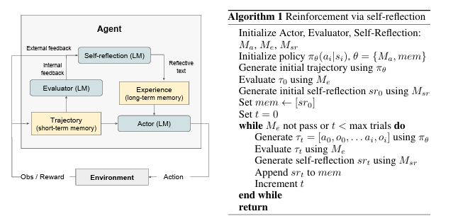

# Reflection

> Stato: #active
> Concetto Chiave: **Rinforzo Verbale**
> Parent: [[2_Reasoning]]

**Reflextion** è una riflessione che utilizza il rinforzo verbale per aiutare gli agenti ad apprendere dai fallimenti precedenti. Reflexion converte il feedback binario o scalare proveniente dall'ambiente in un feedback verbale sotto forma di sintesi testuale, che viene poi aggiunta come contesto addizionale per l'agente LLM nell'episodio successivo. Questo feedback auto-riflessivo agisce come un segnale di gradiente "semantico" fornendo all'agente una direzione concreta su cui migliorare, aiutandolo ad apprendere dai propri errori passati per ottenere prestazioni migliori nel compito. Questo processo è simile a come gli esseri umani imparano iterativamente a compiere compiti complessi in modalità *few-shot*: riflettendo sui fallimenti precedenti per formare un piano d'attacco migliorato per il tentativo successivo.

## Panoramica del Framework Reflexion

Un agente di Reflection impara a ottimizzare il proprio comportamento per risolvere compiti di decision-making, programmazione e ragionamento attraverso prove, errori e auto-riflessione. Generare un feedback riflessivo utile è impegnativo, poiché richiede una buona comprensione di dove il modello ha commesso errori, nonché la capacità di generare una sintesi contenente intuizioni azionabili per il miglioramento. Esploriamo tre modi per farlo: 
- feedback ambientale binario semplice, 
- euristiche predefinite per casi di fallimento comuni
- auto-valutazione, come la classificazione binaria tramite LLM (decision-making) o test unitari scritti autonomamente (programmazione).
  
{width=70% height=70%}

Reflexion presenta diversi vantaggi rispetto agli approcci di RL (Apprendimento per Rinforzo) più tradizionali, come l'apprendimento basato su policy o valore: 1) è leggero e non richiede il fine-tuning del LLM, 2) consente forme di feedback più sfumate (ad esempio, modifiche mirate nelle azioni), rispetto a ricompense scalari o vettoriali con cui è difficile eseguire un'accurata assegnazione del credito, 3) permette una forma di memoria episodica più esplicita e interpretabile sulle esperienze precedenti, e 4) fornisce suggerimenti più espliciti per le azioni negli episodi futuri. Allo stesso tempo, presenta gli svantaggi di fare affidamento sulla potenza delle capacità di auto-valutazione del LLM (o sulle euristiche) e di non avere una garanzia formale di successo. Tuttavia, con il miglioramento delle capacità dei LLM, ci aspettiamo che questo paradigma migliori nel tempo.

**Attore (Actor)**: è LLM specificamente istruito (*prompted*) per generare il testo e le azioni necessari condizionati dalle osservazioni di stato. Analogamente alle configurazioni RL tradizionali basate su policy, campioniamo un'azione o una generazione, $a_t$, dalla policy attuale $\pi_\theta$ al tempo $t$, e riceviamo un'osservazione dall'ambiente $o_t$. Inoltre, aggiungiamo una componente di memoria *mem* che fornisce ulteriore contesto a questo agente. Questo adattamento è stato ispirato  utilizzando l'apprendimento nel contesto (*in-context learning*).

**Valutatore (Evaluator)**: La componente Valutatore del framework Reflexion gioca un ruolo cruciale nel valutare la qualità degli output generati prodotti dall'Attore. Prende in input una traiettoria generata e calcola un punteggio di ricompensa che riflette le sue prestazioni all'interno del contesto del compito dato. Definire funzioni di valore e ricompensa efficaci che si applichino agli spazi semantici è difficile, quindi analizziamo diverse varianti del modello Valutatore. Per i compiti di ragionamento, esploriamo funzioni di ricompensa basate sulla classificazione *exact match* (EM), assicurandoci che l'output generato sia strettamente allineato con la soluzione attesa. Nei compiti di decision-making, impieghiamo funzioni euristiche predefinite, adattate a specifici criteri di valutazione. Inoltre, sperimentiamo l'uso di una diversa istanza di un LLM stesso come Valutatore, generando ricompense per compiti di decision-making e programmazione. Questo approccio sfaccettato alla progettazione del Valutatore ci permette di esaminare diverse strategie per il punteggio degli output generati, offrendo intuizioni sulla loro efficacia e idoneità in una gamma di compiti.

**Auto-riflessione (Self-reflection)**
Il modello di Auto-riflessione, istanziato come un LLM, svolge un ruolo cruciale nel framework Reflexion generando auto-riflessioni verbali per fornire feedback preziosi per le prove future. Dato un segnale di ricompensa scarso (*sparse reward*), come uno stato di successo binario (successo/fallimento), la traiettoria attuale e la sua memoria persistente *mem*, il modello di auto-riflessione genera un feedback sfumato e specifico. Questo feedback, che è più informativo delle ricompense scalari, viene poi memorizzato nella memoria dell'agente (*mem*). Ad esempio, in un compito decisionale multi-fase, quando l'agente riceve un segnale di fallimento, può dedurre che una specifica azione $a_i$ ha portato alle successive azioni errate $a_{i+1}$ e $a_{i+2}$. L'agente può quindi dichiarare verbalmente che avrebbe dovuto intraprendere un'azione diversa, $a'_i$, che avrebbe portato a $a'_{i+1}$ e $a'_{i+2}$, e memorizzare questa esperienza nella sua memoria. Nelle prove successive, l'agente può sfruttare le sue esperienze passate per adattare il suo approccio decisionale al tempo $t$ scegliendo l'azione $a'_i$. Questo processo iterativo di prova, errore, auto-riflessione e persistenza della memoria consente all'agente di migliorare rapidamente la propria capacità decisionale in vari ambienti utilizzando segnali di feedback informativi.

**Memoria (Memory)**
Componenti fondamentali del processo Reflexion sono i concetti di memoria a breve e lungo termine. Al momento dell'inferenza, l'Attore condiziona le sue decisioni sulla memoria a breve e lungo termine, in modo simile a come gli esseri umani ricordano dettagli recenti a grana fine e allo stesso tempo richiamano importanti esperienze distillate dalla memoria a lungo termine. Nella configurazione RL, la cronologia della traiettoria funge da memoria a breve termine, mentre gli output del modello di Auto-riflessione sono memorizzati nella memoria a lungo termine. Queste due componenti di memoria lavorano insieme per fornire un contesto specifico ma influenzato dalle lezioni apprese in diverse prove, il che rappresenta un vantaggio chiave degli agenti Reflexion rispetto ad altri lavori sulla scelta delle azioni nei LLM.

## Il processo Reflexion

Reflexion è formalizzato come un processo di ottimizzazione iterativo. Nella prima prova, l'Attore produce una traiettoria $\tau_0$ interagendo con l'ambiente. Il Valutatore produce quindi un punteggio $r_0$ che viene calcolato come $r_t = M_e(\tau_0)$. $r_t$ è solo una ricompensa scalare per la prova $t$ che migliora all'aumentare delle prestazioni specifiche del compito. Dopo la prima prova, per amplificare $r_0$ in una forma di feedback che possa essere utilizzata per il miglioramento da un LLM, il modello di Auto-riflessione analizza l'insieme di $\{\tau_0, r_0\}$ per produrre una sintesi $s_{r0}$ che viene memorizzata nella memoria *mem*. $s_{rt}$ è un feedback di esperienza verbale per la prova $t$. I modelli Attore, Valutatore e Auto-riflessione lavorano insieme attraverso prove in un ciclo finché il Valutatore non ritiene che $\tau_t$ sia corretta. Come menzionato, la componente di memoria di Reflexion è cruciale per la sua efficacia. Dopo ogni prova $t$, $s_{rt}$ viene aggiunta a *mem*. In pratica, limitiamo *mem* a un numero massimo di esperienze memorizzate, $\Omega$ (solitamente impostato su 1-3), per rispettare i limiti massimi di contesto del LLM.

!!!quote Reference
    [Reflexion: Language Agents with Verbal Reinforcement Learning](https://arxiv.org/abs/2303.11366)