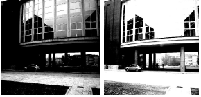
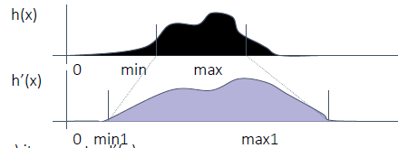
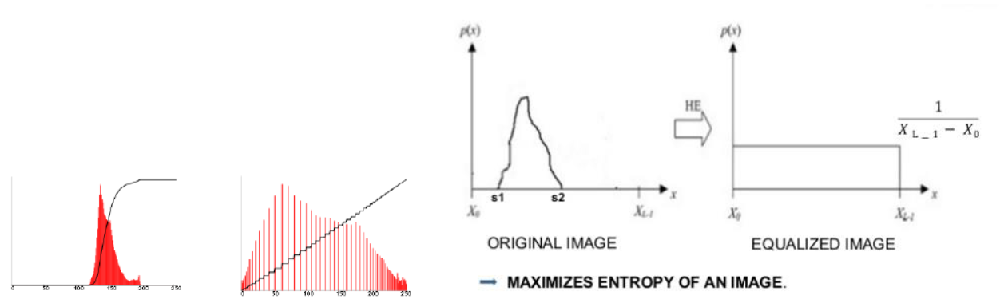
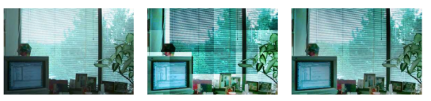
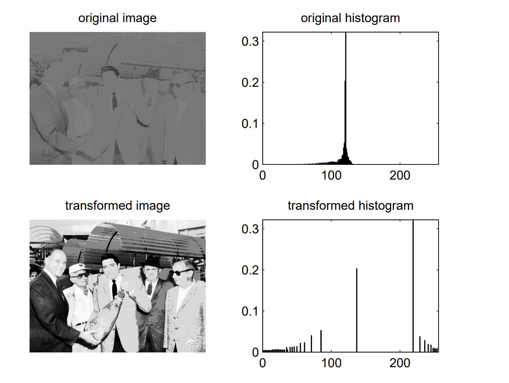
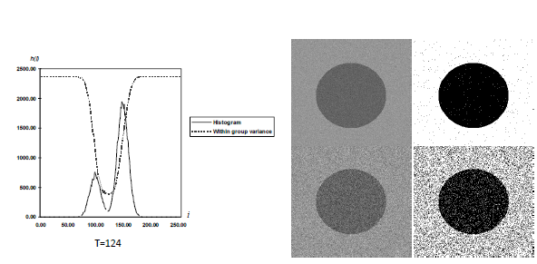
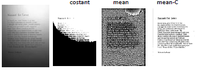
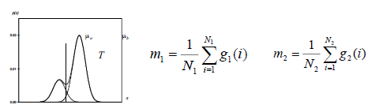

# Image_Processing

Parent: [[0-Computer_Vision_MOC]]


Image processing focuses on transforming images—inputting an image and outputting a modified version. Its primary goals include improving image quality (e.g., noise reduction, contrast enhancement), resizing, and extracting low-level features. It uses mathematical operations and algorithms that do not necessarily "learn" from data.

There are three main type of operation that differ each other based on the spatial scope of the input pixels used to compute each output pixel.

1. **Point operators**: where each output pixel’s value depends on only corresponding value. The output value $I'(x,y)$ depends solely on the input value $I(x,y)$. For videos, an **(M+1) D structure**, point operators $I_t'(x) = h(I_t(x))$ are applied frame-by-frame, often to adjust brightness or contrast over the **time dimension**.
2. **Local (Neighborhood) operators** involve a "kernel" or mask that moves over the image, mathematically combining a pixel with its neighbors
3. **Global operators**: require information from every pixel in the image to determine the value of a single output pixel. (e.g., Fourier transform)

## Linear point operator

A linear point operator is a function that take one or more input image and produce an output image.

$$g\left(x\right)=h\left(f\left(x\right)\right) \text{ or } g\left(x\right)=h\left(f\_{0}\left(x\right),…,f\_{n}\left(x\right)\right)$$

where x is in D-dimensional domain of input and output function $f()$ and $g()$, which operate over some _range_, which can be scalar or vector. While \_
$h()$ is the operator that transforms an image to another image after an image processing operation. If the $h()$ transformation is linear they obey the superposition principle

$$h\left(f_{0}+f_{1}\right)=h\left(f_{0}\right)+h\left(f_{1}\right)$$

and it can be written as:

$$g\left(x\right)=h\left(f\left(x\right)\right)=s \cdot f\left(x\right)+k$$

where:

- s is the **scale factor**, often called also _gain or_ **_contrast_**
- k is the **shifting constant** often called also bias or **brightness**

<div align=center>



</div>

and this is the **Luminance Variation** **operation**. Increasing brightness moves the entire histogram toward the right, while changing the gain expands or narrows the **dynamic range**

Because the change is linear, the relative distribution of pixels remains the same, though they occupy different "bins" in the histogram.

**Linear Blending** is a point operator used to combine two images into a single output. It is a weighted average of pixel values, where the resulting image $I'$ is a linear combination of two source images, $I1$ and $I2$. Th equation is:

$$g\left(x\right)=h\left(f_{0}(x), f_{1}(x)\right)=\left(1-α\right)f_{0}\left(x\right)+αf_{1}\left(x\right)$$

**Contrast Stretching** (**normalization**) is a **point operator** used to expand the **dynamic range** of an image. The goal is to take a "low-contrast" image — where the pixels are clustered in a narrow portion of the histogram — and stretch them to occupy the full range of available values (e.g., $0$ to $255$ for an 8-bit image).

If the original pixel values range from $[min, max]$, the linear transformation for each pixel $I(x,y)$ is:

$$I'(x,y)=(I(x,y)-min) \cdot \frac{L-1}{max-min}$$

- $(I(x,y)-min)$: Shifts the histogram so the lowest value starts at 0.
- $\frac{L-1}{max-min}$: Scales the values so the highest value reaches the maximum limit L-1 (e.g., 255).
- Scale Factor = $\frac{L-1}{max-min}$



Maintains the original "shape" of the distribution thing that equalization does not.

**Histogram Equalization** is a non-linear point operator designed to improve image contrast by redistributing pixel intensities so that they follow a uniform distribution. It is based on PDF and CDF relationship. The CDF acts as a mapping function. By applying the CDF to each pixel value, the algorithm "stretches" the most frequent intensity levels (peaks in the histogram) and "compresses" the less frequent ones.

<div align=center>



</div>

This process modifies entire image. In same case can be useful apply different kind of equalization in different region of image. Dividing a image into pieces is not a good idea because the resulting image is a blocking artifact. Instead, we can use a **moving window**, to recompute the histogram, and even if it is a sloe process, the resulting image is clearer and uniform. This is a **neighbourhood operation**.

<div align=center>



</div>

Because equalization attempts to create a uniform distribution, it often over-stretches the contrast in areas with high pixel frequency and images may look or metallic because the subtle **photometric** gradients are replaced by extreme transitions. Equalization treats these small noise variations as "features" to be stretched, resulting in an higher entropy level.

<div align=center>



</div>

A spike in the PDF leads to a very steep slope in the **Cumulative Distribution Function (CDF)**. When this steep CDF is used as a mapping function, its "pushes" neighbouring grey levels far apart, creating visible banding (contouring) and leaving large empty gaps in the resulting histogram.

## TASK: Thresholding

Thresholding is a punctual operator which consists in the selection of a value T of brightness (intensity) capable of dividing the image into 2 regions of pixels with intensity greater or less than T. It transforms the input image $I(x, y)$ into a binary image $g(x, y)$ based on value T:

$$g(x,y) = \begin{cases} 1 & \text{if } I(x,y) > T \\ 0 & \text{if } I(x,y) \leq T \end{cases}$$

A "good" threshold is one that minimizes the error of misclassifying background pixels as objects (and vice versa). From the perspective of the **histogram as a PDF**, a good T lies in the region between two peaks (bimodal distribution).

- **Global Thresholding**: A single T is used for the entire image. This works well if the energy distribution is uniform.
- **Local/Adaptive Thresholding**: If the image has varying luminance (e.g., shadows), a single T fails. In this case, T is calculated locally for different neighborhoods.

### Otsu thresholding

Otsu’s method is a classic global thresholding algorithm used to automatically perform clustering-based image thresholding. It assumes the image contains two classes of pixels (background and foreground) following a bi-modal histogram.

The good threshold is one that

- **Minimizing within-group variance** $\sigma^2_W(T)$ (maximizing internal homogeneity).
- **Maximizing between-group variance** $\sigma^2_B(T)$ (maximizing the separation between classes).

1. First, we compute the normalized histogram of the image. For an 8-bit image with $L=256$ intensity levels, the probability of occurrence of each intensity level $i$ is defined as:$$P(i) = \frac{n_i}{n}$$ Where $n_i$ is the number of pixels with intensity $i$ and $n$ is the total number of pixels in the image.
2. For a chosen threshold $t$, the pixels are divided into two classes: $C_1$ (intensities $[0, t]$) and $C_2$ (intensities $[t+1, L-1]$). The weights $q_1(t)$ and $q_2(t)$ represent the probability that a pixel belongs to the respective class:
   $$q_1(t) = \sum_{i=0}^{t} P(i), \quad q_2(t) = \sum_{i=t+1}^{L-1} P(i) = 1 - q_1(t)$$
3. Then, we then calculate the average intensity (mean) and the dispersion (variance) for each class. These values are dependent on the threshold $t$:
   - **Class Means:** $$\mu_1(t) = \sum_{i=0}^{t} \frac{i P(i)}{q_1(t)}, \quad \mu_2(t) = \sum_{i=t+1}^{L-1} \frac{i P(i)}{q_2(t)}$$
   - **Class Variances:** $$\sigma_1^2(t) = \sum_{i=0}^{t} \frac{[i - \mu_1(t)]^2 P(i)}{q_1(t)}, \quad \sigma_2^2(t) = \sum_{i=t+1}^{L-1} \frac{[i - \mu_2(t)]^2 P(i)}{q_2(t)}$$

4. The core logic of Otsu’s method is to find the threshold that results in the most "compact" classes. This is achieved by minimizing the **within-class variance** $\sigma_W^2(t)$, which is the weighted sum of variances of the two classes: $$\sigma_W^2(t) = q_1(t)\sigma_1^2(t) + q_2(t)\sigma_2^2(t)$$ In practice, it is often easier to maximize the **between-class variance** $\sigma_B^2(t)$, as it avoids the expensive calculation of individual class variances: $$\sigma_B^2(t) = q_1(t)q_2(t)[\mu_1(t) - \mu_2(t)]^2$$ Maximizing $\sigma_B^2(t)$ yields the same optimal threshold $t^*$ as minimizing $\sigma_W^2(t)$, but with significantly fewer floating-point operations.
5. The optimal threshold $t^*$ is found by exhaustively searching through all possible intensity levels (0 to 255) to find the value that minimizes the within-class variance:
   $$t^* = \arg \min_{0 \le t < L} \sigma_W^2(t)$$ Instead of computing $\sigma_W^2(t)$ directly, we can compute $\sigma_B^2(t)$ for each threshold and select the one that maximizes it, which is computationally more efficient. $$t^* = \arg \max_{0 \le t < L} \sigma_B^2(t)$$

```python
hist = torch.histc(im.float(), bins=256, min=0, max=255)

bin_counts = torch.sum(hist)
prob = hist/bin_counts

min_sigma_w = torch.inf
threshold = 0
intensities = torch.arange(256).float()

for i in range(0, 255):
    p1 = prob[:i+1]
    p2 = prob[i+1:]

    i1 = intensities[:i+1]
    i2 = intensities[i+1:]

    q1 = torch.sum(p1)
    q2 = torch.sum(p2)

    if q1 == 0 or q2 == 0:
        continue

    mean1 = torch.sum(i1 * p1) / q1
    mean2 = torch.sum(i2 * p2) / q2

    sig1 = torch.sum(((i1 - mean1) ** 2) * p1) / q1
    sig2 = torch.sum(((i2 - mean2) ** 2) * p2) / q2

    sig_w = q1*sig1 + q2*sig2

    if sig_w < min_sigma_w:
        min_sigma_w = sig_w
        threshold = i

threshold
```



### Adaptive thresholding

It is local operator used to binarize images that suffer from **non-uniform lighting conditions**, such as shadows or gradients. Unlike global methods, adaptive thresholding calculates a unique threshold for every pixel based on its surrounding neighborhood.

Common methods for calculating the local threshold $T$ include:

- $T = \text{mean}(W)$
- $T = \text{median}(W)$
- $T = \frac{\max(W) - \min(W)}{2}$

<div align=center>



</div>

In practice, simply using the mean often captures too much noise in uniform areas. The refined formula is:$$T = \text{mean}(W) - C$$$C$ (Constant): A fine-tuning parameter (determined by the global noise floor). It acts as a "safety margin" to ensure that slightly dark background pixels aren't mistakenly classified as objects due to local variance.

Adaptive thresholding is used when illumination is not uniform across an image. Instead of using a single global threshold $T$, it computes $T$ locally within a window $W(i, j)$ centered at each pixel.

#### The Ridler-Calvard Algorithm (Iterative Thresholding)

The algorithm **Ridler-Calvard Algorithm** (often associated with **Linda Shapiro** and **George Stockman**). It is essentially a **one-dimensional K-means clustering** algorithm applied to the image histogram.

The core idea is to find a threshold $T$ that is exactly halfway between the average intensities of the two groups it creates.

1. **Initialization**: Choose an initial guess for the threshold, $T^{(0)}$. A common choice is the global mean intensity of the entire image: $$T^{(0)} = \frac{1}{N} \sum_{i,j} I(i,j)$$
2. **Segmentation**: Partition the pixels into two groups based on the current threshold $T^{(k)}$:
   - **Object ($G_1$):** All pixels with intensity $> T^{(k)}$
   - **Background ($G_2$):** All pixels with intensity $\le T^{(k)}$
3. **Compute Group Means**: Calculate the average intensity for each of the two groups:
   - $\mu_1^{(k)}$: The mean intensity of pixels in $G_1$.
   - $\mu_2^{(k)}$: The mean intensity of pixels in $G_2$.

4. **Update**: Calculate the new threshold as the average of these two means: $$T^{(k+1)} = \frac{\mu_1^{(k)} + \mu_2^{(k)}}{2}$$
5. **Termination**: Repeat steps 2 through 4 until the threshold converges (i.e., $T^{(k+1)} = T^{(k)}$ or the difference is below a tiny epsilon).

### Thresholding in RGB Space

Thresholding in RGB involves defining a range for the Red, Green, and Blue channels independently. A pixel is "selected" only if all three components fall within their respective bounds.

$I(x, y)$ is an object pixel if:

$$R_{min} < R < R_{max} \quad \text{AND} \quad G_{min} < G < G_{max} \quad \text{AND} \quad B_{min} < B < B_{max}$$

- **Pros:** Straightforward for primary colors (Pure Red is $[255, 0, 0]$).
- **Cons:** **Extremely sensitive to lighting.** If the brightness changes, all three values ($R, G, B$) shift simultaneously, making it very difficult to define a single "color" range that works in both shadows and highlights.

### Thresholding in HSV Space

HSV (Hue, Saturation, Value) is usually the "Gold Standard" for color-based thresholding because it aligns closer to how humans perceive color.

1. **Illumination Invariance:** You can set a wide range for **Value** (to handle shadows) while keeping a very tight range for **Hue** (to capture a specific color like "Safety Vest Orange").
2. **Intuitive Ranges:** To find "Green," you only need to look at one channel (Hue) rather than trying to balance ratios of Red and Blue in the RGB space.

```python
import torch

def hsv_threshold(im_rgb: torch.Tensor, h_range: tuple, s_range: tuple, v_range: tuple):
    # Note: Assuming im_rgb is [3, H, W]
    # In a real scenario, use a conversion function or kornia.color.rgb_to_hsv
    im_hsv = rgb_to_hsv_pseudo(im_rgb)

    # Create masks for each channel
    h_mask = (im_hsv[0] >= h_range[0]) & (im_hsv[0] <= h_range[1])
    s_mask = (im_hsv[1] >= s_range[0]) & (im_hsv[1] <= s_range[1])
    v_mask = (im_hsv[2] >= v_range[0]) & (im_hsv[2] <= v_range[1])

    # Final mask is the intersection of all three
    final_mask = h_mask & s_mask & v_mask
    return final_mask.to(torch.uint8) * 255
```

## TASK: Clustering

### NN Clustering

It is a method of grouping pixels based on their intensity values. It is a simple form of clustering that assigns each pixel to the nearest cluster center based on its intensity. The algorithm iteratively updates the cluster centers until convergence, where the cluster centers no longer change significantly. Every pixel is assigned to the "cluster center" (mean intensity) that is numerically closest to its own value.



**Process:**

1. Define $K$ initial intensity centers.
2. Assign each pixel to the nearest center.

3. **Repeat**
   1. Compute the centers of classes $m_1$ and $m_2$
   2. Redefine the two groups so that:
      $$\begin{aligned} |g_1(k) - m_1| < |g_1(k) - m_2| \quad k=1..N_1 \\ |g_2(k) - m_2| < |g_2(k) - m_1| \quad k=1..N_2 \end{aligned}$$

   All grey levels in set 1 are nearer to cluster centre $m_1$ and all grey levels in set 2 are nearer to cluster centre $m_2$.
   **Repeat it until none of the pixel labels changes anymore.**
