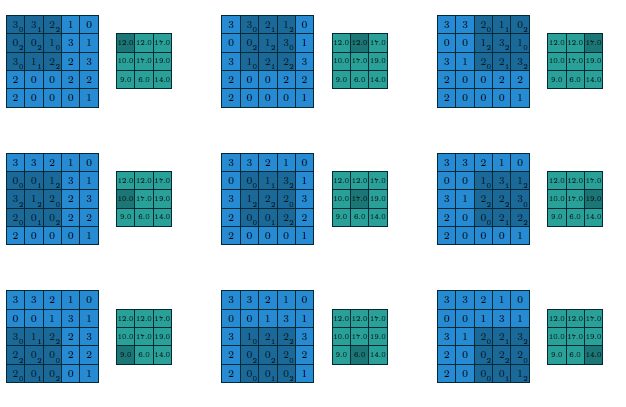
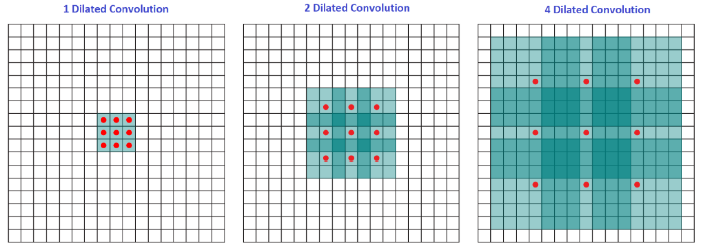

# Convolutional arithmetic

Parent: [[0-Computer_Vision_MOC]]

The CNN are based on the convolution operation, that involves the images (or the feature maps) and the kernels (or filters). This operation are the building blocks of the CNNs, and they are use to estract features from the feature maps. To do this, the kernel is slided across the feature map, and at each position, the element-wise multiplication between the kernel and the corresponding region of the feature map is computed, and then summed up to produce a single value in the output feature map.

$$\text{Output}(i, j) = \sum_{m=0}^{K-1} \sum_{n=0}^{K-1} \text{Input}(i+m, j+n) \cdot \text{Kernel}(m, n)$$

{width=70% height=70%}

Usually, convolution operation, reduce the dimension of the input but the output feature map's dimension does not depend only on the kernel size, but also on the stride, padding, and dilation parameters used in the convolution operation.

The **stride** determinate how much shift the kernel at each step, and a larger stride will result in a smaller output feature map, while a smaller stride will result in a larger output feature map. So, it correspond at a **downsampling operation** and allow the net to capture more local information in the data.

While, the **padding** is used to add extra pixels around the input feature map, and it can be used to control the size of the output feature map. There are different types of padding, such as

- **zero-padding**, where the extra pixels are filled with zeros
- **one-padding**, where the extra pixels are filled with ones
- **reflect-padding**, where the extra pixels are filled with the reflection of the input feature map
- **replicate-padding**, where the extra pixels are filled with the replication of the input feature map

To determine the output dimensions of a convolutional layer, for an input with height $H$ and width $W$, the output dimensions ($H_{out}, W_{out}$) are calculated using the following equations:

$$H_{out} = \left\lfloor \frac{H + 2P - K}{S} \right\rfloor + 1$$

$$W_{out} = \left\lfloor \frac{W + 2P - K}{S} \right\rfloor + 1$$

where:

* **$H / W$**: Height and width of the input volume.
* **$P$ (Padding)**: The number of pixels added to each side of the input. Padding is typically used to prevent spatial shrinkage or to allow the kernel to process edge pixels more effectively.
* **$K$ (Kernel Size)**: The height and width of the filter (e.g., $3 \times 3$ or $5 \times 5$).
* **$S$ (Stride)**: The number of pixels the kernel shifts at each step. A stride of $1$ moves the filter one pixel at a time; higher strides result in downsampling.

!!!note Conv1x1
    A $1 \times 1$ convolution is a special case where the kernel size is $1 \times 1$. This means that each output pixel is computed as a weighted sum of the corresponding input pixel across all channels. The output dimensions are the same as the input dimensions, but the number of output channels can be different based on the number of filters used. This type of convolution is often used for dimensionality reduction or to increase the depth of the feature maps without changing their spatial dimensions.

To determine the number of learnable parameters in a convolutional layer, is calculated as follows:

$$N = \underbrace{[(K_w \times K_h \times C_{in}) \times C_{out}]}_{\text{Weights}} + \underbrace{C_{out}}_{\text{Biases}}$$

where:

* **$K_w, K_h$**: The width and height of the kernel (filter).
* **$C_{in}$**: The number of input channels (e.g., $3$ for an RGB image, or the number of filters from the previous layer).
* **$C_{out}$**: The number of filters in the current layer which dictates the number of output channels.
* **Weights**: Each filter has $K_w \times K_h \times C_{in}$ weights. Since there are $C_{out}$ such filters, we multiply accordingly.
* **Biases**: Each filter typically has one learnable bias term, resulting in $C_{out}$ total biases.

The **dilation** is used to increase the receptive field of the kernel, and it can be used to capture more complex patterns in the data. I  this case, this is defined as **dilated convolution** (or atrous convolution), and it is a type of convolution that allows the kernel to have a larger receptive field without increasing the number of parameters. This is achieved by inserting spaces between the kernel elements, effectively "dilating" the kernel. The **dilation rate** controls how much the kernel is dilated, and it can be used to capture more complex patterns in the data without increasing the computational cost.
When the **dilation** parameter ($D$) is introduced to a convolutional layer, the effective size of the kernel is expanded by inserting "holes" between the kernel elements. This allows the network to increase its receptive field without increasing the number of parameters or the computational cost. A $3 \times 3$ kernel has 9 weights regardless of whether the dilation is 1, 2, or 10.

{width=70% height=70%}

The formula for the output dimensions ($H_{out}, W_{out}$) of a dilated convolutional layer is modified to account for the dilation as follows:

$$H_{out} = \left\lfloor \frac{H + 2P - D \times (K - 1) - 1}{S} \right\rfloor + 1$$

where:

* **$D$ (Dilation Rate)**: The spacing between kernel elements. A dilation of $D=1$ is a standard convolution. A dilation of $D=2$ means there is one empty space between each kernel element.
* **$K$**: The original kernel size (e.g., $3 \times 3$).
* **$S$**: The stride.
* **$P$**: The padding.

## Transposed convolution

## Grouped convolution

The **Grouped Convolution** divides the input channels into $n$ distinct groups. Each group of channels is then convolved with its own dedicated set of filters. It is essentially like running multiple smaller convolutional layers in parallel and then concatenating their results at the end.

The behavior of the layer changes dramatically based on the value of the `groups` parameter:

| Configuration | Description |
| --- | --- |
| **$groups=1$** | **Standard Convolution:** All input channels are convolved with all filters. |
| **$groups=2$** | **Parallel Layers:** The input is split into two halves. The first half of filters only processes the first half of input channels, and the same applies to the second half. |
| **$groups = C_{in}$** | **Depthwise Convolution:** Each input channel is connected to its own specific set of filters. The size of this set is $\frac{C_{out}}{C_{in}}$. |

The reason to use grouping is the drastic reduction in parameters. In a grouped convolution, the kernel depth is no longer $C_{in}$, but rather $\frac{C_{in}}{groups}$. Consequently, the number of weights is reduced by a factor of $n$:

$$\text{Params} = \left( K \times K \times \frac{C_{in}}{groups} \times C_{out} \right) + C_{out}$$

!!!abstract If you set $groups = C_{in}$ (and $C_{out} = C_{in}$), you have created a **Depthwise Convolution**, which is the foundational block of efficient architectures like MobileNet. This reduces the parameter count by a factor nearly equal to the number of input channels.

Different groups can be processed on different GPU cores simultaneously.
By restricting the "vision" of each filter to a subset of channels, you may actually improve generalization by preventing the model from over-learning complex cross-channel correlations.

## Convolutional operation on 3D input

When a "2D convolution" is applied to a 3D input, the kernel itself becomes a 3D volume.

* **Input Shape:** $(H \times W \times C_{in})$
* **Kernel Shape:** $(K \times K \times C_{in})$ — The kernel depth **must** match the input depth.
* **Output Shape:** $(H_{out} \times W_{out} \times C_{out})$ — The output depth is determined solely by the number of filters applied.

Each filter is composed of $C_{in}$ unique 2D kernels. These weights are learned independently for every channel.

* **Weights per filter:** $K \times K \times C_{in}$
* **Total Parameters:** $[(K \times K \times C_{in}) + 1] \times C_{out}$ (The $+1$ represents the bias term per filter).

For every spatial location in the output map, the operation performs a **3D dot product** compute as follow:

1. each of the $C_{in}$ channels in the input is multiplied by its corresponding $K \times K$ weight matrix in the filter.
2. all results from all channels are summed together into a **single scalar value** and a single bias value is added to this sum.

!!!danger 2D convolution
    When we refer to "2D convolution" in the context of CNNs, we are actually performing a 3D convolution operation on a 3D input (height, width, channels). The term "2D" is used because the convolution is applied spatially across the height and width dimensions, while the depth dimension (channels) is processed simultaneously.

## Pooling operation

Pooling operation are used to extract the most important information from the feature maps.

!!!danger Pooling operation
    The pooling operation is NOT a downsampling technique.
    The downsampling is a conseguence due to the choice of stride parameter. Generally, pooling is used to reduce the spatial dimensions of the feature maps when stride is greater than 1.

The most common pooling operations are max pooling and average pooling.

- **Max pooling**: This operation takes the maximum value from a defined window (e.g., $2 \times 2$) and outputs that value. It is effective at capturing the most prominent features in the feature map.
- **Average pooling**: This operation takes the average value from a defined window and outputs that value. It is effective at capturing the overall information in the feature map.
- **Global average pooling**: This operation takes the average value of the entire feature map and outputs a single value for each channel. It is often used at the end of a CNN to reduce the spatial dimensions to 1x1 before feeding into a fully connected layer.
- **Global max pooling**: This operation takes the maximum value of the entire feature map and outputs a single value for each channel. It is also used at the end of a CNN to reduce the spatial dimensions to 1x1 before feeding into a fully connected layer.

The dimension of the output feature map after pooling is determined by the kernel size, stride, and padding used in the pooling operation, similar to convolutional layers. However, pooling layers typically do not have learnable parameters, as they are fixed operations that do not involve weights or biases.
$$H_{out} = \left\lfloor \frac{H + 2P - K}{S} \right\rfloor + 1$$

Does not affect on thge number of the channels, so the output feature map will have the same number of channels as the input feature map.
