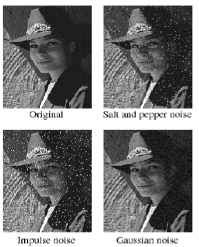
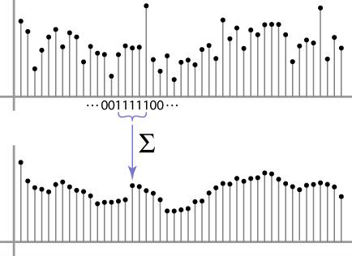
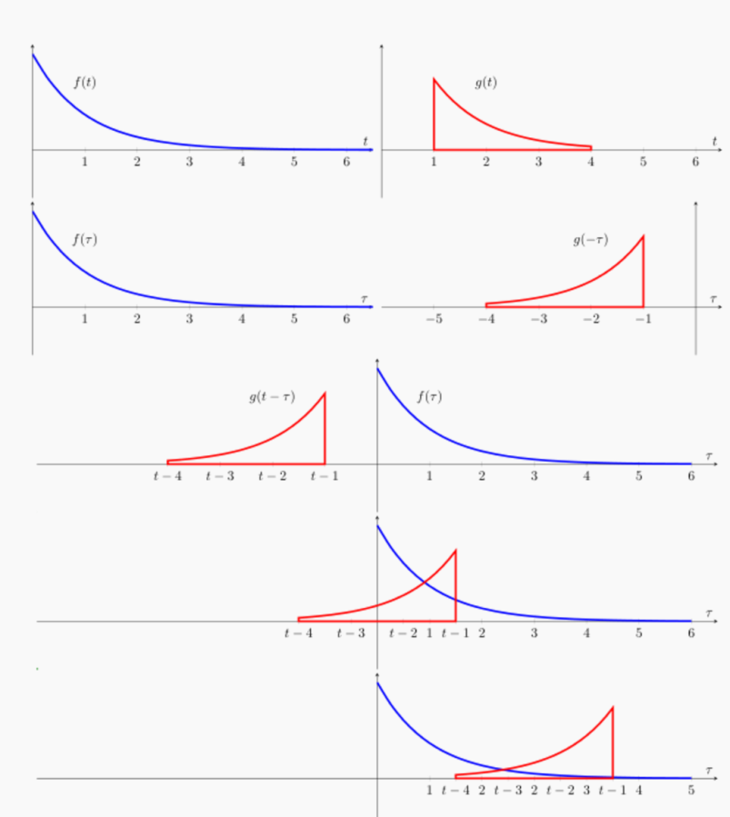
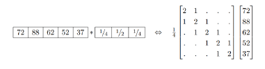
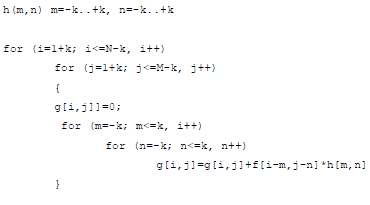
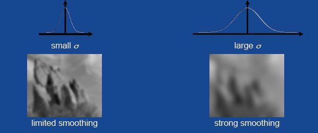
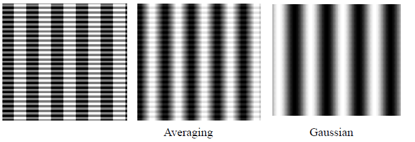
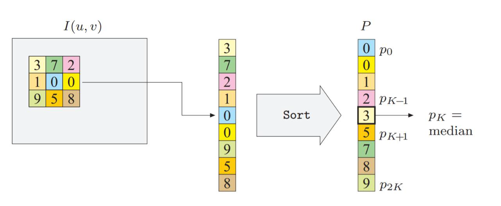
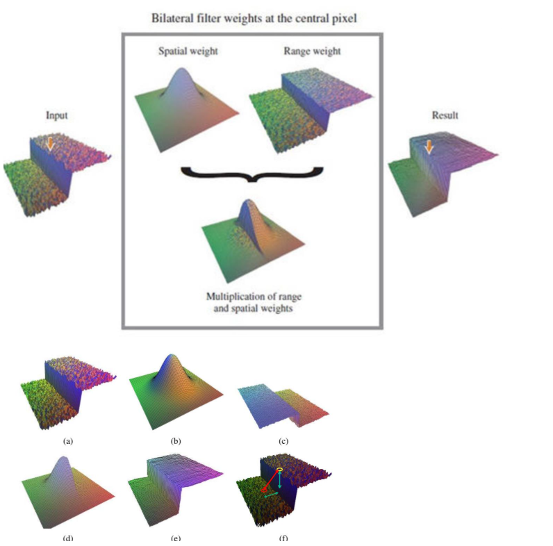
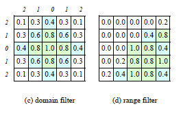

# Noise and Filtering

Parent: [[0-Computer_Vision_MOC]]

## Noise

Histograms images representation consider pixels independent eache other, but in real images pixels are correlated with their neighbors and there is noise in the pixel that alter the image.

Noise can not be removed with point operators because it depens on the neighborhood of the pixel, so we need to use **neighborhood operators** that consider the pixels around the pixel we want to process.

!!!note **Noise** can be defined as everything that is not part of the original image or more in general as any unwanted signal that can alter the image which does not represent relevant information for the task we want to perform on the image.

Ther are three type of noises:

1. **signal noise**. Often, but not necessarly, noise is an additive noise , i.e. $I’(i,j)= I(i,j)+n(i,j)$.
2. **computational noise** it is an error, acting as a noise, produced by computational tasks of processing the image that can alter the image due to the limited precision of the computer;
3. **perceptual noise** (_distractors_) everything in the image which is not the target of the image itself; sometime called **semantic noise**.

Noise can be measured by the Signal-to-Noise Ratio (SNR), which is defined as the ratio of the power of the signal to the power of the noise. In terms of standard deviation, it can be expressed as:

$$SNR= \frac{\sigma_s}{\sigma_n}$$

where $\sigma_s$ is the standard deviation of the signal and $\sigma_n$ is the standard deviation of the noise. The higher the SNR, the better the quality of the image. Noise can be generated by different sources, such as sensor noise, transmission noise, or environmental noise. Noise can be reduced by using various techniques, such as filtering, averaging, or denoising algorithms.

Understanding the nature of noise is crucial for selecting the appropriate restoration filter basing on the type of noise present in the image. The commonn types of noise include:

1. **Salt-and-Pepper Noise** (**Impulse**), also known as **spike noise**, this occurs due to transmission errors or faulty pixel elements.
2. **Gaussian Noise** (**Additive**), whit which every pixel in the image is altered by a small amount, following a Gaussian (normal) distribution $n(i,j) \sim \mathcal{N}(0, \sigma^2)$. It is always present in images due to the physical properties of sensors and the environment.
3. **Speckle Noise** (**Multiplicative**) unlike Gaussian noise, speckle noise is multiplicative. it is particularly prevalent in medical imaging (ultrasound) and synthetic aperture radar (SAR).
   It is present as a granular pattern that is more pronounced in brighter areas of the image.

If we do not have specific erros in acquisition, communication (and storage), the signal noise in the images is supposed to be **white noise** that is a random signal having equal intensity at different frequencies, giving it a constant power spectral density ($S(f) = \sigma^2$). This affect all frequencies of the image.

!!!note 
      In statistical sense, a time series $r_t$ is characterized as having **weak white noise** if ${r_t}$ is a sequence of serially uncorrelated random variables with zero mean and finite variance. 
      White noise also has the quality of being i.i.d. independent and identically distributed , which implies no autocorrelation.
      In particular, if $r_t$ is normally distributed with zero mean and standard deviation $\sigma$, the series is called a **Gaussian white noise.**

When a signal is "white" in the spatial frequency domain, it means its Power Spectral Density (PSD) is flat across all horizontal ($u$) and vertical ($v$) frequencies.
In a 2D image, white noise is a random field where the intensity value of any given pixel $(x, y)$ is completely uncorrelated with its neighbors. This implies that if you shift the image by even one pixel in any direction, the correlation between the original and shifted versions drops to zero. Each pixel is an independent, identically distributed (i.i.d.) random variable.
Just as temporal white noise contains all "audible" frequencies equally, spatial white noise contains all "visible" frequencies (rates of change in pixel intensity) equally. This means that the noise has no preferred scale or direction, and it can be thought of as a "static" pattern that overlays the image, affecting all spatial frequencies uniformly.

Without other information noise is supposed to be additive, and Gaussian (normal, white, with zero mean), that is a stochastic value added to the pixel value, completely unrelated with the signal and the noise added to other pixels.

## Filtering

!!!note **Image restoration** is the process of recovering an original image from a degraded version enhancing the quality of the image and make it more suitable for analysis or visualization.

One way to remove noise from an image is to use **filters**, a neighborhood operator that considers the pixels around the pixel we want to process.

Looking at histograms of the image, noise can be seen as a **spikes** in the histogram, that have value that differ from the avarage value of the pixels in the image, and that are not part of the original image.

Th simplest way to remove noise is to do a **smoothing operation** such as a **mean filter** that replaces each pixel value with the average of the pixel values in its neighborhood, defined by a _window size_. This can help to reduce the effect of noise by averaging out the random variations in pixel intensity.

This is a **linear filter** because the output pixel value is a linear combination of the input pixel values. This consists in a process which gives in output a new image G=g(x,y) , where each location is a weighted sum of the original pixel values from the locations surrounding the corresponding location in the image, using the same set of weights each time, called **filter** or **kernel**. The result is:

- **shift-invariant** — meaning that the value depends on the pattern in an image neighborhood, rather than the position of the neighborhood
- **linear** — meaning that the output for the sum of two filtered images is the same as the sum of the outputs obtained by filtering images separately.

Liner filters are defined as:
$$g(x,y)= \sum_{s=-a}^a \sum_{t=-b}^b f(x+s, y+t)w(s,t) $$ or in a more compact form: $ g = f \otimes w$. This operation is called **correlation**, while, in signale processing, the operation is called **convolution**, defined as:
$$g(x,y) = \sum*{s=-a}^a \sum*{t=-b}^b f(x-s, y-t)w(s,t)= \sum*{s=-a}^a \sum*{t=-b}^b f(s, t)w(x-s,y-t)$$ or in a more compact form: $g = f * w$. The difference between the two is that in convolution the kernel is flipped both horizontally and vertically before being applied to the image, while in correlation it is not.

The mathematical definition of convolution confirms its role as a fundamental **Linear Time-Invariant (LTI)**—or in 2D, **Linear Shift-Invariant (LSI)**—operation. By using the properties of the Dirac delta function, we can see exactly why the impulse response defines the system's behavior.

In a continual domain, convolution of two functions, $f$ and $h$, is defined as:

$$(f * h)(t) = \int_{-\infty}^{\infty} f(\tau)h(t - \tau) d\tau$$

1. **Reflect:** Flip the kernel $h(\tau)$ to obtain $h(-\tau)$.
2. **Shift:** Offset the flipped kernel by $t$ to get $h(t - \tau)$.
3. **Multiply & Integrate:** Find the area under the product of $f(\tau)$ and the shifted kernel.

The kernel $h$ is termed the "impulse response" because it represents the output of the system when the input is a Dirac delta function $\delta(t)$.

The distinction between these two is the "flip" step. In cross-correlation, the kernel is **not** reversed.
If the kernel is symmetric (e.g., a Gaussian kernel), convolution and correlation yield identical results.

In computer vision, the logic extends to two dimensions ($x, y$ or $u, v$). The 2D continuous convolution is:

$$(f * h)(x, y) = \int_{-\infty}^{\infty} \int_{-\infty}^{\infty} f(u, v)h(x - u, y - v) du dv$$

However, it can also blur the image and reduce the sharpness of edges, which may not be desirable in some cases.

Due to the linearity of convolution, we can exploit the properties of linear systems to analyze and design filters. The key properties include:

1. **linearity** (additivity and homogeneity): $f * (h_1 + h_2) = f * h_1 + f * h_2$. So, instead of scanning an image twice (e.g., first for noise reduction and then for edge enhancement), we can convolve the two kernels together beforehand to create a single filter.
2. **scalarity** (homogeneity): $f * (k h) = k (f * h)$. This ensures that the filter's behavior is consistent regardless of the signal's magnitude. If you brighten an image by a factor $k$, the filtered output is brightened by that same factor $k$.

3. **shift invariance** (stationarity): $f(x - x_0, y - y_0) * h(x, y) = (f * h)(x - x_0, y - y_0)$. This property dictates that the filter does not "care" where a feature is located in the image. If an edge exists at the top-left or the bottom-right, the filter's response to that edge will be identical, just shifted to the corresponding location.
4. **commutativity** (order independence): $f * h = h * f$. This means that the order in which we apply filters does not matter. If you apply filter $h_1$ and then filter $h_2$ to an image $f$, the result is the same as applying filter $h_2$ and then filter $h_1$ to the same image.
5. **associativity** (grouping independence): $f * (h_1 * h_2) = (f * h_1) * h_2$. This means that when applying multiple filters, the way we group them does not affect the final output. If you have two filters, $h_1$ and $h_2$, and you want to apply both to an image $f$, you can first convolve $h_1$ and $h_2$ together to create a single filter, and then convolve that result with the image. Alternatively, you can first convolve the image with $h_1$ and then convolve the result with $h_2$. Both approaches will yield the same final output.

$$(h_2 * (h_1 * f)) = (h_2 * h_1) * f$$

!!!success This is fundamental for object recognition. If you are looking for a "vertical line," your filter should be able to find it regardless of whether the line is in the center or the corner of the frame.

Correlation and convolution can both be written as a matrix vector multiplication, if we first convert the two dimensional images $f(i , j)$ and $h(i, j)$ into raster ordered vectors $f $and $g$, given $H$ as a sparse matrix
$g = \bold{H}f$.

### Boundary Effects and Padding

Correlation produces a result images smaller than the original one, which may not be desirable in many applications. This is because the neighborhoods of typical correlation and convolution operations extend beyond the image boundaries near the edges, and so the filtered images suffer from **boundary effects**, where the output pixel values near the edges of the image are influenced by the lack of neighboring pixels outside the image. This can lead to artifacts and distortions in the filtered image, especially when using larger kernels or filters that require a larger neighborhood.
To deal with this, a number of different **padding** strategies have been developed to handle the boundaries of the image when applying filters. These strategies include:

- **zero**: set all pixels outside the source image to 0 (a good choice for alpha-matted cutout images);
- **constant** (border color): set all pixels outside the source image to a specified border value;
- **clamp** (replicate or clamp to edge): repeat edge pixels indefinitely;
- **wrap** (repeat or tile): loop “around” the image in a “toroidal” configuration;
- **mirror**: reflect pixels across the image edge;
- **reflect**: reflect pixels across the image edge, but not including the edge pixel itself;
- **extend**: extend the signal by subtracting the mirrored version of the signal from the edge pixel value.

### Separable Filters

The processs of performing convolutional operation requires $K^2$ multiplication per pixel, where $K$ in the size of the kernel.

This operation can be speed up if the kernel is **separable**, meaning that convolutional can be computed as two one-dimensionale convolutions, one in the horizontal direction and one in the vertical direction. This reduces the number of multiplications per pixel to $2K$, which can significantly speed up the convolution operation, especially for larger kernels.

!!!note Separable Kernel
      Kernel is **separable** decomposing with its sigular value decomposition (SVD) into a sum of rank-1 matrices, which can be expressed as the outer product of two vectors. $$K = \sum_{i=1}^r \sigma_i u_i v_i^T$$ where $r$ is the rank of the kernel, $\sigma_i$ are the singular values, and $u_i$ and $v_i$ are the left and right singular vectors, respectively.
      If only the first singular value $\sigma_0$ is non-zero, the kernel is separable and $\sqrt{\sigma_0}u_0$ and $\sqrt{\sigma_0}v_0^T$ provide the vertical and horizontal kernels.

For 2D kernels, it can be rewritten as the product of two 1D kernels:
$$K(x, y) = vh^T$$ where $v$ is a column vector representing the vertical kernel and $h^T$ is a row vector representing the horizontal kernel.

If kernels is not separable we can use more terms of SVD relation series (i.e., summing up a number of separable convolutions).

### Smooting Filters

Smoothing kernels (or low-pass filters) are designed to reduce noise and remove fine details by averaging the pixel values in a local neighborhood. Being low-pass filters, in the spatial domain, they suppress high-frequency components.

#### Moving Average Filter

A **Moving Average Filter** is a Low-Pass Filter (LPF) used to smooth signals and images by reducing random noise. It operates by replacing each data point with the average of its local neighborhood.

In a discrete-time signal $x[n]$, the output of a moving average filter $y[n]$ with a window size of $M$ is defined as:

$$y[n] = \frac{1}{M} \sum_{k=0}^{M-1} x[n-k]$$

Essentially, as the window "moves" along the signal, it computes a new average for every position.

Thi filter is simple and effective for reducing random noise, but it can also blur the image and reduce the sharpness of edges, due to the fact that suppressing high-frequency components.

A standard moving average gives equal importance to all pixels in the window. However, this often leads to unnatural artifacts.

- **Simple Moving Average (SMA):** All weights are $1/M$.
- **Weighted Moving Average (WMA):** Assigns higher weights to pixels closer to the center. This can help to preserve edges better than a simple moving average.

#### Gaussian Filter

The **Gaussian Filter** is a linear smoothing filter used to blur images and remove noise. Unlike the Moving Average (Box) filter, which gives equal weight to all pixels in the neighborhood, the Gaussian filter uses a weighted average based on the **Gaussian (Normal) distribution**.

The weights of the filter are determined by the 2D Gaussian function:

$$G(x, y) = \frac{1}{2\pi\sigma^2} e^{-\frac{x^2 + y^2}{2\sigma^2}}$$

- **Small $\sigma$:** Subtle smoothing; preserves fine details.
- **Large $\sigma$:** Heavy blurring; removes noise but also obscures edges and structures.

It blurs the image equally in all directions, whereas a Box filter tends to favor horizontal and vertical directions.
In the frequency domain, the Fourier transform of a Gaussian is another Gaussian. This means it has no "ripples" or oscillations, avoiding the artifacts often seen with a Moving Average filter.

One of the properties of the Gaussian filter is that it is **separable**. A 2D Gaussian convolution can be performed by applying a 1D Gaussian filter horizontally, followed by a 1D Gaussian filter vertically.

- **Standard 2D Convolution:** Requires $M \times N$ multiplications per pixel (for an $M \times N$ kernel).
- **Separable Convolution:** Requires only $M + N$ multiplications per pixel.

This makes Gaussian blurring extremely efficient for large kernels (e.g., a $25 \times 25$ kernel becomes significantly faster).

##### Averaging vs Gaussian Smoothing Averaging

While both are linear low-pass filters designed to reduce noise, they treat the spatial frequency of an image very differently.

- The Averaging filter treats every pixel within the neighborhood as equally important. It creates a "blocky" blur. Sharp edges are transformed into linear ramps, which can look unnatural.
- The Gaussian filter gives more weight to pixels closer to the center of the neighborhood, resulting in a smoother and more natural blur. It preserves edges better than the Averaging filter, as it does not create the same blocky artifacts. It provides a much "smoother" and more organic blur. It mimics how out-of-focus lenses naturally behave.

#### Sharpening Filters

Smoothing kernels can also be used to **sharpen images** using a process called **unsharp masking**. The process of unsharp masking involves the following steps:

1. **blurring**: The original image is blurred using a low-pass filter, such as a Gaussian blur, to create a smoothed version of the image.
2. **sharpening**: The blurred image is subtracted from the original image to create a "mask" that contains the high-frequency details (edges and fine textures) that were lost during the blurring process. $$g_{sharp} = f + \gamma(f- h_{blur} * f)$$
3. **combining**: The mask is then added back to the original image, often with a scaling factor $\gamma$ to control the amount of sharpening applied. This results in a sharpened image that enhances edges and fine details while maintaining the overall structure of the original image. $$I_{sharpened} = I_{original} + \gamma g_{sharp}$$

Sharpening filter accentuates differences with local average

### Non-Linear Filters

Better performance can be obtained by using a non-linear combination of neighboring pixels. When the noise, is **shot noise** (impulsive or salt-and-pepper), rather than being Gaussian, regular blurring with a Gaussian filter fails to remove the noisy pixels and instead turns them into softer (but still visible) spots.

#### Median Filter

A better filter to use in this case is the **median filter**, which selects the median value from each pixel’s neighborhood.

Since the shot noise value usually lies well outside the true values in the neighborhood, the median filter is able to filter away such bad pixels.

Median values can be computed in linear time using a **randomized select algorithm** and **incremental variants** have also been developed as well as a constant time algorithm that is independent of window size.

One downside of the median filter, in addition to its moderate computational cost, is that because it selects only one input pixel value to replace each output pixel, it is not as efficient at averaging away regular Gaussian noise. A better choice may be compute a **weighted median**, in which each pixel is used a number of times depending on its distance from the center. This turns out to be equivalent to minimizing the weighted objective function $$\sum_{k,l} w(k, l)|f(i + k, j + l) − g(i, j)|^p$$ where $g(i, j)$ is the desired output value and $p = 1$ for the weighted median. The value $p = 2$ is the usual **weighted mean**, which is equivalent to correlation after normalizing by the sum of the weights

Non-linear smoothing has another property. They are useful in **edge preserving**, have less tendency to soften edges while filtering away high-frequency noise.

#### Max/Min Filter

The **Max Filter** (**Dilation**) replaces the intensity of the central pixel with the maximum intensity value found in its local neighborhood. It is defined as:$$g(x, y) = \max_{(i, j) \in W} \{f(i, j)\}$$ where $W$ is the sliding window/kernel.

It makes bright areas "grow" or expand while causing dark details to shrink or disappear.
Since it picks the maximum value, small black dots (low intensity) are overwritten by the brighter surrounding pixels, resolving the shot noise problem of "pepper" noise.
It helps bridge small gaps in bright objects.

While the **Min Filter** (**Erosion**) replaces the intensity of the central pixel with the minimum intensity value found in its neighborhood. It is defined as: $$g(x, y) = \min_{(i, j) \in W} \{f(i, j)\}$$

It makes dark areas expand and bright areas "erode" or shrink, reducing small white spikes (high intensity) by replacing them with the darker values of the background.

It can be used to disconnect two bright objects that are touching by a thin "bridge" of pixels.

#### Bilateral Filter

The **Bilateral Filter** is a non-linear smoothing filter that addresses the primary weakness of the Gaussian blur: **edge blurring**. While a Gaussian filter averages pixels based solely on their geometric distance, a Bilateral filter considers both **geometric distance** and **pixel intensity difference**.
It smoothes the image while keeping sharp edges intact by ensuring that only pixels with similar intensity values to the central pixel contribute to the average.

A weight is calculated for each neighbor based on two distinct Gaussian functions:

1. **Spatial Weight ($G_s$):** Pixels closer to the center get higher weights (just like a standard Gaussian blur).
2. **Range Weight ($G_r$):** Pixels with intensity values similar to the center pixel get higher weights. If a neighbor has a vastly different intensity (indicating an edge), its weight drops to near zero.

In the bilateral filter, the output pixel value depends on a weighted combination of neighboring pixel values
$$\mathbf{g}(i, j) = \frac{\sum_{k,l} \mathbf{f}(k,l)w(i, j, k, l)}{\sum_{k,l} w(i, j, k, l)}$$

The weighting coefficient w(i, j, k, l) depends on the product of a **domain kernel**,
$$d(i, j, k, l) = \exp \left( -\frac{(i - k)^2 + (j - l)^2}{2\sigma_d^2} \right)$$
and a data-dependent **range kernel**,
$$r(i, j, k, l) = \exp \left( -\frac{\|\mathbf{f}(i, j) - \mathbf{f}(k, l)\|^2}{2\sigma_r^2} \right)$$

When multiplied together, these yield the data-dependent bilateral weight function

$$w(i, j, k, l) = \exp \left( -\frac{(i - k)^2 + (j - l)^2}{2\sigma_d^2} - \frac{\|\mathbf{f}(i, j) - \mathbf{f}(k, l)\|^2}{2\sigma_r^2} \right)$$

If the $\sigma_{range}$ is set too high, it reverts to a standard Gaussian blur. If set too low, it may fail to smooth noise that has a high amplitude.

It is ideal for removing Gaussian noise without losing the structural boundaries of objects.

- **Photo Retouching:** Widely used in "beauty filters" to smooth skin texture (low-contrast details) while keeping the eyes, lips, and hair (high-contrast edges) sharp.

Because the weights depend on the actual pixel values (not just their positions), the kernel must be recomputed for every single pixel. It is significantly slower than a Gaussian filter.

#### Measuring Filter Goodness: PSNR

Non-linear filters are currently adopted more frequently than linear ones. To evaluate the effectiveness of a filter, ground truth images with synthetic noise are typically used:

- $I(x)$: The original starting image.
- $I'(x) = I(x) + N(x)$: The image with added noise.
- $\hat{I}(x) = \text{filter}(I'(x))$: The result after applying the filter.

The MSE measures the average squared difference between the original and the filtered image:$$MSE = \frac{1}{n} \sum_{x} [I(x) - \hat{I}(x)]^2$$

**PSNR** (**Peak Signal-to-Noise Ratio**) is used to quantify the difference between the two images, expressed in decibels (dB). A higher PSNR generally indicates a better quality reconstruction.$$PSNR = 10 \log_{10} \frac{I_{max}^2}{MSE}$$ where:

- **$I_{max}$**: The maximum possible pixel value (e.g., 255 for 8-bit images).
