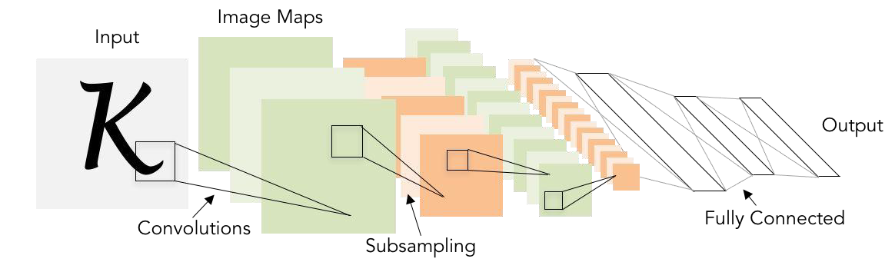
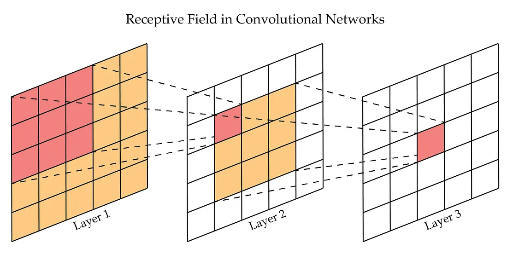
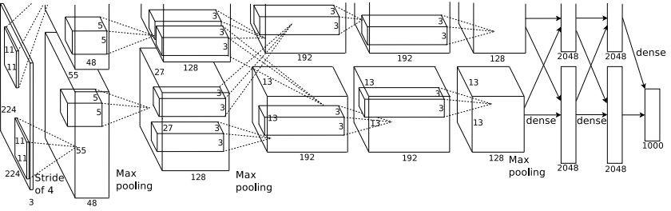
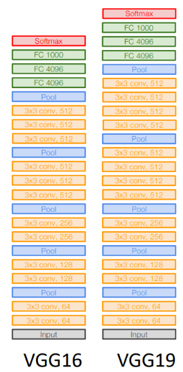
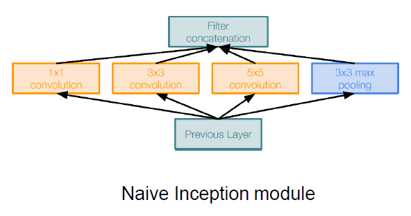
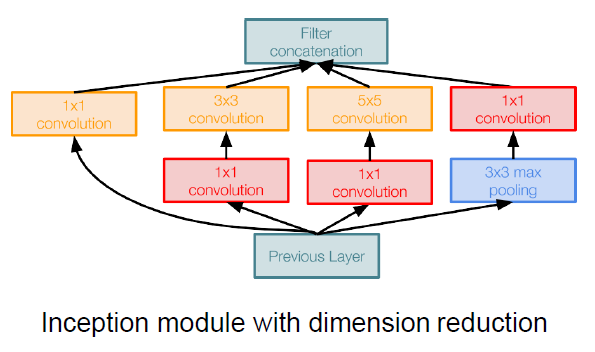
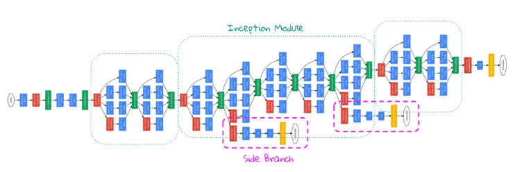
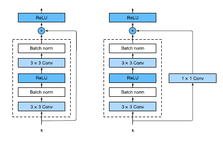
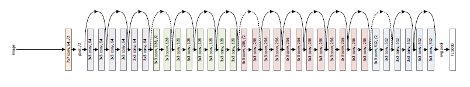

# Convolutional Neural Networks (CNN)

Parent: [[0-Computer_Vision_MOC]], [[3-2_Convolutional_Arithmetics]]

The classic architecture of a CNN is composed of several layers, including:

- **Convolutional layers**: These layers are responsible for extracting features from the input data computing the convolution operation.
- **Activation functions**: These layers are responsible for introducing non-linearity into the model. They typically use a ReLU activation function, which sets all negative values to zero and keeps all positive values unchanged.
- **Pooling layers**: These layers are responsible for extract the most important information.
- **Fully connected layers**: These layers are responsible for making predictions based on the features extracted by the convolutional and pooling layers. They consist of a set of neurons that are connected to all the neurons in the previous layer.

{width=70% height=70%}

## Receptive field

The convolution operation allows the CNN to learn **spatial hierarchies of features**, where lower layers capture simple patterns (like edges and textures), while higher layers capture more complex patterns (like shapes and objects).

!!!note The **receptive field** is the portion of the imput map that are looked by the kernel at each position. The receptive field of a convolutional layer is determined by the kernel size, stride, and padding used in the convolution operation. As we stack more convolutional layers, the receptive field increases, allowing the network to capture more complex patterns and relationships in the data.

Applying convolutional at different layers of the CNN, and differente kernels, we flatten the image into a more compact rappresentation suitable for the neural network, and capture more local information incresing the receptive field that capture the most important feature and local information, to capture  more complex patterns and relationships in the data.

{width=70% height=70%}

The receptive field determines the amount of context that the network can capture when processing the input data. A larger receptive field allows the network to capture more global information, while a smaller receptive field allows the network to capture more local information.

!!!tip Receptive field calculation
    The receptive field can be calculated using the following formula:
    
    $$
    R = (K - 1) \cdot S + R_{prev}
    $$
    
    Where:
    
    - $R$ is the receptive field of the current layer.
    - $K$ is the kernel size.
    - $S$ is the stride.
    - $R_{prev}$ is the receptive field of the previous layer (for the first layer, this is typically set to 1).
    
    By applying this formula iteratively through the layers of a CNN, you can determine how much of the input image each layer is effectively "seeing" as it processes the data.

!!!tip How to increase the receptive field
    To increase the receptive field of a CNN, you can:
    
    1. Increase the kernel size ($K$): Using larger kernels will allow each layer to capture more spatial information.
    2. Increase the stride ($S$): Using a larger stride will reduce the spatial dimensions of the output feature maps, effectively increasing the receptive field.
    3. Use pooling layers: Pooling layers (e.g., max pooling) can also increase the receptive field by downsampling the feature maps, allowing subsequent layers to capture more global information.

## Memory and Computational Cost of CNN

The specific float data type (precision) determines how many bits are used to represent each numerical value. This choice directly impacts memory consumption, computational speed, and model accuracy.

The most prevalent formats in CNNs are:

* **FP32 (Single Precision):** The industry standard for training. It uses **32 bits (4 bytes)** per value: 1 bit for sign, 8 bits for exponent, and 23 bits for the mantissa (fraction). It offers high precision but high memory usage.
* **FP16 (Half Precision):** Uses **16 bits (2 bytes)**: 1 bit for sign, 5 bits for exponent, and 10 bits for the mantissa. It halves memory consumption compared to FP32 and accelerates computation on modern GPUs (e.g., NVIDIA Tensor Cores).
* **BF16 (Brain Floating Point):** Also uses **16 bits (2 bytes)** but allocates them differently: 1 bit for sign, 8 bits for exponent (same as FP32), and 7 bits for the mantissa. This makes it more stable than FP16 for training because it handles a wider range of values, despite lower fractional precision.
* **TF32 (TensorFloat-32):** An internal NVIDIA format that uses 19 bits. It provides the range of BF16 with better precision, though it is usually handled automatically by hardware and mapped to FP32 storage.

Switching from FP32 to FP16/BF16 reduces the memory footprint by exactly **50%** for both parameters and activations.

To balance memory efficiency and numerical stability, many practitioners use **Mixed Precision Training**.

1. **Activations and Weights** are stored in **FP16** to save memory and speed up the "forward pass."
2. **Master Weights** are maintained in **FP32** to ensure that small gradient updates (which might be lost in FP16 precision) are accurately accumulated.
3. **Loss Scaling** is often applied to prevent underflow during the backpropagation of small gradients.

While reducing precision saves memory, it introduces specific challenges:

* **Underflow:** Small values in FP16 may become zero, leading to "dying" neurons or failed convergence.
* **Hardware Dependency:** FP16/BF16 speedups are only realized on hardware with dedicated support (like NVIDIA Volta/Ampere architectures or Google TPUs).
* **Quantization:** For extreme memory savings during inference, models are often "quantized" to **INT8** (8-bit integers). This reduces memory by **75%** relative to FP32, though it requires specialized post-training calibration or quantization-aware training.

Memory consumption in CNN is driven by three components:

- **Parameters (weights)**, include the weights and biases of the layers. This memory cost is fixed once the model architecture is defined.
- **Activations (feature maps)**, during inference, many frameworks optimize this by reusing memory buffers, but during training, these must often be stored for the backward pass. The memory required for activations can be calculated as:
$$\text{Memory} = \text{Batch\_Size} \times H_{out} \times W_{out} \times C_{out} \times \text{Bytes\_per\_Element}$$ where:
  * **Data Types:** * **FP32 (Single Precision):** 4 bytes per element.
  * **FP16/BF16 (Half Precision):** 2 bytes per element.
  * **INT8 (Quantized):** 1 byte per element.
- **Gradients/Optimizer States** (during training), Same size as parameters + Same size as activations.

## CNN Architectures

### AlexNet

AlexNet winning the ImageNet Large Scale Visual Recognition Challenge (ILSVRC) in 2012. It demonstrated the power of deep convolutional neural networks (CNNs) and set the stage for a new era of research and development in the field. The architecture of AlexNet introduced several key innovations that have since become standard practices in CNN design.

AlexNet was groundbreaking not just for its depth, but for several technical choices that have since become industry standards:

* **ReLU Activation Function**: Instead of the traditional Tanh or Sigmoid, AlexNet used Rectified Linear Units ($f(x) = \max(0, x)$). This allowed the model to train much faster by mitigating the vanishing gradient problem.
* **Multi-GPU Training**: Due to the memory constraints of 2012 hardware (GTX 580 GPUs with 3GB RAM), the model was split across two GPUs. This necessitated the "Grouping" concept we discussed earlier, where certain layers only communicated with a subset of the previous layer's filters.
* **Overlapping Pooling**: Rather than traditional non-overlapping pooling, AlexNet used $3 \times 3$ filters with a stride of $2$, which slightly reduced overfitting.
* **Dropout**: To prevent overfitting in the large fully connected layers, AlexNet utilized Dropout, randomly "turning off" neurons during training to force the network to learn more robust features.

AlexNet consists of 8 learnable layers: 5 convolutional layers followed by 3 fully connected layers.

AlexNet contains approximately **60 million learnable parameters**. Interestingly, the vast majority of these parameters are located in the first fully connected layer (FC6), which connects the flattened $6 \times 6 \times 256$ feature map to 4096 neurons.

* **Convolutional Layers**: Occupy a small fraction of the parameters but the majority of the computational cost (FLOPs).
* **Fully Connected Layers**: Occupy the vast majority of memory (parameters) but are computationally less intensive than the early convolutions.

AlexNet famously used **groups=2** for its convolutional layers to spread the workload across two GPUs. This meant the filters on GPU 1 only saw the feature maps on GPU 1, effectively creating two parallel pathways that only merged at specific "cross-talk" layers.

{width=90% height=90%}

### VGGNet

Developed by the **Visual Geometry Group** at the University of Oxford, **VGGNet** (introduced in 2014) to demostrate that increasing the depth of a network using very small convolutional filters significantly improves performance.

VGGNet standardized the entire architecture by using only $3 \times 3$ convolutional filters with a stride of 1 and $2 \times 2$ max-pooling layers with a stride of 2. This design choice allowed VGGNet to achieve excellent performance on the ImageNet dataset while maintaining a relatively simple and uniform architecture.

A stack of two $3 \times 3$ layers has an effective receptive field of $5 \times 5$; three such layers match a $7 \times 7$ field. This allows the model to learn more complex features through additional non-linearities (ReLU) while using fewer parameters than a single large-kernel layer.

Spatial resolution is consistently reduced using $2 \times 2$ max-pooling layers with a stride of 2.
Every time a pooling layer halves the spatial dimensions ($H, W$), the number of filters ($C$) is doubled to preserve the representational capacity.

VGGNet was presented in two configurations: **VGG-16** and **VGG-19**, referring to the number of weight layers (convolutional and fully connected).

{width=20% height=20%}

Despite its elegance, VGGNet is "heavy":

* **Memory Intensity**: It contains approximately **138 million parameters**, more than double that of AlexNet.
* **Computational Cost**: Most parameters reside in the fully connected layers, but the majority of the calculation time is spent in the early convolutional layers.

### GoogLeNet

**GoogLeNet** (also known as Inception v1) introduced a **inception module** designed for efficiently capturing features at multiple scales while keeping computational costs manageable. The architecture was designed to be deeper and wider than previous models, but with significantly fewer parameters than VGGNet.

An inception module typically consists of several convolutional layers with different filter sizes. These layers are arranged in parallel, so that the network can process the input data at multiple resolutions simultaneously. The output of the convolutional layers is then concatenated and passed through a pooling layer.

The naive implementation of an inception module involves (inpuyt -> 28 x 28 x 192):

- 1x1 Convolutions: Used to reduce dimensionality before applying larger filters. outputs -> 28 x 28 x 64.
- 3x3 Convolutions: Capture medium-sized features.  outputs -> 28 x 28 x 128,
- 5x5 Convolutions: Capture larger features. outputs -> 28 x 28 x 32,
- Max Pooling: Downsample the feature maps. outputs -> 28 x 28 x 32
- After applying these operations, we concatenate the outputs along the depth dimension. (The final output tensor is 28 x 28 x 256).

{width=50% height=50%}

The main problem with this naive implementation is that it is computationally expensive, especially when using larger filters like $5 \times 5$, to led to a large number of parameters. To address this issue, GoogLeNet uses **1x1 conv “bottleneck” layers** as a dimensionality reduction step before applying the larger filters. This allows the network to capture multi-scale features while keeping the computational cost manageable.

{width=50% height=50%}

The model consists of multiple Inception modules chained together, with max-pooling layers in between, except for the side branches. These side branches are called **Auxiliary Classifiers** which are s smaller versions of the main classifier that are attached to intermediate layers of the network. The structure of each auxiliary classifier is:

- an average pooling layer with a 5×5 window and stride 3.
- a 1×1 convolution for dimension reduction with 128 filters.
- two fully connected layers, the first layer with 1024 units, followed by a dropout layer and the final layer corresponding to the number of classes in the task.
- a SoftMax layer to output the prediction probabilities.

These auxiliary classifiers help the gradient to flow and not diminish too quickly, as it propagates back through the deeper layers. Moreover, the auxiliary classifiers also help with model regularisation. Since each classifier contributes to the final output, as a result, the network is encouraged to distribute its learning across different parts of the network. This distribution prevents the network from relying too heavily on specific features or layers, which reduces the chances of overfitting.
By adding these extra loss functions, the network learns useful features earlier in training. They act as a regularizer, reducing overfitting.
During inference, they are typically discarded, and only the main classifier is used for predictions.

Another key feature of GoogLeNet is that it replaces fully connected layers with global average pooling at the end, reducing the total number of parameters.

### ResNet

**ResNet** (Residual Network) enabling the training of networks with hundreds or even thousands of layers.

The maim problem was that stacking more layers led to a **degradation problem**, despite the increasing of accurancy models. As network depth increased, accuracy saturated and then rapidly degraded. This was not due to overfitting, but deeper networks are affected by the **vanishing gradient problem** or **exploding gradient**, where the gradients become too small (or too large) to effectively update the weights during backpropagation steps. This makes it difficult for the network to learn and converge, especially in very deep architectures.

ResNet introduced the **Residual Block** which, instead of, trying to learn a direct mapping $H(x)$, the network is designed to learn the **residual** $F(x) = H(x) - x$. The original input $x$ is then added back to the output of the convolutional layers through a **skip connection**.

{width=50% height=50%}

By adding the identity $x$, the layers only need to learn the "difference" required to improve the features. Conseguently, during backpropagation, these skip connections act as compute gradient equals to 1, avoiding the vanishing gradient problem and allowing the network to train much deeper architectures effectively.
If a layer is unnecessary, the network can easily learn to set the weights to zero, effectively letting the identity $x$ pass through unchanged.

To make very deep networks computationally feasible, ResNet utilizes a **bottleneck design** within its residual blocks:

* **1x1 Convolution**: Reduces the number of channels (dimension reduction).
* **3x3 Convolution**: Performs the spatial feature extraction on the smaller volume.
* **1x1 Convolution**: Restores the number of channels to the original depth.

This approach significantly reduces the number of parameters and floating-point operations (FLOPs) compared to a standard block using two $3 \times 3$ convolutions.

!!!warning Summation of F(x) and x
    The summation of $F(x)$ and $x$ in the residual block requires that they have the same dimensions. If the dimensions do not match, a common solution is to use a **projection shortcut** (e.g., a 1x1 convolution) to transform $x$ to the same shape as $F(x)$ before performing the addition.

#### Wide ResidualNetworks

#### Aggregated Residual Transformations for Deep Neural Networks(ResNeXt)

#### Deep Networks with Stochastic Depth

#### Squeeze-and-Excitation Networks (SENet)

### Densely Connected ConvolutionalNetworks