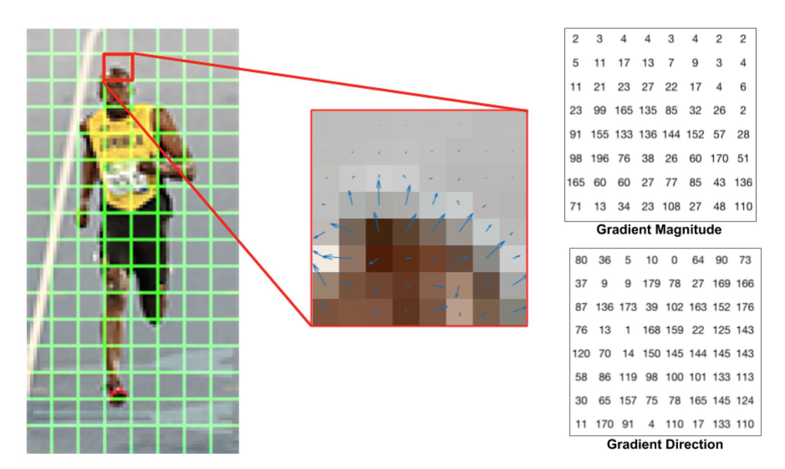
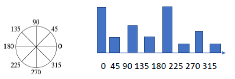
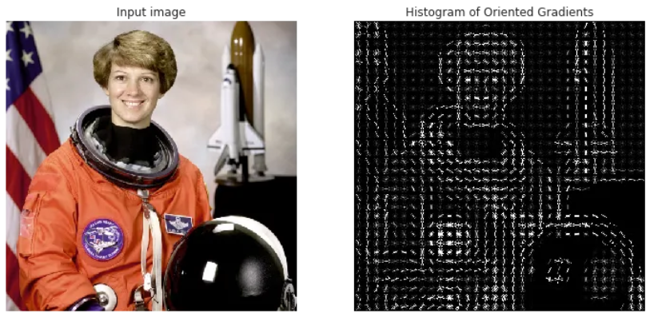

# Type of Visual Features

Parent: [[5_Visual_feature_extraction]]

## Histogram of Oriented Gradients (HOG)

The HOG descriptor is a global feature descriptor apply to the while image to extract _neighborhood information_ and _spatial information_ of the image, like shape, texture, and structure and compress that information from a given image into a reduced/condensed vector form called a feature vector that could describe the feature of this image.

Local shape and appearance of an object can be described by the distribution of intensity gradients. So HOG descriptor is compute after coputing the gradients of the image, generally applying Sobel kernel to get a global feature descriptor of the imag.

{width=70% height=70%}

After, the image is divided into small non-overlappings **cells**, and then for each of them the histogram of gradients is computed.
The histogram of gradients is a vector that counts the number of gradients in each orientation bin. The orientation bins are typically defined as a set of angles (e.g., 0-180 degrees) and the gradients are quantized into these bins based on their direction.

{width=70% height=70%}

Magnitude is directly proportional to pixel intensity. If you double the brightness of an image, the gradient magnitudes double, which would drastically change the feature vector even though the "shape" is identical. To solve this, HOG uses** Block Normalization** usign overlapping blocks of cells to normalize the histograms. Each block typically consists of 2x2 cells, and the histograms from these cells are concatenated to form a feature vector for the block. The most common method is the **L2-norm**:

$$v_{norm} = \frac{v}{\sqrt{\|v\|_2^2 + \epsilon^2}}$$

where $\epsilon$ is a small constant to prevent division by zero. Because blocks overlap, a single cell's histogram contributes to the final descriptor multiple times, normalized relative to different neighbors.

!!!tip Dimensionality and Classification
    For a standard $64 \times 128$ detection window:
    - Cells: $8 \times 16 = 128$ cells.
    - Blocks: $7 \times 15 = 105$ blocks (using a 1-cell stride).
    - Features per block: 4 cells $\times$ 9 bins = 36 features.
    - Total Vector Length: $105 \times 36 = 3780$ elements.

At the end, computed histogram are concatenated to form a single feature vector that represents the image, and this feature vector can be used for various computer vision tasks, such as object detection, image classification, and image retrieval.

{width=70% height=70%}