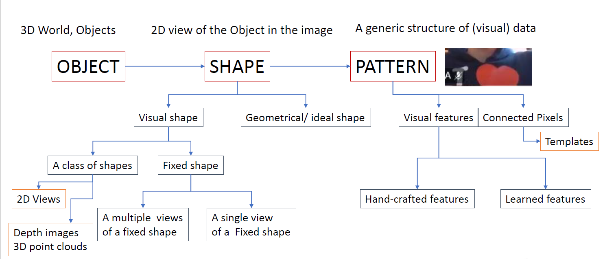
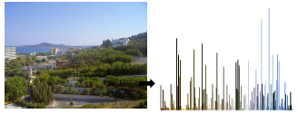
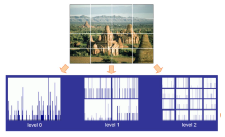
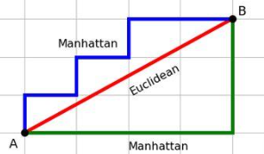
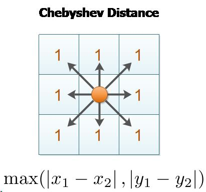
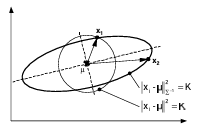
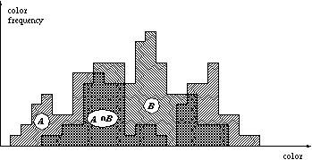

# Visual feature

Parent: [[0-Computer_Vision_MOC]], [[4_CNN]], [[1-Image]]

!!!note Visual features are the specific pieces of information extracted from an image that allow an algorithm to understand its content. they provide the essential characteristics needed to distinguish a cat from a car, or a pothole from a shadow, for example.

{width=100% height=50%}

Visual features are generally categorized into two main eras: **Hand-Crafted Features** and **Learned Features**.

The **Hand-Crafted Features** (Traditional CV), before the diffision of Deep Learning, researchers designed specific mathematical descriptors to capture geometric and textural patterns. They are "fixed" and do not change based on the data. Examples include:

* **Global Features:** These describe the image as a whole.
* **Color Histograms:** Measuring the distribution of colors.
* **Shape Descriptors:** Defining the contour or silhouette of an object.
* **Texture (LBP):** Local Binary Patterns describe the "feel" of a surface (smooth, grainy, etc.).

After the rise of Deep Learning, we moved to **Learned Features**, where the model learns to identify and extract features directly from the data during training. This approach is more flexible and can capture complex patterns that hand-crafted features might miss. So, in this case we can have different levels of features:

* **Low-Level Features:** The first layers of a neural network usually detect simple things like edges, colors, and basic orientations.
* **Mid-Level Features:** Deeper layers combine those edges into shapes, circles, or textures.
* **High-Level Features:** The final layers recognize complex, semantic objects—like a human face, a dog’s ear, or the license plate of a vehicle.

For a computere vision task is important to choose the right levelo of granularity of feature, depending on the problem we are trying to solve. We can have different levels of granularity:

- **Global Features**: Describe the image in its entirety. This is useful for scene recognition (e.g., "this is a forest") but poor for finding specific small objects.
- **Local Features**: These identify "interest points" or small patches. They are robust to occlusions (if a hand covers part of a face, local features can still identify the eyes). Like:
  -  **Edges:** Sudden changes in pixel intensity (e.g., Canny Edge Detector).
  - **Corners:** Points where two edges meet (e.g., Harris Corner Detector).
  - **Blobs:** Regions that differ in properties, such as brightness, compared to surroundings.
  - **SIFT/SURF/ORB:** Sophisticated algorithms that find points that remain the same even if the image is rotated, scaled, or differently lit.
- **Sparse** that only looks at "interesting" parts (like corners) and **dense** which evaluates every pixel or a regular grid (essential for tasks like semantic segmentation).

## Marr's Three Levels of Analysis

David Marr, was the person that defined first the concept of th COmputer Vision, in its book "Vision: A Computational Investigation into the Human Representation and Processing of Visual Information" (1980), in which he said that omputational vision has three levels of analysis:

1. **Computational Level** which defines what are the problems that system have to resolve and why. For example, recognizing objects in an image to understand the scene.
2. **Algorithmic Level** which how the system do it and wgat _representations_ it uses to preocess image. For example, using a convolutional neural network to extract features and classify objects.
3. **Implementational Level** which describes how is the system physically realized. For example, the hardware and software that run the neural network.

So, based on this ideas, we have three levels of representation of visual features:

1. The **primal sketch**, which provides a two-dimensional description of the main changes in light intensity of the visual input, including information about profiles, edges, and spots. This representation is observer-centered, meaning the visual input is described only from the observer's perspective.
2. The **2.5-D sketch**, which incorporates a description of the depth and orientation of visible surfaces, using information provided by nuance, texture, motion, binocular disparity, and so on. This, like the primal sketch, is also observer-centered.
3. The **3D model representation**, which describes the shapes of objects and their relative positions in three dimensions in a way that is independent of the observer's perspective.

The process of shape perception follows several steps, in our brain:

1. Obtaining images: information on light intensity is collected through photographs, a video camera, or other devices.
2. Image processing: the raw visual input is processed to extract basic features such as edges, corners, and textures. This step involves techniques like filtering, thresholding, and feature detection to enhance the relevant information in the images. In this phase, the primal sketch is built.
3. Image analysis: the extracted features are analyzed to identify patterns and relationships. This involves grouping features together to form more complex structures, such as contours and surfaces, which can be used to recognize objects and their spatial relationships. In this phase, the 2.5-D sketch is built.
4. Image understanding: the analyzed features are integrated to create a coherent representation of the scene. This involves recognizing objects, understanding their spatial relationships, and interpreting the overall context of the visual input. 

and based on this, also for the computer vision system, we have the same levels of representation and the same process of shape perception. But with the diffusion of ML algorithms, in every steps there are models that can learn to extract features and understand the scene, without the need of hand-crafted features. But the knowledge is still embended in the task and the data.

## Visual feature extraction

1. which
kind of visual features (semantically, perceptual, both)
•
2. which kind
of data structure
•
feature scalars, vectors, numerical/categorical textual
•
Time series
•
Pixel/value maps, heap
maps,
•
graph,
•
Linguistic/symbolic features
•
3. how compute ore
extract the features
•
4.hot wo check if these features are suitable enough?

The feature has to be
designed to effectively summarize the visual content : it’s a quantization problem, or a
compression problem
•
It’s a necessary procedure:
•
Data generalization (avoid
overfitting
•
Computational constraints

Use these criteria to evaluate any feature you study:

1. **Discriminant**: Must differ between different classes.
2. **Reliability**: Must be similar within the same class.
3. **Independence**: Features should not be redundant.
4. **Minimum Cardinality**: Use as few features as possible to represent the data.
5. Distinguish between **Global** features (describing the whole image) and **Local** features (focusing on specific points or regions).

Computer Vision
aims to compute VISUAL FEATURES that exhibit
•
Perceptual
similarity ( invariance and subjective relevance
•
Computational
stabiity ( discriminance , reliability, indipendence , minimum cardinality
•
Continuity
similarity (in the space , and also in the time)

### Visual feature representation

The choice of feature representation is crucial for the success of any computer vision task. The representation must be designed to effectively summarize the visual content while being computationally efficient. This often involves a trade-off between capturing enough information to be discriminative and keeping the feature set manageable to avoid overfitting.

#### Binarized Image Features

Simple geometric descriptors are often extracted from binarized regions where pixels are distinguished from the background.

* 
**Area**: Calculated as the total number of pixels belonging to a specific region.

* 
**Perimeter**: Measured by summing the points on the external border.

* 
**Connectivity**: Border calculations depend on whether the system uses 4-connectivity or 8-connectivity to define adjacent pixels.

Based on the slide provided, **Binarized Image Features** represent the simplest form of structural extraction. After an image is thresholded into black and white (binary), we can calculate mathematical properties of the resulting "blobs" or regions.

Here is the expansion of the three core features mentioned:

This is the most fundamental geometric descriptor.

* **Definition:** The total number of pixels belonging to the object or region.
* **Logic:** In a binary image where the object is represented by pixels with a value of **1** and the background by **0**, the area is simply the sum of all pixels in that region: $A = \sum_{i,j} I(i,j)$.
* **Use Case:** Useful for filtering out "noise" (very small areas) or distinguishing between objects of significantly different sizes.

The perimeter describes the length of the boundary of the region.

* **Definition:** The sum of the pixels that form the external border of the object.
* **The Connectivity Factor:** The measurement depends on how you define a "neighbor":
* **4-connectivity:** Only considers pixels touching the top, bottom, left, and right.
* **8-connectivity:** Includes diagonal neighbors as well.

* **Significance:** Combined with Area, Perimeter helps calculate **Compactness** ($P^2 / A$), which tells you if a shape is a perfect circle or a long, thin line.

The slide highlights **Connectivity** as a topological feature, often expressed through the **Euler Number ($E$)**.

* **Formula:** $E = S - N$
* $S$ = Number of connected components (the "solid" parts).
* $N$ = Number of holes.

* **Logic:** This feature is **invariant** to scaling or rotation. For example, a "B" has an Euler number of -1 (1 part, 2 holes), while an "I" has an Euler number of 1 (1 part, 0 holes). It allows the system to understand the "topology" of a shape regardless of its size.

#### Color Histograms

This represents the distribution of colors within an image across a chosen color space, such as RGB or HSV.

* 
**Pros**: Computationally efficient compared to other invariant features.

* 
**Cons**: It ignores spatial information (shape and texture) and is highly sensitive to changes in lighting intensity.

##### Spatial Color Histograms

To address the lack of spatial information in standard histograms, researchers use **Spatial Pyramids**.

* 
**Structure**: The image is divided into multiple levels of increasingly fine grids (Level 0, Level 1, Level 2).

* 
**Application**: This method is a foundational step in modern deep learning architectures, including Convolutional Neural Networks (CNNs) and Vision Transformers (ViT).

## Search and Retrieval

The most straightforward approach to image retrieval is the **Nearest Neighbor** strategy.

**The Pipeline**:

1. **Index**: Build a set of histograms for every known object (or every view of an object).
2. **Query**: Generate a histogram for the new test image.
3. **Compare**: Use a distance measure (like L1 or Cosine distance) to compare the test histogram against the database.
4. **Rank**: Select the object with the best matching score or reject it if no similar matches exist.

### Measure of similarity between features

!!!note Matemathic definition of metric
    A **metric** (or distance function) is a formalization of the distance between two points within a set.
    Let $X$ be a non-empty set. A function $d: X \times X \to \mathbb{R}$ is a **metric** on $X$ if, for all $x, y, z \in X$, it satisfies these four axioms:
      1. **Non-negativity:** $d(x, y) \ge 0$
      2. **Identity of Indiscernibles:** $d(x, y) = 0 \iff x = y$
      3. **Symmetry:** $d(x, y) = d(y, x)$
      4. **Triangle Inequality:** $d(x, z) \le d(x, y) + d(y, z)$
    The pair $(X, d)$ is known as a **metric space**. This structure is essential for defining limits, continuity, and the topological properties of a set.

A function $d(x, y)$ is considered a **semi-metric** if it satisfies the **Self-identity**, **Positivity** and **Symmetry** conditions, but does not necessarily satisfy the **Triangle Inequality**. Specifically:
While a function $d(x, y)$ is considered a **pseudo-metric** if it satisfies **Self-identity**, **Positivity**, and **Symmetry**, but does not necessarily satisfy the **Identity of Indiscernibles**.

#### Minkowski-type Distance

The Minkowski distance is a generalized metric for normed vector spaces. It's a generalization of several well-known distance measures, controlled by the order parameter $p$.

$$D(x, y) = \left( \sum_{i=1}^n |x_i - y_i|^p \right)^{\frac{1}{p}}$$

* **$p = 1$ (Manhattan Distance / L1 Norm):** Computes the grid-like path between points. Useful for high-dimensional data or when dealing with sparse vectors (like Lasso regression). Manhattan distance measures the sum of the absolute differences between the coordinates of the points.
$$D_{L1}(x, y) = \sum_{i=1}^n |x_i - y_i|$$
* **$p = 2$ (Euclidean Distance / L2 Norm):** The standard straight-line distance. Sensitive to outliers because differences are squared. $$D_{L2}(x, y) = \sqrt{\sum_{i=1}^n (x_i - y_i)^2}$$
  {width=50% height=50%}
* **$p \to \infty$ (Chebyshev Distance / L$\infty$ Norm):** Takes the absolute maximum difference along any single dimension. $$D_{L\infty}(x, y) = \max_{i} |x_i - y_i|$$ {width=50% height=50%} 
Emphasizes the maximum shift in any coordinate direction, which is pivotal in scenarios where movement is not restricted to horizontal or vertical paths but includes any direct line.

### Mahalanobis (Quadratic) Distance

Euclidean distance assumes the data is isotropically distributed (spherical). Euclidean distance weights each axis equally it effectively assumes that the variables constructing the space are independent and represent unrelated equally important information to one another. 

If the variables involved are correlated in some way, however, then the Euclidean distance will not be an accurate measure of similarity. In this case, the Mahalanobis distance is more appropriate because it accounts for the correlations between variables and the different scales of the data.

Mahalanobis distance corrects for this by factoring in the covariance of the data, effectively measuring how many standard deviations away a point is from the mean of a distribution.

$$D_M(x, y) = \sqrt{(x - y)^T \Sigma^{-1} (x - y)}$$

Where $\Sigma$ is the covariance matrix. If the covariance matrix is the identity matrix (features are uncorrelated and have unit variance), this reduces exactly to the Euclidean distance.

> Mahlanhobis distance used between color histograms

When features are correlated, their joint distribution stretches diagonally across the feature space. If you plot the points that are equidistant from the mean using the Mahalanobis metric, they form a tilted ellipse. When features are not uncorrelated – it is possible to rotate the reference systems to produce uncorrelated coordinates using common approaches for feature reduction

### Cosine Similarity

Cosine similarity measures the orientation between two non-zero vectors, independent of their magnitude. It calculates the cosine of the angle between them.

$$S_C(A, B) = \frac{A \cdot B}{\|A\| \|B\|} = \frac{\sum_{i=1}^n A_i B_i}{\sqrt{\sum_{i=1}^n A_i^2} \sqrt{\sum_{i=1}^n B_i^2}}$$

The result ranges from -1 (exactly opposite) to 1 (exactly the same).

!!!tip Computational Analysis
    For the retrieval of a single query against a database of $N$ items, the computational complexity is $\mathcal{O}(N \cdot d)$, where $d$ is the dimensionality of the feature vectors. This is because you need to compute the cosine similarity between the query vector and each of the $N$ vectors in the database, and each similarity computation involves $d$ multiplications and additions.
    To optimize this, can be stored $\frac{b_i}{||b_i||}$ in datbase, so at query time, only need to compute the dot product with the normalized query vector, reducing the per-comparison cost to $\mathcal{O}(d)$.
    Normalize we make shorter the vector and create a hypersphere space (more dense space) where all vector have the same length, so we can focus only on the angle between them allowing to capture the similarity in direction and redduce the computational cost.

### Kullback-Leibler Distance (Divergence)

Despite the name, KL Divergence is *not* a true mathematical distance metric because it is not symmetric ($D_{KL}(P \| Q) \neq D_{KL}(Q \| P)$) and does not satisfy the triangle inequality. It measures the relative entropy, or how much information is lost when a distribution $Q$ is used to approximate the true distribution $P$.

$$D_{KL}(P \| Q) = \sum_{x \in X} P(x) \log \left( \frac{P(x)}{Q(x)} \right)$$

### Ground Distance

Ground distance is the base distance metric (often Euclidean or Manhattan) used to measure the distance between individual features, bins, or elements *before* calculating an aggregate distance between complex structures like histograms or sets.

### Histogram Intersection

It calculates the overlapping area between them. For two unnormalized histograms $H_1$ and $H_2$ with $n$ bins:

$$I(H_1, H_2) = \sum_{i=1}^n \min(H_1(i), H_2(i))$$

At each bin $i$, the algorithm applies a logical AND equivalent for continuous values: it takes the minimum frequency. This minimum represents the common data present in both distributions for that specific feature. By summing these minimums across all bins, you get the total intersecting area.

If the histograms are normalized (sum to 1), the intersection directly yields a similarity score between 0 and 1.

### Earth Mover’s Distance (Wasserstein Metric)

The **Earth Mover's Distance** (**EMD**), also known as the **Wasserstein-1 metric**, is a measure of dissimilarity between two probability distributions that quantifies the minimum work required to transform one distribution into the other by transporting mass along a metric ground space, where the work is the total amount of mass moved multiplied by the distance over which it is transported.

Instead of looking only at overlapping areas, EMD treats distributions as continuous or discrete mass. It calculates the optimal "flow" of mass from the source distribution $P$ to the target distribution $Q$.

The total cost is a function of two variables:

1. **Flow ($f_{i,j}$):** The amount of mass moved from bin $i$ in distribution $P$ to bin $j$ in distribution $Q$.
2. **Ground Distance ($d_{i,j}$):** The geometric distance (often Euclidean) between bin $i$ and bin $j$ in the underlying feature space.

Given two signatures (or histograms) $P$ and $Q$, the objective is to find a flow matrix $F = [f_{i,j}]$ that minimizes the overall work:

$$EMD(P, Q) = \frac{\sum_{i=1}^m \sum_{j=1}^n f_{i,j} d_{i,j}}{\sum_{i=1}^m \sum_{j=1}^n f_{i,j}}$$

This minimization is subject to strict constraints: mass can only be moved, not created or destroyed. The sum of the flow from a specific bin cannot exceed its original mass.

**Cross-Bin Relationships** This is the primary reason to use EMD. If a sensor calibration error shifts a continuous signal exactly 5Hz to the right, Euclidean distance and Histogram Intersection will report a massive error because the exact bin-to-bin matches are destroyed. EMD recognizes that the entire mass simply moved a short ground distance, returning a correspondingly small, accurate distance score.

If two distributions share zero overlapping domains, metrics like Kullback-Leibler divergence can explode to infinity, and intersection drops to zero. EMD still provides a smooth, meaningful gradient representing how far apart the distributions are.

The main disadvantage of EMD is the severe computational complexity at $\mathcal{O}(N^3 \log N)$ where $N$ is the number of bins. This makes standard EMD expensive for high-dimensional, real-time machine learning pipelines.

> To bypass the extreme computational cost, AI engineers use the **Sinkhorn approximation**, which adds an entropic regularization term to make the optimization highly parallelizable on GPUs.

