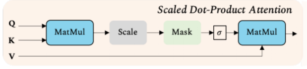
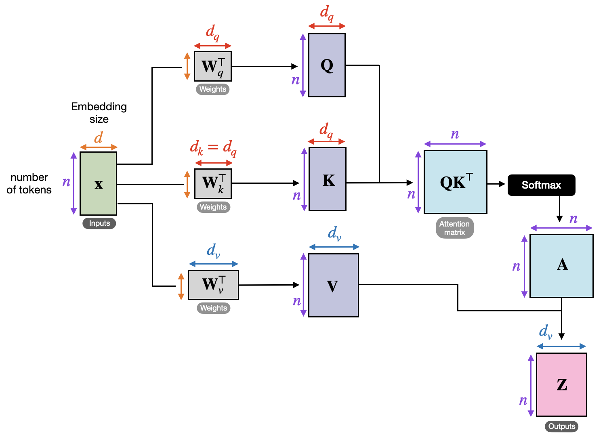
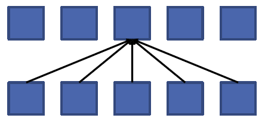
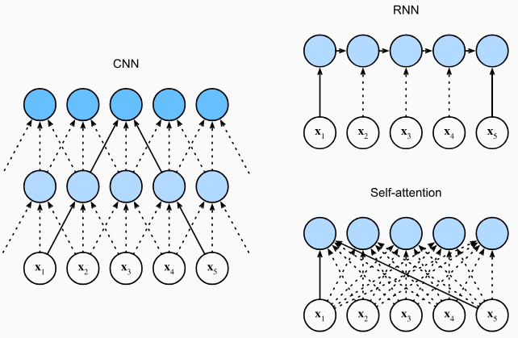

# Attention Mechanism

Parent: [[Deep_Learning_MOC]]

Attention mechanisms allow models to dynamically focus on relevant parts of the input data, improving performance and interpretability.

## Attention Working

Attention can be cinsudere as a measure of similarity computed between a **Query** and a set of **Keys**. The output is a weighted sum of the corresponding **Values**, where the weights are determined by the similarity scores between the Query and the Keys.

The computing of attentio are base on the **Scaled Dot-Product Attention**.

{width=100% height=50%}

The input sequence be represented by a matrix $X \in \mathbb{R}^{N \times d}$, where $N$ is the sequence length (number of tokens or patches) and $d$ is the embedding dimension.

The first step is to project the input $X$ into three different spaces to obtain the Queries ($Q$), Keys ($K$), and Values ($V$). This is done by multiplying $X$ with three distinct learnable weight matrices:

$$Q = XW_Q \\ K = XW_K \\ V = XW_V$$

Where $W_Q  \in \mathbb{R}^{d \times d_k}$ , $W_K \in \mathbb{R}^{d \times d_k}$ and $W_V \in \mathbb{R}^{d \times d_v}$. Typically, $d_k = d_v$. Thise matrix are learned during training and allow the model to project the input into different subspaces for computing attention. So we learn the projection of the input into three different spaces.

!!!warning 
    There is not a single learnable parameter !!!!
!!!danger 
    In **General (Cross) Attention**, the inputs are differ: $Q = X_{\text{target}}W_Q$, while $K = X_{\text{source}}W_K$ and $V = X_{\text{source}}W_V$.
    While, in **Self-Attention**, the inputs come from the same input sequence.

To determine how much focus element $i$ should place on element $j$, we compute the dot product between the query $q_i$ and the key $k_j$. In matrix form, this computes the similarity between all queries and all keys simultaneously:

$$S = QK^T$$

Here, $S \in \mathbb{R}^{N \times N}$ is the raw score matrix.

If the dimension $d_k$ is large, the dot products in $S$ can grow significantly in magnitude. This pushes the subsequent softmax function into regions where it has extremely small gradients, leading to the vanishing gradient problem during backpropagation. To counter this, the scores are scaled down by the square root of the key dimension, $\sqrt{d_k}$:

$$S' = \frac{QK^T}{\sqrt{d_k}}$$

A row-wise softmax is applied to the scaled scores to convert them into a probability distribution. This ensures that the attention weights for each query sum to $1$:

$$A = \text{softmax}\left(\frac{QK^T}{\sqrt{d_k}}\right)$$

The resulting matrix $A \in \mathbb{R}^{N \times N}$ contains the final attention weights. Each entry $A_{i,j}$ indicates the degree of attention that element $i$ pays to element $j$.
Finally, the attention weights are multiplied by the Value matrix $V$.

$$Z = AV$$

Each row in the output matrix $Z \in \mathbb{R}^{N \times d_v}$ is a weighted sum of the values, where the weights dictate which parts of the sequence are most relevant.

!!!note General Formulation of Attention
    The attention mechanism can be generalized to allow for different input sequences for Queries, Keys, and Values. In this case, we have:
    - $Q = X_{\text{target}}W_Q$
    - $K = X_{\text{source}}W_K$
    - $V = X_{\text{source}}W_V$ 
    $$\text{Attention}(Q, K, V) = \text{softmax}\left(\frac{QK^T}{\sqrt{d_k}}\right)V$$

### Multi-Head Attention

Given the same set of queries, keys, and values we may want to combine knowledge from different behaviors of the same attention mechanism, such as capturing dependencies of various ranges within a sequence. Thus, it may be beneficial to allow our attention mechanism to jointly use different representation subspaces of queries, keys, and values.

Instead of performing a single attention pooling we can combine multiple attention pooling operation(that can be parallizable) with different learnable lineat projections of the same input. This is called **Multi-Head Attention** and allows to capture different types of relationships between elements in the sequence and different aspects of the input data.

$$\text{MultiHead}(Q, K, V) = \text{Concat}(\text{head}_1, ..., \text{head}_h)W_O \\
\text{where}\\ \text{head}_i = \text{Attention}(QW_Q^{(i)}, KW_K^{(i)}, VW_V^{(i)})$$

The concatenated result is passed through a linear projection using a learned weight matrix $W_O \in \mathbb{R}^{d_{\text{k}} \times d_{\text{k}}}$. This step systematically synthesizes the distinct information gathered from all the different heads into a unified output representation and act ar a form of dimensionality reduction, ensuring that the final output has the same dimension as the input embeddings, which is crucial for maintaining consistency across layers in a transformer architecture.

### Caratheristics of Attention

Attention mechanisms take as input all the element of sequences of variable length and produce output sequences of the same length, making them highly flexible for various tasks. The sequence length $N$ determines the dimensions of the attention matrix ($N \times N$), but the learned parameters (the weight matrices $W_Q, W_K, W_V$) are completely independent of $N$. 

{width=100% height=50%}

This allow to have an **infinite receptive field**: each output element can attend to all input elements, regardless of their position in the sequence. This is a significant advantage over traditional convolutional or recurrent architectures, which have limited receptive fields and may struggle to capture long-range dependencies.

{width=100% height=50%}

## Positional Encodings

The attention mechanism is **permutation invariant** with respect to the input sequence, means that if shuffling the input does not change the result (other than shuffling the output in the same way). The operator treats the sequence as an unordered in the same way as ordered, so the attention scores are the same regardless of the order of the input elements.

This can be a problem in tasks where the order of elements is important, such as natural language processing or computer vision.

To resolve this, we must inject positional information into the data before computing attention. This is achieved through **Positional Encodings**.

Instead of feeding the raw token or patch embeddings directly into the Transformer, we add a positional vector to each embedding. 

We define a positional embedding matrix $E_{\text{pos}} \in \mathbb{R}^{N \times d}$. and add it to the input embeddings $X$ computing:

$$Z_0 = X + E_{\text{pos}}$$

Because this is an element-wise addition, the resulting vectors in $Z_0$ contain both the visual feature information (from $X$) and the spatial location information (from $E_{\text{pos}}$).

### Types of Positional Encodings

There are two main approaches to generating positional encodings:

1. **Learned Positional Embeddings:** The positional vectors are treated as standard network parameters. They are initialized randomly and optimized via backpropagation during training.
2. **Fixed (Sinusoidal) Positional Encodings:** Introduced in the original "Attention Is All You Need" paper, this method uses deterministic mathematical functions to generate the vectors, requiring no learnable parameters.

The fixed implementation relies on sine and cosine functions of varying frequencies. For a position $pos$ in the sequence, and a specific dimension index $i$ within the embedding vector, the encoding is computed as:

$$PE_{(pos, 2i)} = \sin\left(\frac{pos}{10000^{2i/d_{\text{model}}}}\right)$$
$$PE_{(pos, 2i+1)} = \cos\left(\frac{pos}{10000^{2i/d_{\text{model}}}}\right)$$

In this way, we ensure the **uniqueness** of every position and allow the model to learn to attend based on relative positions, as the encoding of position $pos+k$ can be represented as a linear transformation of the encoding of position $pos$ due to the properties of sine and cosine functions.

Using simple incremental numbers or normalized floats for positional encoding fundamentally breaks the Transformer's representation space. Unbounded integers quickly grow to magnitudes that completely wash out the subtle semantic information within the token embeddings, while length-normalized floats create inconsistent relative step sizes, effectively destroying the model's ability to generalize to unseen sequence lengths. Furthermore, applying a basic 1D scalar across a high-dimensional vector wastes representational capacity, whereas sinusoidal encodings solve all these issues by providing a bounded, deterministic, and multi-frequency geometric basis that allows attention heads to precisely calculate relative distances regardless of the sequence size.
