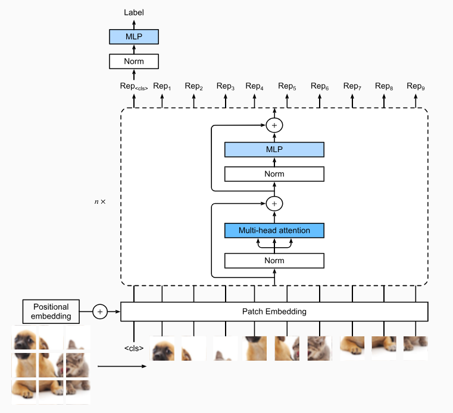
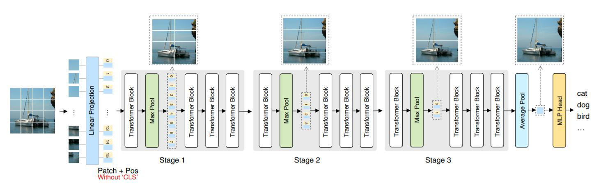

# Vision Transformer (ViT)

The Vision Transformer (ViT) treats an image exactly like a sequence of words in Natural Language Processing, feeding it directly into a standard Transformer encoder.

{width=60% height=50%}

A standard Transformer expects a 1D sequence of token embeddings. To adapt a 2D image $x \in \mathbb{R}^{H \times W \times C}$, ViT divides the image into a grid of non-overlapping **patches**.

If the patch size is $P \times P$, the image is flattened into a sequence of $N$ 2D patches:
$$N = \frac{H \times W}{P^2}$$
Each flattened patch $x_p$ has a dimension of $P^2 \cdot C$.

To convert these raw pixel blocks into continuous vector representations, each flattened patch is multiplied by a learnable (**Patch Embedding**) matrix $E \in \mathbb{R}^{(P^2 \cdot C) \times d_{\text{model}}}$. This linear projection maps the patches into the $d_{\text{k}}$ dimensional space required by the Transformer.

Borrowing from BERT's architecture, a strictly learnable embedding vector $x_{\text{class}}$ is prepended to the sequence of patch embeddings. 
The state of this specific token, `[CLS]`, at the output of the final Transformer layer ($z_L^0$) serves as the aggregated, global representation of the entire image, which is then fed into an MLP head for the final classification task.

Because the self-attention mechanism is permutation invariant, the model must be explicitly told where each patch originated in the original image grid. _Standard 1D_ learnable positional embeddings $E_{pos} \in \mathbb{R}^{(N+1) \times d_{\text{k}}}$ are added to the sequence. The model receives no inductive bias about the 2D grid structure of the image. 

For tasks requiring strict geometric awareness, we can explicitly encode the $x$ and $y$ coordinates of each patch within the original image grid. 
We allocate $d/2$ dimensions to encode the horizontal position $x$ and $d/2$ dimensions to encode the vertical position $y$, using sine and cosine functions of varying frequencies.
For a patch at grid coordinate $(x, y)$, the 2D encoding is the concatenation of the two 1D encodings:

$$PE_{(x,y)} = [PE_{x} \parallel PE_{y}]$$

This explicitly maps the 2D topology of the image into the embedding space, ensuring that patches with similar $x$ or $y$ coordinates have mathematically similar positional vectors.

> Concatenating $X$ and $E_{\text{pos}}$ would increase the dimensionality from $d$ to $2d$, significantly increasing the parameter count and computational cost of the $Q, K, V$ projection matrices.

!!!note 
    The complete input sequence $z_0$ entering the Transformer is formulated as:$$z_0 = [x_{\text{class}}; \, x_p^1 E; \, x_p^2 E; \, \dots; \, x_p^N E] + E_{pos}$$

The sequence $z_0$ passes through $L$ identical Transformer encoder blocks. Each block contains Multi-Head Self-Attention (MSA) and a Multi-Layer Perceptron (MLP), with Layer Normalization (LN) applied *before* every block and residual connections applied *after*.

For layer $l$ (from $1$ to $L$):
$$z'_l = \text{MSA}(\text{LN}(z_{l-1})) + z_{l-1} \\
z_l = \text{MLP}(\text{LN}(z'_l)) + z'_l$$

For a classification task, the network isolates the first token of the final layer's output (the processed `[CLS]` token) and passes it through a LayerNorm and a final MLP to output the class probabilities:
$$y = \text{MLP}(\text{LN}(z_L^0))$$

ViT relies entirely on massive datasets (like JFT-300M or ImageNet-21k) to learn visual representations from scratch. Because it lacks the spatial inductive biases of CNNs, it generalizes poorly when trained on small datasets, but significantly outperforms state-of-the-art CNNs when pre-trained on massive datasets and transferred to downstream tasks.

## Beyond the largest datasets

A way to train ViT without having access to massive datasets is to exploot the power of knowledge distillation from CNNs via a distillation loss. 
This techique allow ViT to learn from the "dark knowledge" of a pre-trained CNN teacher, which has already learned useful visual representations. CNN

## Hierarchical ViT

In a standard Vision Transformer (ViT), the traditional concept of spatial pooling layers used in CNNs to progressively downsample feature maps does not exist.

In the original ViT architecture, the sequence length $N$ and the embedding dimension $d_{\text{k}}$ remain strictly constant through all $L$ layers of the Transformer encoder. Maintaing a constant sequence length $N$, computing self-attention requires $O(N^2)$ operations. If you double the resolution of the input image, the number of patches quadruples, and the computational cost increases by a factor of 16.

Without traditional spatial pooling to progressively reduce the sequence length (like CNNs do when they halve the spatial dimensions and double the channels), standard ViTs are computationally prohibitive for high-resolution tasks like dense object detection or semantic segmentation.

**Hierarchical Transformers** introduce a mechanism to reduce the sequence length as the network goes deeper, creating a **feature pyramid** that allows for high-resolution processing.

The creation of feature pyramids in hierarchical allow the model to capture more context about the image, which is crucial for tasks that require understanding of both local details and global structure, as recognizing objects or segmenting an image into meaningful regions.

{width=100% height=50%}

In standard ViTs, the sequence length remains constant, which leads to computational bottlenecks and feature redundancy in deeper layers. HVTs solve this by applying a pooling operator at the end of each stage to systematically shrink the sequence length. Because tokens tend to accumulate highly redundant information as the network depth increases, pooling effectively compresses these representations, forcing the model to extract denser, more highly semantic features while simultaneously reducing computational overhead. This lead to create a Hierarchical Feature Pyramids that capture more abstarct information to resolve task as segmentation and object recognise.

The input sequence of projected image patches in a ViT can be conceptualized as a flattened CNN feature map that retains encoded spatial information. Because of this structural equivalence, applying pooling operations to spatially adjacent tokens in the 1D sequence is mathematically and functionally analogous to traditional spatial downsampling (e.g., MaxPooling or AveragePooling) in CNNs.

A consequence of spatial pooling is the disruption of the sequence geometry due to the decrising of the sequence length $N$ after every pooling operation, the original positional embeddings ($E_{pos}$) applied at the input layer are no longer meaningful for the compressed sequence. To maintain spatial awareness, the positional embeddings must be recalculated or dynamically updated at each stage to correctly map to the new, pooled token sequence.

HVT architecture inherently builds a hierarchical representation through progressive spatial downsampling, it eliminates the need for an artificial [CLS] token. Instead, the final prediction is generated by applying **Global Average Pooling** (**GAP**) across the highly compressed tokens at the final stage, yielding a single unified vector that is passed directly to the MLP classification head.