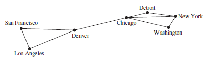
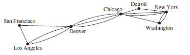

# Graph Theory

Parent: [[Graph_Analytics_MOC]]

I grafi sono strutture matematiche discrete che rappresentano insiemi di oggetti (nodi) e le relazioni tra di essi (archi). La teoria dei grafi fornisce un quadro formale per analizzare e comprendere queste strutture, consentendo di studiare le proprietà dei grafi e di sviluppare algoritmi per risolvere problemi complessi.

!!!note Un **grafo** G = (V, E) è costituito da V, un insieme non vuoto di vertici (o nodi) ed E, un insieme di archi. Ogni arco ha uno o due vertici associati, chiamati estremi. Un arco si dice che collega i suoi estremi.

!!!note Un **sottografo di un grafo** $G = (V, E)$ è un grafo $H = (W, F)$ tale che $W \subseteq V$ (l'insieme dei vertici di $H$ è un sottoinsieme dei vertici di $G$). $F \subseteq E$ (l'insieme degli archi di $H$ è un sottoinsieme degli archi di $G$). Affinché $H$ sia un grafo valido, ogni arco in $F$ deve avere i propri estremi contenuti in $W$. Non si possono ereditare gli archi se si lasciano indietro i vertici a cui sono collegati; la coerenza topologica non ammette "archi orfani".

!!!note Un sottografo $H$ di $G$ è definito sottografo proprio se $H \neq G$. In altri termini, $H$ è un sottografo proprio se è ottenuto rimuovendo almeno un vertice o almeno un arco dal grafo originale.

Un grafo in cui ogni arco collega due vertici diversi e in cui nessun arco collega la stessa coppia di vertici è chiamato **grafo semplice**. Di conseguenza, quando c'è un arco di un grafo semplice associato a {u, v}, possiamo anche dire che {u, v} è un arco del grafo.
Un arco non può collegare un vertice a se stesso.
Non può esistere più di un arco che colleghi la stessa coppia di vertici.

I grafi che possono avere più archi che collegano gli stessi vertici sono chiamati **multigrafi**. Quando ci sono m archi diversi associati alla stessa coppia non ordinata di vertici {u, v}, diciamo anche che {u, v} è un arco di molteplicità m.

Un arco che collega un vertice a se stesso è chiamato **loop**. Un grafo che può avere loop è chiamato **pseudografo**.

## Grafi non orientati

!!!note Un **grafo non orientato** è un grafo in cui gli archi non hanno una direzione specifica. In altre parole, se c'è un arco tra i vertici $u$ e $v$, si può viaggiare da $u$ a $v$ e da $v$ a $u$ senza restrizioni.

Due vertici $u$ e $v$ in un grafo non orientato $G$ sono definiti **adiacenti** (o vicini) se esiste un arco $e$ che li connette. In questo contesto, $u$ e $v$ sono detti estremi dell'arco $e$. Un arco $e$ si dice **incidente** ai vertici $u$ e $v$ se questi ultimi sono i suoi punti terminali. L'arco $e$, di conseguenza, stabilisce una connessione diretta tra i due nodi.

Un **grafo completo** è un grafo in cui ogni coppia di vertici distinti è connessa da un arco. In un grafo completo con $n$ vertici, ci sono $\binom{n}{2} = \frac{n(n-1)}{2}$ archi, poiché ogni coppia di vertici contribuisce con un arco.

L'insieme di tutti i vicini () di un vertice $v \in V$, denotato con $N(v)$, è chiamato **intorno** (**Neighborhoods**) di $v$.Intorno di un SottoinsiemeSia $A \subseteq V$ un sottoinsieme di vertici. L'intorno di $A$, denotato con $N(A)$, è l'insieme di tutti i vertici di $G$ adiacenti ad almeno un vertice contenuto in $A$. Formalmente:$$N(A) = \bigcup_{v \in A} N(v)$$

Il **grado di un vertice** $v$ in un grafo non orientato, indicato con $\deg(v)$, rappresenta il numero di archi incidenti su di esso. Il self-loop contribuisce per due unità al grado del vertice. perchè questo riflette il fatto che ogni arco ha due estremità e in questo caso, entrambe le estremità "toccano" lo stesso vertice.

!!!note**Il Lemma della Stretta di Mano (Handshaking Lemma)**
    Il lemma stabilisce che la somma dei gradi $$\sum_{v \in V} \deg(v) = 2|E|$$ Ogni arco $e = \{u, v\}$ contribuisce esattamente con una unità al grado del vertice $u$ e con una unità al grado del vertice $v$. Di conseguenza, nel conteggio totale dei gradi, ogni singolo arco viene contato esattamente due volte per via del fatto che può essere percorsa in entrambi i versi essendo non direzionato.

## Grafi orientati

!!!noteUn **grafo orientato** (o **digrafo**), è un grafo in cui gli archi hanno una direzione specifica. In un digrafo, un arco che collega i vertici $u$ e $v$ è rappresentato come una coppia ordinata $(u, v)$, indicando che l'arco va da $u$ a $v$. In un digrafo, la direzione degli archi è fondamentale e determina le relazioni tra i vertici.

!!!note Un **arco orientato** è associato a una coppia ordinata di vertici $(u, v)$. 
    - $u$ è il vertice iniziale (o origine).
    - $v$ è il vertice finale (o termine).Si dice che l'arco "esce" da $u$ ed "entra" in $v$.

Poiché la direzione conta, dobbiamo distinguere tra due tipi di grado per ogni vertice $v$:

- **Grado Entrante** ($\deg^-(v)$): Il numero di archi che hanno $v$ come vertice finale.
- **Grado Uscente** ($\deg^+(v)$): Il numero di archi che hanno $v$ come vertice iniziale.

Il **grado totale di un vertice** $v$, definito come la somma del suo grado entrante e del suo grado uscente. $$\deg(v) = \deg^-(v) + \deg^+(v)$$ Se presente un self-loop nella somma del grado totale, il cappio contribuisce con 2, come avviene nei grafi non orientati.

!!!note **Il Lemma della Stretta di Mano per Digrafi**
     In un grafo orientato, la somma dei gradi entranti è uguale alla somma dei gradi uscenti, ed entrambe sono uguali al numero totale di archi $|E|$:$$\sum_{v \in V} \deg^-(v) = \sum_{v \in V} \deg^+(v) = |E|$$

## Bipartite Graphs

Un grafo semplice $G = (V, E)$ si dice **bipartito** se l'insieme dei suoi vertici $V$ può essere partizionato in due sottoinsiemi disgiunti $V_1$ e $V_2$ tali che ogni arco in $E$ colleghi un vertice di $V_1$ con un vertice di $V_2$.
In termini formali, per ogni arco $\{u, v\} \in E$, si ha che:$u \in V_1$ e $v \in V_2$, oppure$u \in V_2$ e $v \in V_1$.Quando questa condizione è soddisfatta, la coppia $(V_1, V_2)$ viene chiamata bipartizione dell'insieme dei vertici $V$.2.

La caratteristica distintiva di un grafo bipartito è che non esistono archi che colleghino due vertici appartenenti allo stesso sottoinsieme. Se $u, w \in V_1$, allora $\{u, w\} \notin E$. Se $v, z \in V_2$, allora $\{v, z\} \notin E$. In pratica, i vertici all'interno di $V_1$ (o $V_2$) non comunicano mai direttamente, ma solo attraverso i vertici dell'altro sottoinsieme. Questa struttura è particolarmente utile in molte applicazioni, come la modellazione di relazioni tra due gruppi distinti di entità (ad esempio, studenti e corsi, o clienti e prodotti).

## Trees and Forests

!!!note Un **albero** è un grafo non orientato connesso privo di circuiti semplici.

Un grafo non orientato è un albero se e solo se esiste un unico percorso semplice tra qualsiasi coppia di vertici.

**Relazione Vertici-Archi**: In un albero con $n$ vertici, il numero di archi è esattamente $n - 1$.

!!!note Una **foresta** è un grafo non orientato privo di circuiti semplici. Formalmente, è l'unione disgiunta di uno o più alberi. Se un albero è una struttura solitaria, la foresta è una collezione di alberi che non si toccano.

### Traversing a Tree

Esistono metodi sistematici per visitare tutti i vertici di un albero:

- **Preordine** (**Preorder**): Visita la radice, poi ricorsivamente i sottoalberi.
- **Inordine** (**Inorder**): Visita il sottoalbero sinistro, poi la radice, poi il destro (tipico degli alberi binari).
- **Postordine** (**Postorder**): Visita i sottoalberi e infine la radice.
- **Level Order**: Visita i nodi livello per livello, dall'alto verso il basso.

### Spanning Trees

!!!note Dato un grafo semplice $G$, un **albero di copertura** è un sottografo di $G$ che è un albero e contiene tutti i vertici di $G$.

#### Minimum Spanning Trees

In un grafo pesato connesso, l'albero di copertura minimo è quello in cui la somma dei pesi degli archi è la minore possibile. Per trovarlo, gli algoritmi standard sono:

- **Algoritmo di Prim**: Costruisce l'albero partendo da un nodo e aggiungendo l'arco più economico connesso ai nodi già scelti.
- **Algoritmo di Kruskal**: Seleziona gli archi in ordine di peso crescente, assicurandosi di non creare cicli.
- **Algoritmo di Eagle**: Un approccio più efficiente per grafi densi, che utilizza una struttura dati chiamata "heap" per gestire gli archi.

## Spectral Graph Theory

La **teoria spettrale dei grafi** è un ramo della teoria dei grafi che studia le proprietà dei grafi attraverso l'analisi degli **autovettori** e degli **autovalori** associati a matrici che rappresentano il grafo, come la matrice di adiacenza o la matrice laplaciana.
Questa teoria fornisce strumenti per comprendere la struttura, il comportamento dei grafi e informazioni sulle loro proprietà globali, come la connettività ecc che non potrebbero essere evidenti solo osservando la struttura del grafo.

!!!quote **Recap: Autovettori e autovalori**
    Gli autovalori e autovettori descrivono come una trasformazione lineare (rappresentata da una matrice quadrata $A$) agisce sullo spazio vettoriale.
    Un vettore non nullo $v$ è un autovettore di una matrice $A$ se, applicando la trasformazione, il vettore non cambia direzione, ma viene solo allungato o contratto di un fattore $\lambda$ detto l'**autovalore**.
    L'equazione fondamentale è:$$Av = \lambda v$$ Per trovare gli autovalori, si risolve l'equazione caratteristica, derivata dall'imporre che il sistema $(A - \lambda I)v = 0$ abbia soluzioni non banali:$$\det(A - \lambda I) = 0$$

Per analizzare il grafo Spectral Graph Theory utilizza principalmente due matrici:

- **Matrice di Adiacenza**: Una matrice quadrata $A$ di dimensione $n \times n$ (dove $n$ è il numero di vertici del grafo) in cui l'elemento $A_{ij}$ è 1 se esiste un arco tra i vertici $i$ e $j$, e 0 altrimenti. Gli autovalori di $A$ sono legati alla densità del grafo e al numero di cammini tra i nodi.
- **Matrice Laplaciana**: Una matrice $L$ definita come $
 L = D - A$, dove $D$ è la matrice diagonale dei gradi dei vertici (con $D_{ii}$ pari al grado del vertice $i$) e $A$ è la matrice di adiacenza del grafo. $L$ è sempre semidefinita positiva. L'autovalore più piccolo è sempre $0$, e il numero di autovalori uguali a zero indica il numero di componenti connesse del grafo.
