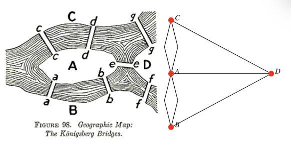

# Graph Navigation

Parent: [[0_Graph_Analytics_MOC]]

La **navigazione** in un grafo si riferisce al processo di esplorazione dei vertici e degli archi del grafo per raggiungere un obiettivo specifico, come trovare un percorso tra due vertici, visitare tutti i vertici o determinare se esiste un ciclo. Esistono diversi algoritmi di navigazione, ognuno con caratteristiche e applicazioni specifiche.

I nodi raggiungibili in un grafo sono tutti quei vertici che possono essere visitati partendo da un nodo sorgente specifico, seguendo una sequenza di archi (cammino).

In un grafo è non orientato, la raggiungibilità è una relazione simmetrica: se $u$ raggiunge $v$, allora $v$ raggiunge $u$; mentre in un grafo orientato, la raggiungibilità è una relazione asimmetrica: se $u$ raggiunge $v$, non è necessariamente vero che $v$ raggiunge $u$.

## Paths, Walks, Trails, Cycles and Circuits

Una **passeggiata** (**walk**) rappresenta la modalità più generica per descrivere il movimento all'interno di un grafo. Se iniziamo da un vertice e ci muoviamo lungo un arco per raggiungere un nuovo vertice, stiamo effettuando una passeggiata. In un grafo orientato (directed graph), il movimento deve seguire necessariamente la direzione indicata dalle frecce.

In un grafo semplice, una passeggiata è formalmente rappresentata da una sequenza di vertici $v_0, v_1, \dots, v_k$, dove ogni coppia di vertici consecutivi è connessa da un arco.

- **Passeggiata Chiusa**: Se il vertice iniziale e quello finale coincidono ($v_0 = v_k$).
- **Passeggiata Aperta**: Se il vertice iniziale e quello finale sono distinti ($v_0 \neq v_k$).

Un **trail** è una passeggiata in cui tutti gli archi sono distinti quindi non è consentito percorrere lo stesso arco più di una volta, ma è possibile visitare lo stesso vertice più volte.

Informalmente, un **path** è una sequenza di archi che inizia in un vertice e si sposta di nodo in nodo attraverso gli archi del grafo. In questo caso i veritici devono essere distinti, quindi non è consentito visitare lo stesso vertice più di una volta. Un path è un trail, ma un trail non è necessariamente un path.

> Sia $n$ un intero non negativo e $G$ un grafo non orientato. Un **path** di lunghezza $n$ da $u$ a $v$ è una sequenza di $n$ archi $e_1, \dots, e_n$ per i quali esiste una sequenza di vertici $x_0 = u, x_1, \dots, x_n = v$ tale che ogni arco $e_i$ abbia come estremi $x_{i-1}$ e $x_i$.

In un grafo semplice, il percorso è identificato univocamente dalla sequenza dei suoi vertici $(x_0, x_1, \dots, x_n)$.

Un path è un **circuito** se inizia e finisce nello stesso vertice ($u = v$) e ha lunghezza maggiore di zero. Quiindi corrisponde ad un trail chiuso.

> Un **ciclo** è un percorso con almeno un arco i cui vertici iniziali e finali sono gli stessi e dove tutti gli altri vertici sono distinti. Quindi corrisponde ad un path chiuso che non è un circuito.

Un ciclo semplice è un ciclo senza archi o vertici ripetuti (eccetto la ripetizione richiesta del primo e dell'ultimo vertice). La lunghezza di un percorso o di un ciclo è il numero di archi.

| Termine            | Archi ripetuti? | Vertici ripetuti? | Chiuso? |
| ------------------ | --------------- | ----------------- | ------- |
| Walk (Passeggiata) | Sì              | Sì                | No/Sì   |
| Trail (Percorso)   | No              | Sì                | No      |
| Path (Cammino)     | No              | No                | No      |
| Circuit (Circuito) | No              | Sì                | Sì      |
| Cycle (Ciclo)      | No              | No                | Sì      |

### Eulerian paths and circuits

La teoria dei grafi nacque da Eulero che voleva trovare un percorso che attraversasse tutti i ponti di Königsberg una sola volta. Eulero comprese che la geografia specifica della città non era rilevante. Ciò che contava era la struttura delle connessioni.

Egli trasformò la mappa in quello che oggi chiamiamo multigrafo:

- le zone della città (divise dal fiume Pregel) divennero vertici (nodi).
- I ponti divennero archi (collegamenti).

Analizzando la configurazione della città, si ottiene la seguente distribuzione dei gradi (ricordando che il grado è il numero di archi incidenti):

- Isola centrale (A): Grado 5 (cinque ponti).
- Riva Nord (C): Grado 3 (tre ponti).
- Riva Sud (B): Grado 3 (tre ponti).
- Penisola Est (D): Grado 3 (tre ponti).

Una soluzione non esiste perchè per poter percorrere un intero grafo passando per ogni arco esattamente una volta, Eulero stabilì una regola che ogni volta che si "entra" in un vertice tramite un ponte, si deve poter "uscire" tramite un altro ponte non ancora utilizzato. Formalmente, ogni transito attraverso un vertice intermedio consuma esattamente due archi incidenti a quel vertice. Pertanto, affinché sia possibile entrare e uscire ogni volta senza riutilizzare archi già percorsi, la somma degli archi incidenti (ovvero il grado del vertice) deve essere necessariamente pari.

Un cammino può avere al massimo due vertici di grado dispari: il punto di partenza e il punto di arrivo.

Nel caso di Königsberg, tutti e quattro i vertici hanno un grado dispari (5, 3, 3, 3).

Poiché il numero di vertici con grado dispari è superiore a due, non esiste un cammino che attraversi ogni ponte una sola volta.

Poiché non sono tutti pari, non esiste nemmeno un ciclo euleriano (che inizi e finisca nello stesso punto).

Un grafo connesso ammette un **circuito euleriano** se esiste un trail chiuso che include ogni arco del grafo esattamente una volta. La condizione necessaria e sufficiente è che ogni vertice abbia grado pari.

> Un grafo $G = (V, E)$ è **euleriano** se e solo se è connesso e:$$\forall v \in V, \deg(v) \equiv 0 \pmod 2$$

> Un grafo $G = (V, E)$ è **semi-euleriano** se e solo se è connesso e il numero di vertici con grado dispari è esattamente due:$$|\{v \in V : \deg(v) \equiv 1 \pmod 2\}| = 2$$

Se il grafo è semi-euleriano, allora esiste un **cammino euleriano** che inizia in uno dei due vertici di grado dispari e termina nell'altro. Questi due vertici saranno necessariamente il punto di inizio e il punto di fine del percorso.

### Hamiltonian Paths and Circuits

Cammino di Hamilton: Un percorso semplice che passa attraverso ogni vertice esattamente una volta.

Circuito di Hamilton: Un circuito semplice che passa attraverso ogni vertice esattamente una volta (ad eccezione del ritorno al vertice iniziale).

La raggiungibilità definisce la struttura macroscopica del grafo:

## Depth-First Search (DFS)

La **Depth-First Search (DFS)** è una strategia di esplorazione che punta a procedere il più lontano possibile lungo ogni ramo prima di tornare sui propri passi (backtracking).

1. Si parte da un vertice sorgente (scelto arbitrariamente o per specifica).
2. Si visita un vicino non ancora esplorato e si prosegue immediatamente da quest'ultimo.
3. Quando si raggiunge un vertice che non ha più vicini non visitati (un "vicolo cieco"), si torna indietro al vertice precedente per cercare altri rami inesplorati.

## Breadth-First Search (BFS)

La **Breadth-First Search (BFS)** una strategia di esplorazione che procede "per livelli". Visita sistematicamente tutti i vicini di un vertice prima di passare ai vicini di questi ultimi.

1. Si parte da un vertice sorgente e si visita tutti i suoi vicini immediati.
2. Successivamente, si visita ogni vicino dei vicini appena visitati, e così via, procedendo a strati successivi del grafo.
3. Solo dopo aver esaurito i vicini diretti, si passa a esplorare i nodi a distanza 2, poi 3, e così via.
