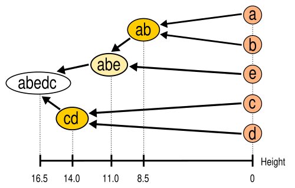

# Clustering

Parent: [[5_Graph_Connettivity]]

Il **clustering** nei grafi si riferisce all'analisi della densità locale e all'identificazione di gruppi di nodi (comunità) che presentano una connettività interna significativamente superiore rispetto a quella con il resto della rete.

## Metriche di clustering

### Coefficiente di Clustering Locale

Il coefficiente di clustering (o di transitività locale) misura quanto i vicini di un nodo siano a loro volta connessi tra loro.

Per un nodo $v_i$ con grado $k_i$, il coefficiente $C_i$ è il rapporto tra il numero di archi esistenti tra i suoi vicini ($e_i$) e il numero totale di archi possibili tra quegli stessi vicini:

$$C_i = \frac{2 e_i}{k_i(k_i - 1)}$$

* **Range:** $0 \leq C_i \leq 1$.
* **$C_i = 1$:** I vicini del nodo formano una clique (sottografo completo).
* **$C_i = 0$:** Nessuno dei vicini del nodo è connesso ad altri vicini (struttura a stella).

### Coefficiente di Clustering Medio

Mentre il coefficiente locale si riferisce a un singolo vertice, il coefficiente medio fornisce una misura sintetica della "clusterizzazione" dell'intero grafo.

Si ottiene semplicemente calcolando la media aritmetica dei coefficienti di clustering locale di tutti i nodi $n$ della rete:

$$\bar{C} = \frac{1}{n} \sum_{i=1}^{n} C_i$$

!!!note Small World Graphs
    Sono reti caratterizzate da un coefficiente di clustering relativamente alto e un diametro medio ($L$) ridotto, indicando che la maggior parte dei nodi può essere raggiunta con pochi passaggi nonostante la forte aggregazione locale.

### Wiener Index

Il Wiener Index rappresenta la somma di tutte le distanze tra tutte le coppie di nodi in un grafo connesso. E' un descrittore globale del grafo.

Dato un grafo $G = (V, E)$ con $n$ nodi, il Wiener Index è definito come:

$$W(G) = \sum_{i < j} d(v_i, v_j)$$

Dove $d(v_i, v_j)$ è la distanza minima (numero di archi) tra il nodo $i$ e il nodo $j$.

**Relazione con il Diametro Medio ($L$):** Il Wiener Index è direttamente proporzionale al diametro medio:

$$L = \frac{W(G)}{n(n-1) / 2}$$

## Community Detection

Il clustering permette di identificare le **comunità** che sono porzioni di grafo caratterizzataida un'elevata connettività interna.
In generale, le comunità sono separate da un numero limitato di archi "ponte" che le collegano ad altri gruppi anche se alcuni nodi possono sovrapporsi in comunità diverse.

{width=50% height=50% align="center"}

La qualità del partizionamento viene definita tramite la misura di conduttanza.

I metodi di rilevamento delle comunità possono essere suddivisi in due categorie:

- **metodi agglomerativi**, con i quali i bordi vengono aggiunti uno alla volta a un grafico che contiene solo nodi. I bordi vengono aggiunti dal bordo più forte a quello più debole.
- **metodi divisivi**, per i quali i bordi vengono rimossi uno alla volta da un grafico completo.

### Girvan-Newman Algorithm

L'algoritmo di Girvan-Newman è un metodo divisivo per l'individuazione di comunità, basato sull'estensione della betweenness centrality agli archi. Opera tipicamente su grafi non diretti e non pesati.

!!!note Edge betweenness
    L'edge betweenness di un arco $e$ è definita come il numero di cammini minimi, tra tutte le coppie di nodi, che lo attraversano. Se esistono più cammini minimi per una singola coppia, il peso unitario del percorso viene suddiviso equamente tra di essi.
    
!!!tip Algoritmo di Girvan-Newman
    1. Calcolare l'edge betweenness per tutti gli archi del grafo.
    2. Rimuovere l'arco con il valore più alto (in caso di parità, rimuoverli tutti).
    3. Ricalcolare l'edge betweenness per tutti gli archi rimanenti.
    4. Ripetere i passaggi 2 e 3 finché non vengono rimossi tutti gli archi.

Il risultato finale è un **dendrogramma** generato dall'alto verso il basso (top-down). Ogni volta che la rimozione di un arco disconnette una componente, il dendrogramma si biforca, tracciando la divisione del grafo in sotto-comunità. Il processo continua fino al completo isolamento di ogni singolo nodo, fornendo una mappa gerarchica completa della rete.

{width=50% height=50% align="center"}

## Graph Partitioning

Il **partizionamento dei grafi** è un problema di ottimizzazione topologica che consiste nel suddividere l'insieme dei nodi di una rete in $k$ sottoinsiemi disgiunti, rispettando rigorosi vincoli strutturali. A differenza della *community detection*, il partizionamento impone una divisione forzata basata su requisiti di efficienza esterni.

!!!note Obiettivi del Partizionamento
    Il problema classico cerca di soddisfare simultaneamente due criteri spesso in conflitto:
    1. **Minimizzazione del Taglio (Min-Cut):** Ridurre al minimo assoluto il numero (o il peso totale) degli archi che collegano nodi appartenenti a partizioni diverse.
    2. **Bilanciamento del Carico:** Garantire che i $k$ sottoinsiemi risultanti abbiano dimensioni o pesi approssimativamente equivalenti.

Poiché la ricerca della partizione perfettamente ottimale è un problema NP-arduo, nella pratica si ricorre a sofisticate euristiche.

InfoMapComplessità: $O(E)$ (generalmente lineare rispetto al numero di archi).Analisi: La logica si basa sulla minimizzazione della description length dei percorsi casuali (random walks). Nonostante il costrutto matematico sottostante risulti meno intuitivo rispetto agli altri metodi, l'efficienza della sua esecuzione garantisce una scalabilità medio-alta, permettendo di catturare strutture topologiche complesse su un'ampia varietà di reti.

LouvainComplessità: $O(V \log V)$ (empirica, frequentemente approssimabile a lineare $O(E)$ su reti sparse).Analisi: Il metodo ottimizza la modularità spostando iterativamente i nodi. Essendo strutturalmente molto veloce, risulta particolarmente efficace per reti dense, il che giustifica la sua classificazione di alta scalabilità. Come contropartita per questa efficienza, tende a produrre comunità nettamente separate e rischia di inglobare le comunità più piccole in aggregazioni maggiori.

### Il Partizionamento in Sottografi (Induced Subgraphs)

Quando applichiamo un algoritmo di *graph partitioning*, il risultato strutturale dell'operazione è l'esatta scomposizione della rete originale in una collezione di **sottografi indotti**. Non si tratta semplicemente di raggruppare etichette, ma di isolare porzioni di topologia matematicamente definite.

!!!note Definizione di Sottografo Indotto
    Dato un grafo originale $G = (V, E)$, il partizionamento divide l'insieme dei vertici $V$ in $k$ sottoinsiemi mutuamente esclusivi $V_1, V_2, \dots, V_k$.

    Le regole per considerare valida la separazione sono due:

    1. **Unione:** $\cup_{i=1}^k V_i = V$, quindi ogni nodo del grafo originale deve essere assegnato a una partizione.
    2. **Disgiunzione:** $V_i \cap V_j = \emptyset$ per ogni $i \neq j$ quindi nessun nodo può appartenere a due partizioni contemporaneamente.

Questa frammentazione dei vertici genera $k$ nuovi ecosistemi, ovvero i sottografi $G_i = (V_i, E_i)$.

Affinché $G_i$ sia un sottografo **indotto** valido, l'insieme dei suoi archi $E_i$ deve includere *tutti e soli* gli archi del grafo originale $G$ che hanno entrambi gli estremi all'interno del sottoinsieme $V_i$.

Questa rigida definizione topologica divide inevitabilmente l'insieme totale degli archi $E$ in due categorie:

* **Archi Intra-Sottografo ($E_i$):** Sopravvivono alla divisione e costituiscono la struttura interna di ogni singola partizione.
* **Archi Inter-Sottografo (Edge Cut):** Sono gli archi i cui estremi finiscono in partizioni diverse (es. un nodo in $V_1$ e uno in $V_2$).

La ricerca della combinazione ottimale di sottografi che minimizzi il taglio rispettando un perfetto bilanciamento dei nodi ha una complessità legata al numero di partizioni possibili, che cresce esponenzialmente ($O(k^V)$). È questa esplosione combinatoria a rendere il problema NP-arduo e vengono usate delle euristiche per trovare soluzioni approssimate in tempi ragionevoli.

### Generalizzazione a N-Partitions

Quando l'obiettivo non è più solo tagliare il grafo a metà, ma suddividerlo in un numero $k$ di partizioni, la logica matematica si evolve. Dato un valore $k$, lo scopo è trovare una partizione $(S_1, S_2, \dots, S_k)$ che minimizzi una misura di "taglio" bilanciato.

Per fare questo, le metriche generalizzate cercano di bilanciare simultaneamente due fattori chiave:

1. **Minimizzare gli archi tra i gruppi:** Avere un valore piccolo per il taglio $cut(S_i, \bar{S}_i)$. *Nota: $\bar{S}_i$ rappresenta il complemento di $S_i$, ovvero l'insieme di tutti i nodi che non vi appartengono.*
2. **Massimizzare la connettività interna:** Avere un "volume" interno grande, indicato come $vol(S_i)$.

La **K-way Conductance** calcola essenzialmente la media delle conduttanze di tutte le singole partizioni.
$$\phi_k(S_1, \dots, S_k) = \frac{1}{k} \sum_{i=1}^{k} \frac{cut(S_i, \bar{S}_i)}{vol(S_i)}$$

Calcolando la media (grazie al termine $\frac{1}{k}$), il risultato finale di questa metrica varia sempre in un intervallo ristretto compreso tra $[0, 1]$.

Il **Normalized Cut** (Taglio Normalizzato per $k$ parti) omette il calcolo della media, limitandosi a sommare i rapporti di taglio di ogni partizione. È una metrica ampiamente utilizzata negli algoritmi di *spectral clustering*.
$$\text{Ncut}_k = \sum_{i=1}^{k} \frac{cut(S_i, \bar{S}_i)}{vol(S_i)}$$

Effettuando una semplice somma, il valore del Normalized Cut (Ncut) spazia in un intervallo più ampio compreso tra $[0, k]$.

In entrambi i casi, per trovare il partizionamento ottimale del grafo nelle $k$ parti desiderate, l'algoritmo matematico dovrà cercare la configurazione che **minimizza** il risultato di queste formule.
