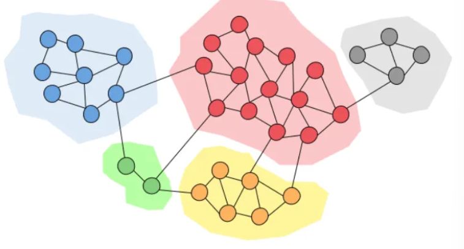

# Clustering

Parent: [[5_Graph_Connettivity]]

Il **clustering** nei grafi si riferisce all'analisi della densità locale e all'identificazione di gruppi di nodi (comunità) che presentano una connettività interna significativamente superiore rispetto a quella con il resto della rete.

## Metriche di clustering

### Coefficiente di Clustering Locale

Il coefficiente di clustering (o di transitività locale) misura quanto i vicini di un nodo siano a loro volta connessi tra loro.

Per un nodo $v_i$ con grado $k_i$, il coefficiente $C_i$ è il rapporto tra il numero di archi esistenti tra i suoi vicini ($e_i$) e il numero totale di archi possibili tra quegli stessi vicini:

$$C_i = \frac{2 e_i}{k_i(k_i - 1)}$$

* **Range:** $0 \leq C_i \leq 1$.
* **$C_i = 1$:** I vicini del nodo formano una clique (sottografo completo).
* **$C_i = 0$:** Nessuno dei vicini del nodo è connesso ad altri vicini (struttura a stella).

### Coefficiente di Clustering Medio

Mentre il coefficiente locale si riferisce a un singolo vertice, il coefficiente medio fornisce una misura sintetica della "clusterizzazione" dell'intero grafo.

Si ottiene semplicemente calcolando la media aritmetica dei coefficienti di clustering locale di tutti i nodi $n$ della rete:

$$\bar{C} = \frac{1}{n} \sum_{i=1}^{n} C_i$$

!!!note Small World Graphs
    Sono reti caratterizzate da un coefficiente di clustering relativamente alto e un diametro medio ($L$) ridotto, indicando che la maggior parte dei nodi può essere raggiunta con pochi passaggi nonostante la forte aggregazione locale.

### Wiener Index

Il Wiener Index rappresenta la somma di tutte le distanze tra tutte le coppie di nodi in un grafo connesso. E' un descrittore globale del grafo.

Dato un grafo $G = (V, E)$ con $n$ nodi, il Wiener Index è definito come:

$$W(G) = \sum_{i < j} d(v_i, v_j)$$

Dove $d(v_i, v_j)$ è la distanza minima (numero di archi) tra il nodo $i$ e il nodo $j$.

**Relazione con il Diametro Medio ($L$):** Il Wiener Index è direttamente proporzionale al diametro medio:

$$L = \frac{W(G)}{n(n-1) / 2}$$

## Community Detection

Il clustering permette di identificare le **comunità** che sono porzioni di grafo caratterizzataida un'elevata connettività interna.
In generale, le comunità sono separate da un numero limitato di archi "ponte" che le collegano ad altri gruppi anche se alcuni nodi possono sovrapporsi in comunità diverse.

La qualità del partizionamento viene definita tramite la misura di conduttanza.

I metodi di rilevamento delle comunità possono essere suddivisi in due categorie:

- **metodi agglomerativi**, con i quali i bordi vengono aggiunti uno alla volta a un grafico che contiene solo nodi. I bordi vengono aggiunti dal bordo più forte a quello più debole.
- **metodi divisivi**, per i quali i bordi vengono rimossi uno alla volta da un grafico completo.

### Girvan-Newman Algorithm

L'algoritmo di Girvan-Newman è un metodo divisivo basato sulla misura di betwenness centrality, estendendola agli edges.

!!!note Edge betweenness
    L'**edge betweenness** di un arco $e$ è definita come la somma del rapporto tra i cammini minimi che passano per $e$ e il totale dei cammini minimi tra ogni coppia di nodi $s$ e $t$:

## Graph Partitioning
