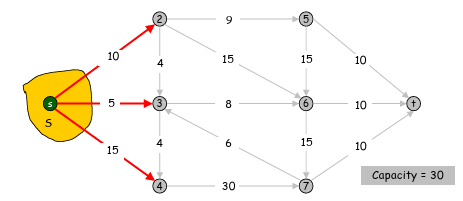
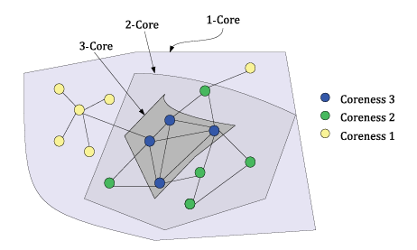

# Graph Connettivity

Parent: [[0_Graph_Analytics_MOC]]

La **connettività** è la proprietà che definisce quanto un grafo sia "unito" o quanto sia facile muoversi tra i suoi vertici. Un grafo che non è connesso può essere visto come un insieme di frammenti isolati. In altre parole, in un grafo connesso, è possibile raggiungere qualsiasi vertice partendo da qualsiasi altro vertice seguendo gli archi del grafo.

Una **componente connessa** di un grafo $G$ è un sottografo connesso di $G$ che non è un sottografo proprio di un altro sottografo connesso di $G$. In altri termini, una componente connessa di un grafo $G$ è un sottografo connesso massimale di $G$.Un grafo $G$ che non è connesso presenta due o più componenti connesse che sono disgiunte e la cui unione costituisce il grafo $G$ stesso.

!!!note
    Un **taglio** è un insieme di vertici o di archi la cui rimozione aumenta il numero di componenti connesse del grafo. In altre parole, un taglio è un insieme di elementi (vertici o archi) che, se rimossi, disconnettono il grafo.

Il taglio può avvenire sia a livello di vertici che di archi:

- **Vertici di Taglio** (o **Punti di Articolazione**): Sono vertici la cui rimozione (insieme a tutti gli archi incidenti) produce un sottografo con un numero maggiore di componenti connesse. La rimozione di un vertice di taglio da un grafo connesso genera un sottografo non connesso.
- **Archi di Taglio** (o **Ponti**): Un arco la cui rimozione produce un grafo con più componenti connesse rispetto al grafo originale.

Per quantificare la robustezza di un grafo, definiamo i seguenti parametri:

- **Connettività dei vertici $\kappa(G)$**: Il numero minimo di vertici che devono essere rimossi per disconnettere il grafo o ridurlo a un singolo vertice.
- **Connettività degli archi $\lambda(G)$**: Il numero minimo di archi che devono essere rimossi per disconnettere il grafo.

Esistono due approcci principali, uno algoritmico e uno algebrico:

- **Approccio Algoritmico (BFS/DFS)**: Partendo dal nodo sorgente, si esplora il grafo "a macchia d'olio" (Breadth-First Search) o in profondità (Depth-First Search). Tutti i nodi marcati come "visitati" alla fine del processo costituiscono l'insieme dei nodi raggiungibili. La complessità è $O(|V| + |E|)$.
- **Approccio Algebrico (Matrice di Adiacenza)**: Come accennato in precedenza, se analizziamo la matrice $A$, un nodo $j$ è raggiungibile dal nodo $i$ in esattamente $k$ passi se l'elemento $(i, j)$ della matrice $A^k$ è maggiore di zero:$$(A^k)_{ij} > 0$$

## Connectivity in Undirected Graphs

**Componente Connessa**: Un insieme di nodi in cui ogni nodo è raggiungibile da qualsiasi altro nodo dell'insieme.

## Connectivity in Directed Graphs

Un grafo orientato è **fortemente connesso** se esiste un percorso da $a$ a $b$ e da $b$ ad $a$ ogni volta che $a$ e $b$ sono vertici del grafo.Affinché un grafo orientato sia fortemente connesso, deve esserci una sequenza di archi orientati da qualsiasi vertice del grafo verso ogni altro vertice.

Un grafo orientato è **debolmente connesso** se esiste un percorso tra ogni coppia di vertici nel grafo non orientato sottostante.

Per analizzare la connettività di un grafo (sia esso orientato o non orientato), possiamo utilizzare algoritmi di ricerca come DFS o BFS. Questi algoritmi ci permettono di esplorare il grafo e determinare se tutti i vertici sono raggiungibili l'uno dall'altro, identificando così le componenti connesse.

## Max-Flow Min-Cut Theorem

Questo teorema serve per risolvere problemi di ottimizzazione legati al flow dei flussi in un grafo.

Una rete di flusso è un multigrafo ponderato e diretto.
Il flusso è definito come uno spostamento di una quantità da un nodo a un altro lungo un arco. Il flusso deve rispettare due condizioni:

1. **Capacità**: Il flusso su un arco non può superare la capacità dell'arco stesso. Formalmente, se la capacità di un arco è indicata come $c(u, v)$ e il flusso attraverso quell'arco è $f(u, v)$, allora deve soddisfare la condizione $0 ≤ f(u, v) ≤ c(u, v)$$ per tutti gli archi $(u, v)$ all'interno della rete.
2. **Conservazione del flusso**: Per ogni nodo, ad eccezione della sorgente e del pozzo, la quantità totale di flusso che entra deve essere uguale alla quantità totale di flusso che esce. Ciò garantisce che il flusso continui senza interruzioni e non si accumuli o dissipi all'interno della rete, nonostante sia possibile consentire l'accumulo di flusso se il sistema lo richiede. Matematicamente, per ogni nodo " u " e i nodi adiacenti rappresentati e raggruppati dai supernodi " v" e "w ", la proprietà di conservazione del flusso è espressa come:$$\sum_{v} f(u, v) = \sum_{w} f(w, u)$$.

!!!theorem Max-Flow Min-Cut Theorem
    Il teorema afferma che in una rete di flusso, il **flusso massimo** che può passare da una sorgente (source) a una destinazione (target o sink) è esattamente uguale alla **capacità del taglio minimo** (min-cut) necessario per separare completamente la sorgente dalla destinazione.
    - Massimo Flusso ($Max-Flow$): Rappresenta la quantità massima di "entità" (dati, acqua, traffico) che può transitare nella rete rispettando i limiti di capacità di ogni arco.
    - Minimo Taglio ($Min-Cut$): Identifica l'insieme di archi con la capacità totale minima la cui rimozione scollega la sorgente dal target.

Questo teorema viene utilizzato per analizzare la resilienza e al'affidabilità di una rete.
Per l'analisi della resilienza,si deve ricercare il numero minimo di archi e nodi che se rimossi disconnetto il grafo.

## Analisi della connettività

### Eccentricità, raggio e diametro

!!!note Eccentricità
    L'eccentricità di un vertice $v$ in un grafo connsso è la distanza massima tra $v$ e qualsiasi altro vertice del grafo. Formalmente, è definita come:$$\epsilon(v) = \max_{u \in V} d(v, u)$$ Dove $d(v, u)$ è la distanza tra i vertici $v$ e $u$.
    In un grafo disconnesso, se un nodo non può raggiungerne un altro, la sua eccentricità diventa formalmente infinita.

!!!note Raggio
    Il raggio è definito come l'eccentrcità minima fra tutti i nodi del grafo. Se il grafo è disconesso, il raggio è considerato infinito, perche non esiste nessun nodo che permette di raggiungere tutti gli altri nodi del grafo. Formalmente:$$r(G) = \min_{v \in V} \epsilon(v)$$

!!!note Diametro
    Il diametro è definito come la masssima eccentricità di un grafo connesso, cioè è la distanza più lunga tra qualunque coppia di vertici. Anche in questo caso, se il grafo è disconesso, il diametro è considerato infinito, perche non esiste nessuna coppia di nodi che permette di raggiungere tutti gli altri nodi del grafo. Formalmente:$$d(G) = \max_{v \in V} \epsilon(v)$$

### Conduttanza

La **conduttanza** di un grafo  è un parametro metrico che misura la "qualità" di un taglio nel grafo, indicando quanto sia difficile per un processo (come un cammino casuale) uscire da un determinato insieme di nodi.

In termini intuitivi, una bassa conduttanza indica la presenza di un "collo di bottiglia": un insieme di nodi densamente connessi tra loro ma scarsamente connessi al resto del grafo.

!!!note Conduttanza
    Sia $G = (V, E)$ un grafo e $S \subset V$ un sottoinsieme di vertici. La conduttanza di $S$, indicata con $\phi(S)$, è definita come: $$\phi(S) = \frac{|\partial(S)|}{\min(\text{vol}(S), \text{vol}(V \setminus S))}$$ Dove:
    - **$|\partial(S)|$**: è il numero di archi che collegano un nodo in $S$ a un nodo fuori da $S$ (il "taglio").
    -  **$\text{vol}(S)$**: è il volume di $S$, ovvero la somma dei gradi dei nodi appartenenti a $S$ ($\sum_{v \in S} d(v)$).
  
La conduttanza può essere calcolata sia per i garfi direttti che per quelli non diretti, ma per questi, bisogna considerare gli archi in entrambie le direzioni.

La conduttanza dell'intero grafo $G$ è il valore minimo di $\phi(S)$ calcolato su tutti i possibili sottoinsiemi $S$:

$$\phi(G) = \min_{S \subseteq V} \phi(S)$$

L'analisi della conduttanza permette di caratterizzare la struttura globale del network:

- **Community Detection:** I cluster o le comunità in un grafo sono spesso identificati come sottoinsiemi di nodi con bassa conduttanza.
- **Mixing Time:** Nelle catene di Markov e nei cammini casuali (random walks), la conduttanza determina la velocità con cui il processo raggiunge la distribuzione stazionaria. Una conduttanza elevata implica che il cammino casuale "esplora" rapidamente l'intero grafo.
- **Robustezza:** Un grafo con alta conduttanza è generalmente più resiliente a guasti mirati, poiché non presenta divisioni nette o ponti critici.

#### La Disuguaglianza di Cheeger

Secondo la teoria spettrale, la conduttazza, dipende da, $\lambda_1$ il secondo autovalore più piccolo del **Laplaciano normalizzato** del grafo, vale la seguente relazione:

$$\frac{\lambda_1}{2} \leq \phi(G) \leq \sqrt{2\lambda_1}$$

Questa disuguaglianza permette di approssimare il valore della conduttanza (che è computazionalmente difficile da calcolare esattamente, essendo un problema NP-hard) analizzando semplicemente lo spettro della matrice Laplaciana. È il fondamento teorico del **Clustering Spettrale**.

### Diametro Medio

L'**Average Path Length** misura l'efficienza del trasporto di informazioni all'interno della rete. Rappresenta la media delle distanze più brevi tra tutte le coppie di nodi possibili.

Dato un grafo $G = (V, E)$ con $n$ nodi, sia $d(v_i, v_j)$ la distanza geodetica (il cammino minimo) tra il nodo $i$ e il nodo $j$:

$$L = \frac{1}{n(n-1)} \sum_{i \neq j} d(v_i, v_j)$$

Un valore di $L$ basso indica che la rete è "stretta" (proprietà Small-World), ovvero che ogni nodo può raggiungerne un altro con pochissimi passaggi intermedi.

* **Nota:** Se il grafo non è connesso, il diametro è tecnicamente infinito. In questi casi si calcola la media solo sulle componenti connesse o si utilizza l'efficienza globale.

## Cliques

Una **clique** è un insieme di $V$ di vertici in $u$ grafo non orienteato per cui ogni coppia di vertici in $V$, esiste un arco che li collega.

!!!note Clique
    Una clique in un grafo indiretto $G = (V, E)$ è un sottoinsieme dell'insieme dei vertici $C ⊆ V$, tale che per ogni due vertici in $C$, esiste uno spigolo che li connette. Questo equivale a dire che il sottografo indotto da $C$ è completo.

### K-core decomposition

the k-core of a network is the maximal subgraph in which each node has at least k connections to other nodes in the subgraph, despite how many links we have outside the subgraph

Il **k-core** di un grafo è un sottografo massimale in cui ogni nodo ha almeno $k$ connessioni con altri nodi all'interno del sottografo, indipendentemente da quante connessioni abbia al di fuori del sottografo stesso.

!!!note K-core decomposition steps
    Per ottenere il $k$-core di un grafo, si procede come segue:
    1. Si rimuovono tutti i nodi con grado inferiore a $k$.
    2. Si ricalcolano i gradi dei nodi rimanenti (poiché la rimozione di un nodo riduce il grado dei suoi vicini).
    3. Si ripete il processo finché tutti i nodi nel grafo rimanente hanno grado $\geq k$.

L'algoritmo di decomposizione in $k$-core è efficiente, con una complessità di $O(|V| + |E|)$, poiché ogni nodo e ogni arco viene esaminato al massimo una volta durante il processo di rimozione.

!!!warning
    Ogni clique di dimensione $k$ è contenuta in un $(k-1)$-core.

Ad esempio, una clique di 4 nodi (dove ogni nodo ha grado 3) è necessariamente parte di un 3-core. Tuttavia, un 3-core non è necessariamente una clique: può essere un insieme molto vasto di nodi dove ognuno ha semplicemente 3 vicini, risultando in una struttura molto più "sparsa" di una clique.
