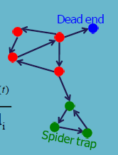

# Link analysis algorithm

Gli algoritmi di link analysis sono un insieme di tecniche utilizzate per analizzare e valutare l'importanza o la rilevanza dei nodi in un grafo, basandosi sulle connessioni tra i nodi stessi. Questi algoritmi sono ampiamente utilizzati in vari campi, tra cui il web search, la social network analysis, e la bibliometria.

## HITS (Hyperlink-Induced Topic Search)

L'algoritmo **HITS** è un algoritmo di analisi dei link che valuta le pagine web, sviluppato da Jon Kleinberg (1999). Questo algoritmo viene utilizzato per analizzare le strutture di link del web al fine di individuare e classificare le pagine web pertinenti a una specifica ricerca. 
HITS utilizza hub e autorità per definire una relazione ricorsiva tra le pagine web.

- **Hub** è una pagina che contiene molti link a pagine autorevoli. Quindi ha un alto out-degree.
- **Authority** è una pagine che viene refernziata da molti hub. Quindi ha un alto in-degree.

L'algoritmo si basa sulla definizione di due misure di score:

- **Authority Score**: misura la qualità di una pagina come fonte di informazioni. Viene calcolato sommando i punteggi degli hub che puntano alla pagina.
- **Hub Score**: misura la qualità di una pagina come aggregatore di informazioni. Viene calcolato sommando i punteggi delle autorità a cui la pagina punta.

Tra hub e authority esiste una **mutual reinforcement relationship** cioè un buon hub punta a molte buone autorità, e una buona autorità è puntata da molti buoni hub. L'algoritmo itera fino a quando i punteggi di hub e authority convergono a valori stabili.
 
Il funzionamento si basa su una query formula dall'utente, che viene inviata a un motore di ricerca. Non dipende da punti universali di hub e authority, ma è specifico per la query

Il motore restituisce un sottoinsieme delle pagine web pertinenti alla query, chiamate **roots**, fornendo due ranking una per le authority  e una per gli hub.

!!!tip Algoritmo
    Questo problema può essere modellato come un grado diretto bipartito, dove ogni nodo ha un hub score e un authority score. Quindi ogni nodo è ripetuto due volte.

    1. Definiamo il numero $k$ di itereazioni da eseguire
    2. Al tempo $t_0$ assegnamo come valori iniziali di $Hub\_score = \frac{1}{\sqrt{N}}$ e an $Authority\_score = \frac{1}{\sqrt{N}}$.
    3. Ripetere $k$ volte: 
        - **Hub update**: per ogni nodo Hub aggiorniamo l'Hubscore = $\sum_{j} A_j$ dove $A_j$ è l'Authority score di ogni nodo Authority a cui il nodo Hub punta.
        - **Authority update**: per ogni nodo Authority aggiorniamo l'Authority score = $\sum_{i} H_i$ dove $H_i$ è l'Hub score di ogni nodo Hub che punta al nodo Authority.
    4. Normalizziamo i punteggi di hub e authority dividendo per la  radice quadrata delle somme dei quadrati di tutto gli $Hub\_score $. 
        - $ \sum_{j} Hub\_score_j^2 = 1$ e $ \sum_{i} Authority\_score_i^2 = 1$.

La convergenza è garantita grazie ai modelli delle chain markoviane.

**Problemi**

- **Referenziazioni Circolari**: Se ci sono cicli di link, l'algoritmo potrebbe non convergere o potrebbe convergere a valori non significativi.
- **Manipolazione dei Link**: I proprietari di siti web potrebbero creare link artificiali per aumentare i loro punteggi di hub o authority, portando a risultati distorti.

### Co-Citation e Bibliographic Matrix Relationship

L'algoritmo HITS può essere implementato utilizzando la matrice di adiacenza del grafo. Se definiamo $A \in \R^{N \times N}$, dove $N$ è il numero delle pagine web, come la matrice di adiacenza del grafo, e definiamo $h$ come il vettore degli hub score e $a$ come il vettore degli authority score, i punteggi di hub e authority possono essere calcolati iterativamente utilizzando le seguenti formule:

- $h_i = \sum_{i \rightarrow j} a_j = \sum_{j} A_{ij} a_j = A \cdot a = A \cdot a$
- $a_j = \sum_{i \rightarrow j} h_i = \sum_{i} A_{ij} h_i = A^T \cdot h$
- Ripetiamo fino a convergenza, normalizzando i punteggi dopo ogni iterazione. L'aggiornamento dei vettori viene calcolato:
  - $h^{(t+1)} = A \cdot a^{(t)}$
  - $a^{(t+1)} = A^T \cdot h^{(t+1)}$

Si basa sull'approccio del _power iteration method_.

## PageRank

Il **PageRank** è l'algoritmo di link analysis ideato da Larry Page e Sergey Brin (Google, 1996-1997) per misurare l'importanza dei nodi (pagine web) analizzando la struttura degli archi (link) che li collegano.

Dal punto di vista ingegneristico, è un'applicazione diretta delle Catene di Markov su scala globale. 

!!!note Il principio fondante è ricorsivo: una pagina è importante se riceve link da altre pagine importanti. Un arco dal nodo $i$ al nodo $j$ è interpretato come un "voto" di $i$ a favore di $j$.

Tuttavia, il peso di questo voto non è uniforme:

* È direttamente proporzionale all'importanza (il rank) della pagina sorgente $i$. 
* È inversamente proporzionale al grado uscente $d_i$ della pagina sorgente. Se $i$ possiede un certo punteggio di importanza e ha 4 link uscenti, distribuirà un quarto del suo rank a ciascun nodo destinazione.

Il **rank** $r_j$ della pagina $j$ èd definito come la somma dei contributi di tutte le pagine $i$ che puntano a $j$:
$$r_j = \sum_{i \rightarrow j} \frac{r_i}{d_i}$$
dove:

- $r_i$ è il rank della pagina $i$ che punta a $j$.
- $d_i$ è il numero di link uscenti dalla pagina $i$.

La somma totale dei rank di tutti i nodi deve essere esattamente pari a $1$.

Il Page Rank si basa sull'algoritmo del _random surfer_, quidi il page rank di una  pagina web è la probabilità che un utente qualsiasi, dopo aver cliccato a caso per un tempo lunghissimo finisca su quella pagina.

Quindi possimao definire $M$ come la matrice di adiacenza stocastica per colonne (in cui $M_{ji} = 1/d_i$ se esiste un arco da $i$ a $j$, e $0$ altrimenti), l'equazione diventa un problem di algebra lineare:
$$r = M \cdot r$$

### Il Damping Factor

Applicare l'equazione $r = M \cdot r$ al World Wide Web porta a un fallimento matematico della convergenza delle markovian chain. Per gli stessi motivo del _random surfer_, la presenza dei _dead-end_ e dei _spider trap_ impedisce l'esistenza di una distribuzione stazionaria stabile:

!!!note Esistenza e unicità della distribuzione stazionaria nei processi di Markov
    Devono valere le seguenti condizioni:
    1. La matrice di transizione è una matrice stocastica: la somma di tutte le colonne è pari a 1.
    2. La matrice è irriducibile, cioè il grafo è fortemente connesso: i → j per ogni coppia di nodi nel grafo.
    3. La matrice è periodica → è possibile tornare a ciascun nodo in un numero fisso di passi.

Per garantire l'esistenza e l'unicità della distribuzione stazionaria, dobbiamo considerare il parametro di teletrasporto, per la seconda condizione, chiamato **damping factor** (indicato con $\beta$, con valori tra $0.8$ e $0.95$).

A ogni iterazione iterazione di calcolo, il "navigatore casuale" ha due opzioni:

1. Con probabilità $\beta$, segue regolarmente un link uscente.
2. Con probabilità $1-\beta$, salta su una pagina estratta uniformemente a caso tra tutte quelle esistenti.

Per ogni nodo $j$, il rank è calcolato come:

$$ r_j =  \sum_{i \rightarrow j} \beta \frac{r_i}{d_i} + \frac{1-\beta}{N} $$

Per passare dalla matrice di transizione a una forma matriciale compatta e ottimizzata per il calcolo computazionale del PageRank.

Definiamo:
$$r = A \cdot r$$ dove ogni elemento di $A$ e definito come $a_{ji}= \beta M_{ji} + \frac{1- \beta}{N}$ e  rappresenta la probabilità complessiva che un utente passi dalla pagina $i$ alla pagina $j$.

La slide analizza poi il calcolo per il PageRank di un singolo nodo, $r_j$.
Sostituendo la definizione di $A_{ji}$ all'interno della sommatoria e distribuendo i termini, l'equazione viene divisa in due parti: la parte derivante dalla struttura dei link ($\beta M_{ji} \cdot r_i$) e la parte derivante dal teleporting ($\frac{1-\beta}{N} \cdot r_i$).

Il passaggio fondamentale è evidenziato in verde: **$\sum_{i=1}^N r_i = 1$**.
Poiché il vettore $r$ rappresenta una distribuzione di probabilità stazionaria, la somma del PageRank di tutte le pagine nell'intero web deve essere pari a 1. Grazie a questa proprietà, la sommatoria legata al teleporting perde la dipendenza da $r_i$ e si semplifica in una pura costante scalare: $\frac{1-\beta}{N}$.

$$r = \beta M \cdot r + \left[\frac{1-\beta}{N}\right]_N$$ 

dove $N$ è il numero totale di nodi nella rete e l'ultimo termine rappresenta un vettore di dimensione $N$ in cui ogni elemento è pari a $(1-\beta)/N$. 

Thisformulationassumesthat𝑴hasnodeadends.Wecaneither preprocess matrix 𝑴to remove all dead ends or explicitly follow randomteleportlinkswithprobability1.0fromdead-ends.
Easysolution:ifacolumnhasall0thenreplacewith1/N

La matrice $A$ è una matrice **densa** (non ha zeri, perché dal teleporting ogni nodo è connesso a tutti gli altri), il che renderebbe il calcolo impossibile per miliardi di nodi.
La matrice $M$, invece, è altamente **sparsa** (la maggior parte degli elementi è zero). La formula dimostra che possiamo calcolare il PageRank facendo una moltiplicazione per una matrice sparsa (estremamente efficiente in memoria e calcolo) e semplicemente sommando un vettore costante alla fine di ogni iterazione.

> Questo garantisce che il metodo iterativo (Power Iteration) converga sempre e in modo stabile al vettore globale di ranking $r$.

### Personalized PageRank

