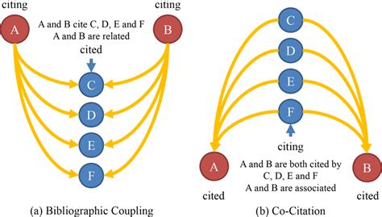

# 6_3_Citation_Networks

!!!note 
    Le **Citation Networks** sono reti dirette in cui i nodi rappresentano articoli accademici e gli archi rappresentano le citazioni da un articolo a un altro. Questi archi puntano da articoli più recenti a quelli più vecchi, rendendo le reti di citazione acicliche per natura. 
    - Il grado in entrata di un nodo è il numero di citazioni ricevute, cioè la popolarità di quel documento;
    - Il grado in uscita è il numero di riferimenti che il documento contiene, cioè la sua ampiezza bibliografica.
  
Gradi di ingresso tendono a seguire una distribuzione a legge di potenza (power law): pochi documenti sono molto citati, molti sono poco citati.

Citation network possono essere rappresentati utilizzando matrici di adiacenza, dove ogni cella indica una citazione da un documento a un altro, o mediante liste di adiacenza che enumerano tutti i collegamenti in uscita per ciascun nodo, il che è più efficiente per reti sparse. 

Definiamo $L$ come la matrice di adiacenza (o **citation matrix**) del nostro grafo di dimensione $N \times N$, dove $N$ è il numero totale di documenti.
Le celle della matrice sono popolate in questo modo:

* $L_{ij} = 1$ se il documento $i$ cita il documento $j$.
* $L_{ij} = 0$ altrimenti.

## Co-Citation e Bibliographic Coupling

Il **Bibliographic Coupling** (accoppiamento bibliografico) e la **Co-citation** (co-citazione) sono due metriche strutturali utilizzate nella network analysis per quantificare la similarità semantica tra documenti. Invece di impiegare tecniche di Natural Language Processing sui testi, questi metodi estraggono relazioni latenti operando puramente sull'algebra lineare del grafo delle citazioni.

{width=50% height=50%}

BC is a similarity between two citing items, whereas CC is that between two cited items. In BC, the similarity is based on the number of shared references, while in CC, it is based on the number of times two items are cited together by other items.

La **Matrice di Co-citazione** (Co-Citation Matrix) ci permette di quantificare quante volte due documenti vengono citati congiuntamente da terzi. Dal punto di vista dell'ingegneria dei dati, è una trasformazione elegante che passa da un grafo orientato (chi cita chi) a un grafo non orientato e pesato (quanto due paper sono associati dalla comunità).

La matrice di co-citazione $C$ è una matrice quadrata e simmetrica che si ottiene moltiplicando la matrice trasposta $L^T$ per la matrice originale $L$:

$$C = L^T \times L$$

Questa operazione equivale a calcolare il prodotto scalare tra le colonne della matrice originale.

$$C_{ij} = \sum_{k=1}^N L_{ki} L_{kj}$$

Ogni singola cella della matrice risultante ci fornisce informazioni topologiche preziose:

* **Valori extra-diagonali ($C_{ij}$ con $i \neq j$):** Rappresentano l'intensità della co-citazione. La formula algebrica per il singolo elemento è $C_{ij} = \sum_{k=1}^n L_{ki} L_{kj}$. In termini semplici, restituisce esattamente il numero di paper (l'indice $k$) che contengono sia $i$ sia $j$ nella loro bibliografia.
* **Valori sulla diagonale ($C_{ii}$):** Se moltiplichiamo una colonna per se stessa, otteniamo semplicemente la somma dei suoi valori non nulli. Pertanto, $C_{ii}$ corrisponde al numero totale di documenti che citano il paper $i$ (ovvero il suo *in-degree* nel grafo originale).

La **Matrice di Bibliographic Coupling** $B$ è una matrice quadrata e simmetrica che si ottiene invertendo l'ordine dei fattori rispetto alla co-citazione. Si moltiplica la matrice originale $L$ per la sua trasposta $L^T$:

$$B = L \times L^T$$

In termini di algebra lineare, questa operazione calcola il prodotto scalare tra le *righe* della matrice originale $L$.

$$B_{ij} = \sum_{k=1}^N L_{ik} L_{jk}$$

L'analisi delle singole celle della matrice $B$ restituisce le seguenti metriche strutturali:

* **Valori extra-diagonali ($B_{ij}$ con $i \neq j$):** Rappresentano la forza dell'accoppiamento bibliografico. La sommatoria per il singolo elemento è $B_{ij} = \sum_{k=1}^n L_{ik} L_{jk}$. Questo valore restituisce il numero esatto di paper (il documento $k$) che compaiono simultaneamente nella bibliografia sia del documento $i$ sia del documento $j$. Maggiore è questo numero, più i due documenti affrontano uno spazio della ricerca simile.
* **Valori sulla diagonale ($B_{ii}$):** Essendo il prodotto scalare di una riga per se stessa, $B_{ii}$ conta il numero totale di elementi non nulli su quella riga. Corrisponde esattamente al numero totale di reference presenti nella bibliografia del documento $i$ (ovvero il suo *out-degree* nel grafo orientato).

Calcolare BC e CC richiede la moltiplicazione di una matrice di adiacenza. La complessità computazionale della moltiplicazione di matrici è data da una funzione superlineare, che è $O(N^2)$ o $O(N\log N)$ a seconda dell'algoritmo utilizzato, dove $N$ è il numero di nodi (paper) nel grafo.