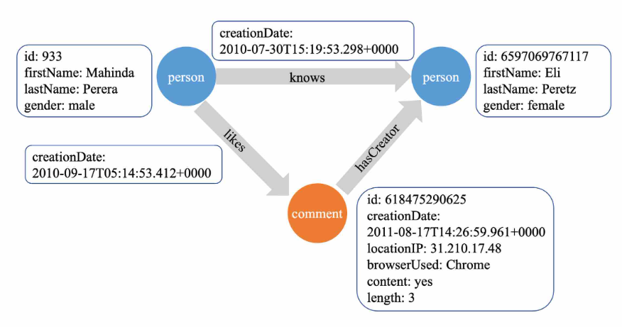
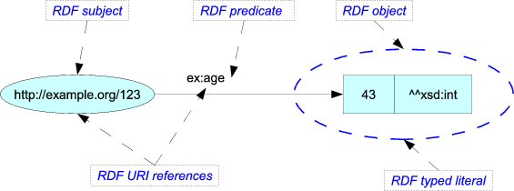
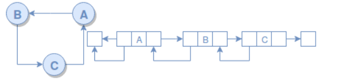
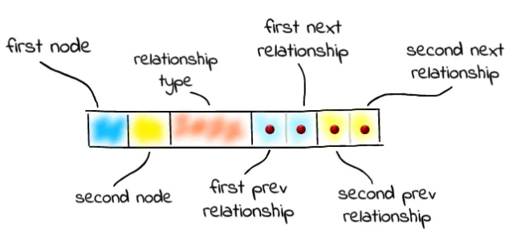

# Graph Databases

Parent: [[0_Graph_Analytics_MOC]]

Un graph database (NoSQL) è un data-storage engine che utilizza i grafi per rappresentare e memorizzare le informazioni in mdo persistente.
I graph db vengono utlizzati per gestire grandi quantià di dati che presentano molte relazioni fra di loro, come ad esempio i social network, i sistemi di raccomandazione, le reti di trasporto e le reti di comunicazione.

Sono molto più efficienti dei db relazionali in quanto risultano molto più veloci nell'esecuzione di query che coinvolgono molte relazioni perchè le relazioni vengono rappresentate diretamente negli archi, cosa che nei relazionali non veniva esplicitamente mostrata, ma veniva rappresentata tramite tabelle di join che rallentavano le query.

Inoltre risultano essere molto più efficienti nella gestione di queries ricorsive. Nei db relazionali, queste possono coinvolgere molte relazioni e svolgere molte operazioni di join, oltre ad essere molto complesse  da scrivere. Mentre con i graph db, le queries ricorsive sono più semplici da scrivere e più efficienti da eseguire, grazie alla struttura a grafo che consente di navigare facilmente tra i nodi e le relazioni. I graph db permetto anche di trovare i **path** fra due nodi, operazione che con i db relazionali non è possibile fare in modo efficeinte.

Un problema che i graph db presentano sono legati al **mantenimento dell'integrità dei dati**.

## Tipi di graph database

### Property Graph Database

I **property graph** sono un tipo di database a grafo che modella i nodi e le relazioni tra i nodi, con l'aggiunta di **proprietà** associate a entrambi. Le caratteristiche principali dei database a grafo di proprietà includono:

- **nodi con proprietà** I nodi in un grafo di proprietà possono avere proprietà associate, ovvero coppie chiave-valore che forniscono informazioni aggiuntive sull'entità rappresentata dal nodo. Ad esempio, in un social network, un nodo utente può avere proprietà come "nome", "età" o "posizione".
- **relazioni con proprietà** Anche le relazioni (archi) tra i nodi nei database dei grafi di proprietà possono avere proprietà. Queste proprietà forniscono dettagli sulla natura o l'intensità della relazione. Questa flessibilità consente una rappresentazione sfumata dei dati interconnessi.

{width="70%", height="70%"}

Un problema per chi usa i graph db è che le properies possono essere diversi, anche per i nodi che modellano la stessa entità. Per esempio, in un grafo di proprietà che rappresenta persone, alcuni nodi potrebbero avere una proprietà "età", mentre altri potrebbero non averla. Questo può portare a una certa eterogeneità nei dati, rendendo più difficile garantire la coerenza e l'integrità dei dati all'interno del grafo.

### RDF graph database

I **RDF graph detabase** (**Resource Description Framework**) utilizzano un approccio diverso, concentrandosi sulla rappresentazione dei dati come triple soggetto-predicato-oggetto.

In RDF, ogni dato è espresso come una tripla, composta da tre componenti:

- **Soggetto**: rappresenta la risorsa o l'entità su cui si basa l'affermazione.
- **Predicato**: indica la relazione o l'attributo tra il soggetto e l'oggetto.
- **Oggetto**: indica il valore o l'obiettivo della relazione.

{width="70%", height="70%"}

Esempio: si consideri la tripla "Alice conosce Bob". Qui, "Alice" è il soggetto, "conosce" è il predicato e "Bob" è l'oggetto.
La struttura tripla è altamente flessibile, consentendo la rappresentazione di diversi tipi di relazioni e dati. Questa flessibilità si adatta a modelli di dati complessi, rendendo RDF adatto a descrivere e collegare vari tipi di informazioni.

Le triple RDF formano naturalmente una struttura a grafo, in cui i nodi rappresentano risorse (soggetti o oggetti) e gli archi rappresentano predicati. Questa rappresentazione basata su grafi è intuitiva e si allinea bene con il modo in cui i dati sono interconnessi nel mondo reale. I database a grafo RDF eccellono nell'interrogazione di dati interconnessi. Le query possono attraversare il grafo per scoprire modelli, relazioni e connessioni tra diverse entità.

### Hypergraph Database

Un **hypergraph database** è un grafo dove un arco può collegare un numero arbitrario di nodi contemporaneamente, in questo caso si parla di **iper-edge**.
Permette di modellare relazioni "molti-a-molti" in modo atomico, senza dover creare nodi intermedi artificiali.

### Spatial graph database

Gli **spatial graph database** sono progettati per gestire dati spaziali e geografici (coordinate, poligoni, topologie). Questi database sono ottimizzati per eseguire query spaziali, come la ricerca di punti di interesse vicini, l'analisi di percorsi e la gestione di dati geografici complessi. Utilizzano strutture dati specializzate, come R-tree o quad-tree, per indicizzare e accedere efficientemente ai dati spaziali.

### Temporal graph database

I **temporal graph database** sono progettati per modellare la dimensione **temporale** dei dati e come questi evolvono nel tempo, compresi le loro relazioni e proprietà.
Esistono due approcci principali:

- **Snapshot** in cui ogni snapshot rappresenta lo stato del grafo in un momento specifico.
- **Time-stamped edges** in cui ogni arco è associato a un intervallo di tempo che indica quando la relazione è valida.

## Graph Database Management Systems (GDBMS)

Un **GDBMS** è un sistema di gestione di database online che espone un modello di dati a grafo attraverso metodi **CRUD** (Create, Read, Update, Delete).

Questi sistemi sono generalmente progettati per carichi di lavoro transazionali in tempo reale (**Online Transactional Processing**) che facilita query e analisi più complesse sui dati storici. I sistemi OLAP elaborano un numero inferiore di transazioni, ma di durata più lunga, su un numero elevato di record. I sistemi OLAP sono orientati verso una lettura più rapida, senza l'aspettativa di aggiornamenti transazionali tipici dell'OLTP, e il funzionamento in batch è comune.

Mentre, le operazioni di **elaborazione delle transazioni online** (**OLTP**) sono in genere attività di breve durata, come la prenotazione di un biglietto, l'accredito di un conto, la prenotazione di una vendita ecc. che implicano l'elaborazione di query voluminose a bassa latenza e un'elevata integrità dei dati. I loro punti di forza risiedono nella robustezza operativa e nell'elevata scalabilità concorrente per molti utenti.

## Graph Engine

Alcuni database utilizzano uno **storage nativo** ottimizzato specificamente per i grafi, mentre altri **serializzano** i dati in database relazionali o NoSQL esistenti. Ovviamente, i database che serializzano i dati in altri formati possono introdurre overhead e complessità aggiuntiva e possono essere meno efficienti nell'esecuzione di query complesse sui grafi rispetto ai database nativi.

### Graph First System

I database nativi sono progettati sia per archiviare che per elaborare i dati sotto forma di grafico, occupandosi di rappresentare gli elementi del grafo e di come rendere efficiente l'esecuzione di query sui grafi.

I sistemi nativi si distinguono in base a:

- il tipo di archiviazione (**storage**) che riguarda come i dati del grafo vengono memorizzati su disco o in memoria
- il motore di elaborazione (**processing engine**), cioè come vengono eseguite le operazioni su graph db

#### Index-free adjacency

I database nativi sono progettati da zero con l'unico scopo di gestire strutture a grafo in modo efficiente, ad esempio l'operazione di attraversamente avviente molto eefficacemente senza introdurre idex lookups o altre tecnologie, cosa che i db non nativi fanno. Ovviamente si ha una perdità di effiecienza nelle operazioni che vengono realizzate nel db. La struuttura che permette ai native graph db di essere così efficienti è l'**index-free adjacency**.

Ogni nodo fa riferimento direttamente ai nodi adiacenti (vicini), il che significa che l'accesso alle relazioni e ai dati correlati è semplicemente una ricerca di puntatori di memoria. Questo fa sì che il tempo di elaborazione nativo del grafo sia proporzionale alla quantità di dati elaborati, non aumentando esponenzialmente con il numero di relazioni attraversate e di hop navigati.

{width="70%", height="70%"}

Esistono file di archiviazione separati per nodi, relazioni, etichette e proprietà di nodi e relazioni. 
Poiché ogni record ha una dimensione fissa, il database calcola l'offset (la posizione fisica nel file) semplicemente moltiplicando l'ID interno per la dimensione del record, garantendo un tempo di accesso costante (O(1)) a qualsiasi nodo o relazione.

Ogni record di un nodo funge da "punto di ingresso" e contiene:

- **puntatore alla relazione**: L'ID della prima relazione connessa al nodo.
- **puntatore alla proprietà**: L'ID della prima proprietà associata al nodo.

Le relazioni sono archiviate come una lista doppiamente concatenata che collega i nodi sorgente e destinazione:

- **Identità**: Contiene gli ID del nodo di origine e di quello di destinazione.
- **Navigazione**: Ogni record contiene i puntatori alla relazione precedente e successiva per entrambi i nodi coinvolti.
- **Tipizzazione**: Include l'ID del tipo di relazione (es. KNOWS o WORKS_FOR).

Questi sistemi si comportano come database a grafo dal punto di vista dell'utente (offrendo metodi CRUD su nodi e archi), ma la loro struttura interna è diversa.

I dati del grafo vengono "serializzati" o adattati forzatamente all'interno di motori di archiviazione generici, come database relazionali, a documenti o a oggetti.
Per ricostruire le relazioni, questi database devono spesso eseguire complessi JOIN tra tabelle o lookup multipli.

## Perché Scegliere un Graph Database?

Nei db relazionali il tempo di risposta aumenta esponenzialmente all'aumentare della "connessione" e della dimensione del dataset. Già tra i 2 e i 3 hops o gradi di separazione, le prestazioni iniziano a degradare.
I Native Graph hanno una curva di risposta quasi piatta. Può gestire da decine a **centinaia di hops**, migliaia di gradi di separazione e **miliardi di connessioni** mantenendo performance elevate.

A differenza della rigidità tabellare, i grafi offrono una flessibilità intrinseca che si adatta perfettamente alla natura dinamica dei dati interconnessi. Questa flessibilità si traduce in vantaggi significativi:

* **Modellazione Adattiva**: La natura "schema-free" permette di evolvere la struttura dei dati dinamicamente, senza migrazioni pesanti o definizioni anticipate complesse.
* **Sviluppo Agile**: Il modello a grafo si allinea perfettamente con lo sviluppo software iterativo; è possibile aggiungere nodi, relazioni e etichette senza rompere le query esistenti.
* **Approccio Test-Driven**: La governance dei dati viene applicata programmaticamente, garantendo affidabilità anche mentre l'applicazione evolve rapidamente.

## GQL (Graph Query Language)

**GQL** **(Graph Query Language**) è lo standard internazionale (**ISO/IEC 39075:2024**) completato nel 2024 con l'obiettivo di fornire un linguaggio standardizzato e indipendente dal database, permettendo agli sviluppatori di scrivere query portabili tra diverse implementazioni.

Su quest ISO sono stati definiti linguaggi come:

- **Cypher**
- Gremlin
- SPARQL
- ecc