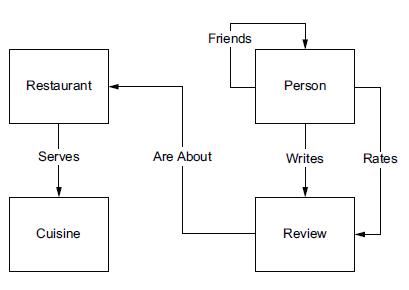
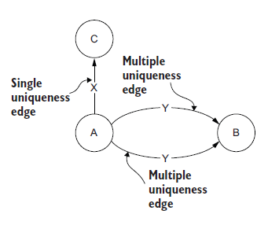
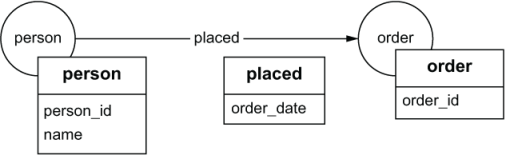

# GraphDB Modelling

Parent: [[[7_Graph_Databases]]

La **data modelling** è il processo di progettazione della struttura dei dati all'interno di un database a grafo, definendo come i nodi, gli archi e le proprietà saranno organizzati per rappresentare efficacemente le informazioni e supportare le query desiderate.
Quindi consiiste nel tradurre i requisiti del dominio in una rappresentazione grafica che catturi le entità, le relazioni e le proprietà chiave, ottimizzando al contempo la performance delle query e la scalabilità del database.

Il processso di data modelling per un database a grafo avviene in 4 fasi:

1. **comprensione del dominio**
2. **definizione del modello concettuale**
3. **definizione del modello logico**
4. **testare il modello**

La prima fase consiste nella definizone e nella comprensione del dominio e del problema che si deve modellare e risolvere. Oltre a ciò è importante comprendere quali dati andremo a modellare e le relazioni tra di essi, e quali sono i requisiti funzionali e non funzionali del sistema che stiamo progettando. Non è imporante avere una scrivere una documentazione dettagliata, ma è importante avere una comprensione chiara del dominio e dei requisiti del sistema e di come l'utente interagirà con il sistema.

Fatto questo, si apssa alla definizione dello schema concettuale, uno schema ad alto livello senza dettagli implementativi che rappresenta le entità, le relazioni e le proprietà chiave del dominio. In questa fase si definisce quali sono i nodi, gli archi e le proprietà che rappresentano le entità e le relazioni del dominio.

Dal modello concettuale si deriva il modello logico, una rappresentazione più adatta alla base di dati che andremo ad utilizzare per operare sui dati.

La costruzione di un modello di dati a grafo (logico) a partire da un modello concettuale si articola in quattro fasi:

1. Tradurre le entità in vertici.
2. Tradurre le relazioni in archi.
3. Individuare e assegnare le proprietà a vertici e archi.
4. Verificare il modello.

La **creazione dei vertici** nel nostro modello a grafo richiede due cose:

- Identificare tutte le entità rilevanti dal nostro modello concettuale
- Assegnare al vertice un nome sotto forma di etichetta per identificare in modo univoco quel tipo di entità nel nostro modello a grafo

Le entità del tuo modello concettuale si mappano quasi direttamente sui vertici del grafo 'obiettivo è estrarre le entità rilevanti e assegnare a ciascuna un'etichetta univoca 
Le etichette dei vertici devono essere rigorosamente al **singolare** (es. `Person` o `Restaurant`), poiché ogni vertice rappresenta una singola istanza di quell'elemento[cite: 116].

La **definizione degli archi** richiede di:

1. **Identificazione ed Etichettatura:** Identificare tutte le relazioni rilevanti tra le entità del tuo modello concettuale e assegna a ciascuna una etichetta che descriva chiaramente la natura della relazione.
2. **Direzionalità:** Ogni arco richiede una direzione definita: da un nodo di origine (*out vertex*) a un nodo di destinazione (*in vertex*). Il modello deve "leggersi come una frase" naturale (es. `Bill -> friends -> Ted`). Se la direzione rende la frase innaturale, riformula l'etichetta o inverti la direzione. Avere la direzione in un verso o in verso opposto non è un errore, ma è importante essere coerenti e scegliere la direzione che meglio rappresenta la relazione.
L'unicità definisce il numero consentito di archi con la stessa etichetta tra due vertici specifici. Può essere:
   - *singola*, zero o un arco
   - *multipla*, zero o più archi
        {width=50% height=70%}

    L'unicità non è la stessa cosa della cardinalità o la molteplicità.
   - cardinalità: il numero di elementi in un insieme
   - moltiplicità: una specifica della cardinalità minima e massima che un insieme può avere
   
   Usiamo il termine unicità per descrivere le caratteristiche di un gruppo di archi perché la cardinalità viene usata per definire il numero di archi nei dati di istanza del nostro grafo (la cardinalità degli archi Y tra A e B nella figura è due). La molteplicità, invece, secondo la terminologia tradizionale, vincola il numero di entità correlate, e in un database a grafo sarebbe sempre molti-a-molti perché, per definizione, i grafi collegano i vertici (l'analogo più semplice di un'entità) a più altri vertici. Poiché, tradizionalmente, avremmo sempre e solo una molteplicità, questo termine non è adatto ai database a grafo in quanto non aggiunge alcun valore descrittivo al nostro modello dati. Potremmo modificare la definizione di molteplicità nel contesto dei database a grafo, ma ciò causerebbe solo ulteriore confusione a coloro che hanno familiarità con l'uso tradizionale.
   Allora usiamo il termine *unicità* per descrivere il numero consentito di archi di una data etichetta tra due vertici. Un'unicità modellata male causa perdita di dati, duplicazioni o, soprattutto, un netto peggioramento delle performance delle query poiché il database deve eseguire più operazioni per restituire i dati per una query con più archi.

Definiti nodi e relazioni, **individuiamo le loro proprietà**, coppie chiave-valore che forniscono ulteriori dettagli su un nodo o un arco. Le proprietà sono fondamentali per arricchire il modello a grafo con informazioni contestuali e supportare query più complesse. Gli archi devono sempre avere almeno una proprietà che rappresenti la data di creazione o l'ultima modifica, in modo da poter tracciare l'evoluzione del grafo nel tempo e supportare query temporali. I nodi, invece, devono sempre avere almeno una proprietà che rappresenti un identificatore univoco (ad esempio `person_id` per un nodo `Person`) per garantire l'unicità e facilitare le operazioni di ricerca e manipolazione dei dati.
A differenza delle colonne di una tabella SQL, i database a grafo **non inseriscono valori di default né valori nulli** nelle proprietà. Se un attributo non esiste per uno specifico nodo, la proprietà semplicemente non viene allocata.

La fase finale della modellazione è la **verifica dello schema** che si è creato. Si verifica che la navigazione del grafo consenta di risolvere i pattern di accesso stabiliti. 