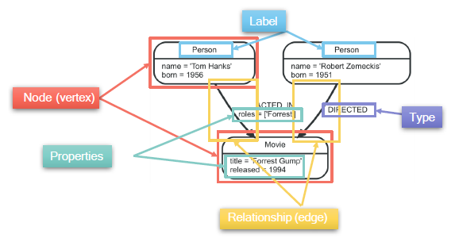

# Neo4j

Parent: [[7_Graph_Databases]]

Neo4j è un property graph db open-source, progettato per gestire e analizzare grandi quantità di dati interconnessi utilizzando un modello di dati a grafo, in cui i dati sono rappresentati come nodi, relazioni e proprietà.

Neo4j nasce specialemnte per gestire operazioni **OLTP**. È progettato per essere un database operativo, ovvero quel motore che lavora dietro le quinte di un'app per rispondere istantaneamente a migliaia di utenti.

Quando invece dobbiamo analizzare l'intero grafo per scoprire tendenze nascoste — ad esempio "Qual è la persona più influente in questa rete?" — entriamo nel campo del **OLAP** (Online Analytical Processing). Sebbene Neo4j non sia nato specificamente per il processamento batch massivo, operazioni **OLAP**.
Neo4j ha librerie come **GDS (Graph Data Science)** che fornisce algoritmi pronti  per calcolare la centralità, scoprire comunità di utenti o trovare percorsi ottimali. Questi calcoli girano fuori dal motore principale delle transazioni per non rallentare gli utenti attivi.

Attraverso le procedure **APOC**, Neo4j estende le sue capacità con centinaia di funzioni extra. Se poi i dati diventano davvero troppi per un solo server, può "parlare" con giganti del calcolo come **Apache Spark** o **Hadoop** per esportare i dati e processarli in parallelo.

Poiché elabora i grafi principalmente in RAM per essere veloce, se il grafo è monumentale, la memoria diventa un collo di bottiglia costoso.
Essendo nato per gestire transazioni precise e sicure (ACID), non è ottimizzato per macinare miliardi di record in un colpo solo come farebbe un sistema dedicato esclusivamente ai Big Data.

Utilizza un sistema di archiviazione nativo ottimizzato per i grafi, basatto sull'*Index-free Adjacency structure* e tratta le relazioni come first-class citizens, cioè le memorizza direttamente, senza doverle ricostruire on the fly, per garantire prestazioni elevate anche con dataset di grandi dimensioni e query complesse.

Neo4j utilizza il modello del grafo a proprietà etichettate:

- **vertex**: Rappresentano le entità (es. Persone, Prodotti).
- **edge**: Connettono i nodi, hanno una direzione e un tipo specifico (es. Lavora_per, Amico_di).
- **properties**: Coppie chiave-valore associate sia ai nodi che alle relazioni (es. nome, età, data d'inizio).
- **labels**: Definiscono il tipo o la categoria di un nodo.

Neo4j supporta un linguaggio dichiarativo di query chiamato **Cypher**, che è progettato specificamente per lavorare con i grafi e consente agli sviluppatori di esprimere query in modo intuitivo e leggibile.

Guide: [[7_2_1_Cypher]]
